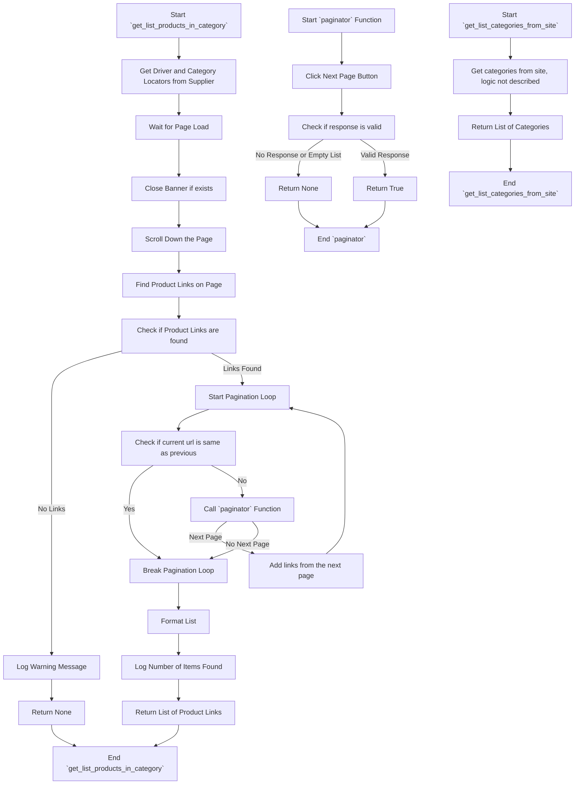

## ИНСТРУКЦИЯ:

Анализируй предоставленный код подробно и объясни его функциональность. Ответ должен включать три раздела:

1.  **<алгоритм>**: Опиши рабочий процесс в виде пошаговой блок-схемы, включая примеры для каждого логического блока, и проиллюстрируй поток данных между функциями, классами или методами.
2.  **<mermaid>**: Напиши код для диаграммы в формате `mermaid`, проанализируй и объясни все зависимости,
    которые импортируются при создании диаграммы.
    **ВАЖНО!** Убедитесь, что все имена переменных, используемые в диаграмме `mermaid`,
    имеют осмысленные и описательные имена. Имена переменных вроде `A`, `B`, `C`, и т.д., не допускаются!

    **Дополнительно**: Если в коде есть импорт `import header`, добавьте блок `mermaid` flowchart, объясняющий `header.py`:
    ```mermaid
    flowchart TD
        Start --> Header[<code>header.py</code><br> Determine Project Root]

        Header --> import[Import Global Settings: <br><code>from src import gs</code>]
    ```

3.  **<объяснение>**: Предоставьте подробные объяснения:
    -   **Импорты**: Их назначение и взаимосвязь с другими пакетами `src.`.
    -   **Классы**: Их роль, атрибуты, методы и взаимодействие с другими компонентами проекта.
    -   **Функции**: Их аргументы, возвращаемые значения, назначение и примеры.
    -   **Переменные**: Их типы и использование.
    -   Выделите потенциальные ошибки или области для улучшения.

Дополнительно, постройте цепочку взаимосвязей с другими частями проекта (если применимо).

Это обеспечивает всесторонний и структурированный анализ кода.
## Формат ответа: `.md` (markdown)
**КОНЕЦ ИНСТРУКЦИИ**

## <алгоритм>
### `get_list_products_in_category`
1.  **Начало**: Функция `get_list_products_in_category` принимает объект `Supplier` в качестве аргумента. Этот объект содержит информацию о поставщике, включая настройки веб-драйвера и локаторы элементов.
    *   _Пример:_ `s = Supplier(driver=..., locators={'category': {...}, 'product': {...}}, ...)`
2.  **Инициализация**: Извлекает `Driver` и `locators` из переданного объекта `Supplier`.
    *   _Пример:_ `d = s.driver`, `l = s.locators['category']`
3.  **Ожидание**:  Использует метод `wait` объекта `Driver`, чтобы дождаться загрузки страницы.
    *   _Пример:_ `d.wait(1)`
4. **Закрытие баннера**: Использует метод `execute_locator` объекта `Driver` чтобы закрыть баннер, если он есть на странице.
    * _Пример:_ `d.execute_locator(s.locators['product']['close_banner'])`
5.  **Прокрутка**: Прокручивает страницу вниз, чтобы подгрузить все элементы.
    *   _Пример:_ `d.scroll()`
6.  **Поиск ссылок на товары**:  С помощью `execute_locator` извлекает список элементов, соответствующих ссылкам на товары, со страницы.
    *   _Пример:_ `list_products_in_category = d.execute_locator(l['product_links'])`
7.  **Проверка на наличие товаров**: Проверяет, найдены ли ссылки на товары. Если нет, то выводит предупреждение и возвращает `None`.
    *   _Пример:_ `if not list_products_in_category:`
8.  **Цикл пагинации**: Запускает цикл, пока текущий URL не равен предыдущему (проверка для пагинации).
    *   _Пример:_ `while d.current_url != d.previous_url:`
9. **Пагинация**: Вызывает функцию `paginator` чтобы проверить есть ли кнопка следующей страницы. Если есть, то добавляет к списку `list_products_in_category` ссылки со следующей страницы. Если нет, то цикл останавливается.
    * _Пример:_ `if paginator(d,l,list_products_in_category): ... else: break`
10. **Форматирование списка**: Преобразует список ссылок, если это одна строка, в список из одной строки.
    * _Пример:_ `list_products_in_category = [list_products_in_category] if isinstance(list_products_in_category, str) else list_products_in_category`
11. **Логирование**: Выводит отладочное сообщение о количестве найденных товаров в текущей категории.
    *   _Пример:_ `logger.debug(f"Found {len(list_products_in_category)} items...")`
12. **Возврат списка**: Возвращает список ссылок на товары.
    *   _Пример:_ `return list_products_in_category`

### `paginator`
1.  **Начало**: Функция `paginator` принимает объект `Driver`, словарь `locator` и список ссылок `list_products_in_category`.
2.  **Клик на кнопку пагинации**: Пытается кликнуть на кнопку "следующая страница" с помощью `execute_locator`.
     *   _Пример:_ `response = d.execute_locator(locator['pagination']['<-'])`
3.  **Проверка ответа**: Проверяет результат `response`. Если нет ответа или список пустой, то возвращает `None`.
    *   _Пример:_ `if not response or (isinstance(response, list) and len(response) == 0): return`
4.  **Возврат True**: Если ответ есть, то возвращает `True`, что означает, что есть следующая страница.
    *   _Пример:_ `return True`

### `get_list_categories_from_site`
1.  **Начало**: Функция `get_list_categories_from_site` принимает объект `Supplier`.
2.  **Реализация**: Логика работы функции не описана, но она должна возвращать список категорий с сайта поставщика.

## <mermaid>


### Зависимости Mermaid
- `Supplier`: Объект, содержащий настройки поставщика и веб-драйвер.
- `Driver`: Объект, предоставляющий интерфейс для взаимодействия с веб-браузером.
- `locators`: Словарь с локаторами элементов на странице.
- `logger`: Объект для ведения журнала.
- `list_products_in_category`: Список строк, представляющих URL-адреса товаров.
- `current_url`, `previous_url`: URL-адреса текущей и предыдущей страниц, используемые для отслеживания пагинации.

## <объяснение>

### Импорты:
*   `typing`: Модуль для определения типов данных, используется для аннотации типов аргументов и возвращаемых значений функций (`Dict`, `List`).
*   `pathlib`: Модуль для работы с путями в файловой системе.
*   `src.gs`: Импортирует глобальные настройки из пакета `src`.
*   `src.logger.logger`: Импортирует объект `logger` из модуля `src.logger.logger` для логирования событий.
*   `src.webdriver.driver`: Импортирует класс `Driver` из модуля `src.webdriver.driver`, используемый для управления браузером.
*   `src.suppliers.Supplier`: Импортирует класс `Supplier` из модуля `src.suppliers`, представляющий поставщика и его настройки.

### Классы:
*   `Supplier`: Класс, представляющий поставщика. Он содержит информацию о поставщике, такую как настройки веб-драйвера, локаторы элементов на странице и другие параметры. В коде используются атрибуты `driver`, `locators` и `current_scenario`. Класс взаимодействует с `Driver` для навигации по сайту и поиска элементов.
*   `Driver`: Класс для управления веб-драйвером. Он предоставляет методы для взаимодействия с браузером, такие как ожидание загрузки страницы, выполнение поиска элементов и скроллинг.

### Функции:
*   `get_list_products_in_category(s: Supplier) -> list[str, str, None]`:
    *   **Аргументы**: принимает объект `Supplier`, содержащий настройки для работы с конкретным поставщиком.
    *   **Возвращаемое значение**: возвращает список URL-адресов товаров на странице категории. Если товары не найдены, возвращается `None`.
    *   **Назначение**: извлекает список ссылок на товары со страницы категории, обходя пагинацию, если она есть. Использует `Driver` для взаимодействия с браузером и `locators` для поиска элементов на странице.
    *   **Пример**:
        ```python
        supplier = Supplier(driver=..., locators={'category': {'product_links': 'xpath://a[@class="product-link"]', 'pagination': {'<-': 'xpath://a[@class="next-page"]'}}, 'product':{'close_banner': 'xpath://div[@class="close-banner"]'}}, current_scenario={'name': 'category_name'})
        product_urls = get_list_products_in_category(supplier)
        if product_urls:
           for url in product_urls:
             print(url)
        ```
*   `paginator(d: Driver, locator: dict, list_products_in_category: list) -> bool | None`:
    *   **Аргументы**: принимает объект `Driver` для управления браузером, словарь `locator`, содержащий локаторы элементов пагинации, и список URL-адресов товаров.
    *   **Возвращаемое значение**: возвращает `True`, если есть следующая страница, иначе `None`.
    *   **Назначение**: проверяет наличие кнопки следующей страницы и переходит на следующую страницу, используя `Driver`.
    *   **Пример**:
         ```python
            driver = Driver(...)
            locator = {'pagination': {'<-': 'xpath://a[@class="next-page"]'}}
            list_products = ['url1', 'url2']
            if paginator(driver, locator, list_products):
                print('Found next page')

         ```
*    `get_list_categories_from_site(s: Supplier)`:
     *   **Аргументы**: принимает объект `Supplier`, содержащий настройки для работы с конкретным поставщиком.
     *   **Возвращаемое значение**:  не определен.
     *   **Назначение**: собирает актуальный список категорий с сайта, логика работы не описана.

### Переменные:
*   `s`: Объект типа `Supplier`, содержащий данные о поставщике.
*   `d`: Объект типа `Driver`, представляющий веб-драйвер.
*   `l`: Словарь, содержащий локаторы элементов на странице.
*   `list_products_in_category`: Список URL-адресов товаров.

### Потенциальные ошибки и области для улучшения:
*   **Необработанные исключения**: В коде отсутствуют блоки `try...except` для обработки возможных ошибок, например, при взаимодействии с веб-драйвером или при парсинге данных.
*   **Неопределенный возврат `get_list_categories_from_site`**:  Функция `get_list_categories_from_site` не возвращает значения.
*   **Неполный код**:  Многоточие `...` указывает на пропущенный код, который необходимо реализовать.
*   **Магические строки**: Строковые литералы, такие как ключи словарей (`'category'`, `'product'`), могут быть вынесены в константы для удобства поддержки кода.
*   **Отсутствие документации**: В коде много многоточий `...`, что затрудняет понимание полного функционала.

### Взаимосвязи:
1.  **`src.suppliers.kualastyle.category.py`** зависит от:
    *   `src.gs`: Для получения глобальных настроек.
    *   `src.logger.logger`: Для логирования событий.
    *   `src.webdriver.driver`: Для управления браузером.
    *   `src.suppliers.Supplier`: Для получения данных о поставщике.
2.  **`src.suppliers.Supplier`** используется в функциях `get_list_products_in_category` и `get_list_categories_from_site`.
3.  **`src.webdriver.Driver`** используется в функциях `get_list_products_in_category` и `paginator` для взаимодействия с браузером.
4.  **`src.logger.logger.logger`** используется для вывода отладочной информации в функциях `get_list_products_in_category` и `paginator`.

Этот анализ предоставляет подробное описание функциональности, алгоритмов, зависимостей и потенциальных проблем в предоставленном коде.