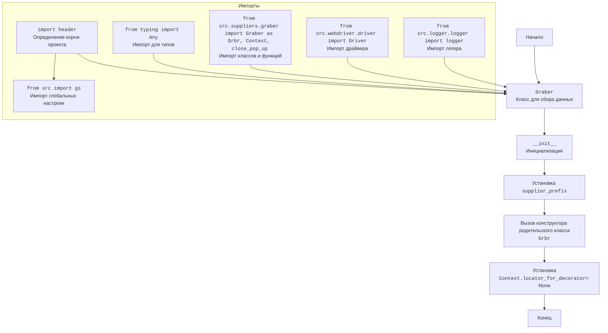
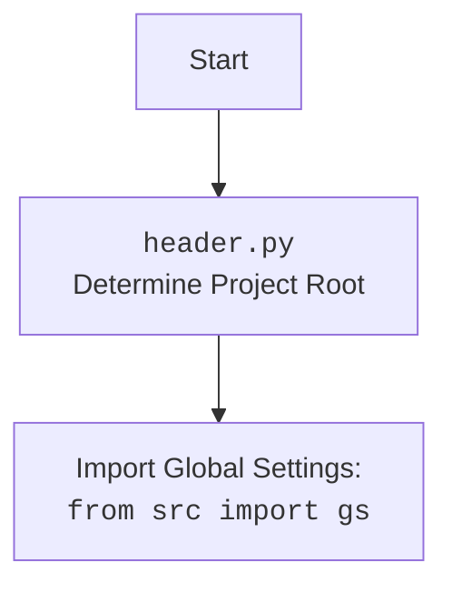

## ИНСТРУКЦИЯ:

Анализируй предоставленный код подробно и объясни его функциональность. Ответ должен включать три раздела:

1.  **<алгоритм>**: Опиши рабочий процесс в виде пошаговой блок-схемы, включая примеры для каждого логического блока, и проиллюстрируй поток данных между функциями, классами или методами.
2.  **<mermaid>**: Напиши код для диаграммы в формате `mermaid`, проанализируй и объясни все зависимости,
    которые импортируются при создании диаграммы.
    **ВАЖНО!** Убедитесь, что все имена переменных, используемые в диаграмме `mermaid`,
    имеют осмысленные и описательные имена. Имена переменных вроде `A`, `B`, `C`, и т.д., не допускаются!

    **Дополнительно**: Если в коде есть импорт `import header`, добавьте блок `mermaid` flowchart, объясняющий `header.py`:
    ```mermaid
    flowchart TD
        Start --> Header[<code>header.py</code><br> Determine Project Root]

        Header --> import[Import Global Settings: <br><code>from src import gs</code>]
    ```

3.  **<объяснение>**: Предоставьте подробные объяснения:
    -   **Импорты**: Их назначение и взаимосвязь с другими пакетами `src.`.
    -   **Классы**: Их роль, атрибуты, методы и взаимодействие с другими компонентами проекта.
    -   **Функции**: Их аргументы, возвращаемые значения, назначение и примеры.
    -   **Переменные**: Их типы и использование.
    -   Выделите потенциальные ошибки или области для улучшения.

Дополнительно, постройте цепочку взаимосвязей с другими частями проекта (если применимо).

Это обеспечивает всесторонний и структурированный анализ кода.
## Формат ответа: `.md` (markdown)
**КОНЕЦ ИНСТРУКЦИИ**

## <алгоритм>

```mermaid
flowchart TD
    Start[Начало] --> InitClass[Инициализация класса Graber]
    InitClass --> SetSupplierPrefix[Установка supplier_prefix = 'kualastyle']
    SetSupplierPrefix --> SuperInit[Вызов конструктора родительского класса Graber (Grbr)]
    SuperInit --> SetContextLocator[Установка Context.locator_for_decorator = None]
    SetContextLocator --> End[Конец]
    
    subgraph "Пример вызова close_pop_up decorator"
        start_decorator[Начало работы декоратора]
        start_decorator --> check_locator[Проверка наличия Context.locator_for_decorator]
        check_locator -- "есть значение" --> ExecuteLocator[Выполнение локатора Context.locator_for_decorator]
        check_locator -- "нет значения" --> skip_locator[Пропуск выполнения локатора]
        ExecuteLocator --> execute_main_func[Выполнение основной функции]
        skip_locator --> execute_main_func
        execute_main_func --> return_result[Возврат результата]
    end
   
    style start_decorator fill:#f9f,stroke:#333,stroke-width:2px
    style execute_main_func fill:#ccf,stroke:#333,stroke-width:2px

```
1.  **Начало**: Программа начинается с создания экземпляра класса `Graber`.
2.  **Инициализация класса `Graber`**: Вызывается конструктор `__init__`.
3.  **Установка `supplier_prefix`**: Внутри конструктора устанавливается атрибут `supplier_prefix` равным `'kualastyle'`.
    *   _Пример_: `self.supplier_prefix = 'kualastyle'`
4.  **Вызов конструктора родительского класса `Graber` (Grbr)**:  Вызывается конструктор родительского класса `Graber` (предположительно из `src.suppliers.graber`).
    *   _Пример_: `super().__init__(supplier_prefix=self.supplier_prefix, driver=driver)`
5.  **Установка `Context.locator_for_decorator`**: Устанавливается глобальный атрибут `Context.locator_for_decorator` в `None`.
    *   _Пример_: `Context.locator_for_decorator = None`
6.  **Конец**: Инициализация завершена. Объект `Graber` готов к использованию.

**Пример вызова `close_pop_up` декоратора**:
1.  **Начало работы декоратора**: Декоратор начинает выполнение перед основной функцией.
2.  **Проверка наличия `Context.locator_for_decorator`**: Проверяется, установлено ли значение для `Context.locator_for_decorator`.
3.  **Выполнение локатора**: Если значение есть (не None), выполняется локатор, предназначенный для закрытия всплывающих окон.
    *   _Пример_: `await Context.driver.execute_locator(Context.locator_for_decorator)`
4.  **Пропуск выполнения локатора**: Если значение None, выполнение локатора пропускается.
5.  **Выполнение основной функции**: Выполняется функция, к которой применен декоратор.
    *   _Пример_: `await func(*args, **kwargs)`
6.  **Возврат результата**: Функция возвращает результат работы.

## <mermaid>





**Анализ `mermaid` диаграммы:**

*   **`Start`**: Начало процесса инициализации класса `Graber`.
*   **`GraberClass`**: Представляет класс `Graber`, основной класс для сбора данных со страниц `kualastyle`.
*   **`Init`**: Метод `__init__`, конструктор класса.
*   **`SetSupplierPrefix`**: Присваивание значения `kualastyle` атрибуту `supplier_prefix`.
*   **`ParentInit`**: Вызов конструктора родительского класса `Grbr` (из `src.suppliers.graber`).
*   **`SetContextLocator`**: Установка значения `None` для атрибута `Context.locator_for_decorator`.
*   **`End`**: Завершение инициализации.

**Импорты:**

*   **`import_header`**: Импорт модуля `header`, который предположительно определяет корень проекта и загружает глобальные настройки.
*    **`src_gs`**: Импорт глобальных настроек `gs` из пакета `src`.
*   **`import_typing`**: Импорт `Any` из модуля `typing`, используемого для аннотации типов.
*   **`import_graber`**: Импорт класса `Graber` как `Grbr`, класса `Context` и функции `close_pop_up` из `src.suppliers.graber`.
*   **`import_driver`**: Импорт класса `Driver` из `src.webdriver.driver`, который управляет веб-драйвером.
*   **`import_logger`**: Импорт логгера из `src.logger.logger`, используемого для записи сообщений отладки.

**Диаграмма для `header.py`:**

*   **`Start`**: Начало процесса определения корня проекта в `header.py`.
*   **`Header`**: Модуль `header.py` определяет корень проекта.
*   **`import`**: Импорт глобальных настроек из `src.gs` после определения корня проекта.

## <объяснение>

**Импорты:**

*   `from typing import Any`:  Импортирует `Any` для аннотации типов. `Any` используется, когда тип переменной может быть любым.
*   `import header`: Импортирует модуль `header`, который, вероятно, отвечает за определение корневой директории проекта и загрузку глобальных настроек. Это необходимо для правильной работы проекта в различных окружениях.
*   `from src.suppliers.graber import Graber as Grbr, Context, close_pop_up`: Импортирует:
    *   `Graber` как `Grbr`: базовый класс для граберов.
    *   `Context`: класс, вероятно, используемый для хранения глобального контекста, например, экземпляра драйвера.
    *   `close_pop_up`: декоратор для закрытия всплывающих окон перед выполнением функции.
*   `from src.webdriver.driver import Driver`: Импортирует класс `Driver`, который управляет веб-драйвером (например, Selenium).
*   `from src.logger.logger import logger`: Импортирует логгер для записи отладочной информации.

**Классы:**

*   `class Graber(Grbr)`:
    *   **Роль**: Наследует от класса `Grbr` и специализируется на сборе данных с сайта `kualastyle.co.il`.
    *   **Атрибуты**:
        *   `supplier_prefix`: Строка, которая устанавливается в 'kualastyle', используется для идентификации поставщика.
    *   **Методы**:
        *   `__init__(self, driver: Driver)`:
            *   **Аргументы**: принимает экземпляр класса `Driver`.
            *   **Назначение**: Инициализирует класс, устанавливает `supplier_prefix`, вызывает конструктор родительского класса, устанавливает `Context.locator_for_decorator` в `None`.

**Функции:**

*   Декоратор `close_pop_up`:
    *   **Аргументы**: принимает `value` (любого типа).
    *   **Назначение**: Оборачивает функцию, чтобы закрыть всплывающие окна перед ее выполнением.
    *   **Возвращаемое значение**: Декоратор (функция).
    *   **Пример**: Если `Context.locator_for_decorator` установлен, то при вызове функции, к которой применён декоратор, будет предпринята попытка закрыть всплывающее окно, используя локатор. Если `Context.locator_for_decorator` равен `None`, закрытие не будет выполняться.

**Переменные:**

*   `supplier_prefix` (str): Идентификатор поставщика ('kualastyle').
*   `Context.locator_for_decorator` (Any): Глобальная переменная в контексте, используемая декоратором `close_pop_up` для определения локатора, необходимого для закрытия всплывающих окон.

**Потенциальные ошибки и области для улучшения:**

*   **Закомментированный декоратор**: Декоратор `close_pop_up` закомментирован, и не используется по умолчанию. Это может быть причиной не закрытия всплывающих окон.
*   **Обработка ошибок**: Обработка ошибок в декораторе минимальна. `ExecuteLocatorException` просто логируется. Необходима более надежная обработка, возможно, с повторными попытками или другими методами.
*   **Зависимость от `Context`**: Использование глобального объекта `Context` может усложнить тестирование и поддержку. Можно рассмотреть альтернативы, например, передачу контекста через параметры конструктора или методы.
*   **Отсутствие логики сбора данных**: В представленном коде отсутствует конкретная логика для сбора данных о продукте. Она, предположительно, должна находиться в родительском классе `Grbr` или в переопределенных методах.

**Взаимосвязи с другими частями проекта:**

*   **`header.py`**: Определяет корневую директорию проекта и загружает глобальные настройки, необходимые для работы.
*   **`src.suppliers.graber`**: Родительский класс для `Graber`, вероятно, содержащий общую логику для сбора данных с веб-сайтов.
*   **`src.webdriver.driver`**: Используется для управления веб-браузером, через который будет осуществляться сбор данных.
*   **`src.logger.logger`**: Логирует события, например, ошибки выполнения локаторов.

**Цепочка взаимосвязей:**

`header.py` -> `src.suppliers.kualastyle.graber.py` -> `src.suppliers.graber.py` -> `src.webdriver.driver.py` -> `src.logger.logger.py`

Этот код является частью системы, которая автоматизирует сбор данных с веб-сайтов, в частности с `kualastyle.co.il`. Он структурирован таким образом, чтобы быть расширяемым, с использованием классов, декораторов и иерархии наследования. Однако, есть области для улучшения, такие как обработка ошибок и управление зависимостями.