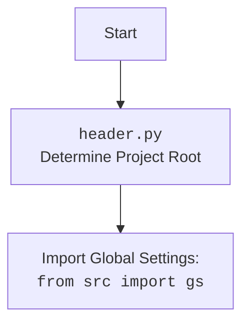

## ИНСТРУКЦИЯ:

Анализируй предоставленный код подробно и объясни его функциональность. Ответ должен включать три раздела:

1.  **<алгоритм>**: Опиши рабочий процесс в виде пошаговой блок-схемы, включая примеры для каждого логического блока, и проиллюстрируй поток данных между функциями, классами или методами.
2.  **<mermaid>**: Напиши код для диаграммы в формате `mermaid`, проанализируй и объясни все зависимости,
    которые импортируются при создании диаграммы.
    **ВАЖНО!** Убедитесь, что все имена переменных, используемые в диаграмме `mermaid`,
    имеют осмысленные и описательные имена. Имена переменных вроде `A`, `B`, `C`, и т.д., не допускаются!

    **Дополнительно**: Если в коде есть импорт `import header`, добавьте блок `mermaid` flowchart, объясняющий `header.py`:
    ```mermaid
    flowchart TD
        Start --> Header[<code>header.py</code><br> Determine Project Root]

        Header --> import[Import Global Settings: <br><code>from src import gs</code>]
    ```

3.  **<объяснение>**: Предоставьте подробные объяснения:
    *   **Импорты**: Их назначение и взаимосвязь с другими пакетами `src.`.
    *   **Классы**: Их роль, атрибуты, методы и взаимодействие с другими компонентами проекта.
    *   **Функции**: Их аргументы, возвращаемые значения, назначение и примеры.
    *   **Переменные**: Их типы и использование.
    *   Выделите потенциальные ошибки или области для улучшения.

Дополнительно, постройте цепочку взаимосвязей с другими частями проекта (если применимо).

Это обеспечивает всесторонний и структурированный анализ кода.
## Формат ответа: `.md` (markdown)
**КОНЕЦ ИНСТРУКЦИИ**

## <алгоритм>

```mermaid
graph TD
    A[Начало] --> B{Определение корня проекта<br><code>set_project_root()</code>};
    B -- Найдена папка с __root__ или .git --> C[Установить __root__];
    B -- Нет папки с __root__ или .git --> D[Установить __root__ в текущий каталог]
    C --> E[Добавить __root__ в sys.path];
    D --> E
    E --> F[Импорт глобальных настроек из <code>src.gs</code>];
    F --> G{Загрузка settings.json};
    G -- success --> H[Присвоение настроек];
    G -- fail --> I[Игнорировать исключение];
    H --> J{Загрузка README.MD};
    I --> J
    J -- success --> K[Присвоение readme];
    J -- fail --> L[Игнорировать исключение];
     K --> M[Инициализация переменных];
    L --> M
    M --> N[Конец];
```

**Описание алгоритма:**

1. **Начало:** Программа начинает выполнение с определения корня проекта.
2. **Определение корня проекта:** Функция `set_project_root()` ищет маркерные файлы (`__root__` или `.git`) вверх по дереву каталогов.
   - **Пример:** Если скрипт находится в `/src/suppliers/kualastyle`, а маркерный файл `.git` есть в `/`, то корнем проекта будет `/`.
   - Если маркерный файл не найден, корнем проекта будет каталог, где находится этот файл (`/src/suppliers/kualastyle`).
3. **Установка корня:** Корневой каталог устанавливается в переменную `__root__`.
4. **Добавление корня в `sys.path`:** Если корневой каталог не находится в списке путей поиска, он добавляется, чтобы Python мог находить модули из корневого каталога.
5. **Импорт глобальных настроек:**  Импортируются глобальные настройки `gs` из пакета `src`.
6. **Загрузка `settings.json`:** Попытка загрузить файл `settings.json` из каталога `src`, расположенного в корне проекта.
   - **Пример:** Если корень проекта `/`, то будет загружен файл `/src/settings.json`.
7. **Присвоение настроек:** Если загрузка прошла успешно, то данные загружаются в переменную `settings`.
8.  **Игнорирование ошибок:** Если загрузка `settings.json` не удалась (файл не найден или ошибки JSON), ошибка игнорируется, переменная `settings` остаётся `None`.
9. **Загрузка `README.MD`:** Попытка загрузить файл `README.MD` из каталога `src`, расположенного в корне проекта.
   - **Пример:** Если корень проекта `/`, то будет загружен файл `/src/README.MD`.
10. **Присвоение readme:** Если загрузка прошла успешно, то данные загружаются в переменную `doc_str`.
11. **Игнорирование ошибок:** Если загрузка `README.MD` не удалась (файл не найден или ошибки JSON), ошибка игнорируется, переменная `doc_str` остаётся `None`.
12. **Инициализация переменных:** Инициализируются глобальные переменные (`__project_name__`, `__version__`, `__doc__`, `__details__`, `__author__`, `__copyright__`, `__cofee__`) на основе загруженных настроек. Если `settings` не загружен, устанавливаются значения по умолчанию.
13. **Конец:** Завершение работы модуля.

## <mermaid>

```mermaid
flowchart TD
    Start --> FindProjectRoot[<code>set_project_root()</code><br> Determine Project Root];
    FindProjectRoot --> CheckForMarkerFiles{Check for marker files: <br><code>'__root__', '.git'</code>};
    CheckForMarkerFiles -- Marker file found --> SetRoot[Set Project Root];
    CheckForMarkerFiles -- No marker file found --> SetCurrentDirAsRoot[Set Current Directory as Root];
    SetRoot --> AddRootToSysPath[Add Project Root to <code>sys.path</code>];
    SetCurrentDirAsRoot --> AddRootToSysPath;
    AddRootToSysPath --> ImportGlobalSettings[Import Global Settings: <br><code>from src import gs</code>];
    ImportGlobalSettings --> LoadSettingsFile{Load <code>settings.json</code> from <code>gs.path.root</code>/<code>src</code>};
    LoadSettingsFile -- Success --> AssignSettings[Assign settings to: <br><code>settings:dict</code>];
    LoadSettingsFile -- Fail --> HandleSettingsError[Handle <code>FileNotFoundError</code>, <code>json.JSONDecodeError</code>];
    AssignSettings --> LoadReadmeFile{Load <code>README.MD</code> from <code>gs.path.root</code>/<code>src</code>};
    HandleSettingsError --> LoadReadmeFile;
    LoadReadmeFile -- Success --> AssignReadme[Assign readme to:<br><code>doc_str:str</code>];
    LoadReadmeFile -- Fail --> HandleReadmeError[Handle <code>FileNotFoundError</code>, <code>json.JSONDecodeError</code>];
    AssignReadme --> InitializeGlobalVariables[Initialize Global Variables: <br><code>__project_name__</code>,<code>__version__</code>,<code>__doc__</code>, etc.];
    HandleReadmeError --> InitializeGlobalVariables;
    InitializeGlobalVariables --> End;
```

**Описание `mermaid` диаграммы:**

Диаграмма описывает поток выполнения кода в `header.py`.

1. **Start**: Начало выполнения скрипта.
2. **FindProjectRoot**: Вызов функции `set_project_root()` для определения корня проекта.
3. **CheckForMarkerFiles**: Проверка наличия маркерных файлов `__root__` или `.git` в каталогах.
4. **SetRoot**: Установка найденного каталога как корня проекта.
5. **SetCurrentDirAsRoot**: Установка текущего каталога как корня проекта, если маркерные файлы не найдены.
6. **AddRootToSysPath**: Добавление корня проекта в `sys.path`, чтобы обеспечить импорт модулей из проекта.
7. **ImportGlobalSettings**: Импорт глобальных настроек из `src.gs`.
8. **LoadSettingsFile**: Попытка загрузить файл `settings.json` из директории `src` в корне проекта.
9. **AssignSettings**: Присваивание загруженных настроек переменной `settings:dict`.
10. **HandleSettingsError**: Обработка ошибок (если файл `settings.json` не найден или имеет неверный формат JSON).
11. **LoadReadmeFile**: Попытка загрузить файл `README.MD` из директории `src` в корне проекта.
12. **AssignReadme**: Присваивание загруженного содержимого переменной `doc_str:str`.
13. **HandleReadmeError**: Обработка ошибок (если файл `README.MD` не найден или имеет неверный формат JSON).
14. **InitializeGlobalVariables**: Инициализация глобальных переменных `__project_name__`, `__version__`, `__doc__` и других на основе загруженных данных или значений по умолчанию.
15. **End**: Завершение выполнения скрипта.



**Описание дополнительной `mermaid` диаграммы:**

Эта диаграмма иллюстрирует начальную часть работы `header.py`, показывая, как модуль определяет корень проекта и импортирует глобальные настройки.

1. **Start**: Начало выполнения скрипта.
2. **Header**:  Выполнение логики `header.py` для определения корня проекта.
3. **import**: Импорт глобальных настроек из `src.gs`.

## <объяснение>

**Импорты:**

*   `sys`: Используется для модификации `sys.path`, чтобы Python мог находить модули проекта, добавляя путь к корневой директории.
*   `json`: Используется для загрузки данных из файла `settings.json`.
*   `packaging.version.Version`: Не используется в предоставленном коде. Возможно, остался от предыдущих итераций.
*   `pathlib.Path`: Используется для работы с путями файлов и директорий в кроссплатформенном формате.
*   `src.gs`: Импортирует глобальные настройки из пакета `src`.  Это предполагает, что в проекте существует модуль `gs.py` или пакет `gs` в директории `src`. `src` это важная часть проекта, где размещен код проекта.

**Функции:**

*   **`set_project_root(marker_files=('__root__', '.git')) -> Path`**:
    *   **Аргументы**: `marker_files` - кортеж строк, содержащий названия файлов или каталогов, которые определяют корень проекта. По умолчанию: `('__root__', '.git')`.
    *   **Возвращаемое значение**:  `pathlib.Path` объект, представляющий путь к корню проекта.
    *   **Назначение**: Функция определяет корневую директорию проекта, начиная с текущего файла, и ищет маркерные файлы. Она поднимается по дереву каталогов до первого каталога, который содержит хотя бы один из маркерных файлов. Затем, добавляет путь к корню проекта в `sys.path`, если его там нет.
    *   **Пример**: Если вызывается из `/src/suppliers/kualastyle/header.py` и маркер `.git` существует в корневой директории `/`, функция вернёт `pathlib.Path('/')`.
    Если маркерные файлы не найдены, то вернет директорию, где расположен файл `header.py`.

**Переменные:**

*   `__root__: Path`: Хранит путь к корневому каталогу проекта.
*   `settings: dict`: Словарь, содержащий загруженные настройки из файла `settings.json`. Может быть `None`, если файл не загружен или произошла ошибка.
*   `doc_str: str`: Строка, содержащая содержимое файла `README.MD`. Может быть `None`, если файл не загружен или произошла ошибка.
*   `__project_name__: str`: Название проекта, полученное из настроек или по умолчанию 'hypotez'.
*   `__version__: str`: Версия проекта, полученная из настроек. По умолчанию пустая строка.
*   `__doc__: str`: Содержимое файла `README.MD`. По умолчанию пустая строка.
*   `__details__: str`: Пустая строка, вероятно, зарезервирована для будущих деталей.
*   `__author__: str`: Автор проекта, полученный из настроек. По умолчанию пустая строка.
*   `__copyright__: str`: Авторские права, полученные из настроек. По умолчанию пустая строка.
*    `__cofee__: str`:  Строка,  содержит сообщение  о  поддержке разработчика  проекта.

**Объяснение:**

Этот код предназначен для определения корневой директории проекта и загрузки основных настроек. Модуль `header.py` выступает как единая точка доступа к этим настройкам для всего проекта. Функция `set_project_root()` обеспечивает гибкость при определении корня проекта, позволяя проекту находиться в любом месте файловой системы. Если `settings.json` или `README.MD` не найдены, программа не прерывается, а используются значения по умолчанию, что является хорошим примером отказоустойчивости.

**Цепочка взаимосвязей:**

1. **`header.py`:** Запускается первым, определяет корень проекта и настраивает пути.
2. **`src.gs`:**  Предположительно содержит пути к основным каталогам проекта или общие настройки проекта (зависимость `header.py`).
3.  Другие модули проекта: используюют переменные, объявленные в `header.py` для доступа к настройкам и информации о проекте (зависимость от `header.py`).

**Потенциальные ошибки и улучшения:**

1.  **Отсутствие обработки ошибок `settings.json` и `README.MD`:** Обработка ошибок сводится к `pass`, что может затруднить диагностику проблем при загрузке настроек. Необходимо как минимум добавить вывод предупреждения в лог.
2.  **Неиспользуемый импорт `packaging.version.Version`**:  Удалить неиспользуемый импорт.
3.  **Неочевидное применение** `__details__`.
4.  **Зависимость от наличия `settings.json` и `README.MD`**: Хотя по умолчанию значения присутствуют, необходимо предусмотреть логирование отсутствия файлов или предусмотреть возможность загружать настройки и информацию из окружения.
5.  **Жестко заданный путь к файлам настроек** (`'src' / 'settings.json'`) и (`'src' /  'README.MD'`).  Следует настроить это через переменную `gs`.
6.  **Несоответствие в названии переменной `copyrihgnt`**, возможно опечатка `copyright`