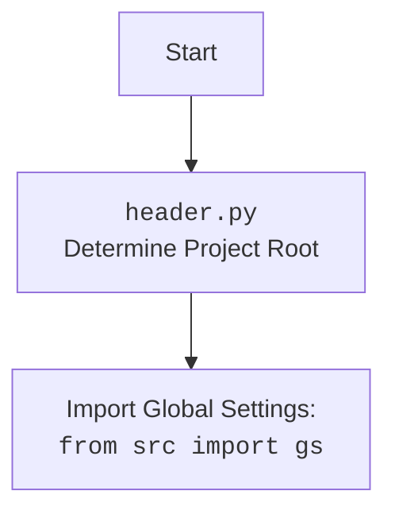

## ИНСТРУКЦИЯ:

Анализируй предоставленный код подробно и объясни его функциональность. Ответ должен включать три раздела:  

1. **<алгоритм>**: Опиши рабочий процесс в виде пошаговой блок-схемы, включая примеры для каждого логического блока, и проиллюстрируй поток данных между функциями, классами или методами.  
2. **<mermaid>**: Напиши код для диаграммы в формате `mermaid`, проанализируй и объясни все зависимости, 
    которые импортируются при создании диаграммы. 
    **ВАЖНО!** Убедитесь, что все имена переменных, используемые в диаграмме `mermaid`, 
    имеют осмысленные и описательные имена. Имена переменных вроде `A`, `B`, `C`, и т.д., не допускаются!  
    
    **Дополнительно**: Если в коде есть импорт `import header`, добавьте блок `mermaid` flowchart, объясняющий `header.py`:\
    ```mermaid
    flowchart TD
        Start --> Header[<code>header.py</code><br> Determine Project Root]
    
        Header --> import[Import Global Settings: <br><code>from src import gs</code>] 
    ```

3. **<объяснение>**: Предоставьте подробные объяснения:  
   - **Импорты**: Их назначение и взаимосвязь с другими пакетами `src.`.  
   - **Классы**: Их роль, атрибуты, методы и взаимодействие с другими компонентами проекта.  
   - **Функции**: Их аргументы, возвращаемые значения, назначение и примеры.  
   - **Переменные**: Их типы и использование.  
   - Выделите потенциальные ошибки или области для улучшения.  

Дополнительно, постройте цепочку взаимосвязей с другими частями проекта (если применимо).  

Это обеспечивает всесторонний и структурированный анализ кода.
## Формат ответа: `.md` (markdown)
**КОНЕЦ ИНСТРУКЦИИ**
```
## <алгоритм>

1. **Начало**: Функция `get_list_products_in_category` вызывается с аргументом `s`, который предположительно является объектом поставщика (`Supplier`).

2. **Получение драйвера и локаторов**:
   - Из объекта поставщика `s` извлекается драйвер веб-браузера `s.driver` и сохраняется в переменную `d`.
   - Извлекаются локаторы элементов, связанные с категорией,  `s.locators.get('category')` и сохраняются в переменную `l`.  Локаторы - это,  словарь,  где ключи - это имена элементов на странице, а значения - xpath/css селекторы.

3. **Прокрутка страницы**:
    - Выполняется прокрутка страницы веб-браузера на 10 шагов в направлении "вперед" `d.scroll(scroll_count = 10, direction = "forward")`. Это делается для загрузки всех элементов на странице, если они подгружаются при прокрутке.

4. **Извлечение ссылок на продукты**:
    - Выполняется функция `d.execute_locator`, которая принимает в качестве аргумента локатор ссылок на продукты `l['product_links']`. Результат сохраняется в переменную `list_products_in_category`.
     -   `d.execute_locator` - это метод объекта драйвера, который находит элементы на странице,  и возвращает список найденных элементов.

5. **Возврат результата**:
   - Функция возвращает  `list_products_in_category`.

## <mermaid>

```mermaid
flowchart TD
    Start[Начало: Вызов get_list_products_in_category(s)] --> GetDriverAndLocators[Получение драйвера (d) из s.driver и локаторов (l) из s.locators.get('category')]
    GetDriverAndLocators --> ScrollPage[Прокрутка страницы d.scroll(scroll_count=10, direction="forward")]
    ScrollPage --> ExecuteLocator[Выполнение d.execute_locator(l['product_links']) для извлечения ссылок на продукты]
    ExecuteLocator --> ReturnLinks[Возврат list_products_in_category]
    ReturnLinks --> End[Конец]
```


## <объяснение>

**Импорты:**

-   `from src.logger.logger import logger`: Импортируется объект `logger` для логирования событий. Это позволяет записывать информацию о работе программы, что полезно при отладке и анализе работы. Логгер, скорее всего,  расположен в файле `src/logger/logger.py`.

-   `from typing import Union`:  Импортируется `Union` из модуля `typing`, который используется для указания, что переменная может иметь один из нескольких типов. В данном коде не используется.

-  `from src import gs`: Импортируется модуль `gs`, вероятно, содержащий глобальные настройки приложения. `gs` расположен в  папке `src`, файл с именем,  скорее всего,  `gs.py`.
-   `from src.logger.logger import logger`:  Повторный импорт.

**Функции:**

-   `get_list_products_in_category(s) -> list[str,str,None]`:
    -   **Аргументы:**
        -   `s`: Объект, представляющий поставщика, должен иметь атрибуты `driver` (веб-драйвер) и `locators` (словарь с локаторами элементов).
    -   **Возвращаемое значение:**
        -  `list[str,str,None]`:  Ожидается список  строк, представляющие ссылки на продукты. Тип `None` в списке указывает, что некоторые элементы списка могут быть `None` или должны быть строками. Это странно, поскольку список ссылок, по идее, должен быть списком строк.
    -   **Назначение:**
        -   Извлекает список URL-адресов продуктов из категории на странице веб-сайта.

    -   **Примеры**:
      ```python
          # Пример использования
          class MockSupplier:
              def __init__(self):
                  self.driver = MockDriver()
                  self.locators = {'category': {'product_links': "css selector"}}

          class MockDriver:
            def scroll(self, scroll_count, direction):
              pass

            def execute_locator(self, locator):
                return ["/product1", "/product2", "/product3"]

          supplier_instance = MockSupplier()
          product_urls = get_list_products_in_category(supplier_instance)
          print(product_urls) # ['/product1', '/product2', '/product3']
      ```

**Переменные:**

- `d`:  Хранит объект веб-драйвера, полученный из `s.driver`.  Тип -  объект веб-драйвера,  например,  `selenium.webdriver.chrome.webdriver.WebDriver`.
- `l`:   Хранит словарь локаторов,  полученных из `s.locators.get('category')`. Тип - словарь,  где ключи -  строки, значения - строки.
- `list_products_in_category`:  Хранит список строк, представляющих URL-адреса продуктов, полученные через `d.execute_locator(l['product_links'])`. Тип -  список строк.
- `_` - временная переменная для хранения ссылки на функцию `d.execute_locator`, это не является общепринятой практикой.

**Потенциальные ошибки и области для улучшения:**

1.  **Возвращаемый тип:** Возвращаемый тип функции `list[str,str,None]` не соответствует ожидаемому списку URL-адресов. Правильным возвращаемым типом был бы `list[str]` или `list[str | None]`, если в списке могут быть `None` значения.
2.  **Использование `_`:** Присваивание `_ = d.execute_locator` не имеет смысла, так как далее в коде все равно используется `_()`. Более правильным было бы напрямую вызывать `d.execute_locator(l['product_links'])`.
3.  **Отсутствие обработки ошибок:** В коде нет обработки возможных исключений, таких как ошибки при загрузке страницы, ошибки при поиске элементов, `KeyError` при отсутствии нужных ключей в словаре локаторов.
4.  **Использование `s`:** Код полагается на то, что объект `s` имеет определенную структуру (атрибуты `driver` и `locators`). Это может привести к ошибкам, если объект `s` не соответствует ожиданиям. Неплохо было бы использовать протокол или `TypedDict`
5. **`d.scroll`**: Метод `d.scroll` может не подойти для загрузки контента. Стоит рассмотреть использование явных ожиданий.
6. **Имя переменной**: Имя переменной `list_products_in_categoryy`  является опечаткой и должно быть `list_products_in_category`

**Цепочка взаимосвязей:**

-   Данный модуль `via_webdriver.py` является частью пакета `src.suppliers.kualastyle`, который, вероятно, занимается сбором данных с сайта поставщика Kualastyle.
-   Модуль использует `src.logger.logger` для логирования.
-   Модуль использует `src.gs` для получения глобальных настроек.
-  Веб-драйвер,  полученный из объекта `s`, скорее всего,  является экземпляром `selenium.webdriver`, который взаимодействует с браузером.
-   Локаторы берутся из `s.locators`, где хранятся данные об элементах на странице. Они используются для навигации и извлечения информации.
- Функция `get_list_products_in_category` возвращает список ссылок, который далее может использоваться для парсинга отдельных страниц продуктов.

В целом, код выполняет функцию извлечения списка URL-адресов продуктов из категории.  Однако,  есть области для улучшения,  включая обработку ошибок,  типизацию данных,  правильное использование переменных и более надежный способ загрузки элементов на странице.