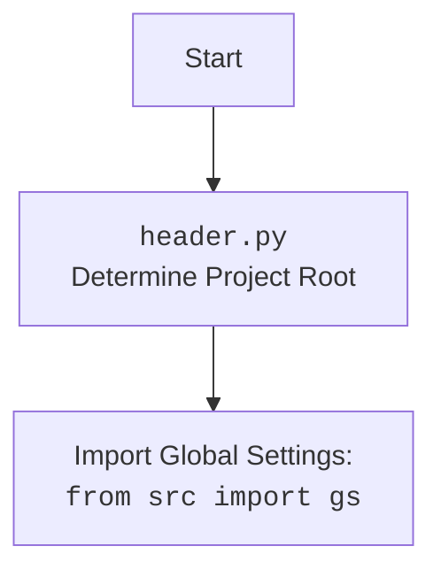

## <алгоритм>

1. **Инициализация**:
   - Создается экземпляр класса `Graber`, наследующего от `Graber` (`Grbr`). При инициализации устанавливается префикс поставщика (`supplier_prefix`) как `'morlevi'` и вызывается конструктор родительского класса `Graber` (`Grbr`).

2.  **Декоратор (закомментирован)**:
    - Имеется шаблон декоратора `close_pop_up`, предназначенный для закрытия всплывающих окон перед выполнением основной функции.
    - Декоратор оборачивает функцию, вызывая функцию `wrapper`.
    - Внутри `wrapper` есть блок `try-except`, который пытается выполнить действия по закрытию всплывающего окна через `Context.driver.execute_locator`. Если возникает ошибка `ExecuteLocatorException`, она логируется.
    - После (или при отсутствии) попытки закрыть всплывающее окно выполняется основная функция.

3. **Метод `local_image_path` (закомментирован)**:
   - Метод `local_image_path` предназначен для получения и сохранения изображения товара.
   - Если `value` не передано, выполняется следующая логика.
   - Сначала пытается получить `id_product` через метод `self.id_product()` если он не определен.
   - Затем получает скриншот элемента, определяемого локатором `self.locator.default_image_url` с помощью `self.driver.execute_locator`
   - Сохраняет полученный скриншот в `tmp` директории с помощью `save_image`, имя файла соответствует `id_product`.
    - Если сохранение удалось, путь к файлу сохраняется в `self.fields.local_image_path`
   - В случае ошибок при сохранении изображения, они логируются.

4. **Обработка исключений**:
   - Внутри декоратора и метода `local_image_path` предусмотрена обработка исключений (`try-except`), позволяющая отлавливать и логировать ошибки, а не прерывать выполнение программы.

## <mermaid>

```mermaid
flowchart TD
    Start[Start] --> Init[<code>Graber.__init__</code><br>Initialize Graber Class]
    Init --> SetPrefix[Set <code>supplier_prefix</code> to "morlevi"]
    SetPrefix --> ParentInit[Call Parent Class <code>Graber.__init__</code>]
    ParentInit --> ContextSet[Set <code>Context.locator_for_decorator</code> (currently commented out)]
    ContextSet --> DecoratorCheck[Check if Decorator <code>close_pop_up</code> is Active (currently commented out)]

    DecoratorCheck -- Yes --> DecoratorStart[Execute Decorator <code>close_pop_up</code>]
    DecoratorStart --> ExecuteLocator[Try to Close Popup with <code>Context.driver.execute_locator</code>]
    ExecuteLocator -- Success --> MainFunc[Execute Main Function <br> (e.g., <code>local_image_path</code>)]
    ExecuteLocator -- Fail --> LogError[Log Locator Error]
    LogError --> MainFunc
   
    DecoratorCheck -- No --> MainFunc

   
    MainFunc --> CheckValue[Check if value is Passed]
    CheckValue -- No --> GetProductId[Get Product ID]
    GetProductId --> GetScreenshot[Get Screenshot with <br><code>self.driver.execute_locator</code>]
   
    CheckValue -- Yes --> SaveImg[Save image with <br><code>save_image</code>]
    GetScreenshot --> SaveImg
    SaveImg --> SavePath[Save Image path to  <br><code>self.fields.local_image_path</code>]
    SavePath --> End[End]
    
    
```



## <объяснение>

### Импорты:

-   `pathlib.Path`: Используется для работы с путями файлов в операционной системе. Это обеспечивает более удобную и кросс-платформенную работу с файловой системой.
-   `typing.Any`: Используется для аннотации типов, указывая, что переменная может быть любого типа. Повышает читаемость и поддерживает статическую проверку типов.
-   `header`: (Предположительно) Модуль, который определяет корневую директорию проекта и, возможно, содержит другие настройки проекта.
-   `src.gs`: Глобальные настройки проекта. Позволяет получить доступ к общим настройкам проекта.
-   `src.suppliers.graber.Graber as Grbr, Context, close_pop_up`:
    -   `Graber as Grbr`: Импортирует родительский класс `Graber` для наследования.
    -   `Context`:  Предположительно, класс для хранения контекста выполнения, например драйвер веб-браузера и локаторы.
    -   `close_pop_up`: Функция или декоратор для закрытия всплывающих окон.
-   `src.webdriver.driver.Driver`: Класс для управления веб-драйвером (например, Selenium).
-  `src.utils.image.save_image`: Функция для сохранения изображений на диск.
-   `src.logger.logger`: Модуль для логирования событий и ошибок.

### Классы:

-   `Graber(Grbr)`:
    -   **Роль**: Класс `Graber` наследует функциональность класса `Grbr` (родительский класс) и предназначен для сбора данных со страниц товаров на сайте "morlevi.co.il".
    -   **Атрибуты**:
        -   `supplier_prefix`: Строка, определяющая префикс поставщика (`'morlevi'`).
    -   **Методы**:
        -   `__init__(self, driver: Driver)`: Конструктор класса, устанавливает префикс поставщика и инициализирует родительский класс `Grbr`.

        -   `local_image_path(self, value: Any = None)`: (Закомментированный метод) Предназначен для получения и сохранения изображения товара на локальном диске.

### Функции:

-   `close_pop_up(value: Any = None)`: (Закомментированный метод) Декоратор для закрытия всплывающих окон.
    -   **Аргументы**: `value` (любого типа, по умолчанию `None`).
    -   **Возвращаемое значение**: Декоратор, оборачивающий функцию.
    -   **Назначение**:  Закрытие всплывающих окон перед выполнением основной функции.
- `save_image(raw, path)`: Функция принимает необработанные байты изображения `raw` и путь `path` сохранения изображения.

### Переменные:

- `supplier_prefix`:  Строковая переменная, хранящая префикс поставщика ('morlevi').
- `self.fields.local_image_path`: Путь к локально сохраненному файлу изображения.
- `self.locator.default_image_url`: Локатор, используемый для получения скриншота изображения.
- `self.driver`: Экземпляр класса `Driver`, используемый для управления браузером.
- `gs.path.tmp`:  Путь к временной директории, определенный в глобальных настройках.

### Потенциальные ошибки и улучшения:

1. **Закомментированный код:** Много закомментированного кода, включая декоратор и функцию `local_image_path`. Этот код следует либо удалить, либо доработать и использовать.
2.  **Обработка ошибок**: В методе `local_image_path` ошибки логируются, но не обрабатываются дальше, что может привести к неполным данным.
3.  **Жестко заданный путь:** В `local_image_path` жестко задан путь сохранения файла. Необходимо сделать его более гибким, например, через конфигурационные файлы.
4.  **Передача значений из `**kwargs`:** В комментарии к функции `local_image_path` указана проблема с передачей значений из `**kwargs` функции `grab_product_page()`, которая не решена и является `BUG`
5. **Зависимость от `Context.locator_for_decorator`**: Использование `Context.locator_for_decorator` выглядит избыточным.
6.  **Не полное использование декоратора**: Декоратор `close_pop_up` не используется, вероятно, его нужно или доработать и использовать или удалить.

### Взаимосвязи с другими частями проекта:

-   `src.gs`:  Используется для доступа к глобальным настройкам, что позволяет гибко настраивать различные параметры проекта.
-   `src.suppliers.graber.Graber`: Используется для наследования общей логики сбора данных о товарах.
-   `src.webdriver.driver.Driver`: Используется для управления браузером, что позволяет взаимодействовать с веб-страницами.
-  `src.utils.image.save_image`: Используется для сохранения изображений, что позволяет вынести эту логику в отдельный модуль.
-   `src.logger.logger`: Используется для логирования событий и ошибок, что позволяет упростить процесс отладки и мониторинга приложения.

**В итоге**, данный код представляет собой класс для сбора данных о товарах с сайта "morlevi.co.il". Он использует наследование, декораторы (хотя и закомментированные), и различные модули проекта для выполнения своей задачи. Необходимо доработать и включить закомментированные методы, а так же реализовать передачу `**kwards` в функцию `grab_product_page`.