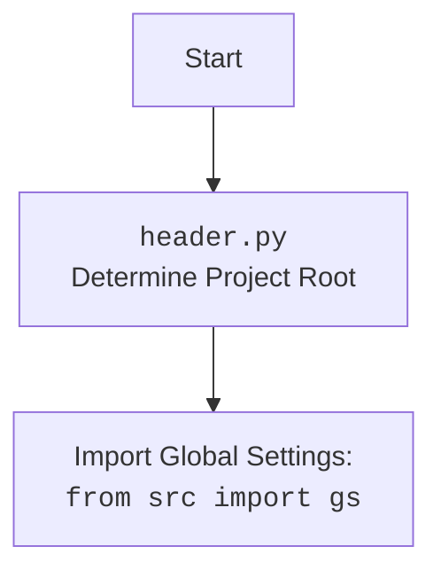

## <алгоритм>

1. **`set_project_root(marker_files)`**:
   - Начинается с получения абсолютного пути к каталогу, в котором находится текущий файл (`header.py`).
   - Проходит вверх по иерархии каталогов, проверяя наличие файлов-маркеров (`__root__`, `.git`) в каждом каталоге.
   - Если маркер найден, устанавливает текущий каталог как корень проекта.
   - Если корневой каталог не находится в `sys.path`, добавляет его для импорта модулей.
   - Возвращает путь к корневому каталогу проекта.

   _Пример:_
      - Текущий файл: `/home/user/project/src/suppliers/morlevi/header.py`
      - Поиск маркеров `__root__`, `.git`
      - Маркер `.git` найден в `/home/user/project`.
      - Возвращает `/home/user/project`.

2. **`__root__: Path = set_project_root()`**:
   - Вызывает функцию `set_project_root()` для определения корневого каталога.
   - Сохраняет результат в глобальной переменной `__root__`.
   - Используется для дальнейшей работы с проектом.

3. **`import gs`**:
   - Импортирует модуль `gs` из пакета `src`, используя путь, который добавили в `sys.path`.
   - Используется для доступа к глобальным настройкам проекта.

4. **Загрузка `settings.json`**:
   - Пытается открыть файл `settings.json` в подкаталоге `src` корневого каталога.
   - Загружает содержимое файла в словарь `settings`.
   - Обрабатывает исключения `FileNotFoundError` или `json.JSONDecodeError`, присваивая `None` переменной `settings`.

5. **Загрузка `README.MD`**:
   - Пытается открыть файл `README.MD` в подкаталоге `src` корневого каталога.
   - Читает содержимое файла в строку `doc_str`.
   - Обрабатывает исключения `FileNotFoundError` или `json.JSONDecodeError`, присваивая `None` переменной `doc_str`.

6. **Инициализация глобальных переменных**:
   - Инициализирует глобальные переменные, такие как `__project_name__`, `__version__`, `__doc__`, `__details__`, `__author__`, `__copyright__` и `__cofee__`, используя значения из загруженного словаря `settings` (если он был загружен) или значения по умолчанию.

## <mermaid>

```mermaid
flowchart TD
    Start[Start] --> FindProjectRoot[<code>set_project_root()</code><br>Determine Project Root Directory]
    FindProjectRoot --> CheckMarker[Check for marker files: <br><code>__root__</code>, <code>.git</code>]
    CheckMarker -- Marker Found --> SetRootPath[Set project root path]
    CheckMarker -- Marker Not Found --> UseScriptDir[Use current script directory]
    SetRootPath --> AddToSysPath[Add root path to <code>sys.path</code>]
    UseScriptDir --> AddToSysPath
    AddToSysPath --> ImportGS[Import Global Settings: <br><code>from src import gs</code>]
    ImportGS --> LoadSettings[Load <code>settings.json</code>]
    LoadSettings -- Success --> LoadReadme[Load <code>README.MD</code>]
    LoadSettings -- Failure --> LoadReadme
    LoadReadme -- Success --> InitGlobalVars[Initialize global variables]
    LoadReadme -- Failure --> InitGlobalVars
    InitGlobalVars --> End[End]
     
    style Start fill:#f9f,stroke:#333,stroke-width:2px
    style End fill:#ccf,stroke:#333,stroke-width:2px
    
```



**Объяснение зависимостей `mermaid`:**

-   **`Start`**: Начало процесса.
-   **`FindProjectRoot`**: Функция `set_project_root` находит корень проекта, используя маркерные файлы.
-   **`CheckMarker`**: Проверка наличия маркеров.
-   **`SetRootPath`**: Если маркер найден, устанавливаем путь к корневому каталогу.
-  **`UseScriptDir`**: Если маркер не найден, устанавливаем путь к текущему каталогу, где запущен скрипт.
-   **`AddToSysPath`**: Добавляем корневой каталог в `sys.path` для возможности импорта модулей из проекта.
-   **`ImportGS`**: Импортируем глобальные настройки `gs` из пакета `src`.
-   **`LoadSettings`**: Загружаем настройки из файла `settings.json`.
-  **`LoadReadme`**: Загружаем readme из файла `README.MD`.
-   **`InitGlobalVars`**: Инициализируем глобальные переменные проекта, такие как имя проекта, версия, описание и т.д.
-   **`End`**: Завершение процесса.

## <объяснение>

**Импорты:**

-   **`import sys`**:
    -   Используется для работы с параметрами интерпретатора, включая `sys.path` для добавления путей к модулям.
    -   Позволяет добавлять корневую директорию проекта в список путей поиска модулей, что позволяет импортировать модули из других частей проекта.
-   **`import json`**:
    -   Используется для работы с данными в формате JSON.
    -   Используется для загрузки конфигураций проекта из файла `settings.json`.
-   **`from packaging.version import Version`**:
    - Импортирует класс `Version` из библиотеки `packaging` для работы с версиями.
    - Не используется напрямую в данном коде, но может быть использован в других частях проекта для сравнения версий.
-   **`from pathlib import Path`**:
    -   Используется для работы с путями к файлам и директориям в операционной системе.
    -   Предоставляет удобный интерфейс для манипулирования путями, включая поиск родительских каталогов.
-   **`from src import gs`**:
    -   Импортирует модуль `gs` из пакета `src`.
    -   Модуль `gs` вероятно содержит глобальные настройки, константы или вспомогательные функции, используемые в проекте.

**Функции:**

-   **`set_project_root(marker_files: tuple = ('__root__', '.git')) -> Path`**:
    -   **Аргументы:**
        -   `marker_files`: кортеж строк, которые представляют имена файлов или каталогов-маркеров для определения корневой директории проекта.
    -   **Возвращаемое значение:**
        -   `Path`: объект `pathlib.Path`, представляющий путь к корневой директории проекта.
    -   **Назначение:**
        -   Определяет корневую директорию проекта, поднимаясь вверх по иерархии директорий, пока не найдет директорию, содержащую один из `marker_files`.
        -   Добавляет корневую директорию в `sys.path` для того, чтобы можно было импортировать модули из других частей проекта.
    -   **Пример**:
        -   Если текущий файл находится в `/home/user/project/src/suppliers/morlevi/header.py`, а маркер `.git` находится в `/home/user/project`, функция вернёт объект `Path('/home/user/project')`.

**Переменные:**

-   **`__root__`**:
    -   Тип: `Path`
    -   Содержит путь к корневой директории проекта, найденный с помощью функции `set_project_root`.
    -   Используется для определения путей к другим файлам и каталогам в проекте.
-   **`settings`**:
    -   Тип: `dict | None`
    -   Содержит загруженные из `settings.json` настройки проекта.
    -   Используется для получения значений, таких как имя проекта, версия, и т.д.
-   **`doc_str`**:
    -   Тип: `str | None`
    -   Содержит содержимое файла `README.MD` в виде строки.
    -   Используется для хранения документации проекта.
-   **`__project_name__`**:
    -   Тип: `str`
    -   Содержит имя проекта, полученное из `settings.json` или значение по умолчанию 'hypotez'.
-   **`__version__`**:
    -   Тип: `str`
    -   Содержит версию проекта, полученную из `settings.json` или значение по умолчанию ''.
-   **`__doc__`**:
    -   Тип: `str`
    -   Содержит документацию проекта, полученную из `README.MD` или значение по умолчанию ''.
-   **`__details__`**:
    -   Тип: `str`
    -   Содержит дополнительные сведения о проекте, на данный момент пустая строка.
-   **`__author__`**:
    -   Тип: `str`
    -   Содержит имя автора проекта, полученное из `settings.json` или значение по умолчанию ''.
-    **`__copyright__`**:
    -   Тип: `str`
    -   Содержит информацию об авторских правах, полученную из `settings.json` или значение по умолчанию ''.
-   **`__cofee__`**:
    -   Тип: `str`
    -   Содержит сообщение с призывом поддержать разработчика, полученное из `settings.json` или значение по умолчанию.

**Потенциальные ошибки и области для улучшения:**

-   **Обработка исключений:**
    -   Обработка исключений `FileNotFoundError` и `json.JSONDecodeError` при загрузке `settings.json` и `README.MD` является общей, `...` можно заменить на более информативную запись в лог.
    -   Если `settings.json` или `README.MD` не найдены, используются значения по умолчанию, но нет никаких уведомлений. В production-среде важно вести логи об ошибках.
-   **Поиск корня проекта**:
    -   Использование `__file__` может привести к проблемам, если файл запущен не напрямую.
    -  Наличие  файла  `__root__` или `.git` не всегда гарантирует, что найдена правильная корневая директория.
-  **Зависимость от `settings.json`**:
     -   Если `settings.json` не существует, проект использует дефолтные значения, что может привести к неопределенному поведению, стоит убедится, что файл обязателен.
-   **Отсутствие обработки ошибок при импорте `gs`**:
    - Если `from src import gs` не пройдет, то вся программа упадет, нужно добавить трай эксепт блок.
-   **Неиспользуемый импорт `packaging.version`**:
    -   Импорт `Version` из `packaging.version` не используется в этом файле, что может быть избыточным.

**Взаимосвязи с другими частями проекта:**

-   Этот файл (header.py) является центральной частью проекта, поскольку он определяет корневую директорию проекта и загружает настройки.
-   Он взаимодействует с файлами `settings.json` и `README.MD` из каталога `/src`.
-   Переменные, определенные в этом файле, такие как `__project_name__`, `__version__`, `__doc__` и другие, могут использоваться в других частях проекта для определения информации о проекте, например, в CLI инструментах или при создании документации.
-   Модуль `gs` (глобальные настройки), который импортируется из `src`, также является важной частью проекта и может быть использован для доступа к другим настройкам и константам.
-   Использование `sys.path` позволяет проекту организовывать структуру пакетов и импортировать модули из разных частей проекта.