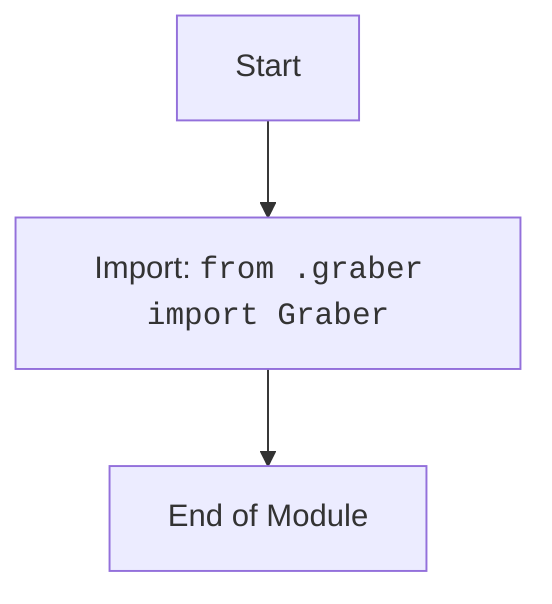

# Анализ кода `hypotez/src/suppliers/visualdg/__init__.py`

## 1. <алгоритм>

1.  **Импорт `Graber`**:
    *   Импортируется класс `Graber` из модуля `graber.py`, находящегося в том же пакете `visualdg`.
    *   **Пример**: `from .graber import Graber`
        *   Это означает, что  в текущий файл импортируется класс `Graber` для использования в этом модуле.

2.  **Конец модуля**:
    *   Модуль завершается, предоставляя возможность использовать класс `Graber` извне через импорт пакета `visualdg`.

## 2. <mermaid>

**Зависимости:**

*   Импортируется класс `Graber` из модуля `graber`, находящегося в том же каталоге. 
*   Нет других зависимостей от других модулей или пакетов.

## 3. <объяснение>

**Импорты:**

*   `from .graber import Graber`:
    *   Импортирует класс `Graber` из модуля `graber.py`, расположенного в том же каталоге, что и `__init__.py`.
    *   Точка (`.`) в `from .graber` означает относительный импорт, т.е. `graber` находится в текущем пакете `visualdg`.
    *   Это позволяет использовать `Graber` в других модулях, импортировав `visualdg`.

**Классы:**

*   `Graber`:
    *   Класс `Graber` импортируется, но его реализация не видна в данном файле. 
    *   Предполагается, что класс `Graber` отвечает за какую-то логику сбора данных или обработки. 
    *   Так как это `__init__.py`, этот класс станет доступным для импорта при импорте пакета `visualdg`.

**Функции:**

*   В данном файле нет функций.

**Переменные:**

*   В данном файле нет переменных.

**Объяснение:**

Файл `__init__.py`  в пакете `visualdg` служит для определения, какие модули и символы из пакета `visualdg` будут доступны при импорте этого пакета. В данном случае, `__init__.py` импортирует класс `Graber`, что делает его доступным для использования при импорте пакета `visualdg`, например, `from src.suppliers.visualdg import Graber`.

**Потенциальные ошибки или области для улучшения:**

*   Отсутствует какая-либо документация внутри файла. Было бы полезно добавить docstring для модуля `__init__.py`.
*   Нет проверок или обработки ошибок. 

**Взаимосвязи с другими частями проекта:**

*   Предполагается, что класс `Graber`  используется в других частях проекта, где требуется функциональность сбора или обработки данных (скорее всего, в контексте поставщиков данных `suppliers`).
*   Файл `__init__.py`  позволяет другим модулям в проекте импортировать  `Graber` как `from src.suppliers.visualdg import Graber`.

Таким образом, этот `__init__.py` файл делает класс `Graber` доступным для использования вне пакета `visualdg`.