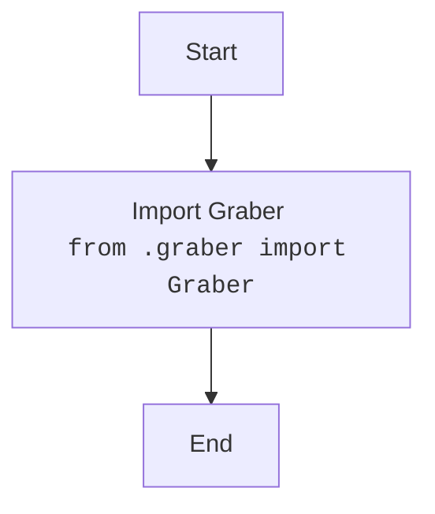

## АНАЛИЗ КОДА: `src/suppliers/wallashop/__init__.py`

### 1. <алгоритм>

1. **Импорт:**
   -  Импортируется класс `Graber` из модуля `graber.py` в текущем пакете `wallashop`.

   _Пример:_
   -   `from .graber import Graber` - это действие импортирует класс, который можно использовать для создания объектов, которые могут  выполнять определенные действия, такие как извлечение данных из сайта.

### 2. <mermaid>

**Объяснение зависимостей в `mermaid`:**

- **Start**: Начало процесса.
- **ImportGraber**: Импортирует класс `Graber` из модуля `graber.py`. Это действие делает класс `Graber` доступным для использования в текущем модуле `__init__.py`.
- **End**: Конец процесса.

### 3. <объяснение>

**Импорты:**

-   `from .graber import Graber`: Этот импорт делает класс `Graber` доступным для использования в пакете `wallashop`. Точка (`.`) перед `graber` означает, что `graber.py` находится в том же каталоге, что и `__init__.py`.
    -   **Назначение:** Этот импорт необходим для того, чтобы можно было создавать экземпляры класса `Graber` и использовать его методы и атрибуты из других частей проекта, которые импортируют модуль `wallashop`.
    -  **Связь с `src`:** Класс `Graber` вероятно предназначен для взаимодействия с веб-страницами или API для сбора данных. Это часть логики поставщика `wallashop` внутри структуры `src`.

**Классы:**

-   `Graber`:  Класс `Graber` не определен в `__init__.py`, он импортируется. Предполагается, что это основной класс для сбора данных или другого взаимодействия, характерного для поставщика `wallashop`. Его реализация находится в файле `graber.py`.

    -   **Роль:** Представляет собой инструмент для сбора данных, связанный с поставщиком `wallashop`.

**Функции:**

-   В данном файле функции не объявлены.

**Переменные:**

-   В данном файле переменные не объявлены.

**Потенциальные ошибки и области для улучшения:**

-   **Отсутствие документации:**  Может быть полезным добавить docstring для `__init__.py`, чтобы описать его роль и предназначение в пакете.

**Цепочка взаимосвязей с другими частями проекта:**

-   `__init__.py` в `wallashop` действует как точка входа для этого поставщика. Он импортирует `Graber` из `graber.py`. Другие модули в `src`,  вероятно, будут импортировать `wallashop` (через этот `__init__.py`) и использовать `Graber` для работы с данными `wallashop`.
-  `Graber` в свою очередь может зависеть от таких модулей, как `requests` (для HTTP-запросов), `BeautifulSoup` (для разбора HTML) или подобных, в зависимости от конкретной реализации в `graber.py`. Эти зависимости не видны из `__init__.py`, но могут быть проанализированы в файле `graber.py`.