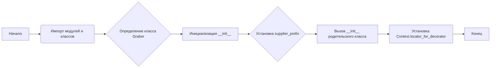
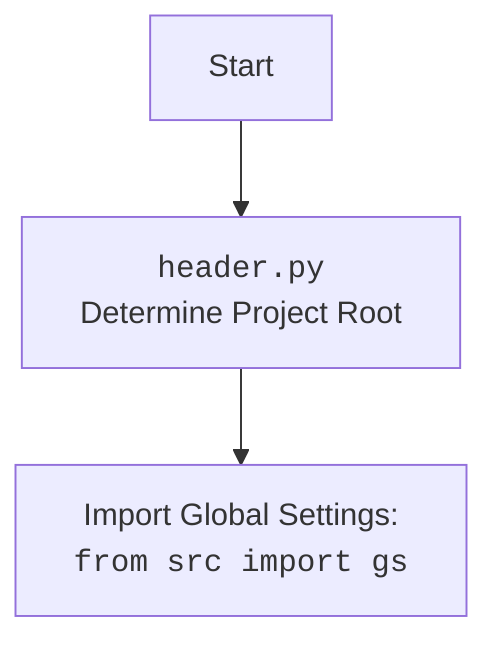

## Анализ кода `graber.py`

### 1. <алгоритм>

**Блок-схема:**



**Пояснение:**

1.  **Начало:** Программа начинает выполнение.
2.  **Импорт модулей и классов:** Импортируются необходимые модули и классы (такие как `header`, `Graber` из `src.suppliers.graber`, `Driver`, `logger` и другие).
3.  **Определение класса `Graber`:** Объявляется класс `Graber`, наследующийся от `Graber` из `src.suppliers.graber`.
4.  **Инициализация `__init__`:** Вызывается конструктор класса `Graber`.
5.  **Установка `supplier_prefix`:** Устанавливается префикс поставщика в значение 'wallashop'.
6.  **Вызов `__init__` родительского класса:** Вызывается конструктор родительского класса `Graber`, передавая ему префикс поставщика и объект `Driver`.
7.  **Установка `Context.locator_for_decorator`:** Устанавливается атрибут `locator_for_decorator` в `Context` (глобальный объект) в значение `None`. Это означает, что декоратор по умолчанию `@close_pop_up` не будет выполнять действия по закрытию всплывающих окон, так как `Context.locator_for_decorator` не имеет значения.
8.  **Конец:** Завершение инициализации класса.

### 2. <mermaid>

```mermaid
flowchart TD
    A[<code>graber.py</code><br>Start] --> B(Import modules and classes);
    B --> C{Define class <br> Graber(Grbr)};
    C --> D[__init__(self, driver: Driver)];
     D --> E{Set self.supplier_prefix = 'wallashop'};
     E --> F[super().__init__(supplier_prefix, driver)];
     F --> G[Set Context.locator_for_decorator = None];
     G --> H[End];

    style A fill:#f9f,stroke:#333,stroke-width:2px
    style H fill:#ccf,stroke:#333,stroke-width:2px
```

**Импортируемые зависимости и их объяснение:**

*   `from typing import Any`: Импортирует `Any` для объявления переменных с любым типом данных.
*   `import header`: Импортирует модуль `header`, который, вероятно, содержит общие настройки проекта.
*    `from src.suppliers.graber import Graber as Grbr, Context, close_pop_up`:
    *   `Graber as Grbr`: Импортирует класс `Graber` из `src.suppliers.graber` и переименовывает его в `Grbr`. Этот класс, вероятно, предоставляет общую логику для сбора данных с веб-страниц поставщиков.
    *   `Context`: Импортирует класс `Context` - хранилище глобальных переменных.
    *   `close_pop_up`: Импортирует декоратор `close_pop_up`, предназначенный для закрытия всплывающих окон.
*    `from src.webdriver.driver import Driver`: Импортирует класс `Driver` из `src.webdriver.driver`, который отвечает за управление веб-драйвером.
*    `from src.logger.logger import logger`: Импортирует объект `logger` для логирования событий.

**Диаграмма для `header.py`:**



### 3. <объяснение>

#### Импорты:

*   `from typing import Any`: Позволяет использовать аннотацию `Any`, которая указывает, что переменная может иметь любой тип данных.
*   `import header`:  Используется для загрузки глобальных настроек проекта. Позволяет настроить базовые пути к проекту и другие общие конфигурации, используемые в разных частях приложения.
*   `from src.suppliers.graber import Graber as Grbr, Context, close_pop_up`:
    *   `Graber as Grbr`: Импортирует родительский класс `Graber` (переименованный в `Grbr`), который предоставляет базовые методы для извлечения данных с веб-страниц.  Этот класс является абстрактным, и `wallashop.graber.Graber` наследует его функциональность, переопределяя поведение для конкретного поставщика.
    *   `Context`: Импортирует класс `Context`, который, по всей видимости, используется как глобальное хранилище данных.  Используется для передачи общих параметров, таких как локаторы для декоратора `close_pop_up`, между различными частями приложения.
    *   `close_pop_up`: Импортирует декоратор `close_pop_up`, предназначенный для закрытия всплывающих окон.
*   `from src.webdriver.driver import Driver`: Импортирует класс `Driver`, который предоставляет интерфейс для взаимодействия с веб-драйвером, таким как Chrome или Firefox. Класс `Driver` инкапсулирует все действия по управлению браузером.
*    `from src.logger.logger import logger`: Импортирует объект `logger`, который используется для записи сообщений и ошибок, возникающих в процессе работы приложения.

#### Классы:

*   **`Graber(Grbr)`:**
    *   **Роль:** Этот класс является наследником `Graber` из `src.suppliers.graber` и специализируется на сборе данных с веб-сайта `wallashop.co.il`.
    *   **Атрибуты:**
        *   `supplier_prefix` (str): Префикс, используемый для идентификации поставщика ('wallashop').
    *   **Методы:**
        *   `__init__(self, driver: Driver)`: Конструктор класса, инициализирует префикс поставщика и вызывает конструктор родительского класса. Также устанавливает значение `Context.locator_for_decorator` в `None`, отключая стандартное действие декоратора.
    *   **Взаимодействие:** Этот класс взаимодействует с классом `Driver` для управления браузером и с родительским классом `Grbr` для наследования базовой логики сбора данных.

#### Функции:

*   **`__init__(self, driver: Driver)`**:
    *   **Аргументы:**
        *   `self`: Ссылка на текущий экземпляр класса.
        *   `driver` (`Driver`): Экземпляр класса `Driver`, предоставляющий интерфейс для управления веб-драйвером.
    *   **Возвращаемое значение:** Нет.
    *   **Назначение:** Инициализирует объект класса `Graber`, устанавливая префикс поставщика, вызывая конструктор родительского класса и сбрасывая значение `Context.locator_for_decorator`.
    *   **Пример:**
        ```python
        driver_instance = Driver(...)
        graber_instance = Graber(driver_instance)
        ```

#### Переменные:

*   `supplier_prefix`:  Строка, хранящая префикс поставщика ('wallashop').
*   `Context.locator_for_decorator`: Атрибут класса `Context`, управляющий выполнением декоратора `@close_pop_up`.  Если значение равно `None`, то декоратор не будет выполнять никаких действий.

#### Потенциальные ошибки и области для улучшения:

*   **Отсутствие декоратора:** Код содержит закомментированный шаблон декоратора, который не используется по умолчанию.  Если декоратор `@close_pop_up` не нужен, его можно убрать, если нужен -  раскомментировать и дописать логику.
*   **Управление `Context.locator_for_decorator`:** Установка значения `Context.locator_for_decorator` в `None` в конструкторе может быть не самым удобным способом управления поведением декоратора.  Рекомендуется сделать более явное управление, например, через метод класса.

#### Цепочка взаимосвязей с другими частями проекта:

1.  **`header.py`:**  Используется для загрузки глобальных настроек, которые необходимы для работы классов `Driver`, `Graber` и `logger`.
2.  **`src.suppliers.graber.Graber`:** Базовый класс для сбора данных с веб-страниц. `wallashop.graber.Graber` наследует от него, переопределяя поведение для `wallashop.co.il`.
3.  **`src.webdriver.driver.Driver`:**  Класс, управляющий веб-драйвером.  Экземпляр этого класса передается в конструктор `Graber`.
4.  **`src.logger.logger`:**  Используется для логирования событий и ошибок в процессе работы граббера.
5.  **`src.Context`:** Глобальное хранилище данных, используемое для передачи общих параметров, в данном случае `locator_for_decorator`, между классами.

Таким образом, `graber.py` взаимодействует с основными частями проекта: настройками, веб-драйвером, базовым классом грабера и системой логирования. Это обеспечивает модульность и гибкость при работе с разными поставщиками.