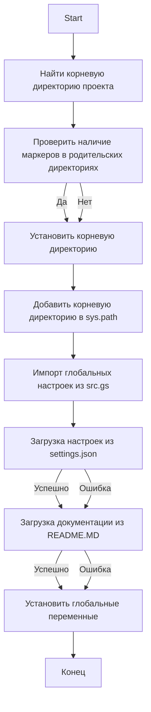
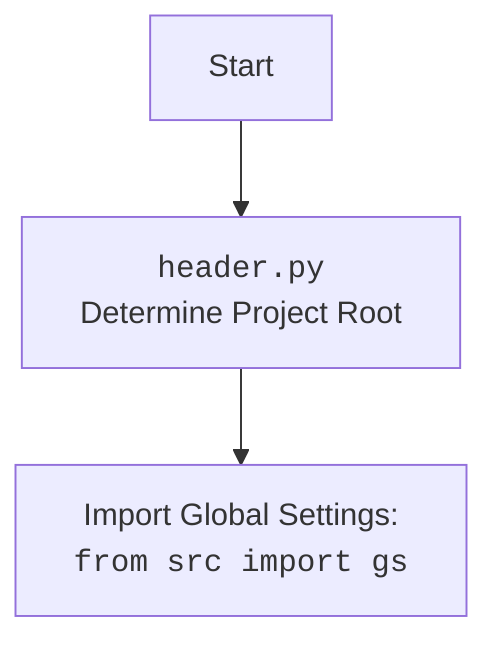

## <алгоритм>

1. **Инициализация**:
   - Начинаем с текущего пути файла (`__file__`) и определяем его родительский каталог. Это наш начальный путь.
   - Устанавливаем переменную `__root__`, которая будет хранить путь к корневому каталогу проекта, равной начальному пути.
   
   *Пример*: Предположим, `__file__` указывает на `/Users/user/projects/hypotez/src/suppliers/wallashop/header.py`. Тогда `current_path` будет `/Users/user/projects/hypotez/src/suppliers/wallashop`, а `__root__` изначально будет равен `current_path`.

2. **Поиск корневого каталога**:
   - Перебираем родительские каталоги от текущего, включая сам текущий каталог.
   - Для каждого каталога проверяем, есть ли в нем любой из файлов или каталогов из списка `marker_files` (по умолчанию `__root__` или `.git`).
   - Если находим один из маркеров, устанавливаем `__root__` равным этому каталогу и выходим из цикла.
   
   *Пример*: Если в `/Users/user/projects/hypotez` есть директория `.git`, `__root__` станет `/Users/user/projects/hypotez`.
   
3. **Добавление корневого каталога в `sys.path`**:
   - Проверяем, находится ли `__root__` в путях поиска модулей (`sys.path`).
   - Если нет, добавляем его в начало списка `sys.path`. Это позволяет импортировать модули из корневого каталога.
   
   *Пример*: Если `__root__` - `/Users/user/projects/hypotez` и его нет в `sys.path`, то `sys.path` станет `['/Users/user/projects/hypotez', ...]`
   
4. **Импорт `gs`**:
   - Импортируем модуль `gs` из `src`, который предположительно содержит глобальные настройки и пути.

5. **Загрузка настроек из `settings.json`**:
   - Пытаемся открыть файл `settings.json`, находящийся по пути `gs.path.root / 'src' / 'settings.json'`.
   - Если файл открыт, загружаем его содержимое как словарь `settings` с помощью `json.load()`.
   - Если файл не найден или есть ошибка в формате JSON, переходим к блоку `except` и ничего не делаем, оставляя `settings` равным `None`.

6. **Загрузка документации из `README.MD`**:
   - Пытаемся открыть файл `README.MD`, находящийся по пути `gs.path.root / 'src' / 'README.MD'`.
   - Если файл открыт, считываем его содержимое как строку `doc_str`.
    - Если файл не найден или есть ошибка в формате JSON, переходим к блоку `except` и ничего не делаем, оставляя `doc_str` равным `None`.
   
7. **Инициализация глобальных переменных**:
   - Инициализируем глобальные переменные, такие как `__project_name__`, `__version__`, `__doc__`, `__details__`, `__author__`, `__copyright__` и `__cofee__`.
   - Если `settings` успешно загружены, то значения для этих переменных берутся из словаря `settings`, если нет или какие-то ключи отсутствуют, то устанавливаются значения по умолчанию.

## <mermaid>




### Зависимости в `mermaid`:

*   **Start**: Начало выполнения скрипта.
*   **FindRoot**: Функция `set_project_root` начинает поиск корневой директории.
*   **CheckMarkers**: Проверка наличия файлов-маркеров (`__root__` или `.git`) в родительских директориях.
*   **SetRoot**: Установка `__root__` на найденную директорию.
*   **AddToSysPath**: Добавление найденного `__root__` в `sys.path` для возможности импорта.
*   **ImportGS**: Импорт модуля `gs`, содержащего глобальные настройки.
*   **LoadSettings**: Загрузка данных из `settings.json`.
*    **LoadDoc**: Загрузка данных из `README.MD`.
*   **SetGlobals**: Установка глобальных переменных, таких как `__project_name__`, `__version__`, используя загруженные настройки.
*   **End**: Конец выполнения скрипта.

## <объяснение>

### Импорты:
*   **`import sys`**:
    -   Используется для взаимодействия с интерпретатором Python, в частности, для модификации `sys.path`.
    -   `sys.path` – это список путей, по которым Python ищет модули для импорта. Добавление в этот список корневого пути проекта делает возможным импорт модулей из разных его частей.
*   **`import json`**:
    -   Используется для работы с JSON файлами: сериализация (запись) и десериализация (чтение).
    -   В данном случае используется для чтения файла настроек `settings.json`.
*  **`from packaging.version import Version`**:
   - Импортирует класс `Version` из модуля `packaging.version`.
   - Используется для сравнения и обработки версий программного обеспечения.
*   **`from pathlib import Path`**:
    -   Используется для работы с путями к файлам и каталогам в виде объектов, что делает операции с ними более интуитивно понятными и кроссплатформенными.
    -   `Path` применяется для поиска корневого каталога проекта и для работы с файлами настроек и документации.
*   **`from src import gs`**:
    -   Импортирует модуль `gs` из пакета `src`. Предположительно `gs` (global settings) содержит глобальные переменные и настройки, такие как пути к директориям проекта.
    -   `gs.path.root` используется для определения полного пути к `settings.json` и `README.MD`.

### Функция:

*   **`set_project_root(marker_files=('__root__', '.git')) -> Path`**:
    -   **Аргументы**:
        -   `marker_files`: кортеж имен файлов или каталогов, которые используются для определения корневого каталога проекта (по умолчанию `('__root__', '.git')`).
    -   **Возвращаемое значение**:
        -   `Path`: объект `pathlib.Path`, представляющий корневой каталог проекта.
    -   **Назначение**:
        -   Функция ищет корневой каталог проекта, поднимаясь вверх по иерархии директорий от текущего файла (`__file__`).
        -   Поиск прекращается, когда в родительской директории обнаруживается файл или каталог, указанный в `marker_files`.
        -   Если корневой каталог найден, его путь добавляется в `sys.path`, чтобы обеспечить возможность импорта модулей из проекта.
    -   **Пример**:
        ```python
        project_root = set_project_root()
        print(project_root)  # Выведет путь к корневой директории проекта
        ```
### Переменные:

*   **`__root__`**:
    -   `Path`: путь к корневому каталогу проекта, определенный функцией `set_project_root`.
    -   Используется для определения путей к другим файлам и каталогам проекта.
*    **`settings`**:
    -   `dict`: словарь, содержащий настройки проекта, считанные из `settings.json`.
    -   Может быть `None`, если файл настроек не найден или имеет некорректный формат.
*   **`doc_str`**:
     -   `str`: строка, содержащая документацию проекта, считанную из `README.MD`.
     -    Может быть `None`, если файл документации не найден или имеет некорректный формат.
*   **`__project_name__`, `__version__`, `__doc__`, `__details__`, `__author__`, `__copyright__`, `__cofee__`**:
    -   `str`: глобальные переменные, содержащие информацию о проекте: название, версия, документация, авторские права и т.д.
    -   Значения берутся из словаря `settings`, если он существует, иначе используются значения по умолчанию.

### Цепочка взаимосвязей:

1.  Скрипт начинается с определения корневой директории проекта с помощью `set_project_root` и сохраняет её в `__root__`.
2.  Далее добавляет `__root__` в `sys.path`, чтобы можно было импортировать другие модули, включая `src.gs`.
3.  Использует путь, определенный в `gs.path.root`, для загрузки настроек из `settings.json` и документации из `README.MD`.
4.  Использует загруженные настройки для установки глобальных переменных, таких как имя проекта, версия, автор и т.д.
5.  Эти глобальные переменные могут использоваться другими модулями проекта.

### Потенциальные ошибки и области для улучшения:

1.  **Обработка ошибок**: Обработка ошибок при открытии `settings.json` и `README.MD` происходит с помощью блока `try...except`, но в блоке `except` ничего не делается (`...`). Может быть полезно добавить логирование или вывод сообщений об ошибках.
2.  **Зависимость от `gs`**: Скрипт сильно зависит от структуры `gs` (global settings), включая `gs.path.root`. Это означает, что изменение `gs` может привести к поломке скрипта. Возможно, стоит сделать эту зависимость более гибкой или явной.
3.  **Отсутствие проверок содержимого `settings`**: Скрипт предполагает, что в `settings` есть необходимые ключи (`project_name`, `version` и т. д.). Если какой-либо из ключей отсутствует, используется значение по умолчанию. Возможно, стоит сделать более строгую проверку и/или логирование отсутствующих ключей.
4.  **Поиск корневой директории**: Если в иерархии директорий не будет найдено ни одного маркера из `marker_files`, то `__root__` будет равен директории, в которой расположен скрипт `header.py`.
5. **Зависимость от `settings.json` и `README.MD`**: Скрипт не сможет корректно инициализировать глобальные переменные, если эти файлы отсутствуют. Следует добавить обработку такого сценария (вывести ошибку или использовать значения по умолчанию).

В целом, код выполняет задачу определения корневой директории, загрузки настроек и документации и инициализации глобальных переменных. Однако, он имеет некоторые потенциальные проблемы, которые следует учитывать при разработке.