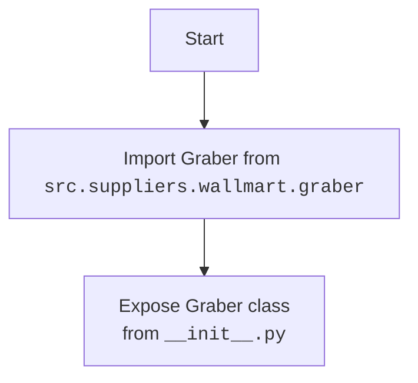

## АНАЛИЗ КОДА: `src/suppliers/wallmart/__init__.py`

### <алгоритм>

1. **Импорт:** Импортируется класс `Graber` из модуля `src.suppliers.wallmart.graber`.
    - Пример: `from .graber import Graber`
    - Данные: `Graber`
    - Поток данных: Модуль `src.suppliers.wallmart` получает доступ к классу `Graber` из `src.suppliers.wallmart.graber`.

2. **Инициализация:** Файл `__init__.py` в пакете `wallmart` делает класс `Graber` доступным для импорта в других частях проекта. Это позволяет обращаться к `Graber` как `from src.suppliers.wallmart import Graber`.
    - Пример: `from src.suppliers.wallmart import Graber`

### <mermaid>

**Объяснение зависимостей:**
- **`flowchart TD`**:  Определяет тип диаграммы как блок-схему с направлением сверху вниз.
- **`Start`**: Начало процесса импорта.
- **`ImportGraber[Import Graber from  src.suppliers.wallmart.graber]`**:  Блок, показывающий импорт класса `Graber` из модуля `src.suppliers.wallmart.graber`. Используется относительный импорт `.graber`.
- **`ExposeGraber[Expose Graber class   from __init__.py]`**: Блок, показывающий, что класс `Graber` становится доступным для импорта из пакета `src.suppliers.wallmart` через файл `__init__.py`.

### <объяснение>

**Импорты:**
- `from .graber import Graber`: Этот импорт позволяет использовать класс `Graber`, который предположительно находится в модуле `graber.py` внутри директории `src/suppliers/wallmart`. Точка `.` в начале указывает на относительный импорт внутри текущего пакета. Таким образом, вместо явного указания пути импортируется модуль `graber` того же пакета, что и `__init__.py`.

**Классы:**
- В данном файле класса не определены.  Он лишь импортирует класс `Graber`.  Класс `Graber` предположительно используется для сбора (парсинга, скачивания) информации о товарах с сайта Walmart.

**Функции:**
- В данном файле функции не определены. Он предназначен для импорта и экспорта классов.

**Переменные:**
- В данном файле переменные не определены.

**Дополнительно:**
- Этот файл `__init__.py` делает класс `Graber` доступным для импорта, что упрощает его использование в других частях проекта.
- **Взаимосвязи:** Этот файл является частью пакета `src.suppliers.wallmart`. Предположительно, другие модули в проекте будут импортировать класс `Graber` для работы с данными Walmart, например, для сбора данных о товарах, их ценах и т.д. Это ключевой компонент, позволяющий модулям пакета обмениваться общими классами.
- **Улучшения:**
    - Для документации и облегчения дальнейшего использования, было бы полезно добавить docstring с описанием, что делает пакет.

**Потенциальные ошибки:**
- Если модуль `graber.py` не существует или содержит ошибки, то импорт `Graber` может привести к исключениям во время выполнения.
- Отсутствие docstring делает код менее понятным для новых разработчиков.