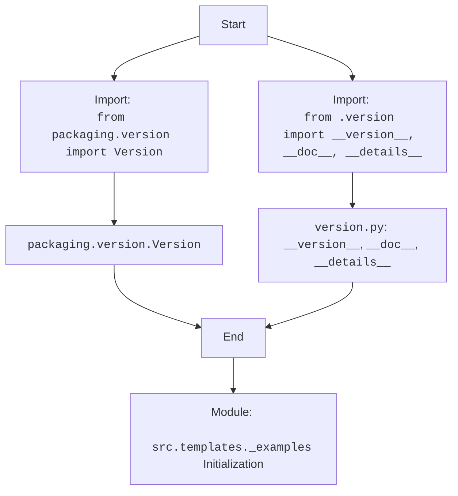

## Анализ кода `src/templates/_examples/__init__.py`

### 1. <алгоритм>

**Описание алгоритма:**

1. **Импорт модулей**:
   - Импортируется класс `Version` из библиотеки `packaging.version`. Этот класс используется для работы с версиями пакетов.
   - Импортируются переменные `__version__`, `__doc__` и `__details__` из модуля `version.py`, находящегося в той же директории (`.`).

2.  **Инициализация модуля**:
   - Модуль `src.templates._examples` инициализируется.
   - Этот `__init__.py` файл делает директорию `_examples` пакетом, позволяя импортировать его содержимое в другие части проекта.

**Примеры:**

- **Импорт `Version`:** `from packaging.version import Version`
   -  Пример использования: `Version("1.2.3")` создаст объект версии.
- **Импорт `__version__`, `__doc__`, `__details__`**:  `from .version import __version__, __doc__, __details__`
  -  Предположим, `version.py` содержит:
    ```python
    __version__ = "0.1.0"
    __doc__ = "Примеры шаблонов"
    __details__ = "Дополнительные детали о шаблонах"
    ```
   -  Тогда в текущем модуле будут доступны `__version__ = "0.1.0"`, `__doc__ = "Примеры шаблонов"` и `__details__ = "Дополнительные детали о шаблонах"`.

### 2. <mermaid>



**Объяснение `mermaid` диаграммы:**

- **Start**: Начало процесса.
- **ImportPackaging**: Импорт класса `Version` из пакета `packaging.version`.
- **ImportVersion**: Импорт переменных `__version__`, `__doc__` и `__details__` из локального модуля `version.py`.
- **PackagingVersion**:  Отображает импортированный класс `packaging.version.Version` .
- **VersionVariables**:  Отображает импортированные переменные из `version.py`.
- **ModuleInit**: Указывает на инициализацию модуля `src.templates._examples`.
- **End**: Завершение процесса импорта и инициализации модуля.

**Зависимости импорта:**

- **`packaging.version`**: Библиотека, предоставляющая класс `Version` для работы с версиями.
- **`.version`**: Модуль `version.py` в той же директории, из которого импортируются переменные о версии, документации и деталях.

### 3. <объяснение>

**Импорты:**

- `from packaging.version import Version`:
   -  **Назначение**: Импортирует класс `Version` для работы с версиями пакетов (например, для сравнения версий, проверки их корректности и т. д.).
   -  **Взаимосвязь с `src`**:  Используется внутри модуля для управления версиями и информацией, связанной с шаблонами. `packaging` — это внешняя библиотека, а не часть `src`.

- `from .version import __version__, __doc__, __details__`:
    - **Назначение**: Импортирует переменные, определяющие версию, документацию и дополнительные детали для текущего модуля.
    - **Взаимосвязь с `src`**:  `version.py` находится в том же пакете (директории) `_examples` в `src/templates/_examples/`. Импортированные переменные используются для предоставления метаинформации о модуле.

**Классы:**
-   В этом файле нет определений классов. Используется только класс `Version` из сторонней библиотеки `packaging`.

**Функции:**

- В этом файле нет определений функций.

**Переменные:**

-   `__version__`: Строка, представляющая версию текущего модуля. Импортируется из `version.py`.
-   `__doc__`: Строка, представляющая документацию к текущему модулю. Импортируется из `version.py`.
-   `__details__`: Строка, представляющая дополнительные детали о текущем модуле. Импортируется из `version.py`.

**Потенциальные ошибки и области для улучшения:**

- **Отсутствие явной инициализации**:  Файл `__init__.py` только импортирует модули и переменные, не выполняя другой логики. Возможно, в будущем потребуется добавить здесь начальную инициализацию.
- **Синтаксис документации:**  Документация в коде не имеет форматирования.  Было бы лучше использовать docstrings.
- **Неиспользуемые строки:** В коде есть несколько пустых строк документации, которые можно убрать.
- **Зависимость от `version.py`:** Зависимость от `version.py` для хранения метаинформации может усложнить управление версиями. Возможно, стоит использовать более стандартные подходы, например, `setup.py` или `pyproject.toml` для хранения версии проекта и использовать механизмы Python для ее получения.

**Цепочка взаимосвязей с другими частями проекта:**

- Модуль, расположенный в `src.templates._examples`, вероятно, используется для хранения и управления примерами шаблонов. 
- Модули, которые импортируют  `src.templates._examples`  могут использовать  `__version__` ,  `__doc__` , и  `__details__` для получения информации о версии и описании.
- `packaging.version` используется для работы с версиями, обеспечивая корректное сравнение и управление версиями шаблонов.

**Заключение:**

Файл `__init__.py` модуля `src.templates._examples`  предоставляет необходимую метаинформацию о модуле, а также импортирует класс для работы с версиями. Файл настраивает директорию `_examples` как пакет Python.