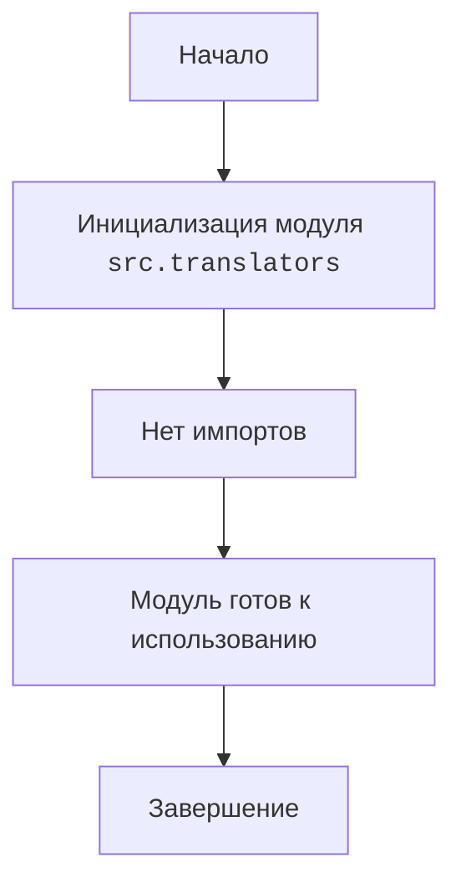

## <алгоритм>

1. **Начало**: Инициализация модуля `src.translators`.
2. **Импорт**: В данном случае, код не содержит явных импортов других модулей или пакетов. Это означает, что модуль, в основном, является контейнером или зарезервированным пространством для других модулей.
3. **Завершение**: Модуль `src.translators` готов к импорту других модулей, которые будут отвечать за конкретную логику перевода.

**Пример**:
  - **Начало**: Модуль `/src/translators/__init__.py` создан для управления переводами.
  - **Импорт**: На данный момент импорты не производятся, но в будушем тут будут модули связанные с обработкой переводов.
  - **Завершение**: Инициализация модуля завершена.

## <mermaid>

**Объяснение:**

*   `Start`: Начало выполнения.
*   `ModuleInit`: Инициализируется модуль `src.translators`.
*   `NoImports`: В текущей версии модуля отсутствуют явные импорты.
*   `ModuleReady`: Модуль подготовлен к дальнейшему использованию.
*   `End`: Завершение процесса инициализации.

## <объяснение>

**Импорты:**
* В данном файле, `__init__.py`, нет явных импортов. Обычно этот файл в Python-пакетах служит для обозначения директории как пакета и может содержать код для инициализации пакета. Отсутствие импортов здесь означает, что пакет `translators` на данный момент не зависит от других модулей и является как бы "точкой входа" в пакет.  

**Классы:**
* В предоставленном коде нет классов.

**Функции:**
* В предоставленном коде нет функций.

**Переменные:**
* В предоставленном коде нет переменных.

**Потенциальные ошибки или области для улучшения:**

*   **Отсутствие функциональности**: На данный момент, модуль `src.translators` не выполняет никаких действий, кроме того, что делает директорию пакетом. Это может быть признаком того, что разработка этого модуля находится на начальной стадии.
*   **Зависимости**: В будущем, когда в Модуль будут добавлены другие модули, важно следить за тем, чтобы зависимости были чётко определены и не создавали циклических импортов.
*   **Документирование**: Неплохо было бы добавить  документирование функций, классов и переменных по мере их добавления.

**Взаимосвязь с другими частями проекта:**

*   Модуль `src.translators` вероятно будет использоваться как часть системы переводов. Другие части проекта могут импортировать модули из `src.translators` для выполнения переводов.
*    По мере роста проекта в этот пакет будут добавляться модули связанные с переводом текста и обработки различных форматов.
*   Модуль будет связан с пользовательским интерфейсом для отображения переведенного текста.

В целом, модуль `src.translators/__init__.py` представляет собой пустой шаблон, который будет расширятся по мере развития проекта.