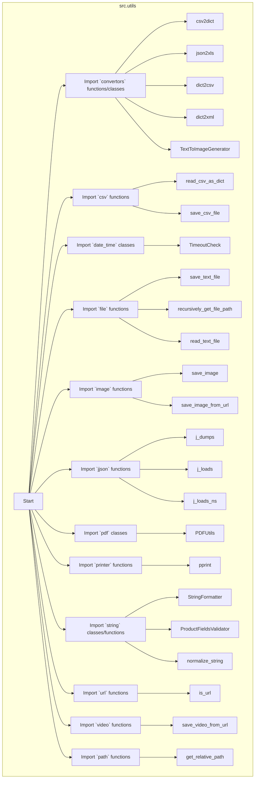

## ИНСТРУКЦИЯ:

Анализируй предоставленный код подробно и объясни его функциональность. Ответ должен включать три раздела:  

1.  **<алгоритм>**: Опиши рабочий процесс в виде пошаговой блок-схемы, включая примеры для каждого логического блока, и проиллюстрируй поток данных между функциями, классами или методами.  
2.  **<mermaid>**: Напиши код для диаграммы в формате `mermaid`, проанализируй и объясни все зависимости,
    которые импортируются при создании диаграммы.
    **ВАЖНО!** Убедитесь, что все имена переменных, используемые в диаграмме `mermaid`,
    имеют осмысленные и описательные имена. Имена переменных вроде `A`, `B`, `C`, и т.д., не допускаются!
    
    **Дополнительно**: Если в коде есть импорт `import header`, добавьте блок `mermaid` flowchart, объясняющий `header.py`:\
    ```mermaid
    flowchart TD
        Start --> Header[<code>header.py</code><br> Determine Project Root]
    
        Header --> import[Import Global Settings: <br><code>from src import gs</code>]
    ```
3.  **<объяснение>**: Предоставьте подробные объяснения:
    - **Импорты**: Их назначение и взаимосвязь с другими пакетами `src.`.
    - **Классы**: Их роль, атрибуты, методы и взаимодействие с другими компонентами проекта.
    - **Функции**: Их аргументы, возвращаемые значения, назначение и примеры.
    - **Переменные**: Их типы и использование.
    - Выделите потенциальные ошибки или области для улучшения.
    
    Дополнительно, постройте цепочку взаимосвязей с другими частями проекта (если применимо).
    
    Это обеспечивает всесторонний и структурированный анализ кода.
## Формат ответа: `.md` (markdown)
**КОНЕЦ ИНСТРУКЦИИ**

### <алгоритм>

**Общая схема работы:**

1.  **Импорт модулей:**
    *   Импортируются необходимые модули и их функции/классы из различных подпакетов `src.utils`.
    *   Пример: `from .convertors import csv2dict` импортирует функцию `csv2dict` из подмодуля `convertors` текущего пакета.
2.  **Организация утилит:**
    *   Модуль `__init__.py` выступает как точка входа для доступа к утилитам из пакета `src.utils`.
    *   Пользователь может импортировать любую функцию, класс или переменную, представленную в этом файле (из подпакетов).
3.  **Использование:**
    *   Импортированные утилиты могут быть использованы в любой части проекта, где требуется их функциональность.
    *   Примеры:
        *   `csv2dict` - конвертация данных из CSV-файла в словарь Python.
        *   `save_text_file` - сохранение текстовых данных в файл.
        *   `j_loads` - разбор JSON-данных.
        *   `normalize_string` - нормализация строк (удаление лишних пробелов, приведение к нижнему регистру и т.п.).
4.  **Подпакеты:**
    *   `convertors` — содержит функции для преобразования различных форматов данных (CSV, JSON, HTML, XML, и т. д.).
    *   `csv` — включает функции для чтения и записи CSV-файлов.
    *   `date_time` — содержит утилиты для работы с датой и временем.
    *   `file` — содержит функции для работы с файлами и директориями.
    *   `image` — функции для работы с изображениями.
    *   `jjson` — функции для работы с JSON (кастомные `j_dumps`, `j_loads`, `j_loads_ns`).
    *   `pdf` — содержит утилиты для работы с PDF файлами.
    *   `printer` — содержит функции для форматированного вывода.
    *   `string` — содержит утилиты для работы со строками.
    *   `url` — содержит функции для работы с URL.
    *   `video` — функции для работы с видео.
    *   `path` — функции для работы с путями.

### <mermaid>



**Анализ `mermaid` диаграммы:**

*   **Структура:** Диаграмма представляет собой подграф, отображающий структуру пакета `src.utils`. Узел `Start` обозначает начало импорта утилит. Все остальные узлы представляют импортируемые модули, классы и функции из различных подпакетов.
*   **Зависимости:** Стрелки показывают, какие модули/классы/функции импортируются из соответствующих подпакетов, демонстрируя зависимость модуля `__init__.py` от внутренних модулей `src.utils`.
*   **Описательные имена:** Имена узлов являются осмысленными и отражают сущность представляемых ими объектов (например, `csv2dict_func` представляет функцию `csv2dict`, `TimeoutCheck_class` представляет класс `TimeoutCheck` и т.д.).

### <объяснение>

**Импорты:**

*   **`from .convertors import ...`**: Импортирует функции и класс для преобразования данных из разных форматов (CSV, JSON, HTML, XML, и т.д.) в другие форматы или структуры данных Python, например `csv2dict` (преобразует CSV в словарь), `json2xls` (преобразует JSON в XLSX), `TextToImageGenerator` (класс для создания изображений из текста).
*   **`from .csv import ...`**: Импортирует функции для работы с CSV-файлами, такие как `read_csv_as_dict` (чтение CSV в словарь), `save_csv_file` (сохранение данных в CSV-файл).
*   **`from .date_time import ...`**: Импортирует классы для работы с датой и временем, такие как `TimeoutCheck` (класс для контроля времени выполнения).
*   **`from .file import ...`**: Импортирует функции для работы с файлами и директориями, такие как `save_text_file` (сохранение текста в файл), `recursively_get_file_path` (рекурсивное получение путей к файлам), `read_text_file` (чтение текстового файла).
*  **`from .image import ...`**: Импортирует функции для работы с изображениями, такие как `save_image` (сохранение изображения), `save_image_from_url` (сохранение изображения по URL).
*  **`from .jjson import ...`**: Импортирует функции для работы с JSON данными (кастомные реализации `j_dumps`, `j_loads`, `j_loads_ns`).
*  **`from .pdf import ...`**: Импортирует класс для работы с PDF файлами.
*   **`from .printer import ...`**: Импортирует функции для форматированного вывода, например `pprint` (pretty print).
*   **`from .string import ...`**: Импортирует классы и функции для работы со строками, например `StringFormatter` (класс для форматирования строк),  `normalize_string` (функция для нормализации строк).
*   **`from .url import ...`**: Импортирует функции для работы с URL, например `is_url` (проверка является ли строка URL).
*   **`from .video import ...`**: Импортирует функции для работы с видео, например `save_video_from_url` (сохранение видео по URL).
*  **`from .path import ...`**: Импортирует функции для работы с путями, например `get_relative_path`.

Все импорты используют относительный импорт (`from .module import ...`), что означает, что они импортируют модули из текущего пакета `src.utils`. Это позволяет организовать код в логические блоки.

**Классы:**

*   **`TextToImageGenerator`**: Класс для генерации изображений из текста.
*   **`TimeoutCheck`**: Класс для проверки истечения времени.
*   **`PDFUtils`**: Класс для работы с PDF документами.
*   **`StringFormatter`**: Класс для форматирования строк.
*   **`ProductFieldsValidator`**: Класс для валидации полей продукта.

**Функции:**

*   Многочисленные функции для преобразования данных, работы с файлами, строками, изображениями, видео и другими типами данных.
*   Функции для чтения и записи файлов различных форматов.
*   Функции для форматированного вывода.
*   Функции для работы с URL.

**Переменные:**

*   В этом файле не определены явные переменные, только импорты. Фактически, все импортированные функции и классы являются "переменными" в контексте модуля `__init__.py`.

**Потенциальные ошибки и области для улучшения:**

*   **Большое количество импортов:** Модуль `__init__.py` импортирует большое количество функций и классов, что может сделать его длинным и трудным для навигации. Возможно, стоит рассмотреть возможность более гранулярной структуры, например, разделив утилиты на несколько подпакетов или модулей.
*   **Отсутствие документации:** Код в текущем виде (без учета комментариев) не имеет явной документации (docstrings) для каждой функции и класса, что затрудняет понимание назначения и способа использования.

**Взаимосвязь с другими частями проекта:**

*   Модуль `src.utils` предназначен для предоставления общих утилит, которые могут быть использованы в различных частях проекта. Это централизованное место для функций, которые могут быть полезны во многих местах проекта.
*   Другие модули проекта (например, `src.main`, `src.api` и др.) могут импортировать функции и классы из `src.utils`, используя `from src.utils import ...`.

В целом, этот файл `__init__.py` служит центральным хабом для утилит проекта, делая их доступными для других частей проекта и предоставляя удобную точку входа для импорта необходимых функций и классов.