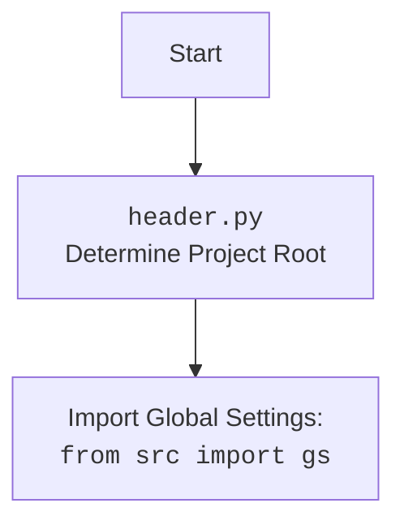

## ИНСТРУКЦИЯ:

Анализируй предоставленный код подробно и объясни его функциональность. Ответ должен включать три раздела:  

1. **<алгоритм>**: Опиши рабочий процесс в виде пошаговой блок-схемы, включая примеры для каждого логического блока, и проиллюстрируй поток данных между функциями, классами или методами.  
2. **<mermaid>**: Напиши код для диаграммы в формате `mermaid`, проанализируй и объясни все зависимости, 
    которые импортируются при создании диаграммы. 
    **ВАЖНО!** Убедитесь, что все имена переменных, используемые в диаграмме `mermaid`, 
    имеют осмысленные и описательные имена. Имена переменных вроде `A`, `B`, `C`, и т.д., не допускаются!  
    
    **Дополнительно**: Если в коде есть импорт `import header`, добавьте блок `mermaid` flowchart, объясняющий `header.py`:\
    ```mermaid
    flowchart TD
        Start --> Header[<code>header.py</code><br> Determine Project Root]
    
        Header --> import[Import Global Settings: <br><code>from src import gs</code>] 
    ```

3. **<объяснение>**: Предоставьте подробные объяснения:  
   - **Импорты**: Их назначение и взаимосвязь с другими пакетами `src.`.  
   - **Классы**: Их роль, атрибуты, методы и взаимодействие с другими компонентами проекта.  
   - **Функции**: Их аргументы, возвращаемые значения, назначение и примеры.  
   - **Переменные**: Их типы и использование.  
   - Выделите потенциальные ошибки или области для улучшения.  

Дополнительно, постройте цепочку взаимосвязей с другими частями проекта (если применимо).  

Это обеспечивает всесторонний и структурированный анализ кода.
## Формат ответа: `.md` (markdown)
**КОНЕЦ ИНСТРУКЦИИ**
```markdown
## <алгоритм>

### Функция `any2dict(any_data)`

1.  **Начало:** Функция `any2dict` вызывается с аргументом `any_data`, который может быть любого типа.
    
    *   Пример: `any2dict({"name": "John", "age": 30})`
    
2.  **Проверка типа данных (простые типы):** Проверяется, является ли `any_data` одним из базовых типов (set, list, int, float, str, bool, NoneType).
    
    *   Пример 1: `any_data` - это `123` (int) -> True
    *   Пример 2: `any_data` - это `[1,2,3]` (list) -> True
    *   Пример 3: `any_data` - это `{"key":"value"}` (dict) -> False
    
3.  **Если `any_data` - базовый тип:** Если `any_data` относится к одному из базовых типов (int, float, str, bool, None), функция возвращает его как есть.
    
    *   Пример: `any2dict(123)` -> `123`
    
4.  **Если `any_data` не базовый тип, инициализация словаря:** Если `any_data` не является базовым типом, создается пустой словарь `result_dict` для преобразования.
    
    *   Пример: `result_dict = {}`
    
5.  **Извлечение словаря для итерации:** Определяется словарь `items_dict` для обработки. Если у `any_data` есть атрибут `__dict__`, используется он, иначе проверяется является ли `any_data` словарем. Если ни одно из условий не выполняется, возвращается `False`.
    *   Пример 1: Если `any_data` это объект класса `MyClass`, то будет использовано `any_data.__dict__`
    *   Пример 2: Если `any_data` это `{"key":"value"}` то `items_dict` станет `{"key":"value"}`
    *   Пример 3: Если `any_data` это `MyClassWithoutDict`, у которого нет атрибута `__dict__`, то вернется `False`
    
6.  **Итерация по элементам словаря:** Происходит итерация по элементам словаря `items_dict`.
    
    *   Для каждой пары ключ-значение (`key`, `value`), рекурсивно вызывается функция `any2dict` для преобразования как ключа, так и значения.
    
7.  **Проверка преобразования ключа:** Если рекурсивное преобразование ключа (`converted_key`) вернуло не `False`, то:
    
    *   Преобразованное значение (`converted_value`) добавляется в `result_dict` с преобразованным ключом. Если `converted_value` - `False` , то в словарь будет добавлена пустая строка.
        
        *   Пример: Если `converted_key` - это строка `'name'`, `converted_value` - это строка `'John'`, то в словаре `result_dict` будет добавлена пара `'name':'John'`
        
8.  **Возврат преобразованного словаря:** Функция возвращает `result_dict`.
    
    *   Пример: `any2dict({"name":"John", "age":30})` -> `{'name': 'John', 'age': 30}`
    
9.  **Обработка списков и кортежей:** Если `any_data` является списком или кортежем, то создается список `result_list`.
    
    *   Для каждого элемента списка или кортежа рекурсивно вызывается функция `any2dict`. Если возвращается `False`, то в `result_list` добавляется пустая строка, иначе добавляется преобразованное значение.
    
10. **Обработка множеств:** Если `any_data` является множеством, то создается список `result_set`.
    
    *   Для каждого элемента множества рекурсивно вызывается функция `any2dict`. Если возвращается `False`, то в `result_set` добавляется пустая строка, иначе добавляется преобразованное значение.
    
11. **Обработка исключений:** Если во время преобразования словаря происходит исключение, функция возвращает `False`
     * Пример: Если в процессе преобразования объекта с атрибутом `__dict__` произойдет ошибка, то вернется `False`
12. **Конец:** Функция возвращает преобразованные данные или `False`, если преобразование не удалось.

## <mermaid>

```mermaid
flowchart TD
    Start(Начало: any2dict(any_data)) --> CheckType{Является ли any_data базовым типом данных?}
    CheckType -- Да --> ReturnBasicType{Вернуть any_data}
    CheckType -- Нет --> CreateResultDict{result_dict = {}}
    CreateResultDict --> ExtractItemsDict{items_dict = any_data.__dict__ or any_data or False}
    ExtractItemsDict -- items_dict = False --> ReturnFalse[Вернуть False]
    ExtractItemsDict -- items_dict != False --> IterateItems{Для каждой key, value в items_dict}
    IterateItems --> ConvertKey{converted_key = any2dict(key)}
    ConvertKey --> CheckKeyConverted{converted_key != False}
    CheckKeyConverted -- Да --> ConvertValue{converted_value = any2dict(value)}
    ConvertValue --> AddToResultDict{result_dict[converted_key] = converted_value or ''}
    AddToResultDict --> IterateItems
    CheckKeyConverted -- Нет --> IterateItems
    IterateItems -- Конец итерации --> ReturnResultDict{Вернуть result_dict}
    
    Start -- Если any_data это список или кортеж--> ProcessListTuple{Обработка списка/кортежа}
    ProcessListTuple --> CreateResultList{result_list = []}
    CreateResultList --> IterateList{Для каждого item в списке/кортеже}
    IterateList --> ConvertItem{converted_item = any2dict(item)}
    ConvertItem --> CheckItemConverted{converted_item is False}
    CheckItemConverted -- Да --> AddEmptyStringToList{result_list.append('')}
    CheckItemConverted -- Нет --> AddConvertedItemToList{result_list.append(converted_item)}
    AddEmptyStringToList --> IterateList
    AddConvertedItemToList --> IterateList
    IterateList -- Конец итерации --> ReturnResultList{Вернуть result_list}

    Start -- Если any_data это множество --> ProcessSet{Обработка множества}
    ProcessSet --> CreateResultSet{result_set = []}
    CreateResultSet --> IterateSet{Для каждого item в множестве}
    IterateSet --> ConvertSetItem{converted_item = any2dict(item)}
    ConvertSetItem --> CheckSetItemConverted{converted_item is False}
    CheckSetItemConverted -- Да --> AddEmptyStringToSet{result_set.append('')}
    CheckSetItemConverted -- Нет --> AddConvertedItemToSet{result_set.append(converted_item)}
    AddEmptyStringToSet --> IterateSet
    AddConvertedItemToSet --> IterateSet
    IterateSet -- Конец итерации --> ReturnResultSet{Вернуть result_set}
    
    Start -- Если происходит ошибка --> CatchException[Вернуть False]
    CatchException --> ReturnFalse
    
    ReturnResultDict --> End(Конец)
    ReturnResultList --> End
    ReturnResultSet --> End
    ReturnBasicType --> End
    ReturnFalse --> End
```

### `mermaid` пояснения

Диаграмма `mermaid` описывает поток выполнения функции `any2dict`.

1. **Начало:** Процесс начинается с вызова `any2dict` с аргументом `any_data`.
2. **Проверка типа данных:** Проверяется, является ли `any_data` базовым типом (int, float, str, bool, None, set, list, tuple).
3. **Обработка базовых типов:** Если `any_data` - базовый тип, функция возвращает его как есть.
4. **Обработка словарей:** Если `any_data` не базовый тип, создается пустой словарь `result_dict`.  Далее, происходит попытка извлечь `__dict__` атрибут, или сам словарь если `any_data` это словарь. Если ни одно из условий не выполняется возвращается `False`. Происходит итерация по элементам словаря. Для каждой пары ключ-значение происходит рекурсивный вызов функции `any2dict` для ключа и значения. Если преобразование ключа вернуло не `False` то преобразованное значение добавляется в `result_dict`.
5. **Обработка списков и кортежей:** Если `any_data` - список или кортеж, создается пустой список `result_list`. Далее идет итерация по списку и рекурсивное преобразование элементов, если преобразование вернуло `False` то добавляется пустая строка, иначе преобразованное значение.
6. **Обработка множеств:** Если `any_data` - множество, создается пустой список `result_set`. Далее идет итерация по множеству и рекурсивное преобразование элементов, если преобразование вернуло `False` то добавляется пустая строка, иначе преобразованное значение.
7. **Обработка исключений:** Если в процессе работы происходит ошибка, функция вернет `False`.
8. **Конец:** Функция возвращает преобразованные данные или `False`.



## <объяснение>

### Импорты
*   `from __future__ import annotations`: Этот импорт обеспечивает использование аннотаций типов, как если бы они были в Python 3.10+.
*   `from typing import Any`: Импортирует тип `Any`, который позволяет использовать переменные любого типа. Это используется в сигнатуре функции `any2dict`.
*   `import header`: Импортирует модуль `header`, который, предположительно, занимается определением корня проекта и содержит глобальные настройки.
*   `from src.logger import logger`: Импортирует модуль `logger` из пакета `src`, который, вероятно, используется для ведения логов.

### Функция `any2dict(any_data)`
*   **Аргументы:**
    *   `any_data`: Переменная любого типа, которая будет преобразована в словарь или список словарей.
*   **Возвращаемое значение:**
    *   Словарь, представляющий входные данные, или список, представляющий список входных данных. `False` если преобразование невозможно.
*   **Назначение:**
    *   Рекурсивная функция для преобразования произвольных данных в словарь или список словарей. Она обрабатывает словари, списки, кортежи, множества, и другие типы данных, включая пользовательские классы с атрибутом `__dict__` или без него.
*  **Примеры:**
   ```python
    data1 = {"name": "John", "age": 30, "address": {"city": "New York"}}
    print(any2dict(data1))
    # Вывод: {'name': 'John', 'age': 30, 'address': {'city': 'New York'}}
   
    data2 = [1, 2, "three", {"key": "value"}]
    print(any2dict(data2))
    # Вывод: [1, 2, 'three', {'key': 'value'}]
    
    data3 = 123
    print(any2dict(data3))
    # Вывод: 123
    
    class MyClass:
         def __init__(self, x):
            self.x = x

    data6 = MyClass(10)
    print(any2dict(data6))
    # Вывод: {}
    
    import types
    data7 = types.SimpleNamespace(a=1, b='hello', c=[1,2,3])
    print(any2dict(data7))
    # Вывод: {'a': 1, 'b': 'hello', 'c': [1, 2, 3]}
   ```

### Переменные

*   `result_dict`: Словарь, в котором накапливаются преобразованные данные.
*   `items_dict`: Временный словарь, используемый для итерации.
*   `converted_key`: Преобразованный ключ словаря.
*   `converted_value`: Преобразованное значение словаря.
*   `result_list`: Список, в котором накапливаются преобразованные данные для списков/кортежей.
*   `result_set`: Список, в котором накапливаются преобразованные данные для множеств.
*   `converted_item`: Преобразованный элемент списка/кортежа/множества.
*   `any_data`: Любой тип данных.
*   `key`: Ключ в словаре.
*   `value`: Значение в словаре.
*   `item`: Элемент в списке/кортеже/множестве.

### Потенциальные ошибки и области для улучшения

1.  **Обработка исключений:** Обработка исключений в блоке `try...except` слишком общая. Лучше ловить конкретные типы исключений.
2.  **Логирование:** Отсутствует логирование ошибок, что может затруднить отладку.
3.  **Производительность:** Рекурсивные вызовы могут привести к переполнению стека для очень глубоких структур данных. В таком случае, можно заменить рекурсию на итерацию.
4.  **Поддерживаемые типы:** Функция не обрабатывает и не уведомляет о том, что она не обрабатывает кастомные типы без `__dict__`. Это может привести к неожиданным результатам, так как функция вернет `False` в таком случае.
5.  **Обработка `False`:** Сейчас функция добавляет пустую строку при преобразовании `False` значения, лучше было бы возвращать `None`, чтобы можно было отличить пустое значение от `False`.
6. **Унификация вывода:** Функция возвращает либо словарь, либо список, либо базовое значение, либо `False`, что может затруднить использование. Лучше было бы всегда возвращать словарь, а списки представлять как значения ключа словаря.
7. **Отсутствие документации:** Отсутствует документация для функции, что может затруднить ее использование другими разработчиками.
8. **Нарушение принципа единой ответственности:** Функция занимается преобразованием данных в различные типы данных, что является нарушением принципа единой ответственности.

### Взаимосвязи с другими частями проекта

*   **`header.py`:** Используется для определения корня проекта.
*   **`src.logger`:** Используется для ведения логов.

Этот код используется для преобразования данных разных типов в формат, удобный для дальнейшей обработки, например, для записи в файл CSV или JSON. Он является частью пакета `src.utils.convertors`.
```