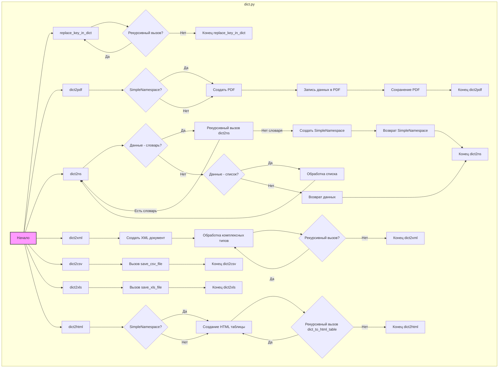
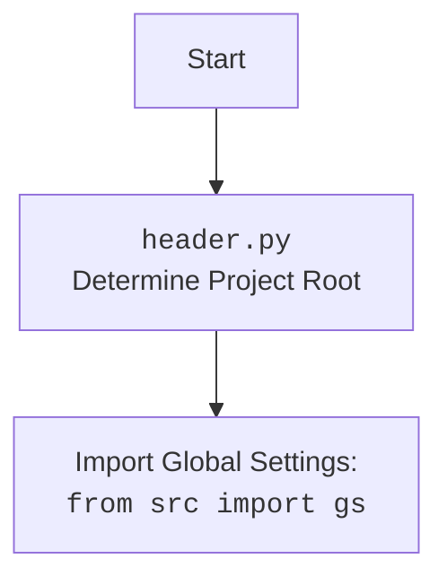

## АНАЛИЗ КОДА: `src/utils/convertors/dict.py`

### 1. <алгоритм>

**Общая схема работы модуля:**

Модуль `dict.py` предоставляет набор функций для конвертации словарей (и объектов `SimpleNamespace`) в различные форматы, такие как XML, CSV, JSON, XLS, HTML и PDF. Также реализована функция для рекурсивной замены ключей в словарях. 
Давайте рассмотрим алгоритм работы основных функций:

1.  **`replace_key_in_dict(data, old_key, new_key)`**:
    *   **Вход**: Словарь или список `data`, ключ `old_key` для замены и новый ключ `new_key`.
    *   **Логика**:
        1.  Если `data` - словарь:
            *   Для каждого ключа в словаре:
                *   Если ключ равен `old_key`, заменить его на `new_key`, перемещая значение.
                *   Если значение по текущему ключу является словарем или списком, рекурсивно вызвать `replace_key_in_dict` для этого значения.
        2.  Если `data` - список:
            *   Для каждого элемента списка рекурсивно вызвать `replace_key_in_dict`.
    *   **Выход**: Обновленный словарь или список с замененными ключами.
    *   **Пример:**
        ```python
        data = {"old_key": "value", "nested": {"old_key": "nested_value"}}
        updated_data = replace_key_in_dict(data, "old_key", "new_key")
        # updated_data == {"new_key": "value", "nested": {"new_key": "nested_value"}}
        ```

2.  **`dict2pdf(data, file_path)`**:
    *   **Вход**: Словарь `data` (или `SimpleNamespace`) и путь к файлу `file_path`.
    *   **Логика**:
        1.  Преобразовать `SimpleNamespace` в словарь, если входные данные являются `SimpleNamespace` объектом.
        2.  Создать PDF-документ с помощью `reportlab`.
        3.  Перебрать ключи и значения словаря, построчно записывая их в PDF.
        4.  При переполнении страницы создать новую.
        5.  Сохранить PDF.
    *   **Выход**: PDF файл с содержимым словаря.
    *   **Пример**:
        ```python
        data = {"name": "John", "age": 30}
        dict2pdf(data, "output.pdf")
        # Результат: PDF файл "output.pdf" с текстом "name: John" и "age: 30"
        ```

3.  **`dict2ns(data)`**:
    *   **Вход**: Словарь или список `data`.
    *   **Логика**:
        1.  Если `data` словарь:
            *   Для каждого значения словаря:
                *   Если значение - словарь, рекурсивно вызвать `dict2ns`.
                *   Если значение - список, рекурсивно вызвать `dict2ns` для каждого словаря в списке.
            *   Создать и вернуть объект `SimpleNamespace`.
        2.  Если `data` - список:
            *   Рекурсивно вызвать `dict2ns` для каждого элемента списка, если элемент является словарем.
    *   **Выход**: `SimpleNamespace` или список `SimpleNamespace`.
    *   **Пример**:
        ```python
        data = {"name": "John", "address": {"city": "New York"}}
        ns_data = dict2ns(data)
        # ns_data.name == "John"
        # ns_data.address.city == "New York"
        ```

4.  **`dict2xml(data, encoding='UTF-8')`**:
    *   **Вход**: Словарь `data` и кодировка `encoding`.
    *   **Логика**:
        1.  Создать XML-документ с помощью `xml.dom.minidom`.
        2.  Рекурсивно преобразовать словарь в XML-ноды.
        3.  Обрабатывать простые типы, атрибуты и сложные структуры (словари и списки).
        4.  Возвращать XML как строку.
    *   **Выход**: XML строка.
    *   **Пример**:
        ```python
        data = {"root": {"item": {"name": "value", "attrs": {"id": "1"}}}}
        xml_data = dict2xml(data)
        # xml_data == <root><item name="value" id="1"></item></root>
        ```

5.  **`dict2csv(data, file_path)`**:
    *   **Вход**: Словарь или SimpleNamespace `data` и путь к файлу `file_path`.
    *   **Логика**: Вызывает функцию `save_csv_file` из модуля `src.utils.csv` для сохранения данных в CSV-файл.
    *   **Выход**: True при успешном сохранении, False в противном случае.

6.  **`dict2xls(data, file_path)`**:
    *   **Вход**: Словарь или SimpleNamespace `data` и путь к файлу `file_path`.
    *   **Логика**: Вызывает функцию `save_xls_file` из модуля `src.utils.xls` для сохранения данных в XLS-файл.
    *   **Выход**: True при успешном сохранении, False в противном случае.

7.  **`dict2html(data, encoding='UTF-8')`**:
    *   **Вход**: Словарь или SimpleNamespace `data` и кодировка `encoding`.
    *   **Логика**:
        1.  Преобразовать `SimpleNamespace` в словарь, если входные данные являются `SimpleNamespace` объектом.
        2.  Рекурсивно преобразовать словарь в HTML-таблицу.
        3.  Возвратить HTML-строку с таблицей.
    *   **Выход**: HTML строка.
    *   **Пример**:
        ```python
        data = {"name": "John", "address": {"city": "New York", "zip": 10001}}
        html_data = dict2html(data)
        # html_data == <table><tr><td><strong>name</strong></td><td>John</td></tr><tr><td><strong>address</strong></td><td><table><tr><td><strong>city</strong></td><td>New York</td></tr><tr><td><strong>zip</strong></td><td>10001</td></tr></table></td></tr></table>
        ```

### 2. <mermaid>



**Объяснение `mermaid` диаграммы:**

*   Диаграмма представляет собой блок-схему, отражающую основные функции модуля `dict.py`.
*   Каждый блок представляет собой отдельную функцию или этап обработки данных.
*   Стрелки показывают поток управления и вызовы функций.
*   Логические ветвления отмечены ромбами (например, `Рекурсивный вызов?`, `SimpleNamespace?`, `Данные - словарь?`).
*   Вложенные функции (например, `dict_to_html_table`) представлены с помощью указания на рекурсивный вызов.
*   Названия блоков осмыслены и отражают назначение соответствующих операций или функций.
*   Диаграмма показывает, как данные обрабатываются и преобразуются на каждом этапе.



### 3. <объяснение>

**Импорты:**

*   `import json`:  Используется для работы с JSON (в данном файле не используется, но может быть импортирован в других частях проекта).
*   `from types import SimpleNamespace`:  Класс, который используется для создания объектов с произвольными атрибутами, что упрощает доступ к данным, как к атрибутам объекта, вместо ключей словаря.
*   `from typing import Any, Dict, List`:  Используется для аннотации типов (type hints), что делает код более читаемым и помогает находить ошибки на этапе разработки.
    *   `Any`: Означает, что переменная может иметь любой тип.
    *   `Dict`: Обозначает тип "словарь".
    *   `List`: Обозначает тип "список".
*   `from pathlib import Path`:  Используется для работы с путями к файлам и директориям.
*   `from xml.dom.minidom import getDOMImplementation`:  Используется для создания и манипулирования XML-документами.
*   `from reportlab.lib.pagesizes import A4`:  Используется для определения размера страницы A4 при создании PDF.
*   `from reportlab.pdfgen import canvas`:  Используется для создания PDF-документов.
*   `from src.utils.xls import save_xls_file`:  Импортирует функцию для сохранения данных в XLS-файл из модуля `src.utils.xls`.

**Функции:**

*   **`replace_key_in_dict(data, old_key, new_key)`**:
    *   **Аргументы**:
        *   `data`: Словарь или список, в котором нужно заменить ключ.
        *   `old_key`: Ключ, который нужно заменить.
        *   `new_key`: Новый ключ.
    *   **Возвращает**: Обновленный словарь или список.
    *   **Назначение**: Рекурсивная замена ключей в словаре или списке, включая вложенные структуры.
    *   **Примеры**: Уже указаны в описании алгоритма.
*   **`dict2pdf(data, file_path)`**:
    *   **Аргументы**:
        *   `data`: Словарь или `SimpleNamespace` с данными для PDF.
        *   `file_path`: Путь к файлу PDF.
    *   **Возвращает**: None (сохраняет файл PDF).
    *   **Назначение**: Сохраняет данные из словаря или `SimpleNamespace` в файл PDF.
*   **`dict2ns(data)`**:
    *   **Аргументы**:
        *   `data`: Словарь или список.
    *   **Возвращает**: `SimpleNamespace` объект (или список таких объектов).
    *   **Назначение**: Рекурсивно преобразует словари в `SimpleNamespace` объекты, что позволяет обращаться к данным как к атрибутам.
*   **`dict2xml(data, encoding='UTF-8')`**:
    *   **Аргументы**:
        *   `data`: Словарь с данными для XML.
        *   `encoding`: Кодировка XML (по умолчанию 'UTF-8').
    *   **Возвращает**: Строка XML.
    *   **Назначение**: Преобразует словарь в XML строку.
    *   **Особенности**: Обрабатывает простые значения, атрибуты, списки и вложенные словари.
*   **`dict2csv(data, file_path)`**:
    *   **Аргументы**:
        *   `data`: Словарь или `SimpleNamespace`.
        *   `file_path`: Путь к файлу CSV.
    *   **Возвращает**: `True`, если сохранение успешно, `False` в противном случае.
    *   **Назначение**: Сохраняет данные в CSV-файл.
    *    **Связь**: Вызывает `save_csv_file` из `src.utils.csv`.
*   **`dict2xls(data, file_path)`**:
    *   **Аргументы**:
        *   `data`: Словарь или `SimpleNamespace`.
        *   `file_path`: Путь к файлу XLS.
    *   **Возвращает**: `True`, если сохранение успешно, `False` в противном случае.
    *   **Назначение**: Сохраняет данные в XLS-файл.
    *   **Связь**: Вызывает `save_xls_file` из `src.utils.xls`.
*   **`dict2html(data, encoding='UTF-8')`**:
    *   **Аргументы**:
        *   `data`: Словарь или `SimpleNamespace`.
        *   `encoding`: Кодировка HTML (по умолчанию 'UTF-8').
    *   **Возвращает**: Строка HTML.
    *   **Назначение**: Преобразует словарь или `SimpleNamespace` в HTML таблицу.
    *   **Особенности**: Рекурсивное преобразование для вложенных словарей и списков.

**Переменные**:

*   Переменные в основном используются как аргументы функций, локальные переменные в функциях, или для временного хранения результатов преобразований. Типы переменных указываются в аннотациях типов, например, `data: Dict[str, Any]`, `file_path: str | Path`.

**Потенциальные ошибки и области для улучшения:**

*   Функция `dict2xml` может выбрасывать исключение, если входной словарь имеет более одного корневого элемента. Это можно было бы улучшить, например, добавив возможность задавать корневой элемент, если его нет, или оборачивать входные данные в единый корневой элемент.
*   Обработка ошибок при работе с файлами (сохранение CSV, XLS, PDF) не реализована явно. Рекомендуется добавить `try-except` блоки для обработки исключений ввода-вывода.
*   В `dict2html` можно добавить стилизацию таблицы для улучшения внешнего вида.
*   Логика работы с кодировками не тестировалась.

**Связи с другими частями проекта:**

*   Модуль взаимодействует с `src.utils.xls` через импорт `save_xls_file` и с `src.utils.csv` в функци `dict2csv`.

В заключении, данный модуль предоставляет мощные инструменты для преобразования данных между словарями (и `SimpleNamespace`) и различными форматами, и является важной частью проекта.  Рекомендуется уделить внимание обработке ошибок и расширению функциональности для более удобного и надежного использования.