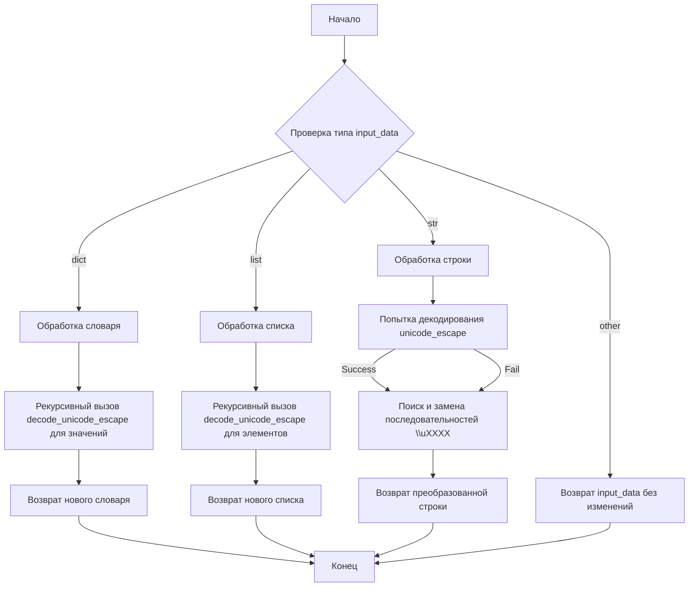

# Анализ кода `unicode.py`

## <алгоритм>

**Функция `decode_unicode_escape`:**

1.  **Начало:** Функция принимает на вход данные `input_data`, которые могут быть словарем, списком или строкой.
2.  **Проверка типа данных:**
    *   **Если `input_data` - словарь:**
        *   Создается новый словарь.
        *   Для каждой пары ключ-значение в `input_data` рекурсивно вызывается `decode_unicode_escape` для значения.
        *   Результаты записываются в новый словарь.
        *   Новый словарь возвращается.
        *   *Пример:* `{'a': r'\u0041', 'b': r'\u0042'}` -> `{'a': 'A', 'b': 'B'}`
    *   **Если `input_data` - список:**
        *   Создается новый список.
        *   Для каждого элемента списка рекурсивно вызывается `decode_unicode_escape`.
        *   Результаты добавляются в новый список.
        *   Новый список возвращается.
        *   *Пример:* `[r'\u0041', r'\u0042']` -> `['A', 'B']`
    *   **Если `input_data` - строка:**
        *   **Попытка декодировать строку:**
            *   Используется метод `.encode('utf-8').decode('unicode_escape')` для декодирования  escape-последовательностей.
            *   Если возникает ошибка `UnicodeDecodeError`, строка остается без изменений.
            *    *Пример:* `r'\u0041\u0042'` -> `'AB'`
            
        *   **Поиск и замена escape-последовательностей:**
             *   Используется регулярное выражение `r'\\\\u[0-9a-fA-F]{4}'` для поиска последовательностей `\uXXXX`,
             *   Для каждой найденной последовательности применяется метод `.encode('utf-8').decode('unicode_escape')`,
             *   Результаты замены возвращаются.
              *   *Пример:*  `'\\\\u0041\\\\u0042'` -> `'\u0041\u0042'` -> `'AB'`
        *   Возвращается декодированная строка.
    *   **Если тип данных не словарь, не список и не строка:**
        *   Возвращает `input_data` без изменений.
3.  **Конец:** Функция возвращает преобразованные или исходные данные.

## <mermaid>

**Объяснение диаграммы:**

*   `Start`: Начало выполнения функции `decode_unicode_escape`.
*   `CheckType`: Проверка типа входных данных `input_data`.
*   `ProcessDict`: Обработка, если `input_data` является словарем.
*   `RecursionDict`: Рекурсивный вызов `decode_unicode_escape` для каждого значения в словаре.
*   `ReturnDict`: Возвращение нового словаря с декодированными значениями.
*   `ProcessList`: Обработка, если `input_data` является списком.
*   `RecursionList`: Рекурсивный вызов `decode_unicode_escape` для каждого элемента списка.
*   `ReturnList`: Возвращение нового списка с декодированными элементами.
*  `ProcessStr`: Обработка, если `input_data` является строкой.
*   `TryDecode`: Попытка декодирования строки с использованием `unicode_escape`.
*   `RegexSub`: Поиск и замена последовательностей `\uXXXX` с помощью регулярного выражения.
*   `ReturnStr`: Возвращение декодированной строки.
*   `ReturnInput`: Возврат исходных данных без изменений, если тип не является словарем, списком или строкой.
*   `End`: Конец выполнения функции.

## <объяснение>

**Импорты:**

*   `import re`: Модуль `re` используется для работы с регулярными выражениями. В данном случае, он применяется для поиска и замены escape-последовательностей `\uXXXX` в строках.
*   `from typing import Dict, Any`: Из модуля `typing` импортируются `Dict` и `Any`. `Dict` используется для аннотации типов словарей, где ключи являются строками, а значения могут быть любого типа. `Any` указывает, что значение может быть любого типа.

**Функция `decode_unicode_escape`:**

*   **Назначение:** Функция `decode_unicode_escape` предназначена для рекурсивной декодировки escape-последовательностей в словарях, списках и строках. Она преобразует строки, содержащие юникодные escape-последовательности, в читаемый текст.
*   **Аргументы:**
    *   `input_data`: Входные данные, которые могут быть словарем (`Dict[str, Any]`), списком (`list`) или строкой (`str`).
*   **Возвращаемые значения:**
    *   Функция возвращает преобразованные данные того же типа, что и входные: словарь, список или строку.
    *   Если входные данные не являются словарем, списком или строкой, то функция вернет их без изменений.
*   **Логика:**
    1.  **Проверка типа данных:** Функция сначала определяет тип входных данных `input_data`.
    2.  **Обработка словаря:** Если `input_data` является словарем, функция создает новый словарь и рекурсивно вызывает `decode_unicode_escape` для каждого значения, сохраняя ключи.
    3.  **Обработка списка:** Если `input_data` является списком, функция создает новый список и рекурсивно вызывает `decode_unicode_escape` для каждого элемента.
    4.  **Обработка строки:** Если `input_data` является строкой, функция сначала пытается декодировать строку, используя метод `.decode('unicode_escape')`. Если возникает `UnicodeDecodeError`, строка остается без изменений. Затем, с использованием регулярного выражения, функция ищет и заменяет все escape-последовательности `\uXXXX`.
    5.  **Обработка других типов:** Если `input_data` не является ни словарем, ни списком, ни строкой, функция возвращает его без изменений.

**Переменные:**

*   `input_data`: Переменная, представляющая входные данные функции (словарь, список или строка).
*   `key`: Переменная, используемая при итерации по ключам словаря.
*   `value`: Переменная, представляющая значение элемента словаря.
*  `item`: Переменная, представляющая элемент списка.
*   `decoded_string`: Переменная для хранения декодированной строки.
*   `unicode_escape_pattern`: Переменная, содержащая регулярное выражение для поиска escape-последовательностей `\uXXXX`.
*   `match`: Переменная, представляющая найденное соответствие регулярному выражению.

**Потенциальные ошибки и улучшения:**

*   **Обработка ошибок:** Функция обрабатывает `UnicodeDecodeError`, но не обрабатывает другие потенциальные ошибки, которые могут возникнуть в процессе декодирования или регулярных выражений.
*  **Производительность:** Рекурсивные вызовы могут быть неэффективными для больших или глубоко вложенных структур данных. Для улучшения производительности можно использовать итеративный подход.
*   **Поддержка других escape-последовательностей:** Функция поддерживает только `\uXXXX`, можно расширить её для поддержки других escape-последовательностей.
*   **Регулярное выражение:**  Регулярное выражение `r'\\\\u[0-9a-fA-F]{4}'`  содержит двойные обратные слеши `\\\\u`, которые необходимо экранировать для правильной обработки.

**Взаимосвязь с другими частями проекта:**

*   Данный модуль `unicode.py`  предоставляет функцию `decode_unicode_escape`, которая может использоваться в других частях проекта для обработки данных, содержащих юникодные escape-последовательности, например, при обработке данных, полученных из API или из файлов.