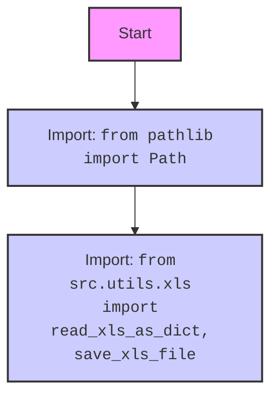

## АНАЛИЗ КОДА: `hypotez/src/utils/convertors/xls.py`

### 1. <алгоритм>

**Блок-схема:**

```mermaid
graph LR
    A[Начало: вызов xls2dict(xls_file)] --> B{Проверка типа xls_file: Path или str?};
    B -- Path или str --> C[Вызов read_xls_as_dict(xls_file)];
    C --> D{Возвращает словарь или None?};
    D -- Словарь --> E[Конец: возвращает словарь];
    D -- None --> F[Конец: возвращает None];
```

**Примеры:**

1.  **Вход:** `xls2dict(xls_file="data.xls")`
    *   `xls_file` - строка.
    *   Вызывается `read_xls_as_dict("data.xls")`
    *   `read_xls_as_dict` возвращает словарь (например, `{'Sheet1': [{'col1': 'val1', 'col2': 'val2'}, {'col1': 'val3', 'col2': 'val4'}]}`).
    *   `xls2dict` возвращает этот словарь.
2.  **Вход:** `xls2dict(xls_file=Path("./data.xls"))`
    *   `xls_file` - объект `Path`.
    *   Вызывается `read_xls_as_dict(Path("./data.xls"))`.
    *   `read_xls_as_dict` возвращает `None`.
    *   `xls2dict` возвращает `None`.
3.  **Вход:** `xls2dict(xls_file="/path/to/nonexistent.xls")`
    *   `xls_file` - строка.
    *   Вызывается `read_xls_as_dict("/path/to/nonexistent.xls")`.
    *   `read_xls_as_dict` (предположительно) может выбросить исключение или вернуть `None`, в зависимости от логики обработки в `src.utils.xls.read_xls_as_dict`
    *   Если `read_xls_as_dict` вернет `None`, `xls2dict` вернет `None`

**Поток данных:**

1.  Функция `xls2dict` принимает на вход путь к xls-файлу в виде строки (`str`) или объекта `Path`.
2.  `xls2dict` вызывает функцию `read_xls_as_dict` из модуля `src.utils.xls`, передавая ей путь к файлу.
3.  `read_xls_as_dict` читает xls-файл и возвращает словарь или `None`.
4.  Результат `read_xls_as_dict` возвращается функцией `xls2dict`.

### 2. <mermaid>

```mermaid
flowchart TD
    A[Start: xls2dict(xls_file)] --> B{Check xls_file type: Path or str?};
    B -- Is Path or str --> C[Call read_xls_as_dict(xls_file)];
    C --> D{Returns dictionary or None?};
    D -- Dictionary --> E[End: return dictionary];
    D -- None --> F[End: return None];

    style A fill:#f9f,stroke:#333,stroke-width:2px
    style E fill:#ccf,stroke:#333,stroke-width:2px
    style F fill:#ccf,stroke:#333,stroke-width:2px
```

**Импорт зависимостей:**



**Описание зависимостей:**

*   `from pathlib import Path`: Импортирует класс `Path` из модуля `pathlib` для работы с путями к файлам в объектно-ориентированном стиле. Это позволяет коду принимать на вход как строки, так и объекты Path, обеспечивая гибкость в обработке путей к файлам.
*   `from src.utils.xls import read_xls_as_dict, save_xls_file`: Импортирует функции `read_xls_as_dict` и `save_xls_file` из модуля `src.utils.xls`. `read_xls_as_dict` используется для чтения содержимого xls-файла и преобразования его в словарь. `save_xls_file` - предположительно, для сохранения данных в xls-файл, но в данном коде не используется.

### 3. <объяснение>

**Импорты:**

*   `from pathlib import Path`:
    *   **Назначение:** Предоставляет класс `Path` для представления путей к файлам в объектно-ориентированном виде.
    *   **Взаимосвязь с `src`**: `pathlib` является стандартной библиотекой Python и не относится к `src` напрямую. Он используется для обеспечения возможности работать с путями к файлам в более гибком виде (строка или объект `Path`).
*   `from src.utils.xls import read_xls_as_dict, save_xls_file`:
    *   **Назначение:** Импортирует функции `read_xls_as_dict` и `save_xls_file` из модуля `src.utils.xls`.
    *   **Взаимосвязь с `src`**: `src.utils.xls` это внутренний модуль проекта, который предположительно содержит логику для чтения и записи xls-файлов. Импорт этих функций обеспечивает возможность конвертации xls-файлов в словари и (предположительно) обратно.

**Функции:**

*   `xls2dict(xls_file: str | Path) -> dict | None:`
    *   **Аргументы:**
        *   `xls_file`: Путь к xls-файлу в виде строки или объекта `Path`.
    *   **Возвращаемое значение:** Словарь, представляющий содержимое xls-файла, или `None` в случае ошибки или отсутствия данных.
    *   **Назначение:** Выполняет преобразование xls-файла в словарь. Функция является обёрткой для `read_xls_as_dict`.
    *   **Примеры:**
        ```python
        data_dict = xls2dict("data.xls") # Чтение файла data.xls
        data_dict = xls2dict(Path("./data.xls")) # Чтение файла data.xls используя объект Path
        ```
**Переменные:**

*   `xls_file`:
    *   **Тип:** `str` или `pathlib.Path`
    *   **Использование:** Хранит путь к xls-файлу, который передается в функцию `xls2dict`

**Потенциальные ошибки и области для улучшения:**

*   **Обработка ошибок**: В текущем варианте кода неявно подразумевается, что функция `read_xls_as_dict` самостоятельно обрабатывает возможные ошибки при чтении файла (например, отсутствие файла, повреждение файла). Было бы лучше добавить явную обработку исключений в `xls2dict`, чтобы обеспечить более надежную работу.
*   **Типизация:** В аннотациях типов указано `-> dict | None`. Было бы лучше уточнить, что именно за словарь возвращает функция, например, `-> dict[str, list[dict[str, str]]] | None`, если предположить, что  результатом `read_xls_as_dict` будет словарь, где ключ это название листа, а значениями будет список словарей, представляющий каждую строку на листе.
*   **Неиспользуемый импорт**: В коде импортируется `save_xls_file`, но не используется. Необходимо удалить неиспользуемые импорты.

**Взаимосвязь с другими частями проекта:**

*   Данный модуль является частью утилит для конвертации данных. Он предназначен для преобразования xls-файлов в словари. Предполагается, что эти словари будут использоваться другими частями проекта для дальнейшей обработки данных.

**Улучшения:**

1.  Добавить обработку исключений в `xls2dict`, что бы обеспечить корректную работу при возникновении ошибок чтения файла.
2.  Убрать неиспользуемый импорт `save_xls_file`.
3.  Добавить более подробную типизацию для возвращаемого значения `read_xls_as_dict` для улучшения читаемости кода.
4.  Добавить docstring к функции `xls2dict` для пояснения ее работы и формата возвращаемых данных.