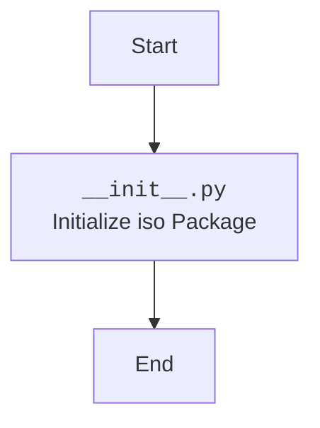

## ИНСТРУКЦИЯ:

Анализируй предоставленный код подробно и объясни его функциональность. Ответ должен включать три раздела:  

1. **<алгоритм>**: Опиши рабочий процесс в виде пошаговой блок-схемы, включая примеры для каждого логического блока, и проиллюстрируй поток данных между функциями, классами или методами.  
2. **<mermaid>**: Напиши код для диаграммы в формате `mermaid`, проанализируй и объясни все зависимости, 
    которые импортируются при создании диаграммы. 
    **ВАЖНО!** Убедитесь, что все имена переменных, используемые в диаграмме `mermaid`, 
    имеют осмысленные и описательные имена. Имена переменных вроде `A`, `B`, `C`, и т.д., не допускаются!  
    
    **Дополнительно**: Если в коде есть импорт `import header`, добавьте блок `mermaid` flowchart, объясняющий `header.py`:\
    ```mermaid\
    flowchart TD\
        Start --> Header[<code>header.py</code><br> Determine Project Root]\
    \
        Header --> import[Import Global Settings: <br><code>from src import gs</code>] \
    ```

3. **<объяснение>**: Предоставьте подробные объяснения:  
   - **Импорты**: Их назначение и взаимосвязь с другими пакетами `src.`.  
   - **Классы**: Их роль, атрибуты, методы и взаимодействие с другими компонентами проекта.  
   - **Функции**: Их аргументы, возвращаемые значения, назначение и примеры.  
   - **Переменные**: Их типы и использование.  
   - Выделите потенциальные ошибки или области для улучшения.  

Дополнительно, постройте цепочку взаимосвязей с другими частями проекта (если применимо).  

Это обеспечивает всесторонний и структурированный анализ кода.
## Формат ответа: `.md` (markdown)
**КОНЕЦ ИНСТРУКЦИИ**
```

## <алгоритм>
Поскольку предоставленный код `__init__.py` является пустым, его алгоритм будет заключаться только в одном шаге:

1.  **Инициализация модуля:** 
    *   Исполнение файла `__init__.py`  делает директорию `iso` пакетом Python.

    *   **Пример:** При импорте `from src.utils import iso` Python будет искать файл `__init__.py` внутри директории `iso`,  чтобы распознать ее как пакет.

## <mermaid>


**Анализ зависимостей `mermaid`:**

В данном коде нет явных импортов, следовательно, диаграмма `mermaid` показывает только процесс инициализации пакета `iso`,  где `__init__.py`  маркирует директорию `iso` как пакет python.  Имя `InitModule` наглядно отображает, что блок представляет инициализацию модуля. `Start` и `End` указывают на начало и завершение процесса.

## <объяснение>
**Импорты:**

*   В данном файле отсутствуют импорты. Это типично для файла `__init__.py`, если он не содержит инициализирующего кода для модуля.

**Классы:**
*   Файл не содержит определения классов.

**Функции:**
*   Файл не содержит определений функций.

**Переменные:**
*   Файл не содержит явных переменных.

**Объяснение:**

Файл `__init__.py` в пакете `src.utils.iso` в большинстве случаев пуст, как в данном случае,  или содержит минимальный код для настройки пакета. В Python, наличие файла `__init__.py` в каталоге  означает, что этот каталог является пакетом, который можно импортировать.

**Потенциальные ошибки или области для улучшения:**
*   **Текущее состояние:** В текущем состоянии файл `__init__.py` не содержит никакого кода и просто обозначает директорию `iso` как пакет. Если пакет `iso` будет содержать подпакеты или модули, то обычно `__init__.py` используется для импорта этих модулей, чтобы сделать их более доступными при импорте пакета `iso`.
*   **Улучшения:** В будущем, если в пакете `iso` появятся модули, можно добавить в `__init__.py` импорты, например: `from . import module1, module2`. Это позволит пользователям импортировать модули пакета `iso` напрямую, используя: `from src.utils.iso import module1`.
*   **Пример:** Если бы в пакете `iso` был файл `date_utils.py`, который содержал бы различные функции для работы с датами, в `__init__.py` можно было бы добавить строку: `from .date_utils import *` (или явно перечислить нужные функции)

**Взаимосвязь с другими частями проекта:**
*   `src.utils.iso` входит в структуру `src`, что является типичной структурой Python-проекта, где `src` - это исходный код проекта. `src.utils` – это папка, содержащая утилиты, а `src.utils.iso` – это пакет, предназначенный для работы с ISO. Конкретно, этот `__init__.py` файл пока ни с чем не взаимодействует, однако при добавлении модулей в пакет `iso`, другие части проекта могут импортировать функционал из этого пакета.