## Алгоритм:

Данный код представляет собой README-файл, написанный на языке Markdown, который описывает функциональность библиотеки `Tiny Utils`.  Этот файл является документацией и не содержит исполняемого кода.  
Тем не менее, на основе структуры и описаний, можно представить алгоритмическую схему, описывающую организацию и использование библиотеки:

1.  **Обзор Библиотеки**:
    *   Представление общей информации о `Tiny Utils`, ее назначении как набора утилит.
    *   Определение основных функциональных областей, которые она охватывает.
2.  **Установка**:
    *   Инструкция по клонированию репозитория с `Tiny Utils` с GitHub.
        ```bash
        git clone https://github.com/hypo69/tiny-utils.git
        cd tiny_utils
        ```
    *   Установка зависимостей, указанных в файле `requirements.txt`.
        ```bash
        pip install -r requirements.txt
        ```
3.  **Обзор Модулей**:
    *   Перечисление основных категорий модулей библиотеки.
        *   Преобразователи данных.
        *   Утилиты для работы со строками.
        *   Утилиты для работы с файлами.
        *   Утилиты для работы с датами и временем.
        *   Утилиты для работы с FTP.
        *   Утилиты для работы с изображениями.
        *   Утилиты для работы с PDF.
        *   Утилиты для работы с принтером.
4.  **Описание Модулей**:
    *   Разбор каждой из основных категорий модулей с подробным описанием каждого модуля.
        *   **Преобразователи**: Описание модулей для преобразования различных форматов.
            *   `text2png.py`: Текст в PNG.
            *   `tts.py`: Текст в аудио.
            *   `webp2png.py`: WebP в PNG.
            *   `xls.py`: Обработка XLS.
            *   `xml2dict.py`: XML в словарь Python.
            *   `base64.py`: Кодирование/декодирование Base64.
            *   `csv.py`: Парсинг и обработка CSV.
            *   `dict.py`: Работа со словарями.
            *   `html.py`: Преобразование HTML.
            *   `json.py`: Парсинг и обработка JSON.
            *   `md2dict.py`: Markdown в словарь.
            *   `ns.py`: Преобразование имен пространств.
        *   **Утилиты для строк**: (и аналогично для других модулей)
5.  **Примеры Использования**:
    *   Демонстрация использования библиотеки на конкретных примерах.
        *   Преобразование текста в PNG.
        *   Преобразование XML в словарь.
        *   Парсинг и манипуляции с JSON.
6.  **Участие в Разработке**:
    *   Призыв к участию в развитии библиотеки, если проект открытый.
7.  **Лицензия**:
    *   Указание лицензии, под которой распространяется библиотека.

## Mermaid:

```mermaid
flowchart TD
    subgraph Tiny Utils Library
        A[Overview<br>Description and Purpose] --> B(Installation<br>Cloning and Dependencies)
        B --> C[Modules Overview<br>List of Module Categories]
        C --> D[Module Description<br>Detailed Module Functionality]
        D --> E[Usage Examples<br>Practical Application of Modules]
        E --> F[Contributing<br>Guidelines for Participation]
        F --> G(License<br>Terms and Conditions)
    end
    
    subgraph Converters Module
        D --> H[Converters: <br> Data Format Conversion]
        H --> H1(text2png.py <br> Text to PNG Conversion)
        H --> H2(tts.py <br> Text to Speech Conversion)
        H --> H3(webp2png.py <br> WebP to PNG Conversion)
        H --> H4(xls.py <br> XLS File Handling)
        H --> H5(xml2dict.py <br> XML to Dictionary Conversion)
        H --> H6(base64.py <br> Base64 Encoding/Decoding)
        H --> H7(csv.py <br> CSV Parsing and Manipulation)
        H --> H8(dict.py <br> Python Dictionary Utilities)
        H --> H9(html.py <br> HTML Conversion)
        H --> H10(json.py <br> JSON Parsing and Manipulation)
         H --> H11(md2dict.py <br> Markdown to Dictionary)
         H --> H12(ns.py <br> Namespace Conversion)
    end
     
     subgraph String Utilities Module
         D --> I[String Utilities: <br> Advanced String Operations]
         I --> I1(string_utils_1.py)
         I --> I2(string_utils_2.py)
     end
     
     subgraph File Utilities Module
        D --> J[File Utilities: <br> File Manipulation]
         J --> J1(file_utils_1.py)
         J --> J2(file_utils_2.py)
    end
    
     subgraph Date and Time Utilities Module
        D --> K[Date and Time Utilities: <br> Date and Time Formatting]
        K --> K1(date_utils_1.py)
        K --> K2(date_utils_2.py)
    end
    
     subgraph FTP Utilities Module
        D --> L[FTP Utilities: <br> FTP Server Operations]
          L --> L1(ftp_utils_1.py)
          L --> L2(ftp_utils_2.py)
    end

     subgraph Image Utilities Module
          D --> M[Image Utilities: <br> Basic Image Processing]
           M --> M1(image_utils_1.py)
           M --> M2(image_utils_2.py)
    end

     subgraph PDF Utilities Module
          D --> N[PDF Utilities: <br> PDF File Handling]
          N --> N1(pdf_utils_1.py)
          N --> N2(pdf_utils_2.py)
    end

     subgraph Printer Utilities Module
        D --> O[Printer Utilities: <br> Data Printing]
         O --> O1(printer_utils_1.py)
        O --> O2(printer_utils_2.py)
     end


```



**Описание `mermaid` диаграммы:**

*   **Tiny Utils Library**:
    *   `A` (Overview) - Начальная точка, представляющая общее описание библиотеки.
    *   `B` (Installation) - Блок, содержащий инструкции по установке, включая клонирование репозитория и установку зависимостей.
    *   `C` (Modules Overview) - Блок, содержащий перечень категорий модулей.
    *   `D` (Module Description) - Блок, содержащий детальное описание функциональности каждого модуля.
    *   `E` (Usage Examples) - Блок, показывающий примеры практического использования библиотеки.
    *   `F` (Contributing) - Блок, предоставляющий информацию о том, как внести вклад в развитие библиотеки.
    *   `G` (License) - Блок, содержащий информацию о лицензии, под которой распространяется библиотека.
*   **Converters Module:**
    *   `H` -  представляет общий модуль конвертеров
    *   `H1`-`H12`: Блоки, представляющие отдельные модули конвертеров, такие как `text2png.py`, `tts.py`, `webp2png.py`, `xls.py`, `xml2dict.py`, `base64.py`, `csv.py`, `dict.py`, `html.py`, `json.py`,`md2dict.py`, `ns.py`.
*   **String Utilities Module:**
     *   `I` -  представляет общий модуль строковых утилит
    *   `I1`, `I2` - примеры конкретных модулей строковых утилит
*  **File Utilities Module:**
    *    `J` - представляет общий модуль файловых утилит
    *    `J1`, `J2` - примеры конкретных модулей файловых утилит
* **Date and Time Utilities Module:**
   *    `K` - представляет общий модуль утилит для работы с датами и временем
   *    `K1`, `K2` - примеры конкретных модулей утилит для работы с датами и временем
* **FTP Utilities Module:**
   *   `L` - представляет общий модуль утилит для работы с FTP
   *   `L1`, `L2` - примеры конкретных модулей утилит для работы с FTP
* **Image Utilities Module:**
   *   `M` - представляет общий модуль утилит для работы с изображениями
   *   `M1`, `M2` - примеры конкретных модулей утилит для работы с изображениями
*  **PDF Utilities Module:**
   *   `N` - представляет общий модуль утилит для работы с PDF
   *  `N1`, `N2` - примеры конкретных модулей утилит для работы с PDF
*  **Printer Utilities Module:**
    *  `O` - представляет общий модуль утилит для работы с принтером
    *  `O1`, `O2` - примеры конкретных модулей утилит для работы с принтером

**Импорты:**
Диаграмма `mermaid` не импортирует никакие внешние модули, так как она представляет собой визуальное описание структуры библиотеки, а не исполняемый код.  Зависимости между модулями (представлены стрелками), описывают организацию и функциональность библиотеки Tiny Utils.

## Объяснение:

**Импорты**:

*   В данном файле, как в файле документации Markdown, нет импортов. Здесь описаны модули, которые могут импортировать другие модули. Например, файл `text2png.py` может импортировать библиотеки, необходимые для обработки текста и создания изображений.
*   В коде, на который ссылается этот `README.MD`, могут быть следующие импорты:
    *   `src.gs` - импорт глобальных настроек, общих для всего проекта, обычно используемых для конфигурации и параметров.

**Классы**:

*   В данном `README.MD` нет описания классов. Классы будут описаны в отдельных файлах кода каждого модуля.

**Функции**:

*   В `README.MD` нет функций. Описание функций будет в файлах конкретных модулей.
    *   **Примеры функций (предположительно из модулей):**
        *   `text_to_png(text, output_path)` в `text2png.py` - преобразует текст в изображение PNG.
        *   `xml_to_dict(xml_string)` в `xml2dict.py` - преобразует XML в словарь Python.
        *   `parse_json(json_string)` в `json.py` - парсит JSON-строку.

**Переменные**:

*   В `README.MD` нет переменных.
    *   **Примеры переменных (предположительно из модулей):**
        *   `output_path` - путь к файлу вывода.
        *   `text` - строка, которую нужно обработать.
        *   `xml_string` - строка в формате XML.
        *   `json_string` - строка в формате JSON.

**Подробное объяснение:**

Этот `README.MD` файл является важной частью проекта, так как он служит вводной документацией для разработчиков и пользователей. Он содержит общую информацию о библиотеке, инструкции по установке, описание модулей и примеры использования.  Файл имеет следующие цели:

*   **Ознакомление с проектом:** Предоставляет пользователю общее представление о возможностях библиотеки `Tiny Utils`, позволяя быстро понять ее назначение.
*   **Инструкции по установке:** Объясняет, как установить библиотеку и настроить ее для работы, что упрощает процесс интеграции.
*   **Описание модулей:**  Подробно описывает каждый модуль библиотеки, их функциональность и типы данных, с которыми они работают, помогая пользователю выбрать нужные инструменты.
*   **Примеры использования:** Показывает конкретные примеры того, как можно применять библиотеку в различных сценариях, что помогает пользователям быстрее начать ее использовать.
*   **Руководство для участников:** Призывает к участию в развитии проекта и предоставляет общие рекомендации.

**Цепочка взаимосвязей с другими частями проекта:**

1.  `README.MD` --> `requirements.txt`: Файл `README.MD` ссылается на `requirements.txt`, который определяет зависимости проекта.
2.  `README.MD` --> Модули (`text2png.py`, `tts.py`, `webp2png.py`, ...): `README.MD` описывает функциональность модулей, которые находятся в других файлах проекта.
3.  `README.MD` -->  Примеры использования: `README.MD` содержит примеры использования, которые требуют импорта и использования кода из соответствующих модулей.
4.  `src.gs` --> `конфигурационные файлы`: (предположение) `src.gs` импортирует глобальные настройки из файлов конфигурации.
5.  `Модули` -->  другие модули: Модули могут импортировать другие модули проекта (например, модуль конвертации может использовать утилиты для работы со строками).

**Потенциальные ошибки или области для улучшения:**

*   **Отсутствие примеров:** В данном файле README.MD, нет подробных примеров,  только список модулей.
*   **Общие описания модулей:** Описания модулей достаточно общие. Было бы полезно добавить примеры использования каждого модуля в самом файле README.MD.
*   **Отсутствие API документации:**  Файл README.MD не является подробной API документацией, поэтому могут возникнуть трудности при использовании библиотеки без доступа к исходному коду.

**Вывод:**
`README.MD` служит важным руководством к библиотеке `Tiny Utils`, но важно дополнить его более подробными примерами и документацией по API.