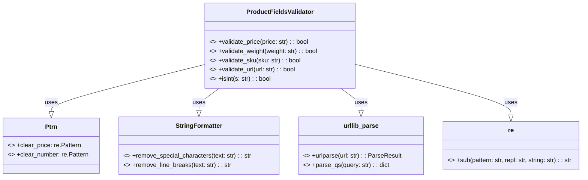

## ИНСТРУКЦИЯ:

Анализируй предоставленный код подробно и объясни его функциональность. Ответ должен включать три раздела:  

1. **<алгоритм>**: Опиши рабочий процесс в виде пошаговой блок-схемы, включая примеры для каждого логического блока, и проиллюстрируй поток данных между функциями, классами или методами.  
2. **<mermaid>**: Напиши код для диаграммы в формате `mermaid`, проанализируй и объясни все зависимости, 
    которые импортируются при создании диаграммы. 
    **ВАЖНО!** Убедитесь, что все имена переменных, используемые в диаграмме `mermaid`, 
    имеют осмысленные и описательные имена. Имена переменных вроде `A`, `B`, `C`, и т.д., не допускаются!  
    
    **Дополнительно**: Если в коде есть импорт `import header`, добавьте блок `mermaid` flowchart, объясняющий `header.py`:\
    ```mermaid
    flowchart TD
        Start --> Header[<code>header.py</code><br> Determine Project Root]
    
        Header --> import[Import Global Settings: <br><code>from src import gs</code>] 
    ```

3. **<объяснение>**: Предоставьте подробные объяснения:  
   - **Импорты**: Их назначение и взаимосвязь с другими пакетами `src.`.  
   - **Классы**: Их роль, атрибуты, методы и взаимодействие с другими компонентами проекта.  
   - **Функции**: Их аргументы, возвращаемые значения, назначение и примеры.  
   - **Переменные**: Их типы и использование.  
   - Выделите потенциальные ошибки или области для улучшения.  

Дополнительно, постройте цепочку взаимосвязей с другими частями проекта (если применимо).  

Это обеспечивает всесторонний и структурированный анализ кода.
## Формат ответа: `.md` (markdown)
**КОНЕЦ ИНСТРУКЦИИ**
```markdown
## <алгоритм>

**ProductFieldsValidator**

*   **validate_price(price: str) -> bool**:
    1.  **Вход**: Строка `price` (например, `"123,45"` или `"123.45"` или `"  123.45  "`).
    2.  **Проверка на пустоту**: Если `price` пустая, возвращается `None`.
    3.  **Очистка от лишних символов**: Удаляются нечисловые символы (кроме точки и запятой) с помощью `Ptrn.clear_price`. Пример: `"  123,45  "`  --> `"123,45"`.
    4.  **Замена запятой на точку**: Заменяет запятую на точку. Пример: `"123,45"` --> `"123.45"`.
    5.  **Попытка преобразовать в float**: Пробуем преобразовать строку в число с плавающей точкой.
    6.  **Обработка ошибки**: Если преобразование не удалось (например, `price` содержит буквы), возвращается `None`.
    7.  **Возврат**: Если преобразование успешно, возвращается `True`.

*   **validate_weight(weight: str) -> bool**:
    1.  **Вход**: Строка `weight` (например, `"1000,5"` или `"1000.5"` или `"  1000.5  "`).
    2.  **Проверка на пустоту**: Если `weight` пустая, возвращается `None`.
    3.  **Очистка от лишних символов**: Удаляются нечисловые символы (кроме точки и запятой) с помощью `Ptrn.clear_number`. Пример: `"  1000,5  "` --> `"1000,5"`.
    4.  **Замена запятой на точку**: Заменяет запятую на точку. Пример: `"1000,5"` --> `"1000.5"`.
    5.  **Попытка преобразовать в float**: Пробуем преобразовать строку в число с плавающей точкой.
    6.  **Обработка ошибки**: Если преобразование не удалось, возвращается `None`.
    7.  **Возврат**: Если преобразование успешно, возвращается `True`.

*   **validate_sku(sku: str) -> bool**:
    1.  **Вход**: Строка `sku` (например, `"  abc-123  "` или `"abc\n123"`).
    2.  **Проверка на пустоту**: Если `sku` пустая, возвращается `None`.
    3.  **Удаление спецсимволов**: Удаляются специальные символы с помощью `StringFormatter.remove_special_characters`. Пример: `"abc-123"` --> `"abc123"`.
    4.  **Удаление переносов строк**: Удаляются переносы строк с помощью `StringFormatter.remove_line_breaks`. Пример: `"abc\n123"` --> `"abc123"`.
    5.  **Удаление пробелов**: Удаляются пробелы в начале и конце строки. Пример: `"  abc123  "` --> `"abc123"`.
    6.  **Проверка длины**: Если длина `sku` меньше 3, возвращается `None`.
    7.  **Возврат**: Если длина `sku` больше или равна 3, возвращается `True`.

*   **validate_url(url: str) -> bool**:
    1.  **Вход**: Строка `url` (например, `"example.com"` или `"http://example.com"`).
    2.  **Проверка на пустоту**: Если `url` пустая, возвращается `None`.
    3.  **Удаление пробелов**: Удаляются пробелы в начале и конце строки. Пример: `"  example.com  "` --> `"example.com"`.
    4.  **Добавление префикса http**: Если `url` не начинается с "http", добавляется "http://". Пример: `"example.com"` --> `"http://example.com"`.
    5.  **Разбор URL**: Разбор URL с помощью `urlparse`.
    6.  **Проверка netloc и scheme**: Проверяется, что `netloc` (доменное имя) и `scheme` (протокол) присутствуют. Если нет, возвращается `None`.
    7.  **Возврат**: Если обе проверки успешны, возвращается `True`.

*   **isint(s: str) -> bool**:
    1.  **Вход**: Строка `s` (например, `"123"` или `"abc"`).
    2.  **Попытка преобразовать в int**: Пробуем преобразовать строку в целое число.
    3.  **Обработка ошибки**: Если преобразование не удалось, возвращается `None`.
    4.  **Возврат**: Если преобразование успешно, возвращается `True`.

## <mermaid>



**Описание диаграммы `mermaid`:**

*   **`ProductFieldsValidator`**: Класс, содержащий статические методы для валидации различных типов строковых полей (цена, вес, артикул, URL, целое число).
*   **`Ptrn`**: Класс (или объект), который предоставляет статические атрибуты `clear_price` и `clear_number`, которые являются регулярными выражениями для очистки строк.
*    **`StringFormatter`**: Класс, содержащий статические методы для форматирования строк, такие как удаление специальных символов и переносов строк.
*   **`urllib_parse`**: Встроенный модуль Python, содержащий статические методы `urlparse` для разбора URL и `parse_qs` для разбора строки запроса. В текущей реализации используется только `urlparse`.
*   **`re`**: Встроенный модуль Python для работы с регулярными выражениями, используется статический метод `sub` для замены в строке.
*   **Связи**:
    *   `ProductFieldsValidator` использует статические методы из классов `Ptrn` , `StringFormatter`, модуля `re` и `urllib_parse`.

## <объяснение>

**Импорты:**

*   **`re`**: Модуль для работы с регулярными выражениями. Используется для очистки строк от лишних символов в методах `validate_price` и `validate_weight`.
*   **`html`**: Модуль для работы с HTML, в данном коде не используется.
*   **`from urllib.parse import urlparse, parse_qs`**: Импортирует функции `urlparse` для разбора URL и `parse_qs` для разбора параметров запроса из модуля `urllib.parse`. Используется для валидации URL в методе `validate_url`, но в данном коде `parse_qs` не используется.
*   **`from typing import Union`**: Импортирует `Union` из модуля `typing`, но в данном коде не используется.
*   **`from src.logger.logger import logger`**: Импортирует объект `logger` из модуля `src.logger.logger`. Этот импорт указывает на то, что валидатор может использовать логгер для записи сообщений, хотя в коде это не показано.

**Классы:**

*   **`ProductFieldsValidator`**:
    *   **Роль**: Класс-валидатор для проверки различных полей продукта (цена, вес, артикул, URL, целое число).
    *   **Атрибуты**: Нет атрибутов экземпляра, все методы статические.
    *   **Методы**:
        *   **`validate_price(price: str) -> bool`**: Проверяет, является ли строка корректной ценой. Возвращает `True` при успехе, `None` в случае ошибки.
        *   **`validate_weight(weight: str) -> bool`**: Проверяет, является ли строка корректным весом. Возвращает `True` при успехе, `None` в случае ошибки.
        *   **`validate_sku(sku: str) -> bool`**: Проверяет, является ли строка корректным артикулом. Возвращает `True` при успехе, `None` в случае ошибки.
        *   **`validate_url(url: str) -> bool`**: Проверяет, является ли строка корректным URL. Возвращает `True` при успехе, `None` в случае ошибки.
        *   **`isint(s: str) -> bool`**: Проверяет, является ли строка целым числом. Возвращает `True` при успехе, `None` в случае ошибки.
    *   **Взаимодействие**: Взаимодействует с `Ptrn` для получения регулярных выражений и со `StringFormatter` для форматирования строк, а так же с модулем `urllib.parse` для проверки url.

**Функции:**

*   Все функции в `ProductFieldsValidator` являются статическими методами, как описано выше.

**Переменные:**

*   **`price`**: Строка, представляющая цену товара.
*   **`weight`**: Строка, представляющая вес товара.
*   **`sku`**: Строка, представляющая артикул товара.
*   **`url`**: Строка, представляющая URL.
*    **`s`**: Строка, представляющая какое-то значение, которое нужно проверить на целое число.
*   `Ptrn.clear_price`: статический атрибут класса `Ptrn`, регулярное выражение для удаления лишних символов из строки цены.
*   `Ptrn.clear_number`: статический атрибут класса `Ptrn`, регулярное выражение для удаления лишних символов из строки числа (веса).

**Потенциальные ошибки и области для улучшения:**

1.  **Неполная валидация**: Методы `validate_price` и `validate_weight` проверяют только возможность преобразования в `float`, но не проверяют на отрицательные значения или другие логические ограничения.
2.  **Неоднозначный возврат**: Все методы возвращают `None` в случае ошибки, что может быть неявным (лучше возвращать `False`).
3.  **Зависимость от `StringFormatter`**: `StringFormatter` не показан в этом коде, что может привести к ошибкам, если его функциональность неизвестна или отсутствует.
4.  **Отсутствие конкретных шаблонов**: Отсутствие явных шаблонов для проверки артикула (кроме минимальной длины) может привести к невалидным значениям.
5.  **Не используется `parse_qs`**: Функция `parse_qs` импортируется, но не используется.
6.  **Отсутствует обработка исключений для `isint`**: Функция `isint` не обрабатывает исключения, которые могут возникнуть при преобразовании строки в целое число, а просто возвращает `None`.

**Цепочка взаимосвязей с другими частями проекта:**

*   Модуль зависит от `src.logger.logger` для логирования, но в предоставленном коде эта функция не используется.
*   Модуль является частью `src.utils.string` пакета, что подразумевает наличие других модулей в этой директории, которые могут быть связаны с валидацией строк или их обработкой.

Этот анализ предоставляет полную картину функциональности предоставленного кода, его зависимостей и потенциальных областей для улучшения.
```