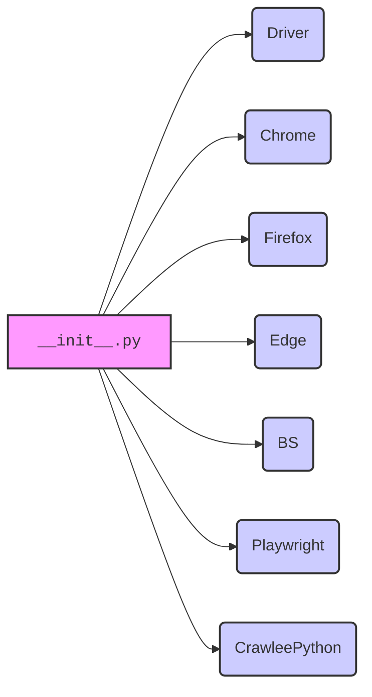

## Анализ кода `hypotez/src/webdriver/__init__.py`

### 1. <алгоритм>

Файл `__init__.py` в пакете `src.webdriver` предназначен для определения пакета `webdriver` и упрощения импорта модулей, находящихся внутри него. В предоставленном коде закомментированы импорты различных веб-драйверов, таких как `Chrome`, `Firefox`, `Edge`, `BS` (возможно, BeautifulSoup), `Playwright` и `CrawleePython`.

**Блок-схема:**

1.  **Начало**: Файл `__init__.py` загружается.
2.  **Импорт (закомментирован)**:
    *   `Driver` (из `.driver`)
    *   `Chrome` (из `.chrome`)
    *   `Firefox` (из `.firefox`)
    *   `Edge` (из `.edge`)
    *   `BS` (из `.bs`)
    *   `Playwright` (из `.playwright`)
    *   `CrawleePython` (из `.crawlee_python`)
    *   **Пример**: Если раскомментировать `from .chrome import Chrome`, то можно будет импортировать класс `Chrome` напрямую из пакета `webdriver` (`from src.webdriver import Chrome`).
3.  **Конец**: Файл завершает выполнение.

### 2. <mermaid>

**Объяснение зависимостей:**

*   `__init__.py`: Инициализирует пакет `webdriver`.
*   `Driver`, `Chrome`, `Firefox`, `Edge`, `BS`, `Playwright`, `CrawleePython`: Модули, представляющие различные веб-драйверы или инструменты для автоматизации браузера.

### 3. <объяснение>

*   **Импорты**:
    *   Закомментированные строки импорта указывают на то, что данный файл предназначен для агрегации различных веб-драйверов и предоставления удобного способа их импорта. Например, если раскомментировать `from .chrome import Chrome`, то класс `Chrome` можно будет импортировать как `from src.webdriver import Chrome`.
    *   Импорты используют относительные пути (`.chrome`, `.firefox`), что означает, что модули находятся в том же пакете `src.webdriver`.
*   **Классы**:
    *   `Driver`, `Chrome`, `Firefox`, `Edge`, `BS`, `Playwright`, `CrawleePython` - это, вероятно, классы, представляющие интерфейсы для управления соответствующими веб-браузерами или инструментами.
    *   Предполагается, что каждый из этих классов предоставляет методы для навигации по веб-страницам, взаимодействия с элементами, извлечения данных и выполнения других задач, связанных с автоматизацией браузера.
*   **Функции**:
    *   В данном файле нет явно определенных функций, но предполагается, что каждый из импортированных классов содержит свои методы для выполнения различных действий.
*   **Переменные**:
    *   В данном файле нет явно определенных переменных.
*   **Потенциальные ошибки и области для улучшения**:
    *   В текущем состоянии файл `__init__.py` не выполняет никакой полезной функции, так как все импорты закомментированы. Чтобы он был полезен, необходимо раскомментировать нужные импорты.
    *   Необходимо добавить документацию для каждого из импортированных классов, чтобы было понятно, как их использовать.

**Взаимосвязи с другими частями проекта**:

*   Пакет `webdriver` может использоваться другими частями проекта для автоматизации тестирования веб-приложений, сбора данных с веб-сайтов (web scraping) или выполнения других задач, требующих взаимодействия с браузером. Например, модуль тестирования может использовать `webdriver` для автоматического запуска тестов в различных браузерах и проверки правильности работы веб-приложения.