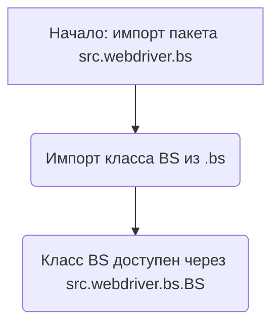
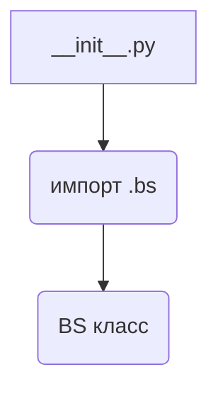

## Анализ кода `hypotez/src/webdriver/bs/__init__.py`

### 1. <алгоритм>

Этот файл `__init__.py` действует как точка входа для модуля `src.webdriver.bs`. Он импортирует класс `BS` из модуля `.bs`, делая его доступным при импорте пакета `src.webdriver.bs`.

**Блок-схема:**



**Пример:**

```python
from src.webdriver import bs

# Теперь можно использовать класс BS напрямую
bs_instance = bs.BS() 
```

### 2. <mermaid>



**Объяснение зависимостей:**

- `__init__.py` зависит от `.bs`, который, как предполагается, является модулем `bs.py` в том же каталоге.
- Класс `BS` определяется в `bs.py` и становится частью пространства имен `src.webdriver.bs` после импорта.

### 3. <объяснение>

**Импорты:**

- `from .bs import BS`: Этот оператор импортирует класс `BS` из модуля `bs.py`, расположенного в том же каталоге. Точка `.` указывает на текущий каталог.

**Классы:**

- `BS`: Класс, вероятно, предназначен для выполнения каких-либо операций, связанных с веб-драйвером и Beautiful Soup (судя по `bs` в имени модуля). Однако, без доступа к коду `bs.py`, точное поведение класса `BS` определить невозможно.

**Функции:**

- В данном коде нет определенных функций. Этот файл в основном используется для импорта и экспорта класса `BS`.

**Переменные:**

- Здесь нет явных переменных, но `BS` - это класс, который можно инстанцировать для создания объектов.

**Потенциальные ошибки и области для улучшения:**

- Без кода для `bs.py` трудно оценить функциональность и потенциальные проблемы.
- Отсутствует документация о цели класса `BS` и его методах.
- Следует добавить документацию, чтобы указать назначение модуля и класса `BS`.