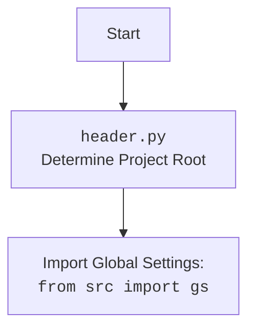

# Анализ кода `hypotez/src/webdriver/bs/bs.py`

## 1. <алгоритм>

### Блок-схема рабочего процесса `BS`

```mermaid
graph LR
    A[Начало] --> B{url is not None};
    B -- Да --> C[BS(url)];
    B -- Нет --> D[BS()];
    C --> E{url.startswith('file://')};
    D --> F[parser.get_url(url)];
    E -- Да --> G[Удаление префикса 'file://'];
    G --> H{Проверка Windows path};
    H -- Да --> I[Чтение файла];
    I -- Успешно --> J[html_content = file.read()];
    I -- Ошибка --> K[logger.error()];
    H -- Нет --> L[logger.error()];
    E -- Нет --> M{url.startswith('https://')};
    M -- Да --> N[requests.get(url)];
    N -- Успешно --> O[html_content = response.text];
    N -- Ошибка --> P[logger.error()];
    M -- Нет --> Q[logger.error()];
    O --> R[parser.execute_locator(locator)];
    J --> R
    R --> S[Создание soup = BeautifulSoup(self.html_content, 'lxml')];
    S --> T[Преобразование в lxml tree];
    T --> U{locator is dict};
    U -- Да --> V[locator = SimpleNamespace(**locator)];
    U -- Нет --> W[Извлечение атрибутов locator];
    V --> W
    W --> X{by == 'ID'};
    X -- Да --> Y[elements = tree.xpath(f'//*[@id="{attribute}"]')];
    X -- Нет --> Z{by == 'CSS'};
    Y --> AA[return elements];
    Z -- Да --> AB[elements = tree.xpath(f'//*[contains(@class, "{attribute}")]')];
    Z -- Нет --> AC{by == 'TEXT'};
    AB --> AA
    AC -- Да --> AD[elements = tree.xpath(f'//input[@type="{attribute}"]')];
    AC -- Нет --> AE[elements = tree.xpath(selector)];
    AD --> AA
    AE --> AA
    K --> AA
    L --> AA
    P --> AA
    Q --> AA
```

## 2. <mermaid>

```mermaid
flowchart TD
    A[BS] --> B{url: Optional[str] = None};
    B -- url is not None --> C[get_url(url: str)];
    C --> D{url.startswith('file://')};
    D -- Yes --> E[Удалить 'file://' префикс];
    E --> F{Windows Path?};
    F -- Yes --> G[Чтение локального файла];
    G -- Успех --> H[self.html_content = file.read()];
    G -- Ошибка --> I[logger.error()];
    F -- No --> J[logger.error()];
    D -- No --> K{url.startswith('https://')};
    K -- Yes --> L[requests.get(url)];
    L -- Успех --> M[self.html_content = response.text];
    L -- Ошибка --> N[logger.error()];
    K -- No --> O[logger.error()];
    H --> P[execute_locator(locator: Union[SimpleNamespace, dict], url: Optional[str] = None)];
    M --> P;
    P --> Q{url is not None};
    Q -- Yes --> C;
    Q -- No --> R{self.html_content is not None};
    R -- No --> S[logger.error()];
    R -- Yes --> T[BeautifulSoup(self.html_content, 'lxml')];
    T --> U[etree.HTML(str(soup))];
    U --> V{locator is dict};
    V -- Yes --> W[locator = SimpleNamespace(**locator)];
    V -- No --> X[attribute = locator.attribute];
    W --> X;
    X --> Y{by == 'ID'};
    Y -- Yes --> Z[tree.xpath(f'//*[@id="{attribute}"]')];
    Y -- No --> AA{by == 'CSS'};
    AA -- Yes --> BB[tree.xpath(f'//*[contains(@class, "{attribute}")]')];
    AA -- No --> CC{by == 'TEXT'};
    CC -- Yes --> DD[tree.xpath(f'//input[@type="{attribute}"]')];
    CC -- No --> EE[tree.xpath(selector)];
    Z --> FF[return elements];
    BB --> FF;
    DD --> FF;
    EE --> FF;
    I --> FF;
    J --> FF;
    N --> FF;
    O --> FF;
    S --> FF;
```



### Описание зависимостей `mermaid`

В этом коде используются следующие зависимости:

- `re`: Модуль для работы с регулярными выражениями. Используется для извлечения пути к файлу Windows из URL-адреса.
- `pathlib.Path`: Класс для представления путей к файлам и каталогам. Используется для проверки существования файла.
- `typing.Optional`, `typing.Union`, `typing.List`: Используются для аннотации типов переменных и параметров функций.
- `types.SimpleNamespace`: Используется для создания объектов с атрибутами, доступными через точечную нотацию.
- `bs4.BeautifulSoup`: Используется для парсинга HTML-контента.
- `lxml.etree`: Используется для работы с XML и HTML.
- `requests`: Используется для выполнения HTTP-запросов.
- `src.gs`: Глобальные настройки.
- `src.logger.logger`: Модуль для логирования.
- `src.utils.jjson`: Модуль для работы с JSON.

## 3. <объяснение>

### Импорты

- `re`: Модуль для работы с регулярными выражениями. Используется для извлечения пути к файлу Windows из URL.
- `pathlib.Path`: Модуль для представления путей к файлам или каталогам в файловой системе.
- `typing.Optional`, `typing.Union`, `typing.List`: Используются для аннотации типов, что улучшает читаемость и помогает обнаруживать ошибки на ранних этапах.
- `types.SimpleNamespace`: Класс, позволяющий создавать объекты с произвольными атрибутами. Используется для хранения данных локатора.
- `bs4.BeautifulSoup`: Класс из библиотеки `BeautifulSoup4`, предназначенный для парсинга HTML и XML.
- `lxml.etree`: Модуль для работы с XML и HTML, предоставляет возможность использования XPath.
- `requests`: Библиотека для выполнения HTTP-запросов.
- `src.gs`: Импортирует глобальные настройки проекта.
- `src.logger.logger`: Импортирует модуль логирования для записи ошибок и отладочной информации.
- `src.utils.jjson`: Импортирует функции для работы с JSON, например, `j_loads_ns`.

### Класс `BS`

- **Роль**: Класс предназначен для парсинга HTML-контента с использованием `BeautifulSoup` и XPath.
- **Атрибуты**:
  - `html_content` (str): Содержит HTML-контент для парсинга.
- **Методы**:
  - `__init__(self, url: Optional[str] = None)`: Инициализирует экземпляр класса `BS`. Если передан URL, вызывает метод `get_url` для загрузки HTML-контента.
  - `get_url(self, url: str) -> bool`: Загружает HTML-контент из файла или URL. Поддерживает протоколы `file://` и `https://`. Возвращает `True` при успешной загрузке и `False` в случае ошибки.
  - `execute_locator(self, locator: Union[SimpleNamespace, dict], url: Optional[str] = None) -> List[etree._Element]`: Выполняет XPath-локатор на HTML-контенте. Принимает объект `locator` (либо `SimpleNamespace`, либо `dict`) с атрибутами `by` (тип локатора), `attribute` (атрибут для поиска) и `selector` (XPath-селектор). Возвращает список элементов, соответствующих локатору.

### Функции

- `BS.__init__`:
    - **Аргументы**:
        - `url` (Optional[str]): URL или путь к файлу для загрузки HTML. По умолчанию `None`.
    - **Назначение**:
        - Инициализирует класс `BS` и при наличии URL вызывает метод `get_url` для загрузки содержимого.
    - **Пример**:
        ```python
        parser = BS('https://example.com')
        ```
- `BS.get_url`:
    - **Аргументы**:
        - `url` (str): URL или путь к файлу.
    - **Возвращаемое значение**:
        - `bool`: `True`, если контент успешно загружен, `False` в противном случае.
    - **Назначение**:
        - Загружает HTML-контент из указанного URL или файла. Поддерживает `file://` и `https://` протоколы.
    - **Пример**:
        ```python
        parser = BS()
        success = parser.get_url('https://example.com')
        if success:
            print('Контент успешно загружен')
        ```
- `BS.execute_locator`:
    - **Аргументы**:
        - `locator` (Union[SimpleNamespace, dict]): Объект, содержащий параметры локатора (`by`, `attribute`, `selector`).
        - `url` (Optional[str]): URL или путь к файлу для загрузки HTML (необязательный).
    - **Возвращаемое значение**:
        - `List[etree._Element]`: Список элементов, соответствующих локатору.
    - **Назначение**:
        - Выполняет XPath-запрос к HTML-контенту на основе предоставленного локатора.
    - **Пример**:
        ```python
        parser = BS()
        parser.get_url('https://example.com')
        locator = SimpleNamespace(by='ID', attribute='element_id', selector='//*[@id="element_id"]')
        elements = parser.execute_locator(locator)
        if elements:
            print(f'Найдено {len(elements)} элементов')
        ```

### Переменные

- `html_content` (str): Атрибут класса `BS`, хранит HTML-контент для парсинга.

### Потенциальные ошибки и области для улучшения

1.  **Обработка исключений**:
    - В методе `get_url` при чтении локального файла обрабатывается исключение `Exception`, что является слишком общим подходом. Рекомендуется уточнить тип исключения (например, `FileNotFoundError`, `IOError`) для более точной обработки ошибок.
2.  **Безопасность XPath**:
    - В методе `execute_locator` формируются XPath-запросы с использованием f-строк, что может быть небезопасно при использовании пользовательского ввода в `attribute`. Рекомендуется использовать параметризованные запросы или экранирование специальных символов для предотвращения XPath-инъекций.
3.  **Улучшение логирования**:
    - В сообщениях логирования можно добавить больше контекстной информации, например, идентификатор запроса или время выполнения.
4.  **Переиспользование кода**:
    - В методе `execute_locator` происходит дублирование кода: проверка `if url:` и вызов `self.get_url(url)` повторяются. Можно вынести этот код в отдельный метод.
5.  **Расширение функциональности**:
    - Можно добавить поддержку других типов локаторов, таких как `name`, `tag name` и т.д.

### Взаимосвязи с другими частями проекта

- **`src.gs`**: Используется для получения глобальных настроек, которые могут влиять на поведение парсера.
- **`src.logger.logger`**: Используется для логирования ошибок и отладочной информации, что помогает в мониторинге и отладке работы парсера.
- **`src.utils.jjson`**: Может использоваться для загрузки конфигурации локаторов из JSON-файла.

**Пример цепочки взаимосвязей**:

1.  Класс `BS` инициализируется.
2.  Метод `get_url` загружает HTML-контент. Если происходит ошибка, информация об ошибке записывается с помощью `logger.error`.
3.  Метод `execute_locator` выполняет XPath-запрос. Если локатор задан в виде словаря, он преобразуется в `SimpleNamespace`. XPath-запрос формируется и выполняется, результаты возвращаются.