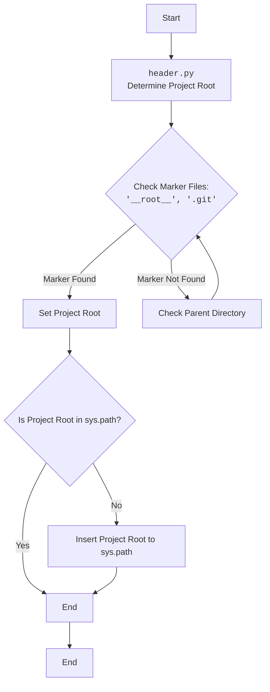

## Анализ кода `hypotez/src/webdriver/bs/header.py`

### 1. **<алгоритм>**:

Этот код предназначен для определения корневой директории проекта, начиная с текущего файла, и добавления этой директории в `sys.path`, чтобы обеспечить возможность импорта модулей проекта.

**Пошаговая блок-схема:**

1.  **Начало**: Точка входа в скрипт.
2.  **`set_project_root(marker_files)`**: Функция для определения корневой директории проекта.
    *   **Аргументы**:
        *   `marker_files` (tuple): Кортеж с именами файлов или директорий, которые используются для определения корневой директории. По умолчанию `('__root__', '.git')`.
    *   **Локальные переменные**:
        *   `current_path` (Path): Текущая директория, где расположен файл.
        *   `__root__` (Path): Изначально устанавливается как `current_path`, затем обновляется, если найден маркер.
    *   **Поиск корневой директории**:
        *   Перебирает текущую директорию и все её родительские директории.
        *   Для каждой директории проверяет наличие любого из `marker_files`.
        *   Если маркер найден, устанавливает `__root__` на эту директорию и прерывает цикл.
    *   **Добавление в `sys.path`**:
        *   Если `__root__` отсутствует в `sys.path`, добавляет её в начало.
    *   **Возврат**:
        *   Возвращает `__root__` (Path).
3.  **Вызов `set_project_root()`**: Вызывает функцию `set_project_root()` и присваивает результат переменной `__root__`.
4.  **Конец**: Завершение скрипта.

**Примеры для каждого логического блока:**

*   **Определение `current_path`**:

    ```python
    current_path: Path = Path(__file__).resolve().parent
    # Пример: Если файл находится в /path/to/project/src/webdriver/bs/header.py,
    # current_path будет /path/to/project/src/webdriver/bs
    ```
*   **Поиск маркера**:

    ```python
    if any((parent / marker).exists() for marker in marker_files):
        __root__ = parent
        break
    # Пример: Если в /path/to/project/ найдена директория .git,
    # __root__ будет /path/to/project
    ```
*   **Добавление в `sys.path`**:

    ```python
    if __root__ not in sys.path:
        sys.path.insert(0, str(__root__))
    # Пример: Если /path/to/project отсутствует в sys.path, добавляем её.
    ```

### 2. **<mermaid>**:



**Объяснение зависимостей и импортов для диаграммы `mermaid`:**

*   `sys`: Используется для модификации `sys.path`, чтобы добавить корневую директорию проекта для импорта модулей.
*   `json`: Не используется напрямую в предоставленном коде, но указан в импортах. Предположительно, может использоваться в других частях модуля или проекте.
*   `packaging.version.Version`: Используется для работы с версиями пакетов.
*   `pathlib.Path`: Используется для работы с путями к файлам и директориям.

### 3. **<объяснение>**:

**Импорты**:

*   `sys`: Предоставляет доступ к некоторым переменным и функциям, взаимодействующим с интерпретатором Python. В данном случае используется для добавления корневой директории проекта в `sys.path`.
*   `json`: Используется для работы с JSON-объектами.  В данном коде непосредственно не используется, но его наличие указывает на возможность использования в других частях модуля.
*   `packaging.version.Version`: Позволяет сравнивать версии пакетов.
*   `pathlib`: Предоставляет классы для представления путей файловой системы с семантикой, подходящей для разных операционных систем. Здесь используется для работы с путями к директориям и файлам.

**Классы**:

*   В данном коде классы отсутствуют.

**Функции**:

*   `set_project_root(marker_files: tuple[str, ...]=('__root__', '.git')) -> Path`:
    *   **Аргументы**:
        *   `marker_files` (tuple): Кортеж с именами файлов или директорий, которые используются для определения корневой директории. По умолчанию `('__root__', '.git')`.
    *   **Возвращаемое значение**:
        *   `Path`: Путь к корневой директории проекта.
    *   **Назначение**:
        *   Функция ищет корневую директорию проекта, начиная с директории, в которой находится текущий файл. Она поднимается вверх по дереву директорий, пока не найдет директорию, содержащую один из файлов-маркеров (например, `__root__` или `.git`). Затем она добавляет эту директорию в `sys.path`, чтобы Python мог импортировать модули из этой директории.
    *   **Пример**:

        ```python
        from pathlib import Path
        
        # Создаем фиктивные файлы и директории для примера
        project_root = Path("/tmp/my_project")
        project_root.mkdir(exist_ok=True)
        (project_root / "__root__").touch()
        
        src_dir = project_root / "src"
        src_dir.mkdir(exist_ok=True)
        
        # Создаем файл header.py внутри src_dir
        header_file = src_dir / "header.py"
        header_file.write_text("", encoding="utf-8")
        
        # Временно меняем текущую директорию для имитации вызова из header.py
        import os
        original_cwd = os.getcwd()
        os.chdir(str(src_dir))
        
        try:
            root_path = set_project_root()
            print(f"Root path: {root_path}")
        finally:
            os.chdir(original_cwd)  # Возвращаем исходную директорию
        
        # Очищаем созданные файлы и директории
        (project_root / "__root__").unlink()
        header_file.unlink()
        os.rmdir(str(src_dir))
        os.rmdir(str(project_root))
        ```

**Переменные**:

*   `__root__` (Path): Путь к корневой директории проекта.  Инициализируется результатом вызова `set_project_root()`.

**Потенциальные ошибки и области для улучшения**:

*   **Обработка ошибок**: В коде отсутствует явная обработка ошибок.  Например, если не удается найти корневую директорию, функция просто вернет директорию, в которой находится скрипт.  Было бы полезно добавить логирование или выброс исключения, если корневая директория не найдена.
*   **Оптимизация поиска**:  В текущей реализации функция перебирает все родительские директории.  Можно добавить ограничение на максимальную глубину поиска, чтобы избежать бесконечного цикла в случае, если маркерные файлы отсутствуют.

**Взаимосвязи с другими частями проекта**:

*   Этот модуль предназначен для определения корневой директории проекта и добавления её в `sys.path`.  Это позволяет другим модулям проекта импортировать модули, расположенные в корневой директории, без необходимости указывать относительные пути.