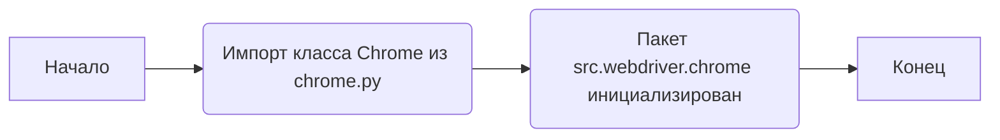
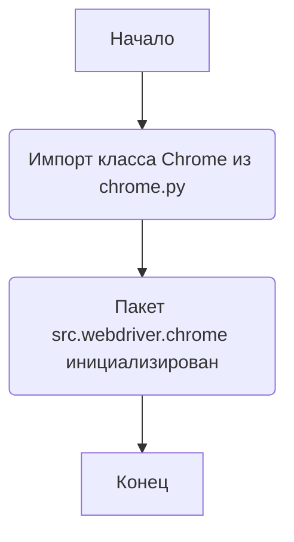

## Анализ кода `hypotez/src/webdriver/chrome/__init__.py`

### 1. <алгоритм>

Файл `__init__.py` в пакете `src.webdriver.chrome` служит для инициализации этого пакета. В данном случае он импортирует класс `Chrome` из модуля `chrome.py`, делая его доступным при импорте пакета `src.webdriver.chrome`.

**Блок-схема:**



**Пример:**

```python
# из другого модуля
from src.webdriver.chrome import Chrome

# Теперь можно использовать класс Chrome
driver = Chrome()
```

### 2. <mermaid>



**Объяснение зависимостей:**

- Пакет `src.webdriver.chrome` зависит от модуля `chrome.py`, который должен содержать класс `Chrome`.

### 3. <объяснение>

**Импорты:**

- `from .chrome import Chrome`: Импортирует класс `Chrome` из модуля `chrome.py`, находящегося в той же директории. Точка перед `chrome` указывает на относительный импорт.

**Классы:**

- `Chrome`: Предположительно, это класс, который управляет экземпляром браузера Chrome. Он может содержать методы для запуска Chrome, навигации по страницам, взаимодействия с элементами и т.д.

**Функции:**

- В данном файле нет функций, только импорт класса.

**Переменные:**

- В данном файле нет переменных.

**Потенциальные ошибки и области для улучшения:**

- Отсутствует документация о том, что делает класс `Chrome`.
- Нет обработки исключений или логирования.
- Зависимость от `chrome.py` не указана явно.

**Взаимосвязи с другими частями проекта:**

- Этот модуль вероятно используется в других частях проекта, где требуется управление браузером Chrome, например, для автоматизированного тестирования или сбора данных.