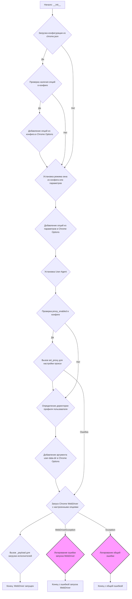
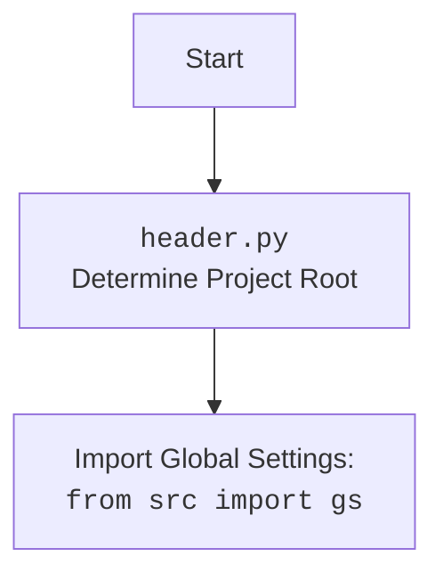

## <алгоритм>

### Алгоритм работы класса `Chrome`

1.  **Инициализация:**
    *   При создании экземпляра класса `Chrome`, в методе `__init__`, происходит инициализация объекта WebDriver для браузера Chrome с заданными параметрами.
    *   Загружаются конфигурации из файла `chrome.json` с использованием `j_loads_ns`.
    *   Определяется путь к исполняемому файлу `chromedriver`.

2.  **Настройка Chrome Options:**
    *   Создается объект `Options` для настройки Chrome.
    *   Добавляются опции из файла конфигурации, если они существуют.
    *   Устанавливается режим окна (kiosk, windowless, full\_window) из конфигурации или параметров.
    *   Добавляются опции, переданные при инициализации класса.
    *   Устанавливается User-Agent. Если не указан, генерируется случайный User-Agent с помощью библиотеки `fake_useragent`.

3.  **Настройка Proxy:**
    *   Если в конфигурации включено использование прокси (`config.proxy_enabled`), вызывается метод `set_proxy` для настройки прокси.

4.  **Настройка профиля пользователя:**
    *   Определяется директория профиля пользователя Chrome.
    *   Если указано имя профиля (`profile_name`), используется поддиректория в директории профиля.
    *   Если в пути профиля есть переменная окружения `%LOCALAPPDATA%`, она заменяется на соответствующее значение из `os.environ`.

5.  **Запуск WebDriver:**
    *   Создается экземпляр `WebDriver` с настроенными опциями и сервисом.
    *   Вызывается метод `_payload` для загрузки исполнителей локаторов и JavaScript.

6.  **Обработка исключений:**
    *   Если во время запуска `WebDriver` возникает исключение `WebDriverException` (например, из-за обновления Chrome или отсутствия Chrome на ОС), оно логируется, и функция завершается.
    *   Другие исключения также логируются.

7.  **Метод `set_proxy`:**
    *   Получает словарь прокси из функции `get_proxies_dict`.
    *   Составляет список всех прокси (socks4 и socks5).
    *   Проверяет каждый прокси из списка на работоспособность с помощью `check_proxy`.
    *   Если найден рабочий прокси, настраивает опции Chrome в зависимости от протокола (http, socks4, socks5).

8.  **Метод `_payload`:**
    *   Создает экземпляр класса `JavaScript`.
    *   Присваивает методы экземпляра `JavaScript` экземпляру класса `Chrome` для выполнения JavaScript-кода в браузере.
    *   Создает экземпляр класса `ExecuteLocator`.
    *   Присваивает методы экземпляра `ExecuteLocator` экземпляру класса `Chrome` для выполнения поиска элементов на странице.

### Блок-схема алгоритма:

## <mermaid>

```mermaid
classDiagram
    class Chrome {
        -driver_name: str
        -__init__(profile_name: Optional[str], chromedriver_version: Optional[str], user_agent: Optional[str], proxy_file_path: Optional[str], options: Optional[List[str]], window_mode: Optional[str], *args, **kwargs)
        -set_proxy(options: Options) : None
        -_payload() : None
    }
    class WebDriver {
    <<selenium.webdriver>>
    }

    class Options {
    <<selenium.webdriver.chrome.options>>
    }

    class Service {
    <<selenium.webdriver.chrome.service>>
    }

    class ExecuteLocator {
        -execute_locator(locator: str, multiple: bool) : list[WebElement] | WebElement | None
        -get_webelement_as_screenshot(locator: str) : bytes | None
        -get_webelement_by_locator(locator: str) : WebElement | None
        -get_attribute_by_locator(locator: str, attribute: str) : str | None
        -send_message(locator: str, message: str) : None
    }

    class JavaScript {
        -get_page_lang() : str
        -ready_state() : str
        -get_referrer() : str
        -unhide_DOM_element(locator: str) : None
        -window_focus() : None
    }

    Chrome --|> WebDriver : наследует
    Chrome --* Options : использует
    Chrome --* Service : использует
    Chrome --* ExecuteLocator : использует
    Chrome --* JavaScript : использует
    Chrome "1" *-- "1" gs : использует глобальные настройки
    Chrome "1" *-- "1" logger : использует для логирования
    Chrome "1" *-- "1" j_loads_ns : использует для загрузки конфигов

    class gs {
    <<src>>
    -path: Path
    }
    class logger {
    <<src.logger>>
    +info(message: str)
    +warning(message: str)
    +error(message: str)
    +critical(message: str, error: Exception)
    }

    class j_loads_ns {
    <<src.utils.jjson>>
    +j_loads_ns(path: Path) : dict
    }
```

### Объяснение зависимостей:

*   **selenium.webdriver**: Пакет `selenium.webdriver` предоставляет интерфейсы для управления браузером.
    *   `WebDriver`: Базовый класс для управления драйвером браузера.
    *   `Chrome`: Класс для управления браузером Chrome.
    *   `Options`: Класс для настройки опций запуска браузера Chrome.
    *   `Service`: Класс для управления процессом ChromeDriver.
*   **src**: Пакет `src` содержит собственные модули проекта.
    *   `gs`: Модуль глобальных настроек проекта.
    *   `src.webdriver.executor`: Модуль для выполнения действий с элементами на странице.
        *   `ExecuteLocator`: Класс для поиска и выполнения действий с элементами на странице.
    *   `src.webdriver.js`: Модуль для выполнения JavaScript-кода в браузере.
        *   `JavaScript`: Класс для выполнения JavaScript-кода в браузере.
    *   `src.utils.jjson`: Модуль для работы с JSON.
        *   `j_loads_ns`: Функция для загрузки JSON-файлов с поддержкой namespace.
    *   `src.logger.logger`: Модуль для логирования.
        *   `logger`: Объект логгера для записи сообщений о работе программы.
*   **fake_useragent**: Библиотека для генерации случайных User-Agent.

## <объяснение>

### Импорты:

*   `os`: Используется для работы с операционной системой, например, для получения переменных окружения.
*   `pathlib.Path`: Используется для работы с путями к файлам и директориям.
*   `typing.Optional, typing.List`: Используются для аннотации типов, указывая, что переменная может быть `None` или списком.
*   `selenium.webdriver.Chrome`: Основной класс для управления браузером Chrome через WebDriver.
*   `selenium.webdriver.chrome.options.Options`: Класс для настройки опций запуска браузера Chrome.
*   `selenium.webdriver.chrome.service.Service`: Класс для управления процессом ChromeDriver.
*   `selenium.common.exceptions.WebDriverException`: Исключение, которое может возникнуть при работе с WebDriver.
*   `src import gs`: Импортирует глобальные настройки проекта из модуля `src.gs`.
*   `src.webdriver.executor.ExecuteLocator`: Класс для выполнения поиска элементов на странице.
*   `src.webdriver.js.JavaScript`: Класс для выполнения JavaScript-кода в браузере.
*   `src.webdriver.proxy.get_proxies_dict, src.webdriver.proxy.check_proxy`: Функции для работы с прокси.
*   `src.utils.jjson.j_loads_ns`: Функция для загрузки JSON-файлов с поддержкой namespace.
*   `src.logger.logger.logger`: Объект логгера для записи сообщений о работе программы.
*   `fake_useragent.UserAgent`: Класс для генерации случайных User-Agent.
*   `random`: Используется для случайного выбора прокси из списка.

### Класс `Chrome`:

*   **Назначение**: Расширяет функциональность `webdriver.Chrome` для упрощения настройки и управления браузером Chrome.
*   **Атрибуты**:
    *   `driver_name: str = 'chrome'`: Имя драйвера (используется для идентификации).
*   **Методы**:
    *   `__init__(...)`: Конструктор класса. Инициализирует WebDriver с заданными параметрами:
        *   `profile_name: Optional[str]`: Имя пользовательского профиля Chrome.
        *   `chromedriver_version: Optional[str]`: Версия chromedriver.
        *   `user_agent: Optional[str]`: Пользовательский агент.
        *   `proxy_file_path: Optional[str]`: Путь к файлу с прокси.
        *   `options: Optional[List[str]]`: Список опций для Chrome.
        *   `window_mode: Optional[str]`: Режим окна браузера.
        *   Загружает конфигурацию из `chrome.json`.
        *   Устанавливает путь к `chromedriver`.
        *   Настраивает опции Chrome, User-Agent и прокси.
        *   Запускает WebDriver.
        *   Обрабатывает исключения при запуске WebDriver.
    *   `set_proxy(options: Options) -> None`: Настраивает прокси из словаря, возвращаемого `get_proxies_dict`.
    *   `_payload() -> None`: Загружает исполнителей для локаторов и JavaScript сценариев.

### Функции:

*   `get_proxies_dict()`: Функция из `src.webdriver.proxy`, возвращает словарь прокси.
*   `check_proxy(proxy)`: Функция из `src.webdriver.proxy`, проверяет работоспособность прокси.
*   `j_loads_ns(Path(gs.path.src / 'webdriver' / 'chrome' / 'chrome.json'))`: Загружает конфигурацию из файла `chrome.json`.
*   `logger.info(...)`, `logger.warning(...)`, `logger.critical(...)`: Методы логгера для записи сообщений о работе программы.

### Переменные:

*   `config`: Объект, содержащий конфигурацию из файла `chrome.json`.
*   `chromedriver_path: str`: Путь к исполняемому файлу `chromedriver`.
*   `options_obj`: Объект класса `Options`, содержащий опции запуска браузера Chrome.
*   `profile_directory`: Директория профиля пользователя Chrome.

### Потенциальные ошибки и области для улучшения:

*   Обработка исключений:
    *   В блоке `except` перехватываются общие исключения (`Exception`).  Возможно, стоит уточнить, какие конкретно исключения нужно обрабатывать.
*   Обработка прокси:
    *   Не предусмотрена обработка ошибок при проверке прокси. Если `check_proxy` возвращает ошибку, она не логируется.
*   Использование `j_loads_ns`:
    *   Убедиться, что все пути к конфигурационным файлам используют `j_loads_ns` для единообразия.
*   Логирование:
    *   Добавить больше логирования для отладки, особенно при настройке опций Chrome и прокси.

### Взаимосвязи с другими частями проекта:

*   Глобальные настройки (`src.gs`): используются для получения путей к файлам и директориям проекта.
*   Логирование (`src.logger.logger`): используется для записи сообщений о работе программы.
*   Работа с JSON (`src.utils.jjson`): используется для загрузки конфигурации из файла `chrome.json`.
*   Прокси (`src.webdriver.proxy`): используется для настройки прокси.
*   JavaScript (`src.webdriver.js`): используется для выполнения JavaScript-кода в браузере.
*   Executor (`src.webdriver.executor`): используется для выполнения действий с элементами на странице.