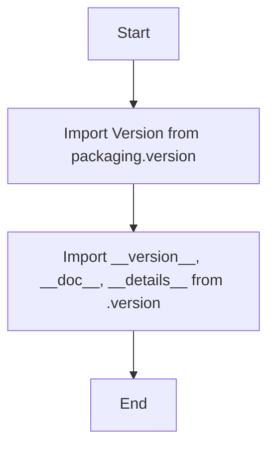

# АНАЛИЗ КОДА

## <алгоритм>

1. **Импорт `Version` из `packaging.version`:**
   - Пример: `from packaging.version import Version`
   -  Импортируется класс `Version` для работы с версиями программного обеспечения.
2. **Импорт `__version__`, `__doc__`, `__details__` из `.version`:**
   - Пример: `from .version import __version__, __doc__, __details__`
   -  Импортируются переменные, содержащие информацию о версии, документацию и дополнительные сведения о расширении.

## <mermaid>

**Объяснение:**

Диаграмма показывает простой процесс импорта необходимых модулей и переменных.
- **Start**: Начало процесса.
- **ImportVersion**: Импорт класса `Version` из библиотеки `packaging.version`. Это класс, предназначенный для сравнения версий.
- **ImportModuleInfo**: Импорт переменных `__version__`, `__doc__`, `__details__` из модуля `version.py` (представлен как `.version`). Эти переменные предоставляют метаданные о расширении: версия, документация и дополнительные детали.
- **End**: Конец процесса.

## <объяснение>

**Импорты:**

*   `from packaging.version import Version`:
    *   **Назначение:**  Импортирует класс `Version` из библиотеки `packaging.version`, предназначенной для работы с версиями программного обеспечения.
    *   **Взаимосвязь с `src`:** Эта библиотека не является частью проекта `src`, а является внешней зависимостью. Её использование позволяет сравнивать версии расширения (если это необходимо).

*   `from .version import __version__, __doc__, __details__`:
    *   **Назначение:** Импортирует переменные `__version__` (строка, представляющая версию расширения), `__doc__` (строка документации) и `__details__` (дополнительные сведения о расширении) из модуля `version.py`, который находится в той же директории (обозначено точкой `.`).
    *   **Взаимосвязь с `src`:** Это внутренний модуль проекта `src`. Он содержит метаданные для текущего расширения chrome.

**Переменные:**

*   `__version__`: Строка, представляющая версию текущего расширения chrome. Например: `"1.0.0"`.
*   `__doc__`: Строка, содержащая документацию к расширению.
*   `__details__`: Строка, содержащая дополнительные сведения об расширении, например, краткое описание.

**Общее объяснение:**

Файл `__init__.py` в пакете `src.webdriver.chrome.extentions` инициализирует пакет и делает доступными переменные `__version__`, `__doc__`, и `__details__`, а также класс `Version` для использования в других частях проекта.  Использование `packaging.version` указывает на то, что версия может быть не просто строкой, а чем-то, что может быть сравнено с другими версиями.

**Возможные ошибки и области для улучшения:**

*   **Отсутствие логики:** Код не имеет никакой логики, кроме импортов.  Если требуется выполнение других действий при импорте пакета, они должны быть добавлены.
*   **Недостаток документации:**  Несмотря на наличие `__doc__`, в коде есть много пустых строковых комментариев.  Стоит добавить документацию в `version.py` и описать цели и методы каждого модуля, чтобы увеличить читабельность и поддерживаемость.
* **Возможность использования `__all__`:** Для управления импортом пакета извне, можно использовать переменную `__all__`,  чтобы явно указать, что должно быть импортировано при использовании `from src.webdriver.chrome.extentions import *`.

**Цепочка взаимосвязей с другими частями проекта:**

*   Другие модули внутри `src.webdriver.chrome` или другие модули, которые зависят от расширений chrome, могут импортировать и использовать `__version__`, `__doc__`, `__details__` для проверки версии, документации и других деталей расширения.
*   Класс `Version` может использоваться для сравнения версий расширений.
*   Информация о версии может быть использована в механизмах логирования, отчётах или при проверке совместимости.

В целом, данный `__init__.py` является входной точкой для пакета, предоставляя доступ к метаданным и версиям, но в текущем виде не реализует никакой логики,  кроме импортов.