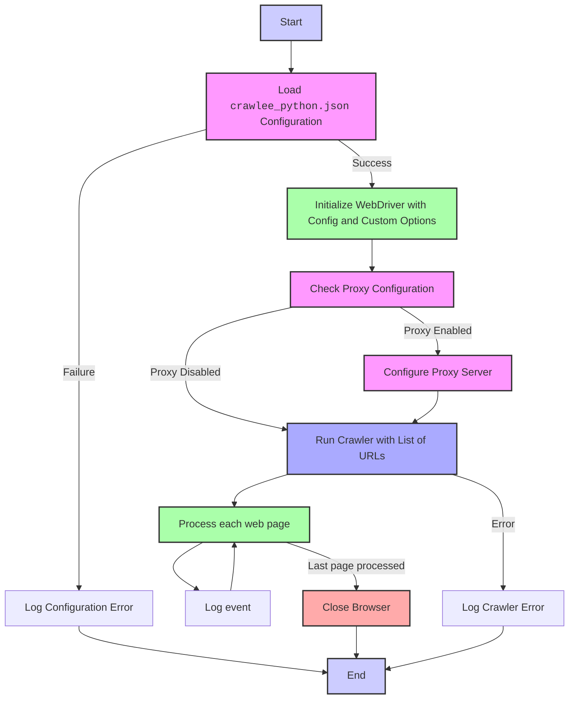

## Анализ кода `crawlee_python/readme.ru.md`

### 1. **<алгоритм>**

1.  **Начало**: Пользователь начинает использовать модуль `CrawleePython`.
    *   Пример: Импорт класса `CrawleePython` из модуля `src.webdriver.crawlee_python`.
2.  **Чтение конфигурации**: Класс `CrawleePython` при инициализации пытается загрузить конфигурацию из файла `crawlee_python.json`.
    *   Пример: Проверяется наличие и корректность JSON-файла.
3.  **Инициализация WebDriver**: Если конфигурация загружена успешно, класс `CrawleePython` инициализирует браузер Playwright на основе параметров из конфигурационного файла и переданных пользовательских опций.
    *   Пример: Используются параметры `headless`, `browser_type`, `options`, `user_agent`, `proxy`, `viewport`, `timeout`, `ignore_https_errors` из JSON-конфига, а также пользовательские параметры.
4.  **Настройка прокси (опционально)**: Если в конфигурации `proxy.enabled` установлен в `true`, устанавливается прокси-сервер.
    *   Пример: Если `proxy.enabled` равно `true`, используется адрес, имя пользователя и пароль из `proxy.server`, `proxy.username`, `proxy.password`.
5.  **Обход веб-страниц**: Метод `run` запускает обход переданных веб-страниц.
    *   Пример: Передается список URL-адресов для обхода.
6.  **Обработка каждой страницы**: Для каждой страницы WebDriver загружает страницу и выполняет необходимые операции.
    *   Пример: WebDriver обращается к URL-адресу, извлекает HTML или другую необходимую информацию.
7.  **Логирование**: В процессе работы все важные события, ошибки и предупреждения записываются в лог.
    *   Пример: Логируется сообщение об ошибке при чтении файла конфигурации или ошибке при запуске браузера.
8.  **Завершение**: После завершения всех запросов или при возникновении ошибки обход завершается, и WebDriver закрывает браузер.

### 2. **<mermaid>**

**Объяснение диаграммы:**

*   **Start**: Начало процесса использования `CrawleePython`.
*   **LoadConfig**: Попытка загрузки конфигурации из файла `crawlee_python.json`. Зависимости: чтение файла, парсинг JSON.
*   **InitializeWebDriver**: Инициализация WebDriver с учетом конфигурации и пользовательских параметров. Зависимости: Playwright, настройки из конфигурации, опциональные пользовательские параметры.
*   **CheckProxy**: Проверка, включен ли прокси-сервер в конфигурации. Зависимости: значение `proxy.enabled` из конфигурации.
*   **ConfigureProxy**: Настройка прокси-сервера, если прокси включен. Зависимости: значения `proxy.server`, `proxy.username`, `proxy.password` из конфигурации.
*   **RunCrawler**: Запуск процесса обхода страниц с предоставленным списком URL. Зависимости: Playwright, список URL.
*   **ProcessPage**: Обработка каждой отдельной веб-страницы, включая загрузку и извлечение данных. Зависимости: WebDriver, URL страницы.
*   **LogEvent**: Логирование всех событий, ошибок и предупреждений. Зависимости: `src.logger`.
*   **CloseBrowser**: Закрытие браузера по завершении процесса обхода или возникновении ошибки. Зависимости: WebDriver.
*   **LogConfigError**: Логирование ошибки конфигурации, если `crawlee_python.json` не удалось загрузить. Зависимости: `src.logger`.
*   **LogCrawlerError**: Логирование ошибки, возникшей во время обхода страниц. Зависимости: `src.logger`.
*   **End**: Завершение процесса обхода.

### 3. **<объяснение>**

#### Импорты:

*   **`from src.webdriver.crawlee_python import CrawleePython`**: Импортирует класс `CrawleePython` из соответствующего модуля, который предоставляет основной функционал обхода веб-страниц. Зависимости:  `src.webdriver`, `crawlee` и `playwright`.
*   **`import asyncio`**: Стандартный модуль Python для асинхронного программирования. Используется для организации асинхронного выполнения задач, таких как запуск обхода.

#### Классы:

*   **`CrawleePython`**:
    *   **Роль**: Основной класс, который управляет процессом обхода веб-страниц с использованием Playwright и Crawlee.
    *   **Атрибуты**:
        *   Не имеет явно объявленных атрибутов в этом описании, но подразумевается наличие внутренних атрибутов, связанных с настройками браузера и обходом страниц.
    *   **Методы**:
        *   **`__init__`**: Конструктор класса, который загружает настройки из `crawlee_python.json`, инициализирует Playwright и настраивает параметры браузера. Он также принимает пользовательские опции.
        *   **`run`**: Асинхронный метод, который запускает обход указанных URL.
    *   **Взаимодействие**: Взаимодействует с Playwright для управления браузером, Crawlee для организации обхода страниц, и `src.logger` для логирования.

#### Функции:

*   **`async def main():`**: Асинхронная функция, которая создает экземпляр класса `CrawleePython` и запускает обход заданного URL.
    *   **Аргументы**: Нет.
    *   **Возвращаемое значение**: Нет.
    *   **Назначение**: Пример использования класса `CrawleePython`.
*   **`asyncio.run(main())`**: Запускает асинхронную функцию `main`.
    *   **Аргументы**: Асинхронная функция `main`.
    *   **Возвращаемое значение**: Нет.
    *   **Назначение**: Запускает асинхронную функцию `main` и управляет ее выполнением.

#### Переменные:

*   `crawler`: Экземпляр класса `CrawleePython`.
*   `max_requests`: Максимальное количество запросов (опционально, передается при инициализации `CrawleePython`).
*   `headless`: Флаг для запуска браузера в безголовом режиме (опционально, передается при инициализации `CrawleePython`).
*   `browser_type`: Тип браузера (опционально, передается при инициализации `CrawleePython`).
*   `options`: Список опций для браузера (опционально, передается при инициализации `CrawleePython`).
*   `urls`: Список URL-адресов для обхода (опционально, передается в метод `run`).

#### Потенциальные ошибки или области для улучшения:

1.  **Обработка ошибок при чтении файла конфигурации:** Более детальная обработка ошибок, связанных с чтением и парсингом `crawlee_python.json`, например, проверка структуры и типов данных.
2.  **Валидация параметров**: Необходимо валидировать входные параметры (например, `max_requests` должно быть целым числом, а `browser_type` должно быть одним из допустимых значений).
3.  **Отсутствие обработки результатов обхода**: В текущем виде нет обработки данных, полученных при обходе страниц. Следует добавить логику для сохранения или анализа полученных данных.
4.  **Управление ресурсами:** Добавить возможность управления ресурсами (например, ограничение использования памяти или CPU).
5.  **Проверка зависимостей**: Необходимо добавить проверку зависимостей в начале работы программы (например, наличие установленного playwright и crawlee).

#### Взаимосвязи с другими частями проекта:

*   **`src.logger`**: Используется для логирования всех событий, ошибок и предупреждений.
*   **Playwright**: Используется для управления браузером и взаимодействия с веб-страницами.
*   **Crawlee**: Используется для организации обхода страниц и управления запросами.
*   **`crawlee_python.json`**: Файл конфигурации, который управляет поведением класса `CrawleePython`.
*   **`src`**: Пакет, который включает в себя все модули проекта.

Этот анализ предоставляет подробную картину функциональности модуля, его структуры и взаимодействий с другими компонентами.