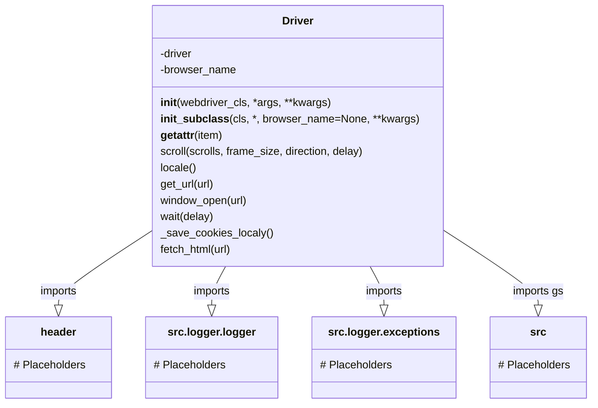
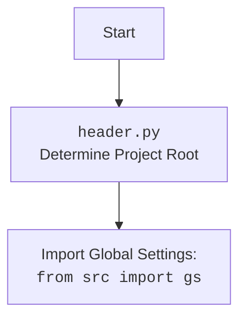

## **Анализ кода `hypotez/src/webdriver/driver.py`**

### **1. <алгоритм>**

#### **Обзор**
Этот модуль предоставляет класс `Driver`, который является оберткой для Selenium WebDriver. Он упрощает взаимодействие с веб-драйверами, предоставляя унифицированный интерфейс для выполнения общих задач, таких как навигация, прокрутка и управление куками.

#### **Блок-схема**

```mermaid
graph TD
    A[Инициализация Driver] --> B{Проверка webdriver_cls};
    B -- True --> C[Создание экземпляра WebDriver];
    B -- False --> D[Выброс TypeError];
    C --> E[Инициализация завершена];
    D --> E

    F[Вызов get_url(url)] --> G[Сохранение current_url];
    G --> H[Вызов driver.get(url)];
    H --> I{Успешно?};
    I -- Да --> J[Сохранение куки];
    I -- Нет --> K[Логирование ошибки];
    J --> L[Завершение get_url];
    K --> L

    M[Вызов scroll(scrolls, frame_size, direction, delay)] --> N{Определение направления};
    N -- forward/down --> O[Вызов carousel('')];
    N -- backward/up --> P[Вызов carousel('-')];
    N -- both --> Q[Вызов carousel('') и carousel('-')];
    O --> R[Прокрутка экрана];
    P --> R
    Q --> R
    R --> S[Завершение scroll];

    T[Вызов locale()] --> U[Попытка получить язык из META];
    U --> V{Успешно?};
    V -- Да --> W[Возврат языка];
    V -- Нет --> X[Попытка получить язык из JavaScript];
    X --> Y{Успешно?};
    Y -- Да --> Z[Возврат языка];
    Y -- Нет --> AA[Возврат None];
    W --> AB[Завершение locale];
    Z --> AB
    AA --> AB
```

#### **Примеры**

1. **Инициализация `Driver`**:
    - Создается экземпляр класса `Driver` с указанием класса WebDriver (например, `Chrome`) и его параметров.
    - Проверяется, является ли переданный класс допустимым классом WebDriver (имеет ли метод `get`).
    - Если проверка не пройдена, выбрасывается исключение `TypeError`.

    ```python
    from selenium.webdriver import Chrome
    driver = Driver(Chrome, executable_path='/path/to/chromedriver')
    ```

2. **Навигация с использованием `get_url`**:
    - Метод `get_url` используется для перехода по указанному URL.
    - Перед переходом сохраняется текущий URL.
    - После успешного перехода сохраняются куки.
    - Если во время перехода возникают ошибки (например, `WebDriverException` или `InvalidArgumentException`), они логируются, и возвращается `False`.

    ```python
    driver.get_url('https://example.com')
    ```

3. **Прокрутка страницы с использованием `scroll`**:
    - Метод `scroll` позволяет прокручивать страницу в заданном направлении на определенное количество пикселей.
    - Поддерживаются направления: `forward` (вниз), `backward` (вверх) и `both` (вниз и вверх).
    - Используется JavaScript для выполнения прокрутки.

    ```python
    driver.scroll(scrolls=3, direction='down')
    ```

4. **Определение языка страницы с использованием `locale`**:
    - Метод `locale` пытается определить язык страницы, сначала проверяя мета-теги, а затем используя JavaScript.
    - Если язык не удается определить, возвращается `None`.

    ```python
    lang = driver.locale
    print(lang)  # 'en' или None
    ```

### **2. <mermaid>**

#### **Диаграмма классов**



#### **Объяснение зависимостей**

- **`Driver`**: Основной класс, предоставляющий интерфейс для работы с веб-драйвером Selenium.
    - **`header`**: Импортируется для определения настроек проекта.
    - **`src.gs`**: Импортируется для доступа к глобальным настройкам проекта, таким как пути к файлам.
    - **`src.logger.logger`**: Используется для логирования ошибок и отладочной информации.
    - **`src.logger.exceptions`**: Используется для обработки специфических исключений, связанных с WebDriver.

#### **Диаграмма для `header.py`**



### **3. <объяснение>**

#### **Импорты**

- **`copy`**: Используется для создания копий объектов.
- **`pickle`**: Используется для сериализации и десериализации объектов Python (в данном случае, для сохранения и загрузки куки).
- **`time`**: Используется для добавления задержек (например, при прокрутке страницы).
- **`re`**: Используется для работы с регулярными выражениями (например, при извлечении пути к файлу из URL).
- **`pathlib.Path`**: Используется для работы с путями к файлам и каталогам.
- **`typing.Optional`**: Используется для указания, что переменная может иметь значение `None`.
- **`selenium.webdriver.common.by.By`**: Используется для определения стратегий поиска элементов на веб-странице (например, по CSS-селектору).
- **`selenium.common.exceptions`**: Содержит исключения, которые могут возникнуть при работе с Selenium WebDriver.
    - `InvalidArgumentException`: Возникает, когда передан некорректный аргумент.
    - `ElementClickInterceptedException`: Возникает, когда элемент не может быть кликнут, так как он перекрыт другим элементом.
    - `ElementNotInteractableException`: Возникает, когда элемент не может быть использован, так как он неактивен.
    - `ElementNotVisibleException`: Возникает, когда элемент не видим.
- **`header`**: Содержит общие настройки и функции для проекта.
- **`src.gs`**: Содержит глобальные настройки проекта, такие как пути к файлам.
- **`src.logger.logger`**: Модуль логирования для записи ошибок и отладочной информации.
- **`src.logger.exceptions`**: Пользовательские исключения для WebDriver.

#### **Класс `Driver`**

- **Роль**: Предоставляет унифицированный интерфейс для взаимодействия с Selenium WebDriver.
- **Атрибуты**:
    - `driver`: Экземпляр Selenium WebDriver.
    - `browser_name`: Имя браузера (устанавливается в подклассах).
- **Методы**:
    - `__init__(self, webdriver_cls, *args, **kwargs)`: Инициализирует экземпляр класса `Driver`.
        - `webdriver_cls`: Класс WebDriver (например, `Chrome` или `Firefox`).
        - `*args`: Позиционные аргументы для драйвера.
        - `**kwargs`: Ключевые аргументы для драйвера.
    - `__init_subclass__(cls, *, browser_name=None, **kwargs)`: Автоматически вызывается при создании подкласса `Driver`.
        - `browser_name`: Имя браузера.
    - `__getattr__(self, item)`: Прокси для доступа к атрибутам драйвера.
        - `item`: Имя атрибута.
    - `scroll(self, scrolls=1, frame_size=600, direction='both', delay=.3)`: Прокручивает страницу в указанном направлении.
        - `scrolls`: Количество прокруток.
        - `frame_size`: Размер прокрутки в пикселях.
        - `direction`: Направление прокрутки (`both`, `down`, `up`).
        - `delay`: Задержка между прокрутками.
    - `locale(self)`: Определяет язык страницы на основе мета-тегов или JavaScript.
    - `get_url(self, url)`: Переходит по указанному URL и сохраняет куки.
        - `url`: URL для перехода.
    - `window_open(self, url=None)`: Открывает новую вкладку в браузере и переключается на нее.
        - `url`: URL для открытия в новой вкладке.
    - `wait(self, delay=.3)`: Ожидает указанное количество времени.
        - `delay`: Время задержки в секундах.
    - `_save_cookies_localy(self)`: Сохраняет текущие куки веб-драйвера в локальный файл.
    - `fetch_html(self, url)`: Извлекает HTML-контент из файла или веб-страницы.
        - `url`: Путь к файлу или URL для извлечения HTML-контента.

#### **Функции**

- `scroll`
    - `carousel`: Внутренняя функция для выполнения фактической прокрутки.

#### **Переменные**

- `driver`: Экземпляр веб-драйвера Selenium.
- `browser_name`: Имя браузера.
- `locale`: Код языка страницы.

#### **Потенциальные ошибки и области для улучшения**

1. **Обработка исключений**:
    - В некоторых методах обработка исключений выполняется с общим `except Exception as ex`, что может затруднить отладку. Рекомендуется использовать более конкретные типы исключений.
2. **Логирование**:
    - В некоторых местах логируются только сообщения об ошибках без дополнительной информации. Было бы полезно добавить больше контекстной информации (например, значения переменных).
3. **Сохранение куки**:
    - Метод `_save_cookies_localy` закомментирован (`return True # <- ~~~~~~~~~~~~~~~~~~~~~~~~~~~~~ debug`), что означает, что сохранение куки не работает. Это нужно исправить.
4. **Ожидание загрузки страницы**:
    - В методе `get_url` есть ожидание загрузки страницы, но количество попыток фиксировано. Можно сделать его более адаптивным, например, используя `WebDriverWait`.

#### **Взаимосвязи с другими частями проекта**

- Класс `Driver` использует модуль `src.gs` для доступа к глобальным настройкам, таким как пути к файлам.
- Модуль `src.logger.logger` используется для логирования ошибок и отладочной информации.
- Модуль `header` используется для определения настроек проекта.