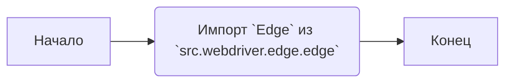
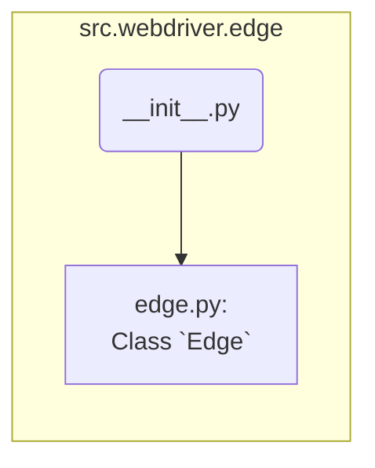

## Анализ кода `src/webdriver/edge/__init__.py`

### 1. <алгоритм>

**Блок-схема:**

**Пример:**

1.  **Начало:** Инициализация выполнения модуля `__init__.py` в пакете `src.webdriver.edge`.
2.  **Импорт `Edge`:** Импортируется класс `Edge` из модуля `edge.py`, находящегося в том же пакете `src.webdriver.edge`. Этот класс предназначен для работы с браузером Microsoft Edge.
3.  **Конец:** Завершение выполнения модуля.

### 2. <mermaid>

**Анализ зависимостей `mermaid`:**

*   `src.webdriver.edge`: Обозначает пакет, в котором находится данный модуль `__init__.py`.
*   `__init__.py`: Текущий модуль, который осуществляет импорт.
*   `edge.py`:  Модуль, из которого импортируется класс `Edge`.
*   `edge_module`: Обозначает модуль edge.py содержащий класс Edge.
*   `edge_init --> edge_module`: Означает импорт класса Edge из `edge.py` в `__init__.py`.

### 3. <объяснение>

**Импорты:**

*   `from .edge import Edge`: Этот импорт является относительным и указывает на импорт класса `Edge` из модуля `edge.py`, находящегося в том же пакете `src.webdriver.edge`. Это позволяет использовать класс `Edge` напрямую при обращении к пакету `src.webdriver.edge`.

**Классы:**

*   `Edge`: Класс, который импортируется из `edge.py`. Предполагается, что этот класс содержит логику для управления браузером Microsoft Edge. Он может включать методы для запуска браузера, навигации по страницам, взаимодействия с элементами и т.д. (Детали реализации этого класса находятся в файле `edge.py` и не раскрываются в текущем анализе).

**Функции:**

*   В предоставленном коде нет явных функций, но класс `Edge`, скорее всего, будет содержать методы для взаимодействия с браузером Edge.

**Переменные:**

*   В коде не используются явные переменные. Но в файле `edge.py` скорее всего будут инициализированы переменные и экземпляры классов.

**Цепочка взаимосвязей с другими частями проекта:**

*   Пакет `src.webdriver.edge` является частью более крупной структуры, отвечающей за автоматизацию браузера. Скорее всего, есть другие пакеты, например, `src.webdriver.chrome`, `src.webdriver.firefox`, которые предоставляют аналогичные функции для других браузеров.
*   `src.webdriver` скорее всего является основным пакетом, который координирует работу со всеми браузерами.
*  `Edge` класс возможно используется в более высоких уровнях проекта, где требуется автоматизация тестирования или сбора данных с помощью браузера Edge.

**Потенциальные ошибки и области для улучшения:**

*   В самом файле `__init__.py` нет явных ошибок, так как он только импортирует `Edge`.
*   Логика работы с браузером Edge находится в файле `edge.py`, поэтому без его анализа сложно указать конкретные улучшения.
*   В текущем коде отсутствует обработка исключений, которые могут возникнуть во время импорта.