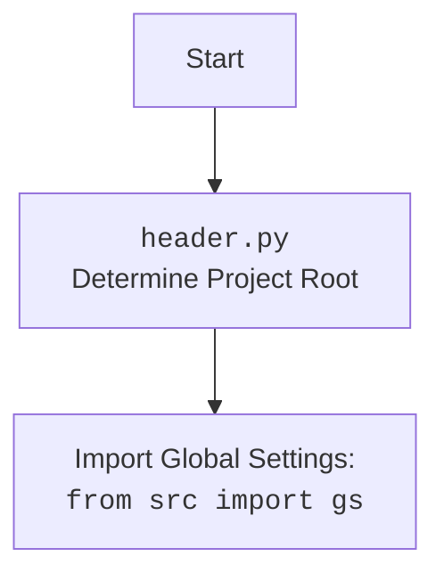

## Анализ кода `hypotez/src/webdriver/executor.py`

### 1. **<алгоритм>**

Модуль `executor.py` предоставляет функциональность для взаимодействия с веб-элементами с использованием Selenium. Он включает в себя классы и функции для выполнения различных действий, таких как поиск элементов, ввод текста, нажатие кнопок и получение атрибутов.

**Блок-схема:**

```mermaid
graph TD
    A[Начало: execute_locator] --> B{Проверка типа locator (dict или SimpleNamespace)};
    B -- dict --> C[Преобразование locator в SimpleNamespace];
    B -- SimpleNamespace --> D{Проверка атрибутов locator (attribute, selector)};
    D -- Нет атрибутов --> E[Логгирование: "Empty locator provided."];
    E --> F[Возврат: None];
    D -- Есть атрибуты --> G[Вызов: _parse_locator];
    G --> H{Проверка атрибутов locator (event, attribute, mandatory)};
    H -- event и attribute, но нет mandatory --> I[Логгирование: "Locator with event and attribute but missing mandatory flag. Skipping."];
    I --> J[Возврат: None];
    H -- Другое --> K{Проверка типа locator.by};
    K -- str --> L{Преобразование locator.by в нижний регистр};
    L --> M{Проверка locator.attribute};
    M -- Есть locator.attribute --> N[Вызов: _evaluate_locator для вычисления locator.attribute];
    N --> O{Проверка locator.by};
    O -- value --> P[Возврат: locator.attribute];
    O -- url --> Q{Проверка наличия locator.attribute};
    Q -- Нет locator.attribute --> R[Логгирование: "Attribute is missing for 'URL' locator"];
    R --> S[Возврат: False];
    Q -- Есть locator.attribute --> T[Получение URL текущей страницы];
    T --> U[Разбор URL и получение query params];
    U --> V[Возврат: query params по locator.attribute];
    O -- Другое --> W{Проверка locator.event};
    W -- Есть locator.event --> X[Вызов: execute_event];
    X --> Y[Возврат: результат execute_event];
    W -- Нет locator.event --> Z{Проверка locator.attribute};
    Z -- Есть locator.attribute --> AA[Вызов: get_attribute_by_locator];
    AA --> BB[Возврат: результат get_attribute_by_locator];
    Z -- Нет locator.attribute --> CC[Вызов: get_webelement_by_locator];
    CC --> DD[Возврат: результат get_webelement_by_locator];
    K -- list --> EE{Проверка locator.sorted == "pairs"};
    EE -- Да --> FF[Создание пар элементов];
    FF --> GG[Цикл по len(locator.by)];
    GG --> HH[Создание SimpleNamespace для каждого элемента];
    HH --> II[Вызов: _parse_locator для каждого элемента];
    II --> JJ[Добавление результатов в elements_pairs];
    JJ --> KK[Объединение пар элементов с помощью zip_longest];
    KK --> LL[Возврат: zipped_pairs];
    EE -- Нет --> MM[Логгирование: "Locator does not contain 'selector' and 'by' lists or invalid 'sorted' value."];
    MM --> NN[Конец];
    F --> NN[Конец];
    Y --> NN[Конец];
    BB --> NN[Конец];
    DD --> NN[Конец];
    LL --> NN[Конец];
```

**Примеры:**

1.  **Проверка типа `locator`**: Если `locator` является словарем (dict), он преобразуется в `SimpleNamespace` для упрощения доступа к атрибутам.

    ```python
    if isinstance(locator, dict):
        locator = SimpleNamespace(**locator)
    ```

2.  **Получение значения атрибута URL**: Если `locator.by` равен `'url'`, извлекается значение параметра из URL текущей страницы.

    ```python
    if locator.by == 'url':
        url = self.driver.current_url
        parsed_url = urlparse(url)
        query_params = parse_qs(parsed_url.query)
        return query_params.get(locator.attribute, None)[0]
    ```

3.  **Выполнение события `click()`**: Если `locator.event` равен `'click()'`, выполняется клик по веб-элементу.

    ```python
    if event == "click()":
        try:
            webelement.click()
            continue
        except ElementClickInterceptedException as ex:
            if locator.mandatory:
                logger.error(f"Element click intercepted: {print(locator)}", ex, False)
                return False
    ```

4.  **Отправка сообщения**: Функция `send_message` отправляет сообщение веб-элементу, обрабатывая специальные символы.

    ```python
    def type_message(
        el: WebElement,
        message: str,
        replace_dict: dict = {";": "SHIFT+ENTER"},
        typing_speed: float = typing_speed,
    ) -> bool:
        message = message.split(" ")
        for word in message:
            word += " "
            try:
                for letter in word:
                    if letter in replace_dict.keys():
                        self.actions.key_down(Keys.SHIFT).send_keys(Keys.ENTER).key_up(Keys.SHIFT)
                    else:
                        self.actions.send_keys(letter)
                        self.actions.pause(typing_speed)
                        self.actions.perform()
            except Exception as ex:
                logger.error(f"Error typing message:/n message={print(message)},/n word={print(letter)},/n letter={print(letter)}/n", ex, False)
                continue
        return True
    ```

### 2. **<mermaid>**

```mermaid
flowchart TD
    A[ExecuteLocator.execute_locator] --> B{locator is dict?};
    B -- Yes --> C[locator = SimpleNamespace(**locator)];
    B -- No --> D{locator.attribute and locator.selector?};
    D -- No --> E[logger.debug("Empty locator provided.")];
    E --> F[return None];
    D -- Yes --> G[ExecuteLocator._parse_locator];
    G --> H{locator.event and locator.attribute and locator.mandatory is None?};
    H -- Yes --> I[logger.debug("Locator with event and attribute but missing mandatory flag.")];
    I --> J[return None];
    H -- No --> K{isinstance(locator.by, str)?};
    K -- Yes --> L[locator.by = locator.by.lower()];
    L --> M{locator.attribute?};
    M -- Yes --> N[locator.attribute = ExecuteLocator._evaluate_locator(locator.attribute)];
    N --> O{locator.by == "value"?};
    O -- Yes --> P[return locator.attribute];
    O -- No --> Q{locator.by == "url"?};
    Q -- Yes --> R{locator.attribute?};
    R -- No --> S[logger.error("Attribute is missing for 'URL' locator")];
    S --> T[return False];
    R -- Yes --> U[url = self.driver.current_url];
    U --> V[parsed_url = urlparse(url)];
    V --> W[query_params = parse_qs(parsed_url.query)];
    W --> X[return query_params.get(locator.attribute, None)[0]];
    Q -- No --> Y{locator.event?};
    Y -- Yes --> Z[ExecuteLocator.execute_event];
    Z --> AA[return result];
    Y -- No --> BB{locator.attribute?};
    BB -- Yes --> CC[ExecuteLocator.get_attribute_by_locator];
    CC --> DD[return result];
    BB -- No --> EE[ExecuteLocator.get_webelement_by_locator];
    EE --> FF[return result];
    K -- No --> GG{isinstance(locator.selector, list) and isinstance(locator.by, list)?};
    GG -- Yes --> HH{locator.sorted == "pairs"?};
    HH -- Yes --> II[elements_pairs = []];
    II --> JJ[for n in len(locator.by)];
    JJ --> KK[l = SimpleNamespace(...)];
    KK --> LL[elements_pairs.append(ExecuteLocator._parse_locator(l))];
    LL --> MM[zipped_pairs = list(zip_longest(*elements_pairs, fillvalue=None))];
    MM --> NN[return zipped_pairs];
    HH -- No --> OO[logger.warning("Locator does not contain 'selector' and 'by' lists or invalid 'sorted' value.")];
    OO --> PP[return None];
    F --> PP[return None];
    AA --> PP[return None];
    DD --> PP[return None];
    FF --> PP[return None];

    subgraph ExecuteLocator
    A[execute_locator]
    B
    C
    D
    E
    F
    G[_parse_locator]
    H
    I
    J
    K
    L
    M
    N
    O
    P
    Q
    R
    S
    T
    U
    V
    W
    X
    Y
    Z
    AA
    BB
    CC
    DD
    EE
    FF
    GG
    HH
    II
    JJ
    KK
    LL
    MM
    NN
    OO
    PP
    end
```

**Зависимости:**

*   `asyncio`: Используется для асинхронного выполнения операций, таких как ожидание и выполнение событий.
*   `re`: Используется для работы с регулярными выражениями, например, для извлечения данных из строк.
*   `dataclasses`: Используется для создания классов данных (`ExecuteLocator`).
*   `typing`: Используется для аннотации типов, что улучшает читаемость и помогает в отладке.
*   `itertools`: Используется для работы с итераторами, например, `zip_longest` для объединения списков.
*   `urllib.parse`: Используется для разбора URL-адресов.
*   `selenium`: Используется для автоматизации действий в браузере. Включает в себя:
    *   `selenium.common.exceptions`: Исключения, которые могут возникнуть при работе с Selenium.
    *   `selenium.webdriver.common.action_chains`: Класс для выполнения цепочки действий (например, ввод текста, нажатие клавиш).
    *   `selenium.webdriver.common.by`: Методы поиска элементов (например, по ID, CSS-селектору).
    *   `selenium.webdriver.common.keys`: Класс, содержащий константы для клавиш (например, ENTER, SHIFT).
    *   `selenium.webdriver.remote.webelement`: Класс, представляющий веб-элемент на странице.
    *   `selenium.webdriver.support`: Вспомогательные классы для ожидания определенных условий.
*   `header`: Содержит общие настройки и функции, связанные с проектом.
*   `src.logger.logger`: Модуль для логирования событий.
*   `src.utils.printer`: Модуль для форматированного вывода данных.



### 3. **<объяснение>**

**Импорты:**

*   `asyncio`: Используется для асинхронного выполнения операций, таких как ожидание и выполнение событий.
*   `re`: Используется для работы с регулярными выражениями, например, для извлечения данных из строк.
*   `dataclasses`: Используется для создания классов данных (`ExecuteLocator`).
*   `typing`: Используется для аннотации типов, что улучшает читаемость и помогает в отладке.
*   `itertools`: Используется для работы с итераторами, например, `zip_longest` для объединения списков.
*   `urllib.parse`: Используется для разбора URL-адресов.
*   `selenium`: Используется для автоматизации действий в браузере. Включает в себя:
    *   `selenium.common.exceptions`: Исключения, которые могут возникнуть при работе с Selenium.
    *   `selenium.webdriver.common.action_chains`: Класс для выполнения цепочки действий (например, ввод текста, нажатие клавиш).
    *   `selenium.webdriver.common.by`: Методы поиска элементов (например, по ID, CSS-селектору).
    *   `selenium.webdriver.common.keys`: Класс, содержащий константы для клавиш (например, ENTER, SHIFT).
    *   `selenium.webdriver.remote.webelement`: Класс, представляющий веб-элемент на странице.
    *   `selenium.webdriver.support`: Вспомогательные классы для ожидания определенных условий.
*   `header`: Содержит общие настройки и функции, связанные с проектом.
*   `src.logger.logger`: Модуль для логирования событий.
*   `src.utils.printer`: Модуль для форматированного вывода данных.

**Классы:**

*   `ExecuteLocator`: Класс, который обрабатывает взаимодействие с веб-элементами.
    *   Атрибуты:
        *   `driver`: Экземпляр веб-драйвера Selenium.
        *   `actions`: Экземпляр `ActionChains` для выполнения цепочки действий.
        *   `mode`: Режим работы (например, "debug").
    *   Методы:
        *   `__post_init__`: Инициализирует `ActionChains` после создания экземпляра класса.
        *   `execute_locator`: Основной метод для выполнения действий с веб-элементами на основе предоставленного локатора.
        *   `_parse_locator`: Анализирует и выполняет инструкции локатора.
        *   `_evaluate_locator`: Вычисляет атрибуты локатора.
        *   `get_attribute_by_locator`: Получает атрибуты веб-элемента.
        *   `get_webelement_by_locator`: Получает веб-элемент на основе локатора.
        *   `get_webelement_as_screenshot`: Делает скриншот веб-элемента.
        *   `execute_event`: Выполняет событие, связанное с локатором.
        *   `send_message`: Отправляет сообщение веб-элементу.

**Функции:**

*   `execute_locator`:
    *   Аргументы:
        *   `locator`: Данные локатора (словарь или `SimpleNamespace`).
        *   `timeout`: Время ожидания элемента (в секундах).
        *   `timeout_for_event`: Условие ожидания (`presence_of_element_located`, `visibility_of_all_elements_located`).
        *   `message`: Сообщение для отправки элементу (например, текст для ввода).
        *   `typing_speed`: Скорость ввода текста (в секундах).
    *   Возвращаемое значение: Результат операции (строка, список, словарь, `WebElement`, bool или `None`).
    *   Назначение: Выполняет действия с веб-элементом на основе предоставленного локатора.
*   `_parse_locator`:
    *   Аргументы:
        *   `locator`: Данные локатора (`SimpleNamespace`).
        *   `message`: Сообщение для отправки элементу.
        *   `timeout`: Время ожидания элемента.
        *   `timeout_for_event`: Условие ожидания.
        *   `typing_speed`: Скорость ввода текста.
    *   Возвращаемое значение: Результат операции (строка, список, словарь, `WebElement`, bool или `None`).
    *   Назначение: Анализирует и выполняет инструкции локатора.
*   `_evaluate_locator`:
    *   Аргументы:
        *   `attribute`: Атрибут для вычисления (строка, список строк или словарь).
    *   Возвращаемое значение: Вычисленный атрибут (строка, список строк или словарь).
    *   Назначение: Вычисляет атрибуты локатора, заменяя специальные значения (например, клавиши).
*   `get_attribute_by_locator`:
    *   Аргументы:
        *   `locator`: Данные локатора (словарь или `SimpleNamespace`).
        *   `timeout`: Время ожидания элемента.
        *   `timeout_for_event`: Условие ожидания.
        *   `message`: Не используется.
        *   `typing_speed`: Не используется.
    *   Возвращаемое значение: Значение атрибута (`WebElement`, список `WebElement` или `None`).
    *   Назначение: Получает атрибуты веб-элемента.
*   `get_webelement_by_locator`:
    *   Аргументы:
        *   `locator`: Данные локатора (словарь или `SimpleNamespace`).
        *   `timeout`: Время ожидания элемента.
        *   `timeout_for_event`: Условие ожидания.
    *   Возвращаемое значение: `WebElement`, список `WebElement` или `None`.
    *   Назначение: Получает веб-элемент на основе локатора.
*   `get_webelement_as_screenshot`:
    *   Аргументы:
        *   `locator`: Данные локатора (словарь или `SimpleNamespace`).
        *   `timeout`: Время ожидания элемента.
        *   `timeout_for_event`: Условие ожидания.
        *   `message`: Не используется.
        *   `typing_speed`: Не используется.
        *   `webelement`: Предопределенный веб-элемент (опционально).
    *   Возвращаемое значение: `BinaryIO` поток скриншота или `None`.
    *   Назначение: Делает скриншот веб-элемента.
*   `execute_event`:
    *   Аргументы:
        *   `locator`: Данные локатора (словарь или `SimpleNamespace`).
        *   `timeout`: Время ожидания элемента.
        *   `timeout_for_event`: Условие ожидания.
        *   `message`: Сообщение для отправки элементу.
        *   `typing_speed`: Скорость ввода текста.
    *   Возвращаемое значение: Результат выполнения события (строка, список строк, байты, список байтов или bool).
    *   Назначение: Выполняет событие, связанное с локатором (например, клик, ввод текста).
*   `send_message`:
    *   Аргументы:
        *   `locator`: Данные локатора (словарь или `SimpleNamespace`).
        *   `timeout`: Время ожидания элемента.
        *   `timeout_for_event`: Условие ожидания.
        *   `message`: Сообщение для отправки элементу.
        *   `typing_speed`: Скорость ввода текста.
    *   Возвращаемое значение: `True`, если сообщение отправлено успешно, `False` в противном случае.
    *   Назначение: Отправляет сообщение веб-элементу.

**Переменные:**

*   `driver`: Экземпляр веб-драйвера Selenium.
*   `actions`: Экземпляр `ActionChains` для выполнения цепочки действий.
*   `mode`: Режим работы (например, "debug").
*   `locator`: Данные локатора (словарь или `SimpleNamespace`).
*   `timeout`: Время ожидания элемента.
*   `timeout_for_event`: Условие ожидания.
*   `message`: Сообщение для отправки элементу.
*   `typing_speed`: Скорость ввода текста.
*   `web_element`: Найденный веб-элемент.
*   `web_elements`: Список найденных веб-элементов.

**Потенциальные ошибки и области для улучшения:**

*   Обработка исключений: В некоторых местах обработка исключений может быть улучшена для более точного логирования и обработки ошибок.
*   Валидация данных: Добавить валидацию входных данных (например, `locator`) для предотвращения ошибок.
*   Улучшение читаемости: Некоторые участки кода можно упростить для повышения читаемости.

**Взаимосвязи с другими частями проекта:**

*   `src.logger.logger`: Используется для логирования событий и ошибок.
*   `src.utils.printer`: Используется для форматированного вывода данных в логах.
*   `header`: Импортируется для получения общих настроек проекта.

**Пример использования:**

```python
from selenium import webdriver
from src.webdriver.executor import ExecuteLocator
from types import SimpleNamespace

# Инициализация веб-драйвера
driver = webdriver.Chrome()

# Создание экземпляра ExecuteLocator
executor = ExecuteLocator(driver=driver)

# Определение локатора
locator = SimpleNamespace(
    by="id",
    selector="myElement",
    attribute="value"
)

# Выполнение действия с элементом
result = await executor.execute_locator(locator=locator)

# Вывод результата
print(result)

# Закрытие веб-драйвера
driver.quit()
```

В этом примере создается экземпляр `ExecuteLocator`, определяется локатор для элемента с `id="myElement"`, выполняется действие по получению значения атрибута `value` и выводится результат.