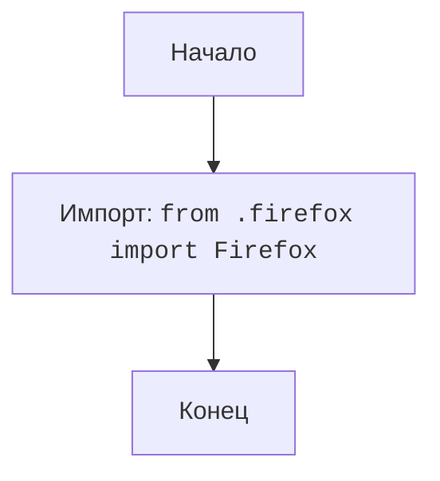

## Анализ кода `src/webdriver/firefox/__init__.py`

### 1. <алгоритм>

1. **Начало**: Запуск интерпретатора Python.
2. **Импорт**:  Выполняется импорт модуля `Firefox` из файла `firefox.py`, находящегося в той же директории.
3. **Завершение**:  Модуль `src.webdriver.firefox` готов к использованию. 

Пример:
```python
# В другом файле, например, src/main.py

from src.webdriver.firefox import Firefox

# Теперь можно использовать класс Firefox, импортированный из src.webdriver.firefox.firefox
driver = Firefox()
driver.get("https://www.example.com")
```
### 2. <mermaid>



**Объяснение диаграммы mermaid:**

- `Start`: Начальная точка процесса.
- `Import_Firefox`:  Импорт класса `Firefox` из модуля `firefox.py`, расположенного в той же директории. 
- `End`: Конечная точка процесса.

### 3. <объяснение>

**Импорты:**

- `from .firefox import Firefox`: 
  -  Этот импорт выполняет следующее: он импортирует класс `Firefox` из модуля `firefox.py`, находящегося в той же директории, что и `__init__.py`. Это позволяет использовать класс `Firefox` напрямую через `src.webdriver.firefox.Firefox`.
  -  `.` (точка) в `from .firefox` указывает на то, что модуль `firefox.py` находится в текущем пакете (то есть в пакете `src.webdriver.firefox`).
  - **Взаимосвязь с другими пакетами `src`**: Этот импорт создает связь между пакетом `src.webdriver.firefox` и модулем `firefox.py`.

**Классы:**

- В данном файле нет определения классов, но он импортирует класс `Firefox`. Класс `Firefox`, как ожидается, будет определен в `firefox.py`.
  - **Роль**: Скорее всего, класс `Firefox` будет отвечать за управление браузером Firefox, включая его запуск, навигацию, и взаимодействие с элементами веб-страницы.
  - **Взаимодействие с другими компонентами проекта**: Он будет взаимодействовать с другими частями проекта, вероятно, через функции и методы, которые будут предоставлять пользовательский интерфейс для Selenium WebDriver.

**Функции:**

- В данном файле нет функций.

**Переменные:**

- В данном файле нет переменных.

**Потенциальные ошибки или области для улучшения:**

- **Отсутствие документации**: Комментарии в заголовке модуля неполные. Стоит дополнить, что данный файл используется для инициализации пакета и что он перенаправляет запросы на класс Firefox, определенный в модуле firefox.py.
- **Скрытие внутренней структуры**: Импорт класса `Firefox` в `__init__.py` делает его доступным напрямую при импорте пакета, что может быть удобно, но скрывает внутреннюю структуру пакета. Это стоит учитывать.

**Цепочка взаимосвязей с другими частями проекта:**

1.  `src/webdriver/firefox/__init__.py` импортирует `src/webdriver/firefox/firefox.py`.
2.  Другие модули в проекте могут импортировать `src.webdriver.firefox.Firefox` для управления браузером Firefox. Например, в файле `src/main.py` или в любом другом модуле, который использует функциональность веб-драйвера.
3.  Предполагается, что `src/webdriver/firefox/firefox.py` будет использовать API Selenium WebDriver и взаимодействовать с исполняемым файлом geckodriver.