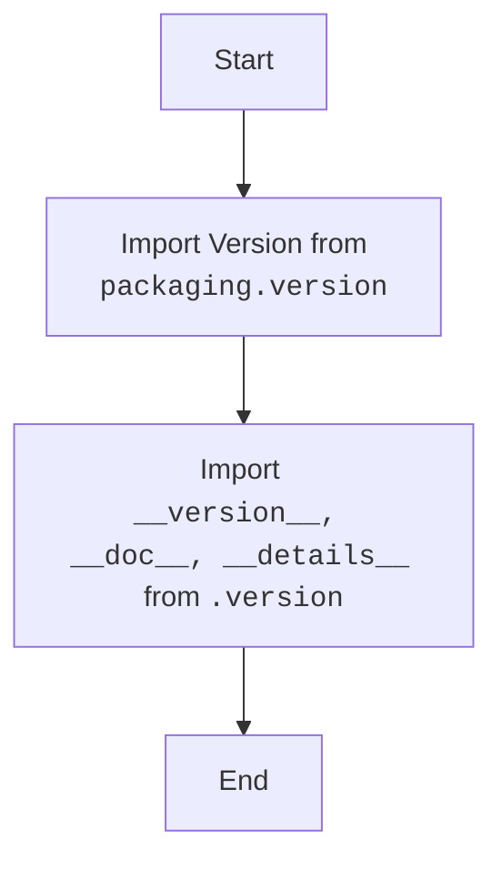

## Анализ кода `hypotez/src/webdriver/firefox/_examples/__init__.py`

### 1. <алгоритм>

1. **Импорт `Version` из `packaging.version`:**
   -  Импортируется класс `Version`, который используется для сравнения и обработки версий программного обеспечения.
   -  Пример: `version = Version("1.2.3")`, `version > Version("1.2.0")` вернет `True`.
2. **Импорт `__version__`, `__doc__`, `__details__` из `.version`:**
   - Импортируются переменные `__version__` (строка, представляющая версию), `__doc__` (строка с документацией) и `__details__` (строка с подробной информацией).
   -  Предположительно, `.version` это другой файл `version.py` в той же директории, в котором эти переменные определены.
   -  Пример: `__version__ = "1.0.0"`, `__doc__ = "Примеры для работы с Firefox"`.
3. **Конец:**
   - Файл выполнил импорт нужных переменных.

### 2. <mermaid>

**Объяснение диаграммы:**

1.  **Start:** Начало процесса.
2.  **ImportVersion:** Импортирует класс `Version` из модуля `packaging.version`. Этот класс используется для управления версиями.
3.  **ImportVersionInfo:** Импортирует переменные `__version__` (версия), `__doc__` (документация), и `__details__` (подробности) из модуля `.version` (предположительно, файла `version.py`). Эти переменные предоставляют информацию о текущей версии и назначении модуля.
4.  **End:** Конец процесса импорта.

### 3. <объяснение>

**Импорты:**

*   `from packaging.version import Version`:
    *   **Назначение:** Импортирует класс `Version` из библиотеки `packaging`. Этот класс предоставляет инструменты для работы с версиями программного обеспечения, позволяя сравнивать их, проверять их на соответствие определенным критериям и т.д.
    *   **Взаимосвязь:** Данный импорт не связан напрямую с другими пакетами `src.`, но обеспечивает функционал для контроля версии данного пакета.
*   `from .version import __version__, __doc__, __details__`:
    *   **Назначение:** Импортирует три переменные: `__version__`, `__doc__` и `__details__` из файла `version.py` находящегося в той же директории.
    *   `__version__`: Содержит строку с номером версии данного пакета. Используется для определения текущей версии.
    *   `__doc__`: Содержит строку с описанием данного пакета. Используется для документации.
    *   `__details__`: Содержит строку с более подробной информацией о пакете. Используется для дополнительной документации.
    *   **Взаимосвязь:**  Импорт является внутренним для пакета `src.webdriver.firefox._examples`, и подразумевается что файл `version.py` присутствует в той же директории.

**Переменные:**

*   `__version__`: Строка, представляющая версию пакета, например, `"1.0.0"`. Используется для отслеживания версий.
*   `__doc__`: Строка, содержащая документацию к модулю. Используется для описания назначения и функционала модуля.
*   `__details__`: Строка, содержащая подробную информацию о модуле. Используется для предоставления более детальной документации.

**Потенциальные ошибки или области для улучшения:**

*   **Отсутствует файл `version.py`**: Код зависит от наличия файла `version.py` в той же директории. Отсутствие этого файла приведет к ошибке `ImportError`.
*   **Недостаточная документация:**  В коде присутствует много пустых строк с комментариями, что затрудняет его понимание. Можно было бы добавить более содержательную документацию в формате docstring.
*   **Отсутствуют примеры:** Файл `__init__.py` в основном служит для инициализации пакета и импорта переменных. Было бы полезно добавить примеры использования, чтобы сделать модуль более понятным для новых пользователей.

**Цепочка взаимосвязей с другими частями проекта:**

1.  `__init__.py`  в пакете `src.webdriver.firefox._examples` служит для обозначения пакета и импорта необходимых переменных.
2.  Этот файл  использует `version.py` (который должен существовать в той же директории).
3.  Класс `Version` из `packaging.version` используется для управления версиями пакета.
4.  Этот пакет может быть частью более крупной структуры, которая использует эти переменные для управления версиями и документацией.