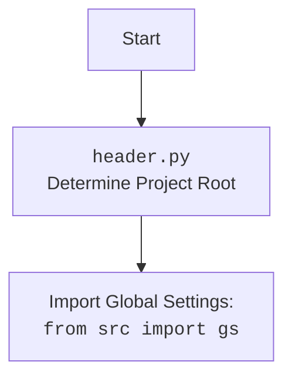

## ИНСТРУКЦИЯ:

Анализируй предоставленный код подробно и объясни его функциональность. Ответ должен включать три раздела:

1.  **<алгоритм>**: Опиши рабочий процесс в виде пошаговой блок-схемы, включая примеры для каждого логического блока, и проиллюстрируй поток данных между функциями, классами или методами.
2.  **<mermaid>**: Напиши код для диаграммы в формате `mermaid`, проанализируй и объясни все зависимости,
    которые импортируются при создании диаграммы.
    **ВАЖНО!** Убедитесь, что все имена переменных, используемые в диаграмме `mermaid`,
    имеют осмысленные и описательные имена. Имена переменных вроде `A`, `B`, `C`, и т.д., не допускаются!

    **Дополнительно**: Если в коде есть импорт `import header`, добавьте блок `mermaid` flowchart, объясняющий `header.py`:
    ```mermaid
    flowchart TD
        Start --> Header[<code>header.py</code><br> Determine Project Root]

        Header --> import[Import Global Settings: <br><code>from src import gs</code>]
    ```

3.  **<объяснение>**: Предоставьте подробные объяснения:
    -   **Импорты**: Их назначение и взаимосвязь с другими пакетами `src.`.
    -   **Классы**: Их роль, атрибуты, методы и взаимодействие с другими компонентами проекта.
    -   **Функции**: Их аргументы, возвращаемые значения, назначение и примеры.
    -   **Переменные**: Их типы и использование.
    -   Выделите потенциальные ошибки или области для улучшения.

Дополнительно, постройте цепочку взаимосвязей с другими частями проекта (если применимо).

Это обеспечивает всесторонний и структурированный анализ кода.
## Формат ответа: `.md` (markdown)
**КОНЕЦ ИНСТРУКЦИИ**

```markdown
## <алгоритм>

**Блок-схема работы класса `Firefox`:**

1. **Инициализация (`__init__`)**:
   - Загружаются настройки из `firefox.json`.
     - Пример: `settings = j_loads_ns(Path(gs.path.src / 'webdriver' / 'firefox' / 'firefox.json'))`
   - Определяются пути к `geckodriver` и бинарнику Firefox.
     - Пример: `geckodriver_path = str(Path(gs.path.root, settings.executable_path.geckodriver))`
   - Инициализируется сервис `geckodriver`.
     - Пример: `service = Service(geckodriver_path)`
   - Создается объект `Options` для настройки Firefox.
     - Пример: `options_obj = Options()`
   - Добавляются опции из файла настроек.
     - Пример: `options_obj.add_argument(option)`
   - Устанавливается режим окна (киоск, без окна) из конфига или параметров.
     - Пример: `options_obj.add_argument("--kiosk")`
   - Добавляются опции, переданные при инициализации.
     - Пример: `options_obj.add_argument(option)`
   - Устанавливается пользовательский агент.
     - Пример: `options_obj.set_preference('general.useragent.override', user_agent)`
   - Вызывается `set_proxy`, если прокси включены в настройках.
     - Пример: `self.set_proxy(options_obj)`
   - Определяется путь к директории профиля.
     - Пример: `profile_directory = str(Path(profile_directory).parent / profile_name)`
   - Создается профиль Firefox.
     - Пример: `profile = FirefoxProfile(profile_directory=profile_directory)`
   - Инициализируется `webdriver.Firefox` с заданными настройками.
     - Пример: `super().__init__(service=service, options=options_obj)`
   - Вызывается метод `_payload()` для настройки дополнительных параметров.
     - Пример: `self._payload()`
   - Обработка возможных ошибок при запуске.
     - Пример: `except WebDriverException as ex:`

2. **Настройка прокси (`set_proxy`)**:
   - Получается словарь прокси из `get_proxies_dict()`.
     - Пример: `proxies_dict = get_proxies_dict()`
   - Создается список всех прокси.
     - Пример: `all_proxies = proxies_dict.get('socks4', []) + proxies_dict.get('socks5', [])`
   - Проверяются прокси в случайном порядке с помощью `check_proxy()`.
     - Пример: `if check_proxy(proxy):`
   - Настраиваются прокси в `options` в зависимости от протокола (`http`, `socks4`, `socks5`).
     - Пример: `options.set_preference('network.proxy.type', 1)`

3. **Загрузка исполнителей (`_payload`)**:
   - Создается экземпляр класса `JavaScript`.
     - Пример: `j = JavaScript(self)`
   - Получаются функции `JavaScript` и добавляются в атрибуты класса `Firefox`.
     - Пример: `self.get_page_lang = j.get_page_lang`
   - Создается экземпляр класса `ExecuteLocator`.
     - Пример: `execute_locator = ExecuteLocator(self)`
   - Получаются функции `ExecuteLocator` и добавляются в атрибуты класса `Firefox`.
     - Пример: `self.execute_locator = execute_locator.execute_locator`

**Поток данных:**

-   Настройки из `firefox.json` → `Firefox.__init__`
-   `proxy_file_path` (если есть) → `get_proxies_dict` → `Firefox.set_proxy`
-   Объект `Options` → `Firefox.__init__` → `webdriver.Firefox`
-   Объект `Firefox` → `ExecuteLocator`, `JavaScript`
-   Функции из `ExecuteLocator` и `JavaScript` -> атрибуты объекта `Firefox`

## <mermaid>

```mermaid
flowchart TD
    subgraph Firefox Class
        Init[Firefox.__init__]
        SetProxy[Firefox.set_proxy]
        Payload[Firefox._payload]
    end

    subgraph Settings Loading
        LoadSettings[j_loads_ns(firefox.json)]
        GetPaths[Determine geckodriver and firefox binary paths]
    end

    subgraph WebDriver Setup
        ServiceInit[Service(geckodriver_path)]
        OptionsInit[Options()]
        SetOptionsFromConfig[Add options from settings.options]
        SetWindowMode[Set window mode (kiosk, headless)]
        SetOptionsFromParams[Add options from init params]
        SetHeaders[Set headers from settings.headers]
        SetUserAgent[Set user agent]
        SetProxyCall[Call Firefox.set_proxy if enabled]
        SetProfileDir[Set profile directory]
        ProfileInit[FirefoxProfile(profile_directory)]
        WebDriverInit[super().__init__]
        ExecutePayload[Call Firefox._payload]
    end

     subgraph Proxy Setting
        GetProxyDict[get_proxies_dict()]
        CreateAllProxiesList[Create all proxies list]
        CheckProxies[Check proxies with check_proxy()]
        SetProxyOptions[Set proxy options (http, socks4, socks5)]
    end

    subgraph ExecuteLocator Setup
        CreateExecuteLocator[execute_locator = ExecuteLocator(self)]
        SetExecuteLocatorFunctions[Set execute locator functions to self]
    end

    subgraph Javascript Setup
        CreateJavaScript[j = JavaScript(self)]
        SetJavascriptFunctions[Set javascript functions to self]
    end
    Start --> LoadSettings
    LoadSettings --> GetPaths
    GetPaths --> Init
    Init --> ServiceInit
    Init --> OptionsInit
    OptionsInit --> SetOptionsFromConfig
    SetOptionsFromConfig --> SetWindowMode
    SetWindowMode --> SetOptionsFromParams
    SetOptionsFromParams --> SetHeaders
    SetHeaders --> SetUserAgent
    SetUserAgent --> SetProxyCall
    SetProxyCall --> SetProxy
    SetProxyCall -- Proxy not enabled --> SetProfileDir
    SetProxy --> GetProxyDict
    GetProxyDict --> CreateAllProxiesList
    CreateAllProxiesList --> CheckProxies
    CheckProxies --> SetProxyOptions
    SetProxyOptions --> SetProfileDir
    SetProfileDir --> ProfileInit
    ProfileInit --> WebDriverInit
    WebDriverInit --> ExecutePayload
    ExecutePayload --> CreateJavaScript
    CreateJavaScript --> SetJavascriptFunctions
    ExecutePayload --> CreateExecuteLocator
    CreateExecuteLocator --> SetExecuteLocatorFunctions
```


### Анализ зависимостей:

*   **Firefox Class:**
    *   `Init`: Инициализация класса, получение параметров, создание сервиса, настройка опций.
    *   `SetProxy`: Настройка прокси для Firefox, вызов `get_proxies_dict` для получения списка прокси.
    *  `Payload`:  Загрузка `JavaScript` и `ExecuteLocator` в атрибуты `self`.

*   **Settings Loading:**
    *   `LoadSettings`: Загружает настройки из `firefox.json` с помощью `j_loads_ns`.
    *   `GetPaths`: Определяет пути к исполняемым файлам `geckodriver` и бинарнику `firefox`

*   **WebDriver Setup:**
    *   `ServiceInit`: Инициализирует `webdriver.firefox.service.Service`.
    *   `OptionsInit`: Инициализирует `webdriver.firefox.options.Options`.
    *   `SetOptionsFromConfig`: Применяет опции из файла конфигурации.
    *   `SetWindowMode`: Устанавливает режим окна браузера (киоск, без окна).
    *   `SetOptionsFromParams`: Применяет опции переданные при инициализации.
    *  `SetHeaders`: Устанавливает пользовательские заголовки.
    *   `SetUserAgent`: Устанавливает пользовательский агент браузера.
    *   `SetProxyCall`: Определяет, нужно ли вызывать `set_proxy`.
    *   `SetProfileDir`: Устанавливает директорию профиля Firefox.
    *   `ProfileInit`: Инициализирует профиль Firefox (`webdriver.firefox.firefox_profile.FirefoxProfile`).
    *   `WebDriverInit`: Инициализирует WebDriver (`super().__init__`).
    *    `ExecutePayload`: Вызывает метод `_payload`.

*   **Proxy Setting:**
    *   `GetProxyDict`: Получает словарь прокси из `src.webdriver.proxy`.
    *   `CreateAllProxiesList`: Объединяет все прокси в один список.
    *   `CheckProxies`: Проверяет работоспособность прокси с помощью `src.webdriver.proxy.check_proxy`.
    *   `SetProxyOptions`: Устанавливает настройки прокси для `webdriver.firefox.options.Options`.

*   **ExecuteLocator Setup:**
    *   `CreateExecuteLocator`: Создает экземпляр `src.webdriver.executor.ExecuteLocator`.
    *   `SetExecuteLocatorFunctions`: Устанавливает функции из `ExecuteLocator` в атрибуты `self`.

*   **Javascript Setup:**
    *   `CreateJavaScript`: Создает экземпляр `src.webdriver.js.JavaScript`.
    *   `SetJavascriptFunctions`: Устанавливает функции из `JavaScript` в атрибуты `self`.

## <объяснение>

**Импорты:**

*   `os`: Работа с операционной системой, например, для доступа к переменным среды (`os.environ.get`).
*   `random`:  Генерация случайных чисел (используется для перемешивания списка прокси).
*   `pathlib.Path`: Работа с путями к файлам и директориям.
*   `typing.Optional, typing.List`:  Для аннотации типов, указывает, что переменная может быть `None` или списком.
*   `selenium.webdriver.Firefox`: Базовый класс WebDriver для Firefox.
*   `selenium.webdriver.firefox.options.Options`: Настройки для запуска Firefox.
*   `selenium.webdriver.firefox.service.Service`:  Сервис для управления geckodriver.
*   `selenium.webdriver.firefox.firefox_profile.FirefoxProfile`:  Работа с профилями Firefox.
*   `selenium.common.exceptions.WebDriverException`: Исключения, возникающие при работе с WebDriver.
*   `src.gs`:  Глобальные настройки проекта.
*   `src.webdriver.executor.ExecuteLocator`: Класс для выполнения действий с локаторами.
*   `src.webdriver.js.JavaScript`:  Класс для выполнения JavaScript.
*   `src.webdriver.proxy`: Модуль для работы с прокси.
*   `src.utils.jjson.j_loads_ns`: Загрузка JSON из файла с поддержкой namespace.
*   `src.logger.logger.logger`: Логгер.
*   `fake_useragent.UserAgent`:  Генератор случайных user agent.
*   `header`: Модуль `header.py`, который определяет корневую директорию проекта.

**Класс `Firefox`:**

*   **Роль:** Расширение `selenium.webdriver.Firefox` с добавлением функциональности настройки профиля, прокси, режимов окна, пользовательских настроек.
*   **Атрибуты:**
    *   `driver_name`: Имя драйвера (статический атрибут).
    *   `self.get_page_lang`, `self.ready_state`, `self.get_referrer`, `self.unhide_DOM_element`, `self.window_focus`: Функции, полученные из `src.webdriver.js.JavaScript`.
    *   `self.execute_locator`, `self.get_webelement_as_screenshot`, `self.get_webelement_by_locator`, `self.get_attribute_by_locator`, `self.send_message`, `self.send_key_to_webelement`: Функции, полученные из `src.webdriver.executor.ExecuteLocator`.
*   **Методы:**
    *   `__init__`: Конструктор класса, настраивает драйвер.
    *   `set_proxy`: Настраивает прокси для Firefox.
    *   `_payload`:  Загружает исполнителей для локаторов и JavaScript сценариев.

**Функции:**

*   `__init__(self, profile_name, geckodriver_version, firefox_version, user_agent, proxy_file_path, options, window_mode, *args, **kwargs)`:
    *   **Аргументы:**
        *   `profile_name`: Имя профиля Firefox.
        *   `geckodriver_version`: Версия geckodriver.
        *   `firefox_version`: Версия Firefox.
        *   `user_agent`: Пользовательский агент.
        *   `proxy_file_path`: Путь к файлу прокси.
        *   `options`: Список дополнительных опций.
        *   `window_mode`: Режим окна.
        *   `*args`, `**kwargs`:  Дополнительные аргументы.
    *   **Возвращает**: `None`.
    *   **Назначение**: Инициализирует драйвер Firefox с заданными параметрами, обрабатывает ошибки запуска.
    *   **Пример**:
        ```python
            browser = Firefox(
                profile_name="custom_profile",
                geckodriver_version="v0.29.0",
                firefox_version="78.0",
                proxy_file_path="path/to/proxies.txt",
                window_mode='kiosk'
            )
        ```
*   `set_proxy(self, options: Options)`:
    *   **Аргументы:**
        *   `options`: Экземпляр `selenium.webdriver.firefox.options.Options`.
    *   **Возвращает**: `None`.
    *   **Назначение**: Настраивает прокси в Firefox.
    *   **Пример**: `self.set_proxy(options_obj)`
*  `_payload(self)`:
    *  **Аргументы**: `None`.
    *  **Возвращает**: `None`.
    *  **Назначение**: Инициализирует `JavaScript` и `ExecuteLocator` и устанавливает их функции в качестве атрибутов `self`.

**Переменные:**

*   `settings`:  Настройки из `firefox.json`.
*   `geckodriver_path`, `firefox_binary_path`: Пути к geckodriver и бинарнику Firefox.
*   `service`: Сервис для управления geckodriver (`selenium.webdriver.firefox.service.Service`).
*   `options_obj`: Настройки Firefox (`selenium.webdriver.firefox.options.Options`).
*   `profile_directory`: Путь к директории профиля.
*   `profile`:  Профиль Firefox (`selenium.webdriver.firefox.firefox_profile.FirefoxProfile`).
*   `user_agent`: Пользовательский агент браузера.
*   `proxies_dict`:  Словарь прокси из `src.webdriver.proxy`.
*   `all_proxies`: Список всех прокси.
*   `working_proxy`:  Рабочий прокси.
*   `protocol`: Тип протокола прокси (`http`, `socks4`, `socks5`).

**Потенциальные ошибки и области для улучшения:**

*   **Обработка ошибок:**
    *   Текущая обработка ошибок WebDriverException и Exception  происходит путём логгирования и явного возврата, но дальнейшая обработка не предусмотрена,  что может вызвать проблемы в вызывающем коде.  Необходимо рассмотреть возможность проброса исключения или более детальной обработки ошибок.
    *   Проверка на существование файлов `geckodriver`, `firefox_binary`, `proxy_file_path` и `firefox.json`, а так же корректность их содержимого перед выполнением основных действий не производится.
    *   Отсутствует обработка ошибки если ни один прокси не подошёл (цикл `for` завершился без `break`).
*   **Прокси:**
    *   Выбор прокси происходит в случайном порядке, что не всегда оптимально.
    *   Не реализована поддержка аутентификации для прокси.
    *   Нет механизма повторной проверки прокси при возникновении сбоев.
*   **Настройки:**
    *   Зависимость от структуры `firefox.json` может привести к ошибкам, если файл будет изменён некорректно.
    *   Логика выбора и переопределения настроек может стать сложной при увеличении их количества.
*   **Общее:**
    *   При большом количестве вызовов `options_obj.add_argument` код станет менее читабельным, рассмотреть возможность вынесения логики настроек в отдельный класс.
    *   Код использует явный `return` в блоках `except`. Рассмотреть возможность использования `finally` для освобождения ресурсов в случае возникновения ошибки.
    *   Дублирование кода `options.set_preference` для разных протоколов можно вынести в отдельную функцию.

**Взаимосвязи с другими частями проекта:**

*   `src.gs`: Используется для получения глобальных настроек и путей к файлам.
*   `src.webdriver.executor`: Используется для выполнения действий с локаторами.
*   `src.webdriver.js`: Используется для выполнения JavaScript кода.
*   `src.webdriver.proxy`: Используется для работы с прокси.
*   `src.utils.jjson`: Используется для загрузки JSON.
*   `src.logger.logger`: Используется для логирования.
*  `header.py`: Используется для определения корневой директории проекта.

Этот код представляет собой расширение стандартного `selenium.webdriver.Firefox`, которое добавляет пользовательские настройки, прокси, и режимы работы. Он  связан с другими частями проекта, в частности `src`, для получения настроек, выполнения действий и работы с прокси. Для дальнейшего улучшения следует рассмотреть возможные проблемы, описанные выше.
```