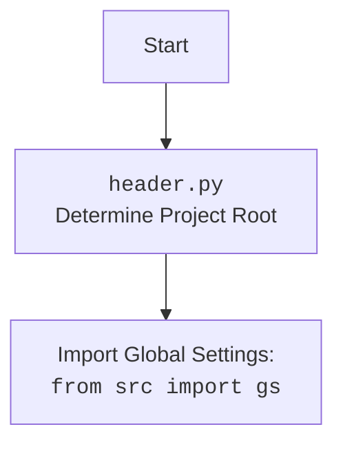

## ИНСТРУКЦИЯ:

Анализируй предоставленный код подробно и объясни его функциональность. Ответ должен включать три раздела:

1.  **<алгоритм>**: Опиши рабочий процесс в виде пошаговой блок-схемы, включая примеры для каждого логического блока, и проиллюстрируй поток данных между функциями, классами или методами.
2.  **<mermaid>**: Напиши код для диаграммы в формате `mermaid`, проанализируй и объясни все зависимости,
    которые импортируются при создании диаграммы.
    **ВАЖНО!** Убедитесь, что все имена переменных, используемые в диаграмме `mermaid`,
    имеют осмысленные и описательные имена. Имена переменных вроде `A`, `B`, `C`, и т.д., не допускаются!

    **Дополнительно**: Если в коде есть импорт `import header`, добавьте блок `mermaid` flowchart, объясняющий `header.py`:\
    ```mermaid
    flowchart TD
        Start --> Header[<code>header.py</code><br> Determine Project Root]

        Header --> import[Import Global Settings: <br><code>from src import gs</code>]
    ```

3.  **<объяснение>**: Предоставьте подробные объяснения:
    *   **Импорты**: Их назначение и взаимосвязь с другими пакетами `src.`.
    *   **Классы**: Их роль, атрибуты, методы и взаимодействие с другими компонентами проекта.
    *   **Функции**: Их аргументы, возвращаемые значения, назначение и примеры.
    *   **Переменные**: Их типы и использование.
    *   Выделите потенциальные ошибки или области для улучшения.

Дополнительно, постройте цепочку взаимосвязей с другими частями проекта (если применимо).

Это обеспечивает всесторонний и структурированный анализ кода.
## Формат ответа: `.md` (markdown)
**КОНЕЦ ИНСТРУКЦИИ**

## <алгоритм>

1.  **Начало:**
    *   Скрипт начинает выполнение.
    *   Импортируются необходимые модули: `sys`, `json`, `Version` из `packaging.version`, `Path` из `pathlib`.

2.  **Определение корневой директории проекта (`set_project_root`)**:
    *   Функция `set_project_root` вызывается без аргументов (используются значения по умолчанию `marker_files`).
    *   Определяется текущая директория, где находится файл (`current_path`).
    *   Инициализируется переменная `__root__` текущей директорией.
    *   Проверяются родительские директории, начиная с текущей, на наличие файлов или директорий `__root__` или `.git`.
        *   **Пример**: Если `current_path` это `/home/user/project/src/webdriver/firefox`, то проверяются: `/home/user/project/src/webdriver/firefox`, `/home/user/project/src/webdriver`, `/home/user/project/src`, `/home/user/project`, `/home/user`, `/home`, `/`.
    *   Если один из маркеров найден, `__root__` обновляется до этой директории, цикл завершается.
    *   Если `__root__` не находится в `sys.path`, она добавляется в начало.
    *   Функция возвращает путь к корневой директории проекта `__root__`.
        *   **Пример**: Пусть проект расположен в `/home/user/project` и в этой директории есть файл `.git`. Тогда функция вернет `/home/user/project`.

3.  **Сохранение корня проекта в глобальную переменную**:
    *   Результат функции `set_project_root` сохраняется в глобальной переменной `__root__`.

4.  **Импорт настроек:**
    *   Импортируется модуль `gs` из пакета `src`. (Предполагается, что `gs` содержит информацию о путях проекта).
    *   Предпринимается попытка загрузить `settings.json` из директории проекта.
        *   **Пример**: Если `__root__` это `/home/user/project`, то читается файл `/home/user/project/src/settings.json`.
    *   Если файл не найден или его не удается прочитать, обработка ошибок происходит без дальнейших действий.

5.  **Чтение документации:**
    *   Предпринимается попытка загрузить `README.MD` из директории проекта.
        *    **Пример**: Если `__root__` это `/home/user/project`, то читается файл `/home/user/project/src/README.MD`.
    *   Если файл не найден или его не удается прочитать, обработка ошибок происходит без дальнейших действий.

6.  **Инициализация глобальных переменных:**
    *   Глобальные переменные `__project_name__`, `__version__`, `__doc__`, `__details__`, `__author__`, `__copyright__`, `__cofee__` инициализируются, используя данные из `settings`, или значения по умолчанию.
        *   `__project_name__` устанавливается в "hypotez", если параметр не указан.
        *   `__version__` устанавливается в пустую строку, если параметр не указан.
        *   `__doc__` устанавливается в содержимое файла `README.MD`, если параметр не указан.
        *   `__author__` устанавливается в пустую строку, если параметр не указан.
        *   `__copyright__` устанавливается в пустую строку, если параметр не указан.
        *   `__cofee__` устанавливается в строку по умолчанию, если параметр не указан.

7.  **Конец:**
    *   Скрипт завершает выполнение, устанавливая глобальные переменные для дальнейшего использования в проекте.

## <mermaid>

```mermaid
flowchart TD
    Start --> FindProjectRoot[<code>set_project_root()</code><br> Find project root directory]
    FindProjectRoot --> SetRootPath[Set <code>__root__</code> and add to sys.path]

    SetRootPath --> ImportGS[Import Global Settings: <br><code>from src import gs</code>]
    ImportGS --> LoadSettings[Load settings from <br> <code>settings.json</code>]
    LoadSettings --> LoadReadme[Load documentation from <br> <code>README.MD</code>]

    LoadReadme --> InitVariables[Initialize global variables: <br> <code>__project_name__</code>, <code>__version__</code>, etc.]
    InitVariables --> End
```



## <объяснение>

### Импорты:

*   **`sys`**: Модуль `sys` используется для взаимодействия с интерпретатором Python, в частности, для добавления пути к корневой директории проекта в `sys.path`, что позволяет импортировать модули из этой директории.
*   **`json`**: Модуль `json` используется для работы с JSON файлами, в данном случае для загрузки файла `settings.json`, который содержит настройки проекта.
*   **`packaging.version.Version`**:  Модуль используется для сравнения версий, но в данном скрипте не используется.
*   **`pathlib.Path`**: Класс `Path` используется для представления путей к файлам и директориям, что делает работу с путями более удобной и кроссплатформенной.

### Функции:

*   **`set_project_root(marker_files=('__root__', '.git')) -> Path`**:
    *   **Аргументы**:
        *   `marker_files`: кортеж строк, содержащих имена файлов или каталогов, которые используются для определения корневого каталога проекта. По умолчанию `('__root__', '.git')`.
    *   **Возвращаемое значение**: Объект `Path`, представляющий путь к корневому каталогу проекта.
    *   **Назначение**:
        *   Функция предназначена для автоматического определения корневой директории проекта, что позволяет избежать жестко заданных путей.
        *   Функция поднимается по дереву директорий, пока не найдет один из маркеров, что позволяет запускать скрипты из любой точки проекта.
    *   **Пример**: Если текущий файл находится в `project/src/webdriver/firefox/header.py`, и в директории `project` есть файл `.git`, то функция вернет путь к директории `project`.

### Переменные:

*   **`__root__`**: Глобальная переменная типа `Path`, содержащая путь к корневой директории проекта.
*   **`settings`**: Глобальная переменная типа `dict`, содержащая загруженные настройки из файла `settings.json`. Может быть `None`, если файл не удалось загрузить.
*  **`doc_str`**: Глобальная переменная типа `str`, содержащая загруженное содержимое из файла `README.MD`. Может быть `None`, если файл не удалось загрузить.
*   **`__project_name__`**: Глобальная переменная типа `str`, содержащая имя проекта. Значение по умолчанию "hypotez".
*   **`__version__`**: Глобальная переменная типа `str`, содержащая версию проекта. Значение по умолчанию "".
*   **`__doc__`**: Глобальная переменная типа `str`, содержащая документацию проекта. Значение по умолчанию "".
*  **`__details__`**: Глобальная переменная типа `str`, не используется в текущем коде, установлена в пустую строку
*   **`__author__`**: Глобальная переменная типа `str`, содержащая автора проекта. Значение по умолчанию "".
*   **`__copyright__`**: Глобальная переменная типа `str`, содержащая информацию о авторских правах. Значение по умолчанию "".
*   **`__cofee__`**: Глобальная переменная типа `str`, содержащая текст о том, как угостить разработчика кофе.

### Взаимосвязь с другими частями проекта:

*   **`src.gs`**: Предполагается, что `src.gs` содержит глобальные настройки проекта и, в частности, пути к файлам и директориям. `header.py` использует `gs.path.root` для получения пути к корневой директории проекта. Таким образом, `header.py` зависит от `src.gs`.
*   **`settings.json`**: Файл `settings.json` содержит метаданные проекта, которые используются для заполнения глобальных переменных.

### Потенциальные ошибки и области для улучшения:

*   **Обработка ошибок**: Обработка ошибок при чтении файлов `settings.json` и `README.MD` происходит тихо, без вывода предупреждения. Это может затруднить отладку.
*   **Зависимость от `src.gs`**: Код зависит от существования `src.gs`.
*   **Повторное чтение файлов**: `settings.json` и `README.MD` читаются каждый раз при выполнении этого скрипта. Можно добавить кеширование результатов, для оптимизации.
*   **Установка глобальных переменных**: Использование глобальных переменных может затруднить тестирование и поддержку кода. Возможно, стоит использовать конфигурационные классы или паттерны для хранения этих данных.
*   **Отсутствие проверки маркеров**: Можно добавить возможность передавать маркеры как аргументы командной строки, для гибкости использования.