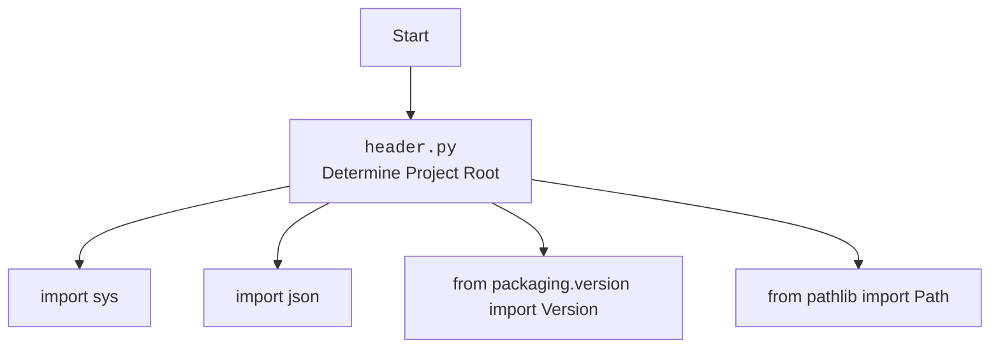

## АНАЛИЗ КОДА: `hypotez/src/webdriver/header.py`

### 1. <алгоритм>

**Блок-схема алгоритма `set_project_root`:**

1.  **Начало**: Функция `set_project_root` вызывается со списком файлов-маркеров (по умолчанию `__root__` и `.git`).
2.  **Инициализация**:
    *   `current_path` устанавливается как абсолютный путь к директории, в которой находится текущий файл (`header.py`).
    *   `__root__` инициализируется как `current_path`.
3.  **Поиск родительских директорий**:
    *   Цикл перебирает текущую директорию и все ее родительские директории.
    *   Для каждой родительской директории проверяется, содержит ли она какой-либо из файлов-маркеров.
4.  **Проверка файлов-маркеров**:
    *   Если хотя бы один из файлов-маркеров найден в текущей родительской директории, `__root__` обновляется до этой родительской директории, и цикл прерывается.
5.  **Обновление `sys.path`**:
    *   Если `__root__` отсутствует в `sys.path`, он добавляется в начало `sys.path`.
6.  **Возврат**: Функция возвращает `__root__`.

**Примеры:**

*   **Пример 1**: Если файл `__root__` находится в родительской директории, `__root__` будет установлен в эту родительскую директорию.
*   **Пример 2**: Если файл `.git` находится в текущей директории, `__root__` останется равным текущей директории.
*   **Пример 3**: Если ни один из файлов-маркеров не найден, `__root__` останется равным директории, в которой находится файл `header.py`.

**Поток данных:**

```mermaid
flowchart TD
    A[Начало: set_project_root(marker_files)] --> B{Инициализация: current_path = Path(__file__).resolve().parent; __root__ = current_path}
    B --> C{Цикл: для каждой parent in [current_path] + list(current_path.parents)}
    C --> D{Проверка: any((parent / marker).exists() for marker in marker_files)}
    D -- Да --> E{__root__ = parent; break}
    D -- Нет --> C
    C --> F{__root__ not in sys.path}
    F -- Да --> G{sys.path.insert(0, str(__root__))}
    F -- Нет --> H[Возврат: __root__]
    E --> F
    G --> H
    H --> I[Конец]
```

### 2. <mermaid>



**Объяснение зависимостей:**

*   `sys`: Этот модуль предоставляет доступ к некоторым переменным и функциям, взаимодействующим с интерпретатором Python. Здесь он используется для добавления корневой директории проекта в `sys.path`, чтобы можно было импортировать модули из этой директории.
*   `json`: Этот модуль предоставляет функции для работы с данными в формате JSON. В данном коде он не используется, но импортирован.
*   `packaging.version`: Из этого модуля импортируется класс `Version`, предназначенный для сравнения версий программного обеспечения. В данном коде он не используется, но импортирован.
*   `pathlib`: Этот модуль предоставляет классы для работы с путями к файлам и директориям. Здесь он используется для определения пути к текущему файлу и поиска корневой директории проекта.

### 3. <объяснение>

**Импорты:**

*   `sys`: Используется для модификации `sys.path` для добавления корневой директории проекта, что позволяет импортировать модули из этой директории.
*   `json`: Импортируется, но не используется в предоставленном коде. Возможно, планируется использование в будущем.
*   `packaging.version`: Импортируется `Version` из `packaging.version`, но не используется в предоставленном коде. Вероятно, планируется использование для сравнения версий.
*   `pathlib`: Используется для работы с путями к файлам и директориям, в частности, для определения пути к текущему файлу и поиска корневой директории проекта.

**Функции:**

*   `set_project_root(marker_files: tuple[str, ...]=('__root__', '.git')) -> Path`:
    *   **Аргументы**:
        *   `marker_files` (tuple): Кортеж имен файлов или директорий, которые используются для идентификации корневой директории проекта. По умолчанию `('__root__', '.git')`.
    *   **Возвращаемое значение**:
        *   `Path`: Путь к корневой директории проекта. Если ни один из файлов-маркеров не найден, возвращается директория, в которой находится скрипт.
    *   **Назначение**:
        *   Функция определяет корневую директорию проекта, начиная с директории текущего файла и двигаясь вверх по иерархии директорий. Поиск останавливается, когда найдена директория, содержащая хотя бы один из файлов-маркеров. Затем корневая директория добавляется в `sys.path`, если ее там еще нет.
    *   **Пример**:

    ```python
    from pathlib import Path
    
    # Создаем фиктивные файлы и директории для примера
    Path("./test_dir").mkdir(exist_ok=True)
    Path("./test_dir/__root__").touch()
    
    # Вызываем функцию set_project_root
    root_path = set_project_root()
    
    # Выводим результат
    print(root_path)  # Вывод: Path к директории, содержащей '__root__'
    
    # Удаляем созданные файлы и директории
    Path("./test_dir/__root__").unlink()
    Path("./test_dir").rmdir()
    ```

**Переменные:**

*   `__root__`:
    *   **Тип**: `Path`
    *   **Использование**: Хранит путь к корневой директории проекта. Инициализируется функцией `set_project_root`.

**Потенциальные ошибки и области для улучшения:**

*   Импорты `json` и `Version` не используются в предоставленном коде. Их следует удалить, если они не планируются к использованию.
*   Обработка исключений отсутствует. Следует добавить обработку исключений, чтобы код был более надежным.

**Взаимосвязи с другими частями проекта:**

*   `__root__`, полученный в этом модуле, используется как глобальная переменная для определения путей к другим частям проекта. Это позволяет легко ссылаться на файлы конфигурации, данные и другие ресурсы проекта.
*   Модуль `sys` используется для добавления корневой директории проекта в список путей поиска модулей. Это позволяет импортировать модули из других частей проекта, используя относительные пути.