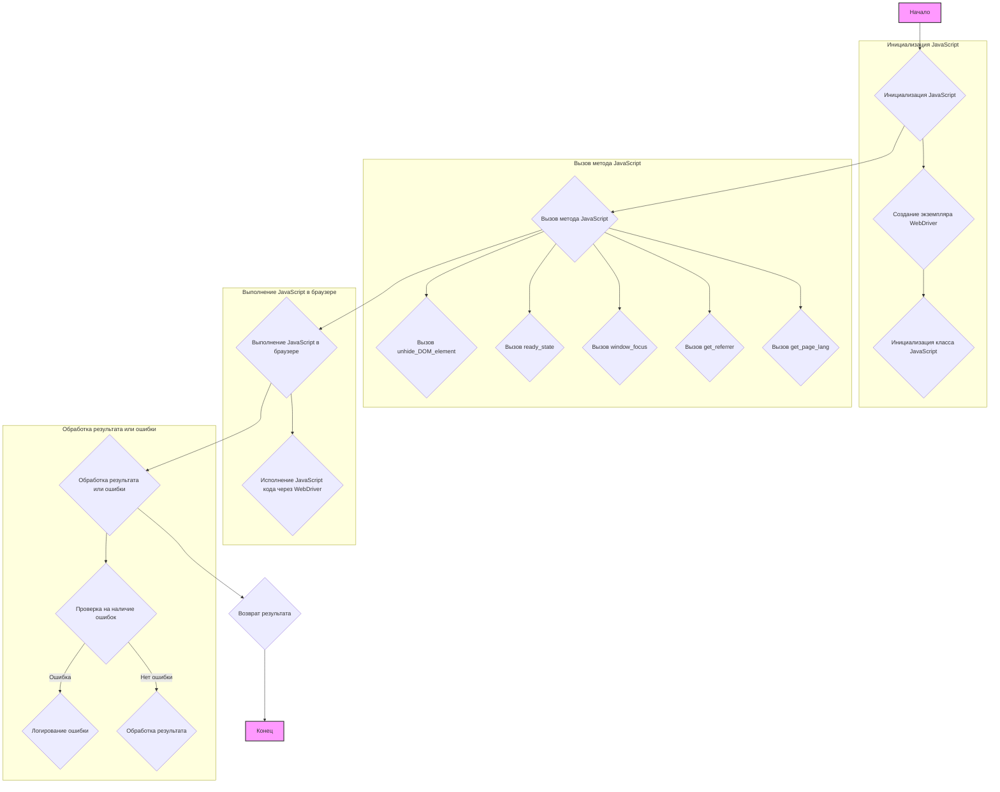
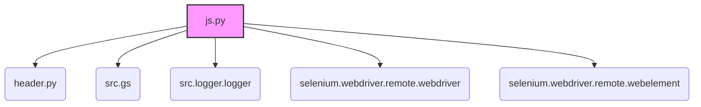
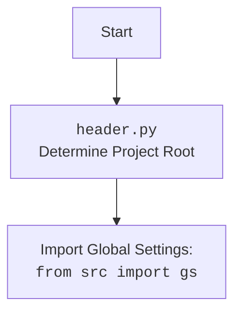

## Анализ кода `hypotez/src/webdriver/js.py`

### 1. <алгоритм>

#### **Блок-схема рабочего процесса модуля `js.py`**



**Примеры для каждого логического блока:**

1.  **Инициализация JavaScript:**

    *   Создание экземпляра `WebDriver`:

        ```python
        from selenium import webdriver
        driver = webdriver.Chrome()
        ```

    *   Инициализация класса `JavaScript`:

        ```python
        from src.webdriver.js import JavaScript
        js_executor = JavaScript(driver)
        ```
2.  **Вызов метода JavaScript:**

    *   Вызов `unhide_DOM_element`:

        ```python
        element = driver.find_element_by_id('hidden_element')
        js_executor.unhide_DOM_element(element)
        ```

    *   Вызов `ready_state`:

        ```python
        ready = js_executor.ready_state
        print(ready)
        ```

    *   Вызов `window_focus`:

        ```python
        js_executor.window_focus()
        ```

    *   Вызов `get_referrer`:

        ```python
        referrer = js_executor.get_referrer()
        print(referrer)
        ```

    *   Вызов `get_page_lang`:

        ```python
        page_lang = js_executor.get_page_lang()
        print(page_lang)
        ```
3.  **Выполнение JavaScript в браузере:**

    *   Исполнение JavaScript кода через `WebDriver`:

        ```python
        driver.execute_script("return document.title;")
        ```
4.  **Обработка результата или ошибки:**

    *   Проверка на наличие ошибок:

        ```python
        try:
            result = driver.execute_script("return document.title;")
        except Exception as e:
            print(f"Error: {e}")
        ```

    *   Логирование ошибки:

        ```python
        import logging
        try:
            result = driver.execute_script("return document.title;")
        except Exception as e:
            logging.error(f"Error executing script: {e}")
        ```

    *   Обработка результата:

        ```python
        result = driver.execute_script("return document.title;")
        print(f"Page title: {result}")
        ```
5.  **Возврат результата:**

    *   Возврат значения:

        ```python
        def get_title(driver):
            return driver.execute_script("return document.title;")
        title = get_title(driver)
        ```

#### **Поток данных между функциями, классами или методами:**

1.  Класс `JavaScript` инициализируется с экземпляром `WebDriver`.
2.  Методы класса `JavaScript` (например, `unhide_DOM_element`, `ready_state`) используют `WebDriver` для выполнения JavaScript кода в браузере.
3.  Результаты выполнения JavaScript кода возвращаются из методов класса `JavaScript`.
4.  Ошибки, возникающие при выполнении JavaScript кода, перехватываются и логируются с использованием модуля `logger`.

### 2. <mermaid>

#### **Диаграмма зависимостей в формате `mermaid`**



#### **Объяснение зависимостей:**

*   **`header.py`**: Используется для определения корневого каталога проекта.
*   **`src.gs`**: Импортирует глобальные настройки проекта.
*   **`src.logger.logger`**: Используется для логирования ошибок и отладочной информации.
*   **`selenium.webdriver.remote.webdriver`**: Предоставляет класс `WebDriver` для управления браузером.
*   **`selenium.webdriver.remote.webelement`**: Предоставляет класс `WebElement` для взаимодействия с элементами на веб-странице.

#### **`header.py` flowchart**



### 3. <объяснение>

#### **Импорты:**

*   `import header`: Предположительно, используется для определения корневой директории проекта или для других общих конфигураций.
*   `from src import gs`: Импортирует глобальные настройки из пакета `src`. Это может включать общие переменные, пути или параметры конфигурации, используемые во всем проекте.
*   `from src.logger.logger import logger`: Импортирует объект `logger` для логирования. Это позволяет записывать сообщения об ошибках, предупреждения и отладочную информацию.
*   `from selenium.webdriver.remote.webdriver import WebDriver`: Импортирует класс `WebDriver` из библиотеки Selenium. `WebDriver` является основным классом для управления браузером.
*   `from selenium.webdriver.remote.webelement import WebElement`: Импортирует класс `WebElement` из библиотеки Selenium. `WebElement` представляет собой элемент на веб-странице, с которым можно взаимодействовать.

#### **Классы:**

*   **`JavaScript`**:
    *   **Роль**: Предоставляет набор JavaScript утилит для взаимодействия с веб-страницей через Selenium WebDriver.
    *   **Атрибуты**:
        *   `driver (WebDriver)`: Экземпляр Selenium WebDriver, используемый для выполнения JavaScript кода.
    *   **Методы**:
        *   `__init__(self, driver: WebDriver)`: Конструктор класса, инициализирует объект `JavaScript` с экземпляром `WebDriver`.
        *   `unhide_DOM_element(self, element: WebElement) -> bool`: Делает невидимый DOM элемент видимым, изменяя его CSS свойства.
        *   `ready_state(self) -> str`: Возвращает состояние загрузки документа (`loading` или `complete`).
        *   `window_focus(self) -> None`: Передает фокус браузеру.
        *   `get_referrer(self) -> str`: Возвращает URL страницы-источника.
        *   `get_page_lang(self) -> str`: Возвращает язык текущей страницы.
    *   **Взаимодействие с другими компонентами**:
        *   Использует `WebDriver` для выполнения JavaScript кода в браузере.
        *   Использует `WebElement` для взаимодействия с элементами на веб-странице.
        *   Использует `logger` для логирования ошибок.

#### **Функции:**

*   `unhide_DOM_element(self, element: WebElement) -> bool`:
    *   **Аргументы**:
        *   `element (WebElement)`: DOM элемент, который нужно сделать видимым.
    *   **Возвращаемое значение**:
        *   `bool`: `True`, если выполнение скрипта успешно, `False` в противном случае.
    *   **Назначение**: Изменяет CSS свойства элемента, чтобы сделать его видимым.
    *   **Пример**:

        ```python
        element = driver.find_element_by_id('hidden_element')
        js_executor.unhide_DOM_element(element)
        ```
*   `ready_state(self) -> str`:
    *   **Аргументы**: Нет.
    *   **Возвращаемое значение**:
        *   `str`: Состояние загрузки документа (`loading` или `complete`).
    *   **Назначение**: Возвращает состояние загрузки документа.
    *   **Пример**:

        ```python
        ready = js_executor.ready_state
        print(ready)
        ```
*   `window_focus(self) -> None`:
    *   **Аргументы**: Нет.
    *   **Возвращаемое значение**: Нет.
    *   **Назначение**: Передает фокус браузеру.
    *   **Пример**:

        ```python
        js_executor.window_focus()
        ```
*   `get_referrer(self) -> str`:
    *   **Аргументы**: Нет.
    *   **Возвращаемое значение**:
        *   `str`: URL страницы-источника.
    *   **Назначение**: Возвращает URL страницы-источника.
    *   **Пример**:

        ```python
        referrer = js_executor.get_referrer()
        print(referrer)
        ```
*   `get_page_lang(self) -> str`:
    *   **Аргументы**: Нет.
    *   **Возвращаемое значение**:
        *   `str`: Язык текущей страницы.
    *   **Назначение**: Возвращает язык текущей страницы.
    *   **Пример**:

        ```python
        page_lang = js_executor.get_page_lang()
        print(page_lang)
        ```

#### **Переменные:**

*   `driver (WebDriver)`: Экземпляр `WebDriver`, используемый для управления браузером.
*   `script (str)`: Строка, содержащая JavaScript код для выполнения.
*   `ex (Exception)`: Объект исключения, возникающий при выполнении кода.

#### **Потенциальные ошибки и области для улучшения:**

*   Обработка исключений: В блоках `try...except` логируются ошибки, но не предпринимается никаких действий для их обработки. В зависимости от ситуации, может потребоваться повторная попытка выполнения операции или завершение работы программы.
*   Улучшение `unhide_DOM_element`: Скрипт `unhide_DOM_element` можно улучшить, добавив проверку, что элемент действительно невидим перед изменением его свойств.
*   Обработка `None` значений: В методах `get_referrer` и `get_page_lang` возвращается пустая строка, если значение отсутствует. Можно возвращать `None` вместо пустой строки.
*   Использование `j_loads` или `j_loads_ns`:  В данном коде отсутствуют операции чтения JSON или конфигурационных файлов, поэтому применение `j_loads` или `j_loads_ns` не требуется.

#### **Цепочка взаимосвязей с другими частями проекта:**

1.  Модуль `js.py` зависит от `header.py` для определения корневой директории проекта.
2.  Модуль `js.py` использует `src.gs` для получения глобальных настроек.
3.  Модуль `js.py` использует `src.logger.logger` для логирования ошибок.
4.  Модуль `js.py` использует `selenium.webdriver` для управления браузером и взаимодействия с веб-страницами.