## ИНСТРУКЦИЯ:

Анализируй предоставленный код подробно и объясни его функциональность. Ответ должен включать три раздела:

1. **<алгоритм>**: Опиши рабочий процесс в виде пошаговой блок-схемы, включая примеры для каждого логического блока, и проиллюстрируй поток данных между функциями, классами или методами.
2. **<mermaid>**: Напиши код для диаграммы в формате `mermaid`, проанализируй и объясни все зависимости,
   которые импортируются при создании диаграммы.
   **ВАЖНО!** Убедитесь, что все имена переменных, используемые в диаграмме `mermaid`,
   имеют осмысленные и описательные имена. Имена переменных вроде `A`, `B`, `C`, и т.д., не допускаются!

    **Дополнительно**: Если в коде есть импорт `import header`, добавьте блок `mermaid` flowchart, объясняющий `header.py`:
    ```mermaid
    flowchart TD
        Start --> Header[<code>header.py</code><br> Determine Project Root]

        Header --> import[Import Global Settings: <br><code>from src import gs</code>]
    ```

3. **<объяснение>**: Предоставьте подробные объяснения:
   - **Импорты**: Их назначение и взаимосвязь с другими пакетами `src.`.
   - **Классы**: Их роль, атрибуты, методы и взаимодействие с другими компонентами проекта.
   - **Функции**: Их аргументы, возвращаемые значения, назначение и примеры.
   - **Переменные**: Их типы и использование.
   - Выделите потенциальные ошибки или области для улучшения.

Дополнительно, постройте цепочку взаимосвязей с другими частями проекта (если применимо).

Это обеспечивает всесторонний и структурированный анализ кода.
## Формат ответа: `.md` (markdown)
**КОНЕЦ ИНСТРУКЦИИ**

```md
## <алгоритм>

1.  **Чтение конфигурации из `playwrid.json`**:
    *   Пример: `{"browser_type": "chromium", "headless": true, "options": ["--disable-dev-shm-usage"], "user_agent": "...", "proxy": {"enabled": false}, "viewport": {"width": 1280, "height": 720}, "timeout": 30000, "ignore_https_errors": false}`
    *   Данные: JSON-объект, содержащий настройки браузера.
2.  **Инициализация `PlaywrightCrawler`**:
    *   Создается экземпляр класса `PlaywrightCrawler`, в который передаются прочитанные настройки из файла, а также дополнительные пользовательские опции.
    *   Пример: `Playwrid(options=["--headless"])`
    *   Данные: Параметры для запуска браузера.
3.  **Настройка браузера**:
    *   Устанавливаются настройки прокси, если они включены, и задаются viewport и другие параметры браузера на основе конфигурации.
    *   Пример: Задается пользовательский user-agent и viewport браузера.
    *   Данные: Параметры браузера и прокси.
4.  **Запуск браузера**:
    *   Используется библиотека Playwright для запуска браузера с заданными параметрами.
    *   Пример: Запускается Chromium в headless-режиме.
    *   Данные: Экземпляр браузера Playwright.
5.  **Навигация по URL**:
    *   Открытие указанного URL в запущенном браузере.
    *   Пример: `browser.start("https://www.example.com")`
    *   Данные: URL-адрес для загрузки.
6.  **Логирование ошибок и событий**:
    *   Логируются ошибки инициализации, проблемы конфигурации и события во время выполнения.
    *   Пример: Вывод ошибки, если не удалось запустить браузер.
    *   Данные: Сообщения об ошибках и другая информация.

```mermaid
flowchart TD
    subgraph Playwright Crawler Module
        Start --> ReadConfig[Read <code>playwrid.json</code>]
        ReadConfig --> InitCrawler[Initialize <code>Playwrid</code>]
        InitCrawler --> SetProxy[Set Proxy if enabled]
        SetProxy --> SetViewport[Set Viewport Settings]
        SetViewport --> LaunchBrowser[Launch Browser with Playwright]
        LaunchBrowser --> NavigateURL[Navigate to URL]
        NavigateURL --> LogEvents[Log Events and Errors]
        LogEvents --> End
    end

    style ReadConfig fill:#f9f,stroke:#333,stroke-width:2px
    style InitCrawler fill:#ccf,stroke:#333,stroke-width:2px
    style SetProxy fill:#ccf,stroke:#333,stroke-width:2px
    style SetViewport fill:#ccf,stroke:#333,stroke-width:2px
    style LaunchBrowser fill:#ccf,stroke:#333,stroke-width:2px
    style NavigateURL fill:#ccf,stroke:#333,stroke-width:2px
     style LogEvents fill:#ccf,stroke:#333,stroke-width:2px
```

## <mermaid>



### Анализ зависимостей `mermaid`:

*   **`Start`**: Начало работы модуля, не имеет зависимостей.
*   **`ReadConfig`**: Читает настройки из файла `playwrid.json`. Зависит от наличия этого файла.
*   **`InitCrawler`**: Инициализирует класс `Playwrid` и передает ему параметры из `ReadConfig` и пользовательские опции. Зависит от модуля `src.webdriver.playwright`.
*   **`SetProxy`**: Настраивает прокси-сервер, если он включен. Зависит от параметров, полученных из `ReadConfig`.
*   **`SetViewport`**: Задает размеры окна браузера на основе настроек из `ReadConfig`. Зависит от `ReadConfig`.
*   **`LaunchBrowser`**: Запускает браузер с использованием библиотеки Playwright и настроек из `InitCrawler`, `SetProxy` и `SetViewport`. Зависит от библиотеки `playwright`.
*   **`NavigateURL`**: Открывает веб-страницу по указанному URL. Зависит от запущенного браузера.
*   **`LogEvents`**: Выводит сообщения об ошибках и событиях. Зависит от модуля логирования `src.logger`.
*   **`End`**: Конец выполнения.

## <объяснение>

### Импорты:

*   В предоставленном тексте нет явных импортов, однако подразумевается использование следующих компонентов:
    *   `playwright` - библиотека для управления браузерами.
    *   `crawlee` - библиотека для веб-скрапинга и краулинга.
    *   `src.logger` - собственный модуль для логирования.

### Классы:

*   **`Playwrid`**: Этот класс (по-видимому) является кастомной реализацией веб-драйвера на основе Playwright.

    *   **Роль**: Предоставляет интерфейс для управления браузером, используя Playwright, и обрабатывает конфигурацию из файла `playwrid.json`.
    *   **Атрибуты**:
        *   `browser_type`: Тип используемого браузера (`chromium`, `firefox`, `webkit`).
        *   `headless`: Флаг для запуска браузера в headless режиме.
        *   `options`: Список дополнительных параметров командной строки для браузера.
        *   `user_agent`: Пользовательский user-agent.
        *   `proxy`: Настройки прокси.
        *   `viewport`: Размеры окна браузера.
        *   `timeout`: Максимальное время ожидания операций.
        *   `ignore_https_errors`: Флаг для игнорирования ошибок HTTPS.
    *   **Методы**:
        *   `__init__(self, options=None)`: Конструктор класса, загружающий конфигурацию и обрабатывающий пользовательские опции.
        *   `start(self, url)`: Запускает браузер и переходит по указанному URL.
    *   **Взаимодействие**: Класс `Playwrid` взаимодействует с библиотекой `playwright` для управления браузером, с модулем логирования `src.logger` для вывода сообщений, и с файлом `playwrid.json` для загрузки настроек.

### Функции:

*   В предоставленном тексте явные функции не описаны, но подразумевается использование следующих методов класса `Playwrid`:
    *   `__init__` (конструктор): Инициализирует экземпляр класса, загружая настройки из файла и применяя их. Принимает опциональный параметр `options`.
    *   `start(url)`: Запускает браузер и переходит по заданному URL. Принимает строку `url`.

### Переменные:

*   `browser_type`: Строка, определяющая тип браузера (`chromium`, `firefox`, `webkit`).
*   `headless`: Логическое значение, определяющее, запускать ли браузер в headless режиме.
*   `options`: Список строк, представляющих опции командной строки браузера.
*   `user_agent`: Строка, представляющая user-agent браузера.
*   `proxy`: Словарь, содержащий настройки прокси (`enabled`, `server`, `username`, `password`).
*   `viewport`: Словарь, содержащий размеры окна браузера (`width`, `height`).
*   `timeout`: Числовое значение, представляющее максимальное время ожидания операций.
*   `ignore_https_errors`: Логическое значение, определяющее, игнорировать ли ошибки HTTPS.

### Потенциальные ошибки и области для улучшения:

1.  **Обработка ошибок при чтении `playwrid.json`**: Код должен содержать более надежную обработку исключений при чтении файла конфигурации (например, при отсутствии файла или его некорректном формате).
2.  **Проверка корректности параметров**: Необходимо добавить валидацию параметров, загруженных из файла `playwrid.json` (например, проверку типа данных и допустимых значений).
3.  **Управление браузером**: Класс `Playwrid` должен предоставлять более широкие возможности для управления браузером, например, возможность выполнять JavaScript-код, работать с DOM и т.д.
4.  **Асинхронность**: Использование асинхронных функций Playwright может улучшить производительность и отзывчивость.
5.  **Централизация настроек**: Возможно стоит вынести загрузку настроек в отдельный модуль.
6.  **Переиспользуемость кода**: Использование единой точки входа для всех веб-драйверов.

### Цепочка взаимосвязей с другими частями проекта:

*   **`src.logger`**: Используется для вывода сообщений об ошибках, предупреждений и общей информации о работе веб-драйвера.
*   **`src.config`**: Предполагается наличие модуля для загрузки конфигурации, где могут храниться глобальные настройки проекта, включая путь к `playwrid.json`.
*   **`src.webdriver`**: Является частью общего модуля, отвечающего за взаимодействие с веб-драйверами.

Таким образом, `Playwrid` является важным компонентом системы, предоставляющим абстракцию над библиотекой Playwright и позволяющим гибко настраивать поведение браузера при веб-краулинге.
```