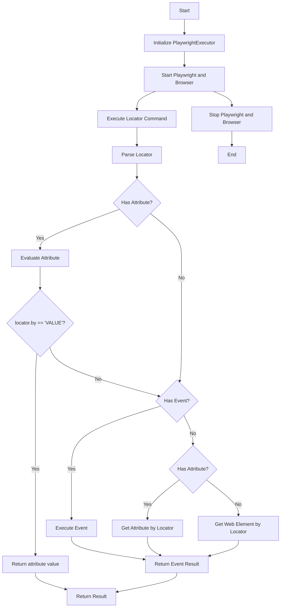
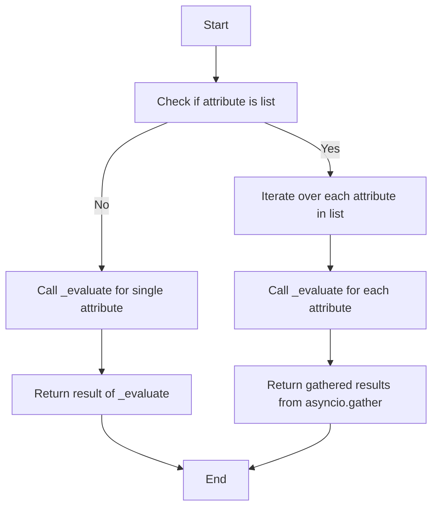

## Алгоритм:

1.  **Инициализация `PlaywrightExecutor`**:
    *   Создается экземпляр класса `PlaywrightExecutor`.
    *   Принимает `browser_type` (по умолчанию 'chromium') и дополнительные `kwargs`.
    *   Инициализирует `driver` как `None`, `browser_type` из параметров, `page` как `None` и загружает конфигурацию из JSON файла `playwrid.json` в `self.config`.

2.  **Запуск `start()`**:
    *   Использует `async_playwright().start()` для запуска Playwright.
    *   Запускает браузер указанного типа (например, `chromium`),  в headless-режиме, передает аргументы из конфигурации.
    *   Создает новую страницу (`page`) в браузере.
    *   Логирует критическую ошибку, если запуск не удался.

3.  **Остановка `stop()`**:
    *   Закрывает текущую страницу (`page`), если она существует.
    *   Останавливает драйвер (`driver`), если он существует.
    *   Устанавливает `self.driver` в `None`.
    *   Логирует успешную остановку или ошибку при закрытии браузера.

4.  **Выполнение локатора `execute_locator()`**:
    *   Принимает `locator` (словарь или `SimpleNamespace`), `message` и `typing_speed`.
    *   Преобразует `locator` в `SimpleNamespace`, если это словарь или если это  `locator` равен `None`.
    *   Если отсутствует `locator.attribute` и `locator.selector`, то возвращает `None`.
    *   Определяет асинхронную функцию `_parse_locator` для обработки локатора:
        *   Преобразует `locator` в `SimpleNamespace` если это словарь.
        *   Проверяет наличие `event`, `attribute` или `mandatory`. Если ничего нет, возвращает `None`.
        *   Вызывает `evaluate_locator` для вычисления `locator.attribute`, если присутствует. Если `locator.by` равен `'VALUE'`, то возвращает значение `locator.attribute`.
        *   Если есть `event`, выполняет `execute_event`.
        *   Если есть `attribute`, получает значение через `get_attribute_by_locator`.
        *   Иначе получает веб-элемент через `get_webelement_by_locator`.
        *   Ловит исключения и логирует, если необходимо.
    *   Возвращает результат `_parse_locator`.

5.  **Оценка локатора `evaluate_locator()`**:
    *   Принимает атрибут `attribute` (строка, список, словарь).
    *   Определяет асинхронную функцию `_evaluate`, которая возвращает строку `attr` (не проводит никаких операций).
    *   Если `attribute` является списком, применяет `_evaluate` к каждому элементу и возвращает результаты.
    *   Если `attribute` не список, то возвращает результат `_evaluate`.

6.  **Получение атрибута `get_attribute_by_locator()`**:
    *   Принимает `locator`.
    *   Преобразует `locator` в `SimpleNamespace`.
    *   Получает веб-элемент с помощью `get_webelement_by_locator()`.
    *   Если элемент не найден, возвращает `None`.
    *   Определяет внутреннюю функцию `_parse_dict_string`, которая пытается распарсить строку в словарь вида `{key:value}`, возвращает словарь или `None`, если парсинг не удался.
    *   Определяет внутреннюю функцию `_get_attribute`, которая возвращает атрибут элемента или `None` в случае ошибки.
    *   Определяет внутреннюю функцию `_get_attributes_from_dict`, которая получает несколько атрибутов из элемента, на основании словаря, где ключ и значение это имена атрибутов.
    *   Если `locator.attribute` это строка и начинается с `{`, то пытается распарсить её в словарь и вызывает `_get_attributes_from_dict`. Если не словарь, то возвращает результат `_get_attribute`.
    *   Если полученный элемент это список, то  вызывает `_get_attribute` для каждого элемента.
    *   Если элемент не список, то возвращает результат `_get_attribute`.

7.  **Получение веб-элемента `get_webelement_by_locator()`**:
    *   Принимает `locator`.
    *   Преобразует `locator` в `SimpleNamespace`.
    *   Если `locator` равен `None`, выбрасывает `ValueError`.
    *   Ищет веб-элемент с помощью `page.locator()`, если `locator.by` равен `XPATH`, то  ищет по xpath, иначе по переданному `locator.selector`.
    *   Возвращает элемент, первый, последний, четные, нечетные, или по индексам в зависимости от значения `locator.if_list`. Если не указан, возвращает `Locator`.
    *   Ловит исключения и логирует, если поиск не удался.

8.  **Получение скриншота `get_webelement_as_screenshot()`**:
    *   Принимает `locator` и опционально `webelement`.
    *   Преобразует `locator` в `SimpleNamespace`.
    *   Если `webelement` не передан, получает его с помощью `get_webelement_by_locator()`.
    *   Если элемент не найден, возвращает `None`.
    *   Делает скриншот элемента с помощью `webelement.screenshot()` и возвращает байты скриншота.
    *   Ловит исключения и логирует, если не удалось сделать скриншот.

9.  **Выполнение события `execute_event()`**:
    *   Принимает `locator`, `message` и `typing_speed`.
    *   Преобразует `locator` в `SimpleNamespace`.
    *   Разделяет события из `locator.event` по символу `;`.
    *   Получает веб-элемент с помощью `get_webelement_by_locator()`.
    *   Если элемент не найден, возвращает `False`.
    *   Если элемент список, то получает первый элемент.
    *   Итерируется по всем событиям:
        *   Если `click()`, то выполняет клик.
        *   Если `pause(n)`, то ставит паузу в n секунд.
        *   Если `upload_media()`, то загружает файл.
        *   Если `screenshot()`, то делает скриншот и добавляет в список результатов.
        *   Если `clear()`, то очищает элемент.
        *    Если `send_keys()`, отправляет клавиши по одной.
        *    Если `type()`, то вводит текст в зависимости от `typing_speed`.
    *   Возвращает `True` или список `screenshot()` в байтах если все успешно, иначе `False`.

10. **Отправка сообщения `send_message()`**:
    *   Принимает `locator`, `message` и `typing_speed`.
    *   Преобразует `locator` в `SimpleNamespace`.
    *   Получает веб-элемент с помощью `get_webelement_by_locator()`.
    *  Если элемент не найден, возвращает `None`.
    *   Если элемент это список, то берется первый элемент.
    *   Вводит текст в элемент. Если указана `typing_speed`, то имитирует ввод по символам, иначе вводит всё сразу.
    *   Возвращает `True`, если отправка сообщения прошла успешно.

11. **Переход по URL `goto()`**:
    *   Принимает URL.
    *   Переходит по URL с помощью `self.page.goto()`.
    *    Ловит исключения и логирует, если не удалось перейти по URL.

## mermaid:





## Объяснение:

### Импорты:

*   `asyncio`: Используется для асинхронного программирования, позволяя выполнять неблокирующие операции ввода-вывода.
*   `typing`: Используется для определения типов переменных и функций. `Optional`, `List`, `Dict`, `Any` позволяют уточнить типы данных.
*   `pathlib.Path`: Используется для работы с файловыми путями, делает код более читаемым и независимым от ОС.
*   `playwright.async_api`: Импортируются асинхронные API Playwright, такие как `async_playwright`, `Page` и `Locator`, для управления браузером и веб-элементами.
*   `types.SimpleNamespace`: Используется для создания объектов с атрибутами, которые могут быть заданы динамически, что упрощает работу с конфигурацией и локаторами.
*   `src`: Локальный пакет.
    *   `gs` (`from src import gs`): Глобальные настройки проекта, включая пути к файлам и другие конфигурации.
    *   `logger`: Модуль для логирования, позволяющий фиксировать события и ошибки, используется для отладки и мониторинга.
    *   `jjson`: Модуль для работы с `json`, в данном случае для загрузки конфигурации в `SimpleNamespace`.
    *   `exceptions`: Классы пользовательских исключений.
*   `re`: Используется для работы с регулярными выражениями, в данном случае для парсинга событий `pause()` и `send_keys()`.

### Классы:

*   **`PlaywrightExecutor`**:
    *   **Роль**: Является основным классом для управления браузером с использованием Playwright.
    *   **Атрибуты**:
        *   `driver` (`None`): Асинхронный драйвер Playwright.
        *   `browser_type` (`str`): Тип браузера (например, "chromium").
        *   `page` (`Optional[Page]`): Текущая страница браузера.
        *   `config` (`SimpleNamespace`): Конфигурация из JSON файла.
    *   **Методы**:
        *   `__init__`: Инициализация, задает параметры браузера и загружает конфиг.
        *   `start`: Запускает Playwright и браузер.
        *   `stop`: Останавливает Playwright и закрывает браузер.
        *   `execute_locator`: Выполняет действия на основе локатора и события.
        *   `evaluate_locator`: Вычисляет значения атрибутов локатора.
        *   `get_attribute_by_locator`: Возвращает значение атрибута элемента.
        *   `get_webelement_by_locator`: Возвращает веб-элемент по локатору.
        *  `get_webelement_as_screenshot`: Делает скриншот элемента.
        *   `execute_event`: Выполняет событие для элемента.
        *   `send_message`: Отправляет сообщение в элемент.
        *   `goto`: Переходит по URL.
    *   **Взаимодействие**: Взаимодействует с Playwright API для управления браузером, использует модули `src.logger`, `src.utils.jjson` и `src.gs`.

### Функции:

*   **`start()`**:
    *   **Аргументы**: Нет.
    *   **Возвращаемое значение**: `None`.
    *   **Назначение**: Запускает Playwright и открывает браузер с заданной конфигурацией.
    *   **Примеры**: Вызывается для инициализации браузера перед выполнением тестов или сбора данных.

*   **`stop()`**:
    *   **Аргументы**: Нет.
    *   **Возвращаемое значение**: `None`.
    *   **Назначение**: Закрывает браузер и останавливает Playwright.
    *   **Примеры**: Вызывается для завершения работы с браузером.

*   **`execute_locator()`**:
    *   **Аргументы**:
        *   `locator`: Локатор элемента в виде словаря или `SimpleNamespace`.
        *   `message` (`Optional[str]`): Сообщение для отправки в элемент.
        *   `typing_speed` (`float`): Скорость ввода текста (если используется).
    *   **Возвращаемое значение**: `str | List[str] | dict | bytes | bool`: Результат действия (значение атрибута, данные или результат события).
    *   **Назначение**: Выполняет действие на основе предоставленного локатора и события.
    *   **Примеры**: Получение текста элемента, клик по кнопке, ввод текста в поле.
   ```python
    locator = {
        'by': 'css',
        'selector': '#username',
        'event': 'type(testuser)',
    }
    result = await executor.execute_locator(locator, typing_speed=0.1)
    ```

*   **`evaluate_locator()`**:
    *   **Аргументы**:
        *   `attribute` (`str | List[str] | dict`): Атрибут или список атрибутов для оценки.
    *   **Возвращаемое значение**: `Optional[str | List[str] | dict]`: Вычисленное значение атрибута или список значений.
    *   **Назначение**: Вычисляет значение атрибута, который может содержать, в будущем,  специальные конструкции, например `Keys`.
    *   **Примеры**: Получение значения атрибута или их списка, где каждый атрибут это текст.

*   **`get_attribute_by_locator()`**:
    *   **Аргументы**:
        *   `locator`: Локатор элемента в виде словаря или `SimpleNamespace`.
    *   **Возвращаемое значение**: `Optional[str | List[str] | dict]`: Значение атрибута элемента.
    *   **Назначение**: Получение значения атрибута веб-элемента на основе локатора.
    *   **Примеры**: Получение значения атрибута `value` текстового поля, `class` кнопки.
      ```python
       locator = {
        'by': 'css',
        'selector': '#username',
        'attribute': 'value',
        }
       value = await executor.get_attribute_by_locator(locator)
      ```

*   **`get_webelement_by_locator()`**:
    *   **Аргументы**:
        *   `locator`: Локатор элемента в виде словаря или `SimpleNamespace`.
    *   **Возвращаемое значение**: `Optional[Locator | List[Locator]]`: веб-элемент или список веб-элементов.
    *   **Назначение**: Получение веб-элемента(ов) по локатору.
    *   **Примеры**: Получение элемента по `css`, `xpath` или `id`.
        ```python
        locator = {
        'by': 'css',
        'selector': '#login-button',
        }
        element = await executor.get_webelement_by_locator(locator)
        ```

*   **`get_webelement_as_screenshot()`**:
    *   **Аргументы**:
        *   `locator`: Локатор элемента в виде словаря или `SimpleNamespace`.
         *   `webelement`: веб-элемент.
    *   **Возвращаемое значение**: `Optional[bytes]`:  Скриншот в виде байтов.
    *   **Назначение**: Получение скриншота элемента по локатору.
    *   **Примеры**: Создание скриншота элемента по `css`.
    ```python
        locator = {
            'by': 'css',
            'selector': '#screenshot-element',
        }
        screenshot = await executor.get_webelement_as_screenshot(locator)
   ```
*   **`execute_event()`**:
    *   **Аргументы**:
        *   `locator`: Локатор элемента в виде словаря или `SimpleNamespace`.
        *   `message` (`Optional[str]`): Сообщение, связанное с событием.
        *   `typing_speed` (`float`): Скорость ввода текста.
    *   **Возвращаемое значение**: `str | List[str] | bytes | List[bytes] | bool`: Статус выполнения события.
    *   **Назначение**: Выполнение события (например, клик, ввод текста) на элементе.
    *   **Примеры**: Клик по элементу, ввод сообщения в текстовое поле, загрузка файла.
    ```python
      locator = {
        'by': 'css',
        'selector': '#upload_button',
        'event': 'upload_media()',
       }
       result = await executor.execute_event(locator, message='/path/to/file.png')
    ```

*   **`send_message()`**:
    *   **Аргументы**:
        *   `locator`: Локатор элемента в виде словаря или `SimpleNamespace`.
        *   `message` (`Optional[str]`): Сообщение для отправки в элемент.
        *    `typing_speed` (`float`): Скорость ввода текста.
    *   **Возвращаемое значение**: `bool`: Статус отправки сообщения.
    *   **Назначение**: Отправка сообщения в веб-элемент.
    *   **Примеры**: Отправка сообщения в элемент с помощью `locator`.
   ```python
    locator = {
        'by': 'css',
        'selector': '#message',
    }
   send_message = await executor.send_message(locator, message='Hello world')
   ```
*   **`goto()`**:
    *   **Аргументы**:
        *   `url` (`str`): URL для перехода.
    *   **Возвращаемое значение**: `None`.
    *   **Назначение**: Переход на указанную веб-страницу.
    *   **Примеры**: Открытие начальной страницы приложения.
       ```python
       await executor.goto('https://example.com')
       ```

### Переменные:

*   `driver`: Экземпляр асинхронного драйвера Playwright.
*   `browser_type`: Тип браузера для запуска (по умолчанию 'chromium').
*   `page`: Текущая страница браузера, которая представляет собой асинхронную обертку над страницей браузера.
*   `config`: Конфигурация для Playwright, загруженная из JSON-файла, в виде `SimpleNamespace`.
*   `locator`: Объект (словарь или `SimpleNamespace`), содержащий информацию о том, как найти элемент на странице, а так же какие действия с ним нужно производить.
*   `message`: Строка, передающая дополнительную информацию, которая может быть использована в методах `execute_event()` и `send_message()`.
*   `typing_speed`: Число с плавающей точкой, которое определяет задержку при вводе текста, это можно использовать при тестировании UI.
*   `element`: Объект `Locator` который представляет собой элемент на веб-странице.
*   `events`: Список событий, которые нужно выполнить.
*   `result`: Список результатов выполнения события.
*   `screenshot_bytes`: Байты скриншота.
*   `attr_dict`:  Словарь содержащий имена атрибутов и их значения.
*   `attr_string`: Строка с атрибутами.

### Потенциальные ошибки и области для улучшения:

*   **Обработка ошибок**: В некоторых местах используются общие блоки `try-except`, лучше использовать более конкретные исключения и предоставлять больше информации в логах.
*   **Логирование**: В некоторых местах используется логирование debug, в других error,  лучше использовать единый стандарт.
*   **Валидация локаторов**: Валидация  формата локатора, можно было бы добавить проверку на то что локатор не пустой.
*  **Гибкость `evaluate_locator`**: Функция `_evaluate` сейчас ничего не делает, было бы неплохо добавить возможность вычисления атрибутов, на примере `Keys`, которые не используют `Playwright`, а являются "костылями" для некоторых проектов.
*  **Обработка некорректного локатора**: В некоторых местах может быть `None` или `{}`, стоило бы улучшить проверки на этот счет.
*   **Рефакторинг**: Некоторые функции можно разбить на более мелкие для улучшения читаемости и поддерживаемости.
*  **Расширение функционала `execute_event`**: `execute_event` можно расширить, добавить новые методы управления веб-элементами.

### Взаимосвязь с другими частями проекта:

*   **`src.gs`**: Используется для получения глобальных настроек проекта, включая путь к файлу конфигурации Playwright. Это обеспечивает гибкость и централизованное управление настройками.
*   **`src.logger`**: Используется для логирования событий и ошибок, обеспечивая возможность мониторинга и отладки.
*   **`src.utils.jjson`**: Используется для загрузки конфигурации из JSON-файла, обеспечивая легкую настройку параметров Playwright.
*   **`playwright`**: Библиотека для управления браузером.

Этот класс является центральным элементом для управления браузером в проекте, предоставляя методы для запуска, остановки, навигации, взаимодействия с элементами и выполнения событий. Он тесно связан с другими компонентами проекта через импорты, что обеспечивает его функциональность и гибкость.