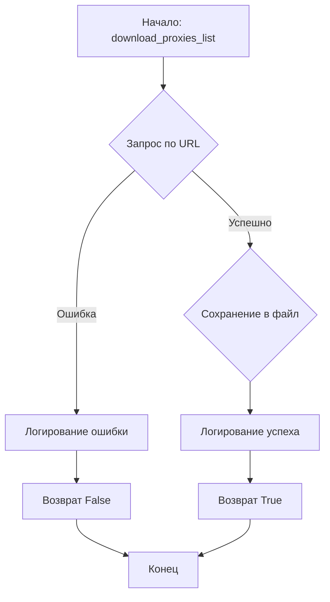
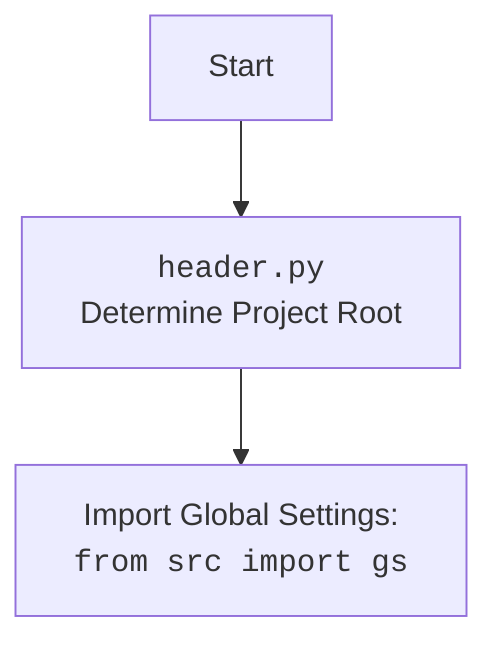

## Анализ кода `hypotez/src/webdriver/proxy.py`

### 1. <алгоритм>

#### download_proxies_list
1.  **Начало**: Функция `download_proxies_list` принимает URL и путь для сохранения.
    ```python
    def download_proxies_list(url: str = url, save_path: Path = proxies_list_path) -> bool:
    ```
2.  **Запрос**: Отправляет HTTP-запрос GET к указанному URL.
    ```python
    response = requests.get(url, stream=True)
    response.raise_for_status()
    ```
    *Пример*: Запрос к `'https://raw.githubusercontent.com/proxifly/free-proxy-list/main/proxies/all/data.txt'`
3.  **Сохранение**: Сохраняет содержимое ответа в файл по указанному пути.
    ```python
    with open(save_path, 'wb') as file:
        for chunk in response.iter_content(chunk_size=8192):
            file.write(chunk)
    ```
    *Пример*: Сохранение в `'__root__ / \'src\' / \'webdriver\' / \'proxies.txt\''`
4.  **Обработка ошибок**: Если происходит исключение (например, ошибка HTTP), логирует ошибку и возвращает `False`.
    ```python
    except Exception as ex:
        logger.error('Ошибка при загрузке файла: ', ex)
        return False
    ```
5.  **Успешное завершение**: Логирует успешную загрузку и возвращает `True`.
    ```python
    logger.info(f'Файл успешно загружен и сохранён в {save_path}')
    return True
    ```

#### get_proxies_dict
1.  **Начало**: Функция `get_proxies_dict` принимает путь к файлу с прокси.
    ```python
    def get_proxies_dict(file_path: Path = proxies_list_path) -> Dict[str, List[Dict[str, Any]]]:
    ```
2.  **Загрузка списка**: Вызывает функцию `download_proxies_list` для обновления файла с прокси.
    ```python
    download_proxies_list()
    ```
3.  **Инициализация**: Инициализирует словарь `proxies` для хранения прокси по типам (http, socks4, socks5).
    ```python
    proxies: Dict[str, List[Dict[str, Any]]] = {
        'http': [],
        'socks4': [],
        'socks5': []
    }
    ```
4.  **Чтение и парсинг**: Читает файл построчно, используя регулярное выражение для извлечения протокола, хоста и порта.
    ```python
    with open(file_path, 'r', encoding='utf-8') as file:
        for line in file:
            match = re.match(r'^(http|socks4|socks5)://([\d\.]+):(\d+)', line.strip())
            if match:
                protocol, host, port = match.groups()
                proxies[protocol].append({'protocol':protocol, 'host': host, 'port': port})
    ```
    *Пример*: Если строка `'http://127.0.0.1:8080'`, то `protocol` будет `'http'`, `host` - `'127.0.0.1'`, `port` - `'8080'`.
5.  **Обработка ошибок**: Обрабатывает исключения `FileNotFoundError` и `Exception`, логирует ошибки.
    ```python
    except FileNotFoundError as ex:
        logger.error('Файл не найден: ', ex)
    except Exception as ex:
        logger.error('Ошибка при парсинге прокси: ', ex)
    ```
6.  **Возврат**: Возвращает словарь `proxies` с распределенными прокси.
    ```python
    return proxies
    ```

#### check_proxy
1.  **Начало**: Функция `check_proxy` принимает словарь с данными прокси.
    ```python
    def check_proxy(proxy: dict) -> bool:
    ```
2.  **Проверка прокси**: Отправляет HTTP-запрос GET через указанный прокси на `https://httpbin.org/ip`.
    ```python
    response = requests.get("https://httpbin.org/ip", proxies={proxy['protocol']: f"{proxy['protocol']}://{proxy['host']}:{proxy['port']}"}, timeout=5)
    ```
    *Пример*: Если `proxy = {'protocol': 'http', 'host': '127.0.0.1', 'port': '8080'}`, то запрос будет отправлен через `http://127.0.0.1:8080`.
3.  **Проверка статуса**: Проверяет код ответа. Если код 200, прокси считается рабочим и возвращается `True`.
    ```python
    if response.status_code == 200:
        logger.info(f"Прокси найден: {proxy['host']}:{proxy['port']}")
        return True
    ```
4.  **Обработка ошибок**: Обрабатывает исключения `ProxyError` и `RequestException`, логирует ошибки и возвращает `False`.
    ```python
    except (ProxyError, RequestException) as ex:
        logger.warning(f"Ошибка подключения через прокси {proxy['host']}:{proxy['port']}:",ex)
        return False
    ```
5. **Неудачная проверка**: Если код ответа не 200, прокси считается нерабочим и возвращается `False`.
    ```python
    else:
        logger.warning(f"Прокси не работает: {proxy['host']}:{proxy['port']} (Статус: {response.status_code})", None, False)
        return False
    ```

### 2. <mermaid>



**Объяснение зависимостей (download_proxies_list):**

-   `requests`: Используется для отправки HTTP-запроса к URL, чтобы загрузить список прокси.
-   `pathlib.Path`: Используется для определения пути сохранения загруженного файла.
-   `src.logger.logger`: Используется для логирования информации об успешной загрузке или ошибках.

```mermaid
flowchart TD
    A[Начало: get_proxies_dict] --> B{Загрузка списка прокси (download_proxies_list)};
    B --> C{Инициализация словаря proxies};
    C --> D{Чтение файла построчно};
    D -- Соответствует шаблону --> E{Извлечение протокола, хоста, порта};
    D -- Не соответствует шаблону --> D;
    E --> F{Добавление прокси в словарь};
    F --> D;
    D -- Конец файла --> G[Возврат словаря proxies];
    D -- Ошибка --> H[Логирование ошибки];
    H --> G;
```

**Объяснение зависимостей (get_proxies_dict):**

-   `re`: Используется для применения регулярного выражения к каждой строке в файле, чтобы извлечь информацию о прокси.
-   `pathlib.Path`: Используется для определения пути к файлу, содержащему список прокси.
-   `typing`: Используется для аннотации типов.
-   `src.logger.logger`: Используется для логирования информации об успешной загрузке или ошибках.
-   `download_proxies_list`: Используется для обновления списка прокси.

```mermaid
flowchart TD
    A[Начало: check_proxy] --> B{Запрос через прокси};
    B -- Успешно --> C{Проверка статуса (200?)};
    B -- Ошибка --> D[Логирование ошибки];
    C -- Да --> E[Логирование успеха];
    C -- Нет --> F[Логирование предупреждения];
    D --> G[Возврат False];
    E --> H[Возврат True];
    F --> G;
    G --> I[Конец];
    H --> I;
```

**Объяснение зависимостей (check_proxy):**

-   `requests`: Используется для отправки HTTP-запроса через указанный прокси.
-   `src.logger.logger`: Используется для логирования информации об успешной проверке или ошибках.



### 3. <объяснение>

#### Импорты:

-   `re`: Используется для работы с регулярными выражениями при парсинге строк с прокси-серверами.
-   `requests`: Используется для отправки HTTP-запросов к URL для загрузки списка прокси и проверки прокси-серверов.
-   `requests.exceptions`: Используется для обработки исключений, связанных с запросами, таких как `ProxyError` и `RequestException`.
-   `pathlib.Path`: Используется для работы с путями к файлам и директориям.
-   `typing.Any, Dict, List, Optional`: Используется для аннотации типов.
-   `header`: Содержит определение корневого каталога проекта.
-   `header.__root__`: Корневой каталог проекта, используется для определения пути к файлу `proxies.txt`.
-   `src.gs`: Глобальные настройки проекта.
-   `src.utils.printer.pprint`: Функция для красивой печати данных.
-   `src.logger.logger`: Модуль для логирования.

#### Переменные:

-   `url`: URL источника списка прокси.
    ```python
    url: str = 'https://raw.githubusercontent.com/proxifly/free-proxy-list/main/proxies/all/data.txt'
    ```
-   `proxies_list_path`: Путь к файлу для сохранения списка прокси.
    ```python
    proxies_list_path: Path = __root__ / 'src' / 'webdriver' / 'proxies.txt'
    ```

#### Функции:

-   `download_proxies_list(url: str = url, save_path: Path = proxies_list_path) -> bool`:
    -   Загружает файл по указанному URL и сохраняет его в заданный путь.
    -   Аргументы:
        -   `url` (str): URL файла для загрузки (по умолчанию `url`, определенный в модуле).
        -   `save_path` (Path): Путь для сохранения загруженного файла (по умолчанию `proxies_list_path`, определенный в модуле).
    -   Возвращает: `True`, если файл успешно загружен и сохранен, `False` в противном случае.
    -   Пример:
        ```python
        download_proxies_list(url='http://example.com/proxies.txt', save_path=Path('/tmp/proxies.txt'))
        ```
-   `get_proxies_dict(file_path: Path = proxies_list_path) -> Dict[str, List[Dict[str, Any]]]`:
    -   Парсит файл с прокси-адресами и распределяет их по категориям (http, socks4, socks5).
    -   Аргументы:
        -   `file_path` (Path): Путь к файлу с прокси (по умолчанию `proxies_list_path`, определенный в модуле).
    -   Возвращает: Словарь, где ключи - типы прокси (http, socks4, socks5), а значения - списки словарей с данными прокси (protocol, host, port).
    -   Пример:
        ```python
        proxies = get_proxies_dict(file_path=Path('/tmp/proxies.txt'))
        print(proxies['http'])  # Вывод списка HTTP-прокси
        ```
-   `check_proxy(proxy: dict) -> bool`:
    -   Проверяет работоспособность прокси-сервера.
    -   Аргументы:
        -   `proxy` (dict): Словарь с данными прокси (host, port, protocol).
    -   Возвращает: `True`, если прокси работает, `False` в противном случае.
    -   Пример:
        ```python
        proxy = {'protocol': 'http', 'host': '127.0.0.1', 'port': '8080'}
        if check_proxy(proxy):
            print('Прокси работает')
        else:
            print('Прокси не работает')
        ```

#### Потенциальные ошибки и области для улучшения:

-   В функциях `download_proxies_list` и `get_proxies_dict` в блоках `except` стоят `...`. Необходимо добавить обработку исключений.
-   В функции `get_proxies_dict` вызывается функция `download_proxies_list()`. Не помешает добавить проверку на существование файла, прежде чем загружать его.
-   В функции `check_proxy` можно добавить возможность указания URL для проверки прокси.

#### Взаимосвязи с другими частями проекта:

-   Модуль использует `header` для определения корневого каталога проекта, что позволяет гибко определять пути к файлам.
-   Модуль использует `src.gs` для доступа к глобальным настройкам проекта (если это необходимо).
-   Модуль использует `src.utils.printer.pprint` для красивой печати данных.
-   Модуль использует `src.logger.logger` для логирования, что позволяет отслеживать работу модуля и выявлять ошибки.