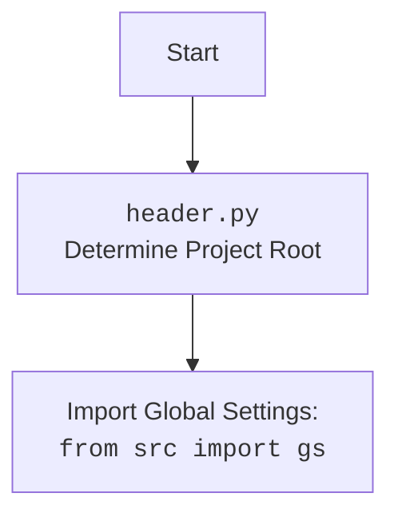

## ИНСТРУКЦИЯ:

Анализируй предоставленный код подробно и объясни его функциональность. Ответ должен включать три раздела:  

1. **<алгоритм>**: Опиши рабочий процесс в виде пошаговой блок-схемы, включая примеры для каждого логического блока, и проиллюстрируй поток данных между функциями, классами или методами.  
2. **<mermaid>**: Напиши код для диаграммы в формате `mermaid`, проанализируй и объясни все зависимости, 
    которые импортируются при создании диаграммы. 
    **ВАЖНО!** Убедитесь, что все имена переменных, используемые в диаграмме `mermaid`, 
    имеют осмысленные и описательные имена. Имена переменных вроде `A`, `B`, `C`, и т.д., не допускаются!  
    
    **Дополнительно**: Если в коде есть импорт `import header`, добавьте блок `mermaid` flowchart, объясняющий `header.py`:\
    ```mermaid
    flowchart TD
        Start --> Header[<code>header.py</code><br> Determine Project Root]
    
        Header --> import[Import Global Settings: <br><code>from src import gs</code>] 
    ```

3. **<объяснение>**: Предоставьте подробные объяснения:  
   - **Импорты**: Их назначение и взаимосвязь с другими пакетами `src.`.  
   - **Классы**: Их роль, атрибуты, методы и взаимодействие с другими компонентами проекта.  
   - **Функции**: Их аргументы, возвращаемые значения, назначение и примеры.  
   - **Переменные**: Их типы и использование.  
   - Выделите потенциальные ошибки или области для улучшения.  

Дополнительно, постройте цепочку взаимосвязей с другими частями проекта (если применимо).  

Это обеспечивает всесторонний и структурированный анализ кода.
## Формат ответа: `.md` (markdown)
**КОНЕЦ ИНСТРУКЦИИ**
```markdown
## Анализ кода `webdriver/readme.ru.md`

### 1. <алгоритм>

**Общая схема работы модуля `Driver`:**

1.  **Инициализация драйвера:**
    *   Создается экземпляр класса `Driver`, который принимает класс браузера (например, `Chrome`) в качестве аргумента. Также можно передать дополнительные параметры, например, `user_agent`.
    *   При создании экземпляра `Driver` динамически создается класс, наследующий от `DriverBase` и указанного класса браузера. Этот класс содержит всю логику управления браузером.
    *   Инициализируется объект `ActionChains`, который используется для выполнения сложных действий с элементами (например, drag and drop).
    *   Примеры:
        ```python
        chrome_driver = Driver(Chrome) # создание драйвера Chrome
        custom_chrome_driver = Driver(Chrome, user_agent=user_agent) # создание драйвера Chrome с user agent
        ```

2.  **Навигация:**
    *   Вызывается метод `get_url`, который загружает указанный URL в браузере.
    *   Метод `extract_domain` извлекает домен из URL.
    *   Метод `page_refresh` обновляет текущую страницу.
    *   Примеры:
        ```python
        chrome_driver.get_url("https://www.example.com") # переход по URL
        domain = chrome_driver.extract_domain("https://www.example.com/path/to/page") # извлечение домена
        chrome_driver.page_refresh() # обновление страницы
        ```

3.  **Взаимодействие со страницей:**
    *   Метод `scroll` прокручивает страницу в заданном направлении на указанное количество прокруток.
    *   Метод `locale` определяет язык текущей страницы.
    *   Метод `find_element` ищет элемент на странице по указанному локатору.
    *   Метод `window_focus` устанавливает фокус на окно браузера.
        ```python
        chrome_driver.scroll(scrolls=3, direction='forward', frame_size=1000, delay=1) # прокрутка страницы
        page_language = chrome_driver.locale # определение языка страницы
        element = chrome_driver.find_element(By.CSS_SELECTOR, 'h1') # поиск элемента
        chrome_driver.window_focus() # фокусировка окна
        ```

4.  **Управление Cookies:**
    *   Метод `_save_cookies_localy` сохраняет cookies в локальный файл.
    *   Примеры:
        ```python
        chrome_driver._save_cookies_localy() # сохранение cookies
        ```

**Общая схема работы модуля `ExecuteLocator`:**

1.  **Инициализация:**
    *   Создается экземпляр класса `ExecuteLocator`, который принимает экземпляр WebDriver в качестве аргумента.
    *   Инициализируется объект `ActionChains` для выполнения сложных действий с элементами.
    *   Примеры:
    ```python
        executor = ExecuteLocator(chrome_driver)
    ```
2.  **Выполнение действий по локатору:**
    *   Метод `execute_locator` принимает словарь с данными о локаторе и действиях, которые необходимо выполнить. Этот метод является точкой входа для выполнения различных операций с элементами.
    *   Внутри `execute_locator` вызываются другие методы, такие как `get_webelement_by_locator`, `send_message`, и другие, в зависимости от параметров переданного локатора.
    *   Примеры:
    ```python
        locator = {
            "by": "xpath",
            "selector": "//h1"
        }
        executor.execute_locator(locator)
    ```

3.  **Получение элемента:**
    *   Метод `get_webelement_by_locator` находит элементы на странице по заданному локатору и возвращает WebElement, список элементов или False, если ни один элемент не найден.
    *   Примеры:
    ```python
        locator = {
             "by": "css selector",
             "selector": "h1"
        }
        element = executor.get_webelement_by_locator(locator)
    ```

4.  **Получение атрибута:**
    *   Метод `get_attribute_by_locator` получает значение указанного атрибута найденного элемента или элементов.
    *   Примеры:
    ```python
        locator = {
            "by": "xpath",
            "selector": "//h1"
        }
       attribute = executor.get_attribute_by_locator(locator, 'text')
    ```

5.  **Отправка сообщения:**
    *   Метод `send_message` отправляет текст в указанный элемент, имитируя ввод с клавиатуры, может устанавливать скорость ввода.
    *   Примеры:
    ```python
         locator = {
            "by": "xpath",
            "selector": "//input[@name='search']"
         }
         executor.send_message(locator, 'Test Message')
    ```

6.  **Оценка атрибута:**
    *   Метод `evaluate_locator` вычисляет значение атрибута с учетом возможных плейсхолдеров.
    *  Примеры:
    ```python
        locator = {
           'attribute': '%EXTERNAL_MESSAGE%',
           'by': 'xpath',
           'selector': '//input[@name="search"]'
         }
         executor.evaluate_locator(locator['attribute'])
    ```
### 2. <mermaid>



```mermaid
flowchart TD
    subgraph Driver Module
        StartDriver[Start Driver Initialization]
        CreateDriverClass[Create Dynamic Driver Class]
        InitDriverBase[Initialize DriverBase Attributes]
        InitWebDriver[Initialize WebDriver Instance]
        SetJSMethods[Set JavaScript Methods]
        CreateActionChains[Create ActionChains Instance]
        EndDriver[End Driver Initialization]
        
        StartDriver --> CreateDriverClass
        CreateDriverClass --> InitDriverBase
        InitDriverBase --> InitWebDriver
        InitWebDriver --> SetJSMethods
        SetJSMethods --> CreateActionChains
        CreateActionChains --> EndDriver
    end

    subgraph ExecuteLocator Module
        StartExecutor[Start Executor Initialization]
        InitExecutor[Initialize ExecuteLocator Class]
        SetDriver[Set WebDriver Instance]
         SetActions[Set ActionChains Instance]
        EndExecutor[End Executor Initialization]

        StartExecutor --> InitExecutor
        InitExecutor --> SetDriver
         SetDriver --> SetActions
        SetActions --> EndExecutor
    end

   
    subgraph Driver Methods
         Scroll[scroll: Scroll the web page]
         GetURL[get_url: Loads the specified URL]
        ExtractDomain[extract_domain: Extracts the domain from a URL]
        SaveCookies[ _save_cookies_localy: Saves cookies to a local file]
        PageRefresh[page_refresh: Refreshes the current page]
        WindowFocus[window_focus: Focuses the browser window using JavaScript]
        GetLocale[locale: Attempts to determine the language of the page]
    end
   
    subgraph ExecuteLocator Methods
        ExecuteLocatorMethod[execute_locator: Main method for executing actions based on a locator]
        GetWebElement[get_webelement_by_locator: Retrieves elements found on the page based on the locator]
        GetAttribute[get_attribute_by_locator: Retrieves an attribute from an element based on the locator]
        SendMessage[send_message: Sends a message to a web element]
        EvaluateLocator[evaluate_locator: Evaluates the locator’s attribute]
    end

   
    DriverModule --> DriverMethods
    ExecuteLocatorModule --> ExecuteLocatorMethods


    style StartDriver fill:#f9f,stroke:#333,stroke-width:2px
    style EndDriver fill:#ccf,stroke:#333,stroke-width:2px

     style StartExecutor fill:#f9f,stroke:#333,stroke-width:2px
    style EndExecutor fill:#ccf,stroke:#333,stroke-width:2px
```

**Анализ зависимостей:**

*   **Driver Module:**
    *   Динамически создает класс драйвера, наследуя от `DriverBase` и выбранного класса браузера (например, Chrome).
    *   Инициализирует основные атрибуты, WebDriver и ActionChains.
    *   Устанавливает JavaScript методы для управления браузером.
    *   Основные методы: `scroll`, `get_url`, `extract_domain`, `_save_cookies_localy`, `page_refresh`, `window_focus`, `locale`.
*   **ExecuteLocator Module:**
    *   Инициализирует класс `ExecuteLocator` для выполнения действий над элементами на основе локаторов.
    *   Устанавливает WebDriver и ActionChains.
    *   Основные методы: `execute_locator`, `get_webelement_by_locator`, `get_attribute_by_locator`, `send_message`, `evaluate_locator`.
    *   Зависит от `Driver Module` для получения экземпляра `WebDriver`
*   **Зависимости:**
    *   Оба модуля используют библиотеки `selenium` для взаимодействия с браузером.
    *   Модули используют библиотеки `src` для общих утилит.


### 3. <объяснение>

**Модуль `Driver`:**

*   **Импорты:**
    *   `from src.webdriver.driver import Driver, Chrome`: Импортирует классы `Driver` и `Chrome` из модуля `driver.py`. Класс `Driver` является основным для управления браузером, а `Chrome` используется для создания экземпляра Chrome драйвера.
    *   `from selenium.webdriver.common.by import By`: Импортирует класс `By` из Selenium для указания типа локатора при поиске элементов (например, `By.XPATH`, `By.CSS_SELECTOR`).

*   **Классы:**
    *   `Driver`: Класс для динамического создания драйвера, наследующего от `DriverBase` и указанного класса браузера (например, `Chrome`).
        *   **Атрибуты**:
            *   `previous_url`: Сохраняет предыдущий URL.
            *    `referrer`: Сохраняет реферер URL.
            *    `page_lang`: Сохраняет язык страницы.
            *  Другие атрибуты для работы с элементами и JS.
        *   **Методы**:
            *   `scroll(scrolls, direction, frame_size, delay)`: прокручивает страницу на заданное количество раз, в заданном направлении, на заданную величину, с заданной задержкой
            *   `locale()`: определяет язык страницы.
            *   `get_url(url)`: загружает указанный URL.
            *   `extract_domain(url)`: извлекает домен из URL.
            *   `_save_cookies_localy()`: сохраняет cookies в файл.
            *   `page_refresh()`: обновляет страницу.
            *  `window_focus()`: фокусирует окно браузера с помощью JS.
            *   `wait(seconds)`: задает ожидание.
    *   `DriverMeta`: Метакласс для создания класса `Driver`.
        *   **Методы:**
            *   `__call__(cls, webdriver_class, *args, **kwargs)`: создает новый класс, наследующий от `DriverBase` и переданного класса драйвера (например, `Chrome`).
    *    `DriverBase`: Базовый класс для Driver.
        *   **Методы:**
            *   `scroll(scrolls, direction, frame_size, delay)`: прокручивает страницу на заданное количество раз, в заданном направлении, на заданную величину, с заданной задержкой.
            *   `locale()`: определяет язык страницы.
            *   `get_url(url)`: загружает указанный URL.
            *    `extract_domain(url)`: извлекает домен из URL.
            *    `_save_cookies_localy()`: сохраняет cookies в файл.
            *    `page_refresh()`: обновляет страницу.
            *    `window_focus()`: фокусирует окно браузера с помощью JS.
            *    `wait(seconds)`: задает ожидание.

*   **Функции:**
    *   `main()`: Основная функция для демонстрации использования классов `Driver` и `Chrome`.
        *   **Примеры использования:**
            *   Создание экземпляра Chrome драйвера и навигация по URL.
            *   Извлечение домена из URL.
            *   Сохранение cookies в локальный файл.
            *   Обновление текущей страницы.
            *   Прокрутка страницы вниз.
            *   Получение языка текущей страницы.
            *   Установка кастомного User-Agent для Chrome драйвера.
            *   Поиск элемента по CSS селектору.
            *   Получение текущего URL.
            *   Фокусировка окна.

*   **Переменные:**
    *   `chrome_driver`: экземпляр класса `Driver` с браузером `Chrome`.
    *    `custom_chrome_driver`: экземпляр класса `Driver` с кастомным `user_agent`.
    *   `domain`: переменная для хранения извлеченного домена.
    *   `success`: переменная для проверки успешного выполнения операции.
    *   `page_language`: переменная для хранения языка страницы.
    *   `user_agent`: словарь с кастомным user-agent.
    *    `element`: переменная для хранения найденного элемента.
    *    `current_url`: переменная для хранения текущего url страницы.

**Модуль `ExecuteLocator`:**

*   **Импорты:**
    *   `from selenium import webdriver`: Импортирует модуль `webdriver` из Selenium.
    *   `from selenium.webdriver.common.keys import Keys`: Импортирует класс `Keys` для отправки специальных клавиш.
    *   `from selenium.webdriver.common.by import By`: Импортирует класс `By` для определения типа локатора.
    *   `from selenium.webdriver.remote.webelement import WebElement`: Импортирует класс `WebElement` для работы с элементами.
    *   `from selenium.webdriver.support.ui import WebDriverWait`: Импортирует класс `WebDriverWait` для ожидания появления элементов.
    *   `from selenium.webdriver.support import expected_conditions as EC`: Импортирует expected conditions для WebDriverWait.
    *   `from selenium.webdriver.common.action_chains import ActionChains`: Импортирует класс `ActionChains` для сложных действий.
    *   `from selenium.common.exceptions import NoSuchElementException, TimeoutException`: Импортирует исключения Selenium.
    *    `from src import gs`: Импортирует глобальные настройки из модуля `src`.
    *   `from src.utils.printer import pprint, j_loads, j_loads_ns, j_dumps, save_png`: Импортирует утилиты из модуля `src.utils.printer`.
    *    `from src.logger.logger import logger`: Импортирует логгер.
    *    `from src.logger.exceptions import DefaultSettingsException, WebDriverException, ExecuteLocatorException`: Импортирует исключения из модуля `src.logger.exceptions`.

*   **Классы:**
    *   `ExecuteLocator`: Класс для выполнения действий по локатору.
        *   **Атрибуты:**
            *   `driver`: экземпляр WebDriver.
            *   `actions`: экземпляр ActionChains.
            *   `by_mapping`: словарь, сопоставляющий названия локаторов с `By` из selenium
        *   **Методы:**
            *    `__init__(self, driver, *args, **kwargs)`: инициализация класса.
            *   `execute_locator(locator, message=None, typing_speed=0, continue_on_error=True)`: выполняет действия в зависимости от переданного словаря локатора.
            *   `get_webelement_by_locator(locator, message=None)`: получает элемент или список элементов.
            *   `get_attribute_by_locator(locator, message=None)`: получает атрибут элемента.
            *  `_get_element_attribute(element, attribute)`: вспомогательная функция для получения атрибута элемента.
            *   `send_message(locator, message, typing_speed, continue_on_error)`: отправляет сообщение в элемент с заданной скоростью.
            *   `evaluate_locator(attribute)`: вычисляет значение атрибута.
            *   `_evaluate(attribute)`: вспомогательная функция для вычисления значения атрибута.
            *    `get_locator_keys()`: возвращает список ключей локаторов.

*   **Функции:**
    *   Отсутствуют функции вне класса `ExecuteLocator`.

*   **Переменные:**
    *   Внутри методов используются переменные для хранения элементов, атрибутов, сообщений, результатов выполнения операций.

**Взаимосвязи:**

*   Модуль `Driver` предоставляет функционал для управления браузером, а модуль `ExecuteLocator` использует этот функционал для взаимодействия с элементами веб-страницы.
*   Оба модуля используют общие зависимости, такие как `selenium` и общие модули `src`.
*   Примеры использования показывают, как создавать экземпляр `Driver` и использовать его для навигации и взаимодействия с элементами.

**Потенциальные ошибки и улучшения:**

*   **Ошибки**:
    *   Некорректные локаторы могут вызвать ошибки при поиске элементов.
    *   Таймауты ожидания могут приводить к ошибкам, если элементы не появляются в течение заданного времени.
    *   Ошибки могут возникать, если веб-страница меняет свою структуру, что делает невалидными существующие локаторы.
*   **Улучшения**:
    *   Добавление более гибких механизмов обработки ошибок и повторных попыток.
    *   Реализация возможности динамической загрузки конфигурации локаторов.
    *   Более тщательная обработка различных типов элементов и их свойств.
    *   Обеспечение совместимости с различными типами браузеров.
    *   Улучшение производительности за счет более эффективных алгоритмов поиска элементов.
    *   Добавление поддержки асинхронных операций для ускорения выполнения тестов.

**Цепочка взаимосвязей:**

1.  **`main.py`**: Пример использования `Driver` для управления браузером.
2.  **`src/webdriver/driver.py`**: Определяет классы `Driver`, `DriverBase` и `DriverMeta`, реализует функционал для управления браузером.
3.  **`src/webdriver/executor.py`**: Определяет класс `ExecuteLocator`, реализует функционал для взаимодействия с элементами веб-страницы, использует класс `Driver` для работы с браузером.
4.  **`selenium`**: Основная библиотека для управления браузером, на которой основаны модули `Driver` и `ExecuteLocator`.
5.  **`src/utils/printer.py`**: Модуль для форматирования вывода в лог.
6.  **`src/logger/logger.py`**:  Модуль для логирования событий.
7.  **`src/logger/exceptions.py`**:  Модуль для хранения кастомных исключений.
8.  **`src/gs.py`**: Модуль для хранения глобальных настроек.

Таким образом, код представляет собой хорошо структурированную систему для автоматизации веб-тестирования, включающую абстракцию над управлением браузером и взаимодействие с элементами.