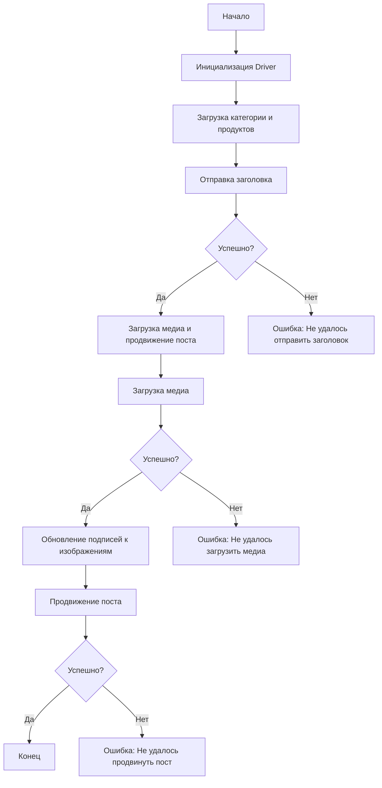

### Анализ кода модуля `post_message_async`

**Качество кода**:
- **Соответствие стандартам**: 7
- **Плюсы**:
    - Хорошая структурированность документации с описанием функционала и структуры модуля.
    - Наличие диаграммы Mermaid для визуализации процесса.
    - Подробное описание функций с указанием параметров и возвращаемых значений.
    - Наличие примера использования и перечня зависимостей.
- **Минусы**:
    - Отсутствует явное указание на асинхронную работу функций в описании.
    - Пример использования не является полным и не показывает асинхронный вызов.
    - Нет указаний на использование `j_loads` или `j_loads_ns` из `src.utils.jjson`.
    - Не используется `from src.logger.logger import logger` для логирования ошибок.
    - Отсутствует формат RST для документации функций.

**Рекомендации по улучшению**:

- Добавить явное упоминание асинхронности в описании функций, например, в разделе "Назначение".
- Уточнить пример использования, чтобы показать, как асинхронно вызывать функции `promote_post`.
- Использовать `j_loads` или `j_loads_ns` при загрузке данных из JSON, если это необходимо.
- Добавить импорт `logger` из `src.logger` и использовать его для логирования ошибок.
- Привести примеры использования в формате RST, чтобы соответствовать общему стилю документации.
- Добавить более подробное описание того, как обрабатываются ошибки в скрипте.
- Улучшить раздел "Вклад" с более конкретными инструкциями о том, как вносить изменения.

**Оптимизированный код**:

```rst
.. module:: src.endpoints.advertisement.facebook.post_message_async

```
[English]()

## Сценарий асинхронной публикации сообщения на Facebook

### Обзор

Этот скрипт является частью директории `hypotez/src/endpoints/advertisement/facebook/scenarios` и предназначен для автоматизации процесса публикации сообщений на Facebook. Скрипт взаимодействует со страницей Facebook, используя локаторы для выполнения различных действий, таких как отправка сообщений, загрузка медиафайлов и обновление подписей.

### Основные возможности

1. **Отправка заголовка и описания**: Отправляет заголовок и описание кампании в поле сообщения на Facebook.
2. **Загрузка медиафайлов**: Загружает медиафайлы (изображения и видео) на пост Facebook и обновляет их подписи.
3. **Продвижение поста**: Управляет всем процессом продвижения поста с заголовком, описанием и медиафайлами.

### Структура модуля



### Легенда

1. **Start**: Начало выполнения скрипта.
2. **InitDriver**: Создание экземпляра класса `Driver`.
3. **LoadCategoryAndProducts**: Загрузка данных категории и продуктов.
4. **SendTitle**: Вызов функции `post_title` для отправки заголовка.
5. **CheckTitleSuccess**: Проверка успешности отправки заголовка.
   - **Да**: Переход к загрузке медиа и продвижению поста.
   - **Нет**: Вывод ошибки "Не удалось отправить заголовок".
6. **UploadMediaAndPromotePost**: Вызов функции `promote_post`.
7. **UploadMedia**: Вызов функции `upload_media` для загрузки медиафайлов.
8. **CheckMediaSuccess**: Проверка успешности загрузки медиа.
   - **Да**: Переход к обновлению подписей к изображениям.
   - **Нет**: Вывод ошибки "Не удалось загрузить медиа".
9. **UpdateCaptions**: Вызов функции `update_images_captions` для обновления подписей.
10. **PromotePost**: Завершение процесса продвижения поста.
11. **CheckPromoteSuccess**: Проверка успешности продвижения поста.
    - **Да**: Конец выполнения скрипта.
    - **Нет**: Вывод ошибки "Не удалось продвинуть пост".
-----------------------

#### Функции

- **`post_title(d: Driver, category: SimpleNamespace) -> bool`**:
    
  .. function:: post_title(d: Driver, category: SimpleNamespace) -> bool

    Асинхронно отправляет заголовок и описание кампании в поле сообщения на Facebook.
    
    :param d: Экземпляр `Driver` для взаимодействия с веб-страницей.
    :type d: Driver
    :param category: Категория, содержащая заголовок и описание для отправки.
    :type category: SimpleNamespace
    :return: `True`, если заголовок и описание были успешно отправлены, иначе `False`.
    :rtype: bool
    
- **`upload_media(d: Driver, products: List[SimpleNamespace], no_video: bool = False) -> bool`**:
  
  .. function:: upload_media(d: Driver, products: List[SimpleNamespace], no_video: bool = False) -> bool

    Асинхронно загружает медиафайлы на пост Facebook.
    
    :param d: Экземпляр `Driver` для взаимодействия с веб-страницей.
    :type d: Driver
    :param products: Список продуктов, содержащих пути к медиафайлам.
    :type products: List[SimpleNamespace]
    :param no_video: Флаг, указывающий, следует ли пропустить загрузку видео.
    :type no_video: bool, optional
    :return: `True`, если медиафайлы были успешно загружены, иначе `False`.
    :rtype: bool
    
- **`update_images_captions(d: Driver, products: List[SimpleNamespace], textarea_list: List[WebElement]) -> None`**:
    
  .. function:: update_images_captions(d: Driver, products: List[SimpleNamespace], textarea_list: List[WebElement]) -> None
  
    Асинхронно добавляет описания к загруженным медиафайлам.

    :param d: Экземпляр `Driver` для взаимодействия с веб-страницей.
    :type d: Driver
    :param products: Список продуктов с деталями для обновления.
    :type products: List[SimpleNamespace]
    :param textarea_list: Список текстовых полей, куда добавляются подписи.
    :type textarea_list: List[WebElement]

- **`promote_post(d: Driver, category: SimpleNamespace, products: List[SimpleNamespace], no_video: bool = False) -> bool`**:
    
  .. function:: promote_post(d: Driver, category: SimpleNamespace, products: List[SimpleNamespace], no_video: bool = False) -> bool

    Асинхронно управляет процессом продвижения поста с заголовком, описанием и медиафайлами.
    
    :param d: Экземпляр `Driver` для взаимодействия с веб-страницей.
    :type d: Driver
    :param category: Детали категории, используемые для заголовка и описания поста.
    :type category: SimpleNamespace
    :param products: Список продуктов, содержащих медиа и детали для публикации.
    :type products: List[SimpleNamespace]
    :param no_video: Флаг, указывающий, следует ли пропустить загрузку видео.
    :type no_video: bool, optional
    :return: `True`, если пост был успешно продвинут, иначе `False`.
    :rtype: bool

### Использование

Для использования этого скрипта выполните следующие шаги:

1. **Инициализация Driver**: Создайте экземпляр класса `Driver`.
2. **Загрузка локаторов**: Загрузите локаторы из JSON-файла.
3. **Вызов функций**: Используйте предоставленные функции для отправки заголовка, загрузки медиа и продвижения поста.

#### Пример

```python
import asyncio
from src.webdriver.driver import Driver #import Driver
from types import SimpleNamespace
from src.logger import logger # Import logger

# Инициализация Driver
driver = Driver(...)

# Загрузка категории и продуктов
category = SimpleNamespace(title='Заголовок кампании', description='Описание кампании')
products = [SimpleNamespace(local_image_path='путь/к/изображению.jpg', ...)]

# Отправка заголовка
post_title(driver, category)

# Загрузка медиа и продвижение поста
async def main():
    result = await promote_post(driver, category, products)
    if result:
      logger.info('Пост успешно продвинут')
    else:
      logger.error('Не удалось продвинуть пост')


if __name__ == "__main__":
    asyncio.run(main())
```

### Зависимости

- `selenium`: Для веб-автоматизации.
- `asyncio`: Для асинхронных операций.
- `pathlib`: Для обработки путей к файлам.
- `types`: Для создания простых пространств имен.
- `typing`: Для аннотаций типов.
- `src.logger`: Для логирования ошибок.

### Обработка ошибок

Скрипт включает надежную обработку ошибок, чтобы обеспечить продолжение выполнения даже в случае, если некоторые элементы не найдены или если возникли проблемы с веб-страницей. Это особенно полезно для обработки динамических или нестабильных веб-страниц.

### Вклад

Вклад в этот скрипт приветствуется. Пожалуйста, убедитесь, что любые изменения хорошо документированы, соответствуют стандартам PEP8 и включают соответствующие тесты. Используйте `logger` для логирования ошибок и предупреждений.

### Лицензия

Этот скрипт лицензирован под MIT License. Подробности смотрите в файле `LICENSE`.