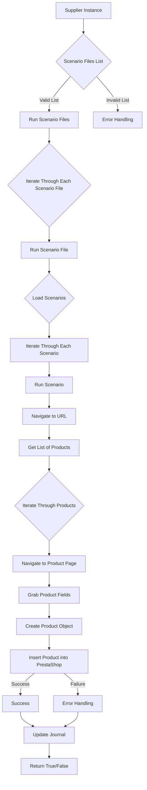

# Анализ кода модуля `src.scenario`

## Качество кода:

- **Соответствие стандартам**: 7
- **Плюсы**:
    - Хорошая структура документации с описанием основных функций и компонентов.
    - Наличие диаграммы Mermaid для визуализации процесса.
    - Примеры JSON-сценария и описания процесса работы.
- **Минусы**:
    - Отсутствие конкретного кода, что не позволяет оценить соответствие стандартам Python и рекомендациям.
    - Используются не стандартизированные кавычки `"` вместо `'` в коде python.
    - Не указано использование `j_loads` или `j_loads_ns` вместо стандартного `json.load`.
    - Не указано использование `logger` из `src.logger`.
    - Не используются комментарии в формате RST для функций.
    - Используются общие формулировки в описании функций, например "принимает", "вызывает".

## Рекомендации по улучшению:

- Необходимо добавить в код `j_loads` или `j_loads_ns` из `src.utils.jjson` вместо стандартного `json.load`.
-  Импортировать `logger` только из `src.logger`.
- Добавить комментарии в формате RST для всех функций и методов.
- Использовать более точные формулировки в описаниях функций, например: "осуществляет", "загружает".
- В документации использовать одинарные кавычки (`'`) в Python-коде.
- Внедрить обработку ошибок через `logger.error` вместо чрезмерного использования `try-except`.
- Добавить пример кода функций `run_scenario_files`, `run_scenario_file`, `run_scenario`, `dump_journal` и `main`.

## Оптимизированный код:

```markdown
# Модуль `src.scenario`

## Обзор

Модуль `src.scenario` предназначен для автоматизации взаимодействия с поставщиками, используя сценарии, описанные в JSON-файлах. Он адаптирует процесс извлечения и обработки данных о продуктах с веб-сайтов поставщиков и синхронизирует эту информацию с базой данных (например, PrestaShop).  Модуль включает чтение сценариев, взаимодействие с веб-сайтами, обработку данных, запись журнала выполнения и организацию всего процесса.

## Оглавление

* [Модуль `src.scenario`](#модуль-src-scenario)
* [Обзор](#обзор)
* [Основные функции модуля](#основные-функции-модуля)
* [Основные компоненты модуля](#основные-компоненты-модуля)
    * [`run_scenario_files(s, scenario_files_list)`](#run_scenario_files-s-scenario_files_list)
    * [`run_scenario_file(s, scenario_file)`](#run_scenario_file-s-scenario_file)
    * [`run_scenario(s, scenario)`](#run_scenario-s-scenario)
    * [`dump_journal(s, journal)`](#dump_journal-s-journal)
    * [`main()`](#main)
* [Пример сценария](#пример-сценария)
* [Как это работает](#как-это-работает)

## Основные функции модуля

1.  **Чтение сценариев**: Загрузка сценариев из JSON-файлов, содержащих информацию о продуктах и их URL на сайте поставщика.
2.  **Взаимодействие с веб-сайтами**: Обработка URL-адресов из сценариев для извлечения данных о продуктах.
3.  **Обработка данных**: Преобразование извлечённых данных в формат, подходящий для базы данных, и сохранение в неё.
4.  **Запись журнала выполнения**: Ведение журнала с деталями выполнения сценариев и результатами работы для отслеживания процесса и выявления ошибок.



## Основные компоненты модуля

### `run_scenario_files(s, scenario_files_list)`

**Описание**: Осуществляет выполнение сценариев из списка файлов, последовательно вызывая `run_scenario_file` для каждого файла.

**Параметры**:
- `s`: Объект настроек (например, для соединения с базой данных).
- `scenario_files_list` (list): Список путей к файлам сценариев.

**Возвращает**:
- None

**Вызывает исключения**:
- `FileNotFoundError`: Если файл сценария не найден.
- `JSONDecodeError`: Если файл сценария содержит невалидный JSON.

```python
from src.logger import logger # Импорт logger
from src.utils.jjson import j_loads # Импорт j_loads

def run_scenario_files(s: dict, scenario_files_list: list[str]) -> None:
    """
    Осуществляет выполнение сценариев из списка файлов.

    :param s: Объект настроек.
    :type s: dict
    :param scenario_files_list: Список путей к файлам сценариев.
    :type scenario_files_list: list[str]
    :raises FileNotFoundError: Если файл сценария не найден.
    :raises JSONDecodeError: Если файл сценария содержит невалидный JSON.
    """
    for scenario_file in scenario_files_list:
        try:
            run_scenario_file(s, scenario_file) # Вызов run_scenario_file для каждого файла
        except FileNotFoundError:
            logger.error(f'Файл сценария не найден: {scenario_file}') # Обработка ошибки, если файл не найден
        except Exception as e:
            logger.error(f'Ошибка при обработке файла {scenario_file}: {e}') # Обработка прочих ошибок
```

### `run_scenario_file(s, scenario_file)`

**Описание**: Загружает сценарии из указанного файла и выполняет `run_scenario` для каждого сценария.

**Параметры**:
- `s`: Объект настроек.
- `scenario_file` (str): Путь к файлу сценария.

**Возвращает**:
- None

**Вызывает исключения**:
- `FileNotFoundError`: Если файл сценария не найден.
- `JSONDecodeError`: Если файл сценария содержит невалидный JSON.
- `Exception`: При любых других проблемах при работе со сценариями.

```python
def run_scenario_file(s: dict, scenario_file: str) -> None:
    """
    Загружает сценарии из указанного файла и выполняет их.

    :param s: Объект настроек.
    :type s: dict
    :param scenario_file: Путь к файлу сценария.
    :type scenario_file: str
    :raises FileNotFoundError: Если файл сценария не найден.
    :raises JSONDecodeError: Если файл сценария содержит невалидный JSON.
    :raises Exception: При любых других проблемах при работе со сценариями.
    """
    try:
        with open(scenario_file, 'r', encoding='utf-8') as f:
            scenarios = j_loads(f) # Загрузка сценариев из JSON файла
        for scenario in scenarios.get('scenarios', {}).values(): # Обход всех сценариев в файле
            run_scenario(s, scenario) # Запуск сценария
    except FileNotFoundError:
        logger.error(f'Файл сценария не найден: {scenario_file}') # Обработка ошибки, если файл не найден
    except Exception as e:
         logger.error(f'Ошибка при обработке файла {scenario_file}: {e}') # Обработка прочих ошибок
```

### `run_scenario(s, scenario)`

**Описание**: Выполняет обработку отдельного сценария: переходит по URL, извлекает данные о продуктах и сохраняет их в базе данных.

**Параметры**:
- `s`: Объект настроек.
- `scenario` (dict): Словарь, содержащий сценарий (например, с URL, категориями).

**Возвращает**:
- None

**Вызывает исключения**:
- `requests.exceptions.RequestException`: Если есть проблемы с запросом к веб-сайту.
- `Exception`: При любых других проблемах в процессе обработки сценария.

```python
import requests
def run_scenario(s: dict, scenario: dict) -> None:
    """
    Выполняет обработку отдельного сценария.

    :param s: Объект настроек.
    :type s: dict
    :param scenario: Словарь, содержащий сценарий.
    :type scenario: dict
    :raises requests.exceptions.RequestException: Если есть проблемы с запросом к веб-сайту.
    :raises Exception: При любых других проблемах в процессе обработки сценария.
    """
    try:
        url = scenario.get('url') # Получение URL из сценария
        if url:
            response = requests.get(url) # Выполнение запроса по URL
            response.raise_for_status() # Проверка статуса ответа
            # Извлечение данных о продуктах и их сохранение в БД.
            # Это место надо дополнить в зависимости от реализации
            logger.info(f'Сценарий успешно выполнен для URL: {url}') # Логирование успеха
        else:
            logger.warning(f'URL не найден в сценарии: {scenario}') # Логирование предупреждения
    except requests.exceptions.RequestException as e:
        logger.error(f'Ошибка при запросе к URL {url}: {e}') # Логирование ошибки запроса
    except Exception as e:
        logger.error(f'Ошибка при обработке сценария: {e}') # Логирование прочих ошибок
```

### `dump_journal(s, journal)`

**Описание**: Сохраняет журнал выполнения сценариев в файл для последующего анализа.

**Параметры**:
- `s`: Объект настроек.
- `journal` (list): Список записей журнала выполнения.

**Возвращает**:
- None

**Вызывает исключения**:
- `Exception`: При проблемах с записью в файл.

```python
import json

def dump_journal(s: dict, journal: list) -> None:
    """
    Сохраняет журнал выполнения сценариев в файл для последующего анализа.

    :param s: Объект настроек.
    :type s: dict
    :param journal: Список записей журнала выполнения.
    :type journal: list
    :raises Exception: При проблемах с записью в файл.
    """
    try:
        with open('journal.json', 'w', encoding='utf-8') as f:
             json.dump(journal, f, ensure_ascii=False, indent=4) # Запись журнала в файл
        logger.info('Журнал успешно сохранен') # Логирование успеха
    except Exception as e:
       logger.error(f'Ошибка при сохранении журнала: {e}') # Логирование ошибки записи
```

### `main()`

**Описание**: Основная функция для запуска модуля.

**Параметры**:
- None

**Возвращает**:
- None

**Вызывает исключения**:
- `Exception`: При любых критических ошибках во время выполнения.

```python
def main() -> None:
    """
    Основная функция для запуска модуля.

    :raises Exception: При любых критических ошибках во время выполнения.
    """
    settings = {'some_setting': 'some_value'} # Пример настроек
    scenario_files = ['scenario1.json', 'scenario2.json'] # Пример списка файлов

    try:
        run_scenario_files(settings, scenario_files) # Запуск обработки файлов сценариев
        logger.info('Работа модуля завершена') # Логирование завершения работы
    except Exception as e:
         logger.error(f'Критическая ошибка в ходе выполнения: {e}') # Логирование критической ошибки
```

## Пример сценария

Пример сценария JSON описывает взаимодействие с категориями продуктов на веб-сайте. Он содержит URL, имя категории и идентификаторы категорий в базе данных PrestaShop.

```json
{
    "scenarios": {
        "минеральные+кремы": {
            "url": "https://example.com/category/mineral-creams/",
            "name": "минеральные+кремы",
            "presta_categories": {
                "default_category": 12345,
                "additional_categories": [12346, 12347]
            }
        }
    }
}
```

## Как это работает

Модуль загружает сценарии, извлекает данные с веб-сайтов, обрабатывает их и сохраняет в базе данных.  Он ведёт журнал выполнения для отслеживания процесса и выявления ошибок.  В целом, модуль автоматизирует взаимодействие с поставщиками, улучшая эффективность и надежность процесса.
```