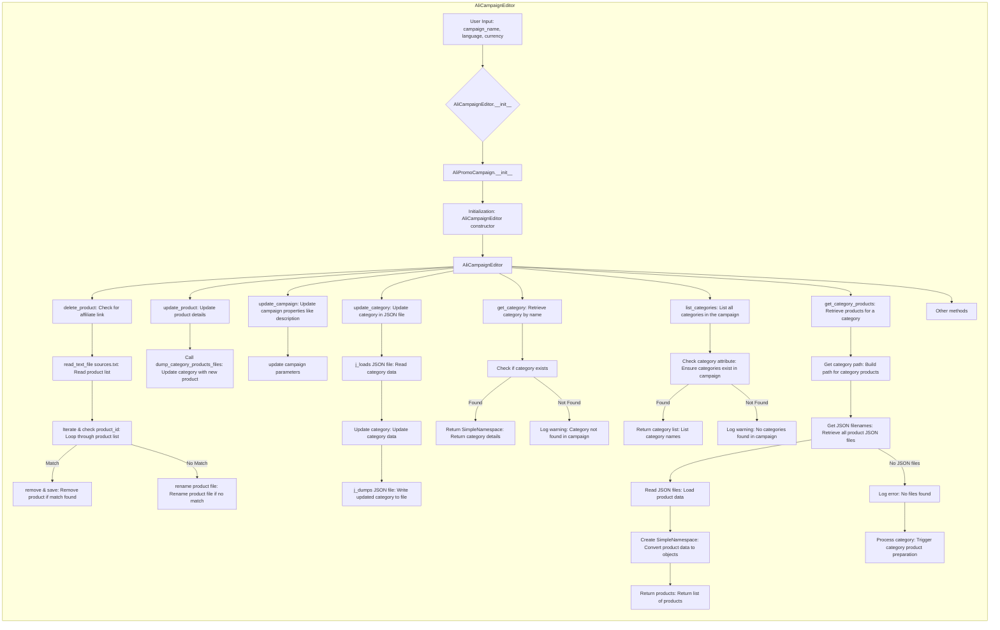

# Модуль: ali_campaign_editor

## Обзор

Модуль `ali_campaign_editor.py` предоставляет редактор для управления рекламными кампаниями AliExpress. Он позволяет создавать, обновлять и удалять продукты в кампаниях, а также управлять категориями и другими параметрами кампании. Модуль является частью подсистемы управления кампаниями AliExpress в проекте `hypotez`.

## Подробней

`AliCampaignEditor` предоставляет инструменты для работы с рекламными кампаниями AliExpress. Он включает в себя функции для управления продуктами (добавление, удаление, обновление), категориями и общими параметрами кампании. Этот модуль взаимодействует с другими модулями, такими как `ali_promo_campaign` и `AliCampaignGoogleSheet`, для обеспечения полной функциональности управления кампаниями.



## Классы

### `AliCampaignEditor`

**Описание**:
Редактор для управления рекламными кампаниями.

**Методы**:
- `__init__`: Инициализирует экземпляр класса `AliCampaignEditor`.
- `delete_product`: Удаляет продукт, у которого нет партнерской ссылки.
- `update_product`: Обновляет детали продукта в указанной категории.
- `update_campaign`: Обновляет свойства кампании, такие как описание и теги.
- `update_category`: Обновляет категорию в JSON файле.
- `get_category`: Возвращает объект `SimpleNamespace` для указанной категории.
- `list_categories`: Возвращает список категорий в текущей кампании.
- `get_category_products`: Читает данные о товарах из JSON файлов для конкретной категории.

**Параметры**:
- `campaign_name` (str): Название кампании.
- `language` (Optional[str | dict], optional): Язык кампании. По умолчанию `None`.
- `currency` (Optional[str], optional): Валюта кампании. По умолчанию `None`.

**Примеры**:

```python
# 1. by campaign parameters
editor = AliCampaignEditor(campaign_name="Summer Sale", language="EN", currency="USD")
# 2. load fom file
editor = AliCampaignEditor(campaign_name="Summer Sale", campaign_file="EN_USD.JSON")
```

## Функции

### `__init__`

```python
def __init__(self, 
                 campaign_name: str, 
                 language: Optional[str | dict] = None, 
                 currency: Optional[str] = None):
        """ Initialize the AliCampaignEditor with the given parameters.
        
        Args:
            campaign_name (Optional[str]): The name of the campaign. Defaults to `None`.
            language (Optional[str | dict]): The language of the campaign. Defaults to 'EN'.
            currency (Optional[str]): The currency for the campaign. Defaults to 'USD'.
            campaign_file (Optional[str | Path]): Optionally load a `<lang>_<currency>.json` file from the campaign root folder. Defaults to `None`.

        Raises:
            CriticalError: If neither `campaign_name` nor `campaign_file` is provided.
        
        Example:
        # 1. by campaign parameters
            >>> editor = AliCampaignEditor(campaign_name="Summer Sale", language="EN", currency="USD")
        # 2. load fom file
            >>> editor = AliCampaignEditor(campaign_name="Summer Sale", campaign_file="EN_USD.JSON")
        """
```

**Описание**:
Инициализирует экземпляр класса `AliCampaignEditor` с заданными параметрами.

**Параметры**:
- `campaign_name` (str): Имя кампании.
- `language` (Optional[str | dict], optional): Язык кампании. По умолчанию `None`.
- `currency` (Optional[str], optional): Валюта кампании. По умолчанию `None`.

**Вызывает исключения**:
- `CriticalError`: Если не указано ни `campaign_name`, ни `campaign_file`.

**Примеры**:

```python
# 1. by campaign parameters
editor = AliCampaignEditor(campaign_name="Summer Sale", language="EN", currency="USD")
# 2. load fom file
editor = AliCampaignEditor(campaign_name="Summer Sale", campaign_file="EN_USD.JSON")
```

### `delete_product`

```python
def delete_product(self, product_id: str, exc_info: bool = False):
        """ Delete a product that does not have an affiliate link.
        
        Args:
            product_id (str): The ID of the product to be deleted.
            exc_info (bool): Whether to include exception information in logs. Defaults to `False`.

        Example:
            >>> editor = AliCampaignEditor(campaign_name="Summer Sale")
            >>> editor.delete_product("12345")
        """
```

**Описание**:
Удаляет продукт, у которого нет партнерской ссылки.

**Параметры**:
- `product_id` (str): ID продукта, который нужно удалить.
- `exc_info` (bool): Определяет, нужно ли включать информацию об исключении в логи. По умолчанию `False`.

**Примеры**:

```python
editor = AliCampaignEditor(campaign_name="Summer Sale")
editor.delete_product("12345")
```

### `update_product`

```python
def update_product(self, category_name: str, lang: str, product: dict):
        """ Update product details within a category.

        Args:
            category_name (str): The name of the category where the product should be updated.
            lang (str): The language of the campaign.
            product (dict): A dictionary containing product details.

        Example:
            >>> editor = AliCampaignEditor(campaign_name="Summer Sale")
            >>> editor.update_product("Electronics", "EN", {"product_id": "12345", "title": "Smartphone"})
        """
```

**Описание**:
Обновляет детали продукта в указанной категории.

**Параметры**:
- `category_name` (str): Название категории, в которой нужно обновить продукт.
- `lang` (str): Язык кампании.
- `product` (dict): Словарь, содержащий детали продукта.

**Примеры**:

```python
editor = AliCampaignEditor(campaign_name="Summer Sale")
editor.update_product("Electronics", "EN", {"product_id": "12345", "title": "Smartphone"})
```

### `update_campaign`

```python
def update_campaign(self):
        """ Update campaign properties such as `description`, `tags`, etc.
        
        Example:
            >>> editor = AliCampaignEditor(campaign_name="Summer Sale")
            >>> editor.update_campaign()
        """
```

**Описание**:
Обновляет свойства кампании, такие как `description`, `tags` и т.д.

**Примеры**:

```python
editor = AliCampaignEditor(campaign_name="Summer Sale")
editor.update_campaign()
```

### `update_category`

```python
def update_category(self, json_path: Path, category: SimpleNamespace) -> bool:
        """ Update the category in the JSON file.

        Args:
            json_path (Path): Path to the JSON file.
            category (SimpleNamespace): Category object to be updated.

        Returns:
            bool: True if update is successful, False otherwise.

        Example:
            >>> category = SimpleNamespace(name="New Category", description="Updated description")
            >>> editor = AliCampaignEditor(campaign_name="Summer Sale")
            >>> result = editor.update_category(Path("category.json"), category)
            >>> print(result)  # True if successful
        """
```

**Описание**:
Обновляет категорию в JSON файле.

**Параметры**:
- `json_path` (Path): Путь к JSON файлу.
- `category` (SimpleNamespace): Объект категории, который нужно обновить.

**Возвращает**:
- `bool`: `True`, если обновление успешно, иначе `False`.

**Примеры**:

```python
category = SimpleNamespace(name="New Category", description="Updated description")
editor = AliCampaignEditor(campaign_name="Summer Sale")
result = editor.update_category(Path("category.json"), category)
print(result)  # True if successful
```

### `get_category`

```python
def get_category(self, category_name: str) -> Optional[SimpleNamespace]:
        """ Returns the SimpleNamespace object for a given category name.

        Args:
            category_name (str): The name of the category to retrieve.

        Returns:
            Optional[SimpleNamespace]: SimpleNamespace object representing the category or `None` if not found.

        Example:
            >>> editor = AliCampaignEditor(campaign_name="Summer Sale")
            >>> category = editor.get_category("Electronics")
            >>> print(category)  # SimpleNamespace or None
        """
```

**Описание**:
Возвращает объект `SimpleNamespace` для указанного имени категории.

**Параметры**:
- `category_name` (str): Имя категории для получения.

**Возвращает**:
- `Optional[SimpleNamespace]`: Объект `SimpleNamespace`, представляющий категорию, или `None`, если категория не найдена.

**Примеры**:

```python
editor = AliCampaignEditor(campaign_name="Summer Sale")
category = editor.get_category("Electronics")
print(category)  # SimpleNamespace or None
```

### `list_categories`

```python
@property
    def list_categories(self) -> Optional[List[str]]:
        """ Retrieve a list of categories in the current campaign.

        Returns:
            Optional[List[str]]: A list of category names, or None if no categories are found.

        Example:
            >>> editor = AliCampaignEditor(campaign_name="Summer Sale")
            >>> categories = editor.categories_list
            >>> print(categories)  # ['Electronics', 'Fashion', 'Home']
        """
```

**Описание**:
Возвращает список категорий в текущей кампании.

**Возвращает**:
- `Optional[List[str]]`: Список названий категорий или `None`, если категории не найдены.

**Примеры**:

```python
editor = AliCampaignEditor(campaign_name="Summer Sale")
categories = editor.categories_list
print(categories)  # ['Electronics', 'Fashion', 'Home']
```

### `get_category_products`

```python
async def get_category_products(
        self, category_name: str
    ) -> Optional[List[SimpleNamespace]]:
        """Чтение данных о товарах из JSON файлов для конкретной категории.

        Args:
            category_name (str): Имя категории.

        Returns:
            Optional[List[SimpleNamespace]]: Список объектов SimpleNamespace, представляющих товары.

        Example:
            >>> products = campaign.get_category_products("Electronics")
            >>> print(len(products))
            15
        """
```

**Описание**:
Чтение данных о товарах из JSON файлов для конкретной категории.

**Параметры**:
- `category_name` (str): Имя категории.

**Возвращает**:
- `Optional[List[SimpleNamespace]]`: Список объектов `SimpleNamespace`, представляющих товары.

**Примеры**:

```python
products = campaign.get_category_products("Electronics")
print(len(products))
15