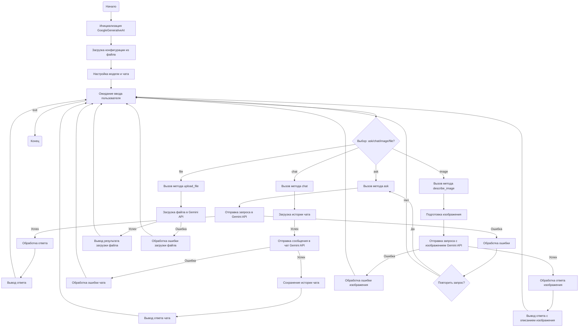

## ИНСТРУКЦИЯ:

Анализируй предоставленный код подробно и объясни его функциональность. Ответ должен включать три раздела:  

1. **<алгоритм>**: Опиши рабочий процесс в виде пошаговой блок-схемы, включая примеры для каждого логического блока, и проиллюстрируй поток данных между функциями, классами или методами.  
2. **<mermaid>**: Напиши код для диаграммы в формате `mermaid`, проанализируй и объясни все зависимости, 
    которые импортируются при создании диаграммы. 
    **ВАЖНО!** Убедитесь, что все имена переменных, используемые в диаграмме `mermaid`, 
    имеют осмысленные и описательные имена. Имена переменных вроде `A`, `B`, `C`, и т.д., не допускаются!  
    
    **Дополнительно**: Если в коде есть импорт `import header`, добавьте блок `mermaid` flowchart, объясняющий `header.py`:\
    ```mermaid
    flowchart TD
        Start --> Header[<code>header.py</code><br> Determine Project Root]
    
        Header --> import[Import Global Settings: <br><code>from src import gs</code>] 
    ```

3. **<объяснение>**: Предоставьте подробные объяснения:  
   - **Импорты**: Их назначение и взаимосвязь с другими пакетами `src.`.  
   - **Классы**: Их роль, атрибуты, методы и взаимодействие с другими компонентами проекта.  
   - **Функции**: Их аргументы, возвращаемые значения, назначение и примеры.  
   - **Переменные**: Их типы и использование.  
   - Выделите потенциальные ошибки или области для улучшения.  

Дополнительно, постройте цепочку взаимосвязей с другими частями проекта (если применимо).  

Это обеспечивает всесторонний и структурированный анализ кода.
## Формат ответа: `.md` (markdown)
**КОНЕЦ ИНСТРУКЦИИ**

## 1. <алгоритм>



**Примеры для логических блоков:**

*   **Init**: `ai = GoogleGenerativeAI(api_key="your_api_key", system_instruction="You are a helpful assistant")` - создает экземпляр класса `GoogleGenerativeAI` с ключом API и системной инструкцией.
*   **Config**: Загружает настройки из `src/ai/gemini/generative_ai.json` в атрибут `config`.
*  **ModelSetup**: Инициализирует модель Gemini с заданными параметрами, создает объект чата.
*   **Input**:  `user_message = input("You: ")` - ожидает ввода от пользователя.
*   **AskOrChat**: Проверяет, какой метод нужно вызвать: `ask` для простых запросов, `chat` для диалога, `describe_image` для обработки изображений, `upload_file` для загрузки файлов.
*   **AskCall**: `response = await ai.ask(q="What is the capital of France?")` - вызывает метод `ask` с запросом.
*  **ChatCall**: `ai_message = await ai.chat(user_message)` - вызывает метод `chat` с сообщением от пользователя.
*   **GenerateContentAsync**: Отправляет запрос в Gemini API, например: `"What is the capital of France?"`
*  **SendMessageAsync**: Отправляет сообщение в чат Gemini API, например: `"Hello, how are you?"`
*   **ProcessResponse**: Получает текстовый ответ от Gemini API, например: `"The capital of France is Paris."`
*   **OutputResponse**: Выводит полученный ответ в консоль.
*   **ErrorHandling**: Обрабатывает ошибки API, например: `GatewayTimeout`, `ResourceExhausted`, и т.д.
*   **Retry**: При ошибке решает, нужно ли повторить запрос, например, при `GatewayTimeout`.
*   **DescribeImageCall**: `description = await ai.describe_image(image_path, prompt="Describe this image")` - вызывает метод `describe_image` с путем к изображению и промптом.
* **PrepareImage**: Подготавливает изображение для отправки в Gemini API, считывая байты из файла.
* **GenerateContentImage**: Отправляет запрос с изображением в Gemini API, например, байты изображения и текст "Describe this image".
* **ProcessImageResponse**: Получает текстовое описание изображения от Gemini API.
* **OutputImageResponse**: Выводит полученное описание изображения в консоль.
* **UploadFileCall**: `file_upload = await ai.upload_file(file_path, 'test_file.txt')` - вызывает метод `upload_file` с путем к файлу и его именем.
* **UploadFile**: Загружает файл в Gemini API.
* **OutputUpload**: Выводит результат загрузки файла в консоль.
* **End**: Завершает работу программы.

## 2. <mermaid>

```mermaid
flowchart TD
    Start --> Header[<code>header.py</code><br> Determine Project Root]
    Header --> import[Import Global Settings: <br><code>from src import gs</code>]

    subgraph GoogleGenerativeAI Class
        Init(Инициализация GoogleGenerativeAI) --> Config[Загрузка конфигурации];
        Config --> ModelSetup[Настройка модели и чата];
        ModelSetup --> AskMethod[ask(q: str, attempts: int)];
        ModelSetup --> ChatMethod[chat(q: str)];
        ModelSetup --> DescribeImageMethod[describe_image(image: Path | bytes, mime_type: str, prompt: str)];
        ModelSetup --> UploadFileMethod[upload_file(file: str | Path | IOBase, file_name: str)];

        AskMethod --> GenerateContentAsync[generate_content_async(q: str)];
        GenerateContentAsync --> ProcessResponse[Обработка ответа];
        ProcessResponse --> ReturnTextAsk[Возврат текста];
          GenerateContentAsync -- Ошибка --> ErrorHandlingAsk[Обработка ошибок ask];
           ErrorHandlingAsk --> ReturnTextAsk

        ChatMethod --> LoadChatHistory[Загрузка истории чата];
         LoadChatHistory-- Успех --> SendMessageAsync[send_message_async(q: str)];
          SendMessageAsync -- Успех --> SaveChatHistory[Сохранение истории чата];
           SendMessageAsync -- Ошибка --> ErrorHandlingChat[Обработка ошибок chat];
           ErrorHandlingChat --> ReturnTextChat
        SaveChatHistory --> ReturnTextChat[Возврат текста];

        DescribeImageMethod --> PrepareImage[Подготовка изображения];
        PrepareImage --> GenerateContentImage[generate_content(image: Path | bytes, prompt: str)];
        GenerateContentImage --> ProcessImageResponse[Обработка ответа изображения];
        ProcessImageResponse --> ReturnTextDescribe[Возврат текста];
         GenerateContentImage -- Ошибка --> ErrorHandlingImage[Обработка ошибок image];
          ErrorHandlingImage --> ReturnTextDescribe
           

        UploadFileMethod --> UploadFileApi[upload_file_async(file: str | Path | IOBase, file_name: str)];
          UploadFileApi -- Успех --> ReturnBoolUpload[Возврат bool];
        UploadFileApi -- Ошибка --> DeleteFileApi[delete_file_async(file_name: str)];
           DeleteFileApi --> UploadFileApi;
           DeleteFileApi-- Ошибка --> ErrorHandlingUpload[Обработка ошибок upload];
           ErrorHandlingUpload --> ReturnBoolUpload;
          
    end
   
    subgraph Main Function
        MainStart[Начало main()] --> CreateAI[Создание экземпляра GoogleGenerativeAI];
        CreateAI --> CallDescribeImage[Вызов describe_image()];
        CallDescribeImage --> CallUploadFile[Вызов upload_file()];
         CallUploadFile --> ChatLoop[Цикл чата];
          ChatLoop --> ChatMethodCall[Вызов chat()];
           ChatMethodCall --> MainEnd[Конец main()];
    end
```

**Объяснение зависимостей:**

*   **`header.py`**: Определяет корневой каталог проекта и настраивает глобальные переменные, используется для настройки путей к файлам.
*   **`src.logger.logger`**: Используется для логирования ошибок и отладочной информации.
*   **`src`**: Общий пакет для всего проекта, включая глобальные настройки (`gs`).
*   **`src.utils.file`**: Содержит функции для работы с файлами, такие как чтение и запись текстовых файлов.
*   **`src.utils.date_time`**: Предоставляет класс `TimeoutCheck` для проверки времени ожидания.
*   **`src.utils.convertors.unicode`**: Содержит функцию `decode_unicode_escape` для декодирования unicode последовательностей.
*   **`src.utils.jjson`**: Предоставляет функции для работы с JSON (`j_loads`, `j_loads_ns`, `j_dumps`).
*  **`src.utils.image`**: Содержит функции для работы с изображениями, такие как `get_image_bytes`
*   **`src.utils.printer`**: Содержит функцию `pprint` для форматированного вывода.
*   **`google.generativeai`**: Основной пакет для взаимодействия с API Gemini.
*   **`requests`**: Используется для обработки HTTP запросов при возникновении сетевых ошибок.
*   **`grpc`**: Используется для обработки ошибок `RpcError` при вызове API Google.
*   **`google.api_core.exceptions`**: Содержит исключения, специфичные для API Google.
*   **`google.auth.exceptions`**: Содержит исключения, связанные с аутентификацией.
*   **`asyncio`**: Используется для асинхронного программирования.
*    **`time`**: Используется для задержек (time.sleep) между попытками запросов.
*    **`json`**: Используется для работы с JSON.
*    **`io.IOBase`**: Базовый класс для работы с файлами.
*    **`pathlib.Path`**: Используется для работы с путями к файлам.
*    **`datetime.datetime`**: Используется для работы с датами и временем.
*    **`typing.Optional, Dict, List`**: Используется для аннотации типов.
*   **`types.SimpleNamespace`**: Используется для создания объектов с атрибутами.
*   **`base64`**: Используется для кодирования и декодирования данных в base64.

## 3. <объяснение>

### Импорты:

*   **`asyncio`**: Модуль для асинхронного программирования, используется для выполнения асинхронных запросов к API Gemini.
*   **`time`**: Модуль для работы со временем, используется для задержек между повторными попытками запросов.
*   **`json`**: Модуль для работы с JSON, используется для сохранения и загрузки истории чата.
*   **`io.IOBase`**: Базовый класс для работы с файловыми потоками, используется как один из типов для загружаемого файла.
*   **`pathlib.Path`**: Класс для работы с путями к файлам и директориям.
*   **`datetime`**: Модуль для работы с датой и временем.
*   **`typing.Optional, Dict, List`**: Модуль для аннотации типов, что делает код более читаемым и позволяет использовать проверку типов.
*   **`types.SimpleNamespace`**: Класс для создания простых объектов, используется для хранения конфигурации.
*   **`base64`**: Модуль для кодирования и декодирования данных в base64, в данном случае не используется, но импортируется.
*   **`google.generativeai as genai`**: Основной модуль для взаимодействия с API Gemini.
*   **`requests`**: Модуль для выполнения HTTP запросов, используется для обработки сетевых ошибок.
*   **`grpc`**: Модуль для работы с gRPC, используется для обработки ошибок gRPC.
*   **`google.api_core.exceptions`**: Модуль, содержащий исключения, специфичные для Google API.
*   **`google.auth.exceptions`**: Модуль, содержащий исключения, связанные с аутентификацией Google.
*  **`header`**: Модуль для определения корневого каталога проекта, и настройки глобальных параметров.
*   **`src.logger.logger`**: Пользовательский модуль для логирования.
*   **`src.gs`**: Глобальные настройки проекта.
*  **`src.utils.file`**: Пользовательский модуль для работы с файлами.
*   **`src.utils.date_time`**: Пользовательский модуль для работы со временем.
*   **`src.utils.convertors.unicode`**: Пользовательский модуль для работы с unicode.
*   **`src.utils.jjson`**: Пользовательский модуль для работы с JSON.
*    **`src.utils.image`**: Пользовательский модуль для работы с изображениями.
*   **`src.utils.printer`**: Пользовательский модуль для форматированного вывода в консоль.

### Классы:

*   **`GoogleGenerativeAI`**:
    *   **Назначение**: Класс для взаимодействия с моделями Google Generative AI.
    *   **Атрибуты**:
        *   `api_key` (str): API ключ для Google Generative AI.
        *   `model_name` (str): Имя используемой модели Gemini.
        *   `generation_config` (Dict): Конфигурация генерации.
        *   `system_instruction` (Optional[str]): Системная инструкция для модели.
        *   `dialogue_log_path` (Path): Путь к директории для хранения логов.
        *  `dialogue_txt_path` (Path): Путь к файлу для хранения диалогов в txt формате.
        *   `history_dir` (Path): Путь к директории для истории чата.
        *   `history_txt_file` (Path): Путь к файлу для хранения истории чата в txt формате.
        *   `history_json_file` (Path): Путь к файлу для хранения истории чата в JSON формате.
        *   `model` (genai.GenerativeModel): Объект модели Gemini.
        *   `_chat` (genai.ChatSession): Объект для чата.
        *    `chat_history` (List): История чата в виде списка.
    *   **Методы**:
        *   `__init__`: Инициализирует объект класса, настраивает модель и создает директории для логов и истории.
        *  `config`: Свойство, которое загружает конфигурацию из JSON файла.
        *  `_start_chat`: Запускает сессию чата с учетом системной инструкции.
        *  `_save_dialogue`: Сохраняет диалог в JSON файл.
        *   `_save_chat_history`: Сохраняет историю чата в JSON файл.
        *   `_load_chat_history`: Загружает историю чата из JSON файла.
        *   `ask`: Отправляет текстовый запрос и возвращает ответ. Используется для не диалоговых запросов.
        *   `chat`: Отправляет запрос в режиме диалога и сохраняет историю.
        *  `describe_image`: Отправляет запрос с изображением и возвращает текстовое описание.
        * `upload_file`: Загружает файл в Gemini API.

### Функции:

*   `main()`:
    *   **Назначение**: Главная функция для демонстрации работы с `GoogleGenerativeAI`.
    *   **Аргументы**: Нет.
    *   **Возвращаемое значение**: Нет.
    *   **Функциональность**: Инициализирует объект `GoogleGenerativeAI`, демонстрирует запросы к API Gemini, включая работу с изображениями и текстовым чатом.

### Переменные:

*   `timeout_check`: Экземпляр класса `TimeoutCheck` для проверки времени ожидания.
*  `MODELS` (List[str]): Список поддерживаемых моделей Gemini.
*   `api_key` (str): API ключ для Google Generative AI.
*   `system_instruction` (str): Системная инструкция для модели Gemini.
*   `ai` (GoogleGenerativeAI): Экземпляр класса `GoogleGenerativeAI`.
*   `image_path` (Path): Путь к файлу изображения.
*   `prompt` (str): Текстовый запрос для модели.
*   `description` (str): Текстовое описание, полученное от модели.
*   `user_message` (str): Сообщение пользователя в чате.
*   `ai_message` (str): Ответ от модели Gemini в чате.
*  `file_path` (Path): Путь к загружаемому файлу.
*  `file_upload` (bool): Результат загрузки файла.

### Потенциальные ошибки и области для улучшения:

*   **Обработка ошибок**: Код обрабатывает большинство известных ошибок, но стоит предусмотреть более детальное логирование и обработку неожиданных ошибок.
*   **Повторные попытки**: Код использует экспоненциальный бэк-офф, но максимальное количество повторных попыток может быть настраиваемым параметром.
*  **Конфигурация**:  Загрузка конфигурации из файла `generative_ai.json` и использование её для настроек модели Gemini. Это позволяет легко настраивать параметры модели без изменения кода.
*  **Сохранение истории чата**: Используется для сохранения и загрузки истории чата, что позволяет продолжать диалог с моделью с предыдущего состояния.
* **Улучшение обработки ошибок**: Код обрабатывает несколько типов исключений, которые могут возникнуть при использовании API Gemini, включая сетевые ошибки, ошибки аутентификации и ошибки, связанные с превышением квот.
*  **Добавление асинхронности**: Все методы для взаимодействия с API Gemini являются асинхронными, что позволяет эффективнее использовать ресурсы и обрабатывать множество запросов.
* **Использование библиотек**: Применение сторонних библиотек, таких как `requests` и `grpc` для обработки HTTP и gRPC запросов.
*  **Гибкость**: Код позволяет настраивать параметры модели, системные инструкции и другие параметры, что делает его более гибким и удобным в использовании.
*   **Логирование**: Присутствует логирование всех важных событий и ошибок.

### Взаимосвязи с другими частями проекта:

*   **`header.py`**: Обеспечивает корректную работу с путями файлов, так как определяет корневой каталог проекта.
*   **`src.gs`**: Предоставляет доступ к глобальным настройкам проекта, таким как текущее время, пути, что упрощает настройку окружения.
*   **`src.logger.logger`**: Позволяет вести логирование для отладки и мониторинга работы с API.
*   **`src.utils`**: Используются вспомогательные утилиты для работы с файлами, датами, unicode, JSON и принтером.

Этот код представляет собой хороший пример интеграции с Google Generative AI API, демонстрируя обработку текста, изображений и загрузку файлов. Он также хорошо структурирован и содержит достаточно много проверок для стабильной работы.