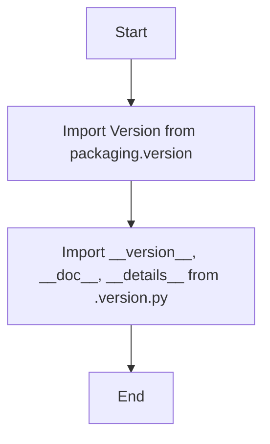

## Анализ кода `src/ai/openai/_examples/__init__.py`

### 1. `<алгоритм>`:

Данный код представляет собой файл `__init__.py`, который используется для определения пакета в Python. Он не содержит сложной логики, а в основном выполняет следующие действия:

1.  **Импорт `Version` из `packaging.version`**: Импортируется класс `Version` из библиотеки `packaging`, который используется для работы с версиями.
2.  **Импорт версионной информации из `.version.py`**: Импортируются переменные `__version__`, `__doc__` и `__details__` из файла `version.py`, расположенного в той же директории.

Пример:

```
Начало
    |
    |-- Импорт Version из packaging.version
    |
    |-- Импорт __version__, __doc__, __details__ из .version.py
    |
Конец
```

В данном случае нет потока данных между функциями или классами, так как файл только импортирует нужные переменные.

### 2. `<mermaid>`:



**Объяснение зависимостей:**
*   **packaging.version**: `packaging` — это библиотека, предназначенная для работы с версиями пакетов. Она предоставляет класс `Version` для сравнения, анализа и сортировки версий.
*   **.version.py**: `version.py` — это файл, который находится в той же директории, что и `__init__.py`. Он содержит переменные, связанные с версией пакета, его документацией и детальной информацией.
*   **Импорт `header`** - отсутствует.

### 3. `<объяснение>`:

*   **Импорты:**
    *   `from packaging.version import Version`: Импортирует класс `Version` из библиотеки `packaging.version`. Этот класс используется для представления и сравнения версий пакетов. Он может быть использован в дальнейшем для проверки совместимости версий или отображения информации о текущей версии пакета.
    *   `from .version import __version__, __doc__, __details__`: Импортирует переменные `__version__`, `__doc__` и `__details__` из файла `version.py`, который расположен в той же директории. 
        *   `__version__` содержит строку, представляющую текущую версию пакета (например, '1.2.3').
        *   `__doc__` содержит строку с документацией пакета (обычно описание назначения пакета).
        *   `__details__` может содержать более подробную информацию о пакете, его изменениях или зависимостях.

*   **Классы**: В данном коде нет определения собственных классов, но используется класс `Version`, импортированный из внешней библиотеки.

*   **Функции**: В этом файле нет определения функций.

*   **Переменные**:
    *   `__version__`: строка, представляющая версию пакета.
    *   `__doc__`: строка, представляющая документацию пакета.
    *   `__details__`: строка, содержащая детальную информацию о пакете.

*   **Цепочка взаимосвязей с другими частями проекта**:
    *   Этот `__init__.py` файл делает пакет `src.ai.openai._examples` доступным для импорта в других частях проекта. 
    *   Файл `version.py`, вероятно, используется для хранения версионной информации о пакете, что позволяет другим частям проекта или инструментам управления пакетами отслеживать версию этого пакета.
    *   Класс `Version` может быть использован в других частях проекта для обработки версий, например, при проверке совместимости зависимостей.
    *   Документация `__doc__` используется для генерации документации проекта.

*   **Потенциальные ошибки или области для улучшения**:
    *   В данном коде нет ошибок.
    *   Так как это `__init__.py` файл, его роль ограничена, и он не требует значительных улучшений.
    *   Однако, если проект разрастется, то возможно потребуется расширить Модуль, например для дополнительной инициализации пакета.
    *   Добавление обработок ошибок при импорте может сделать этот код более надежным в случае, если один из импортов не удастся.

**Заключение**:

Этот `__init__.py` файл служит для инициализации пакета `src.ai.openai._examples`, предоставляя информацию о его версии, документации и деталях, а также импортируя класс для работы с версиями пакетов. Этот файл важен для правильной работы пакета и его интеграции с остальной частью проекта.