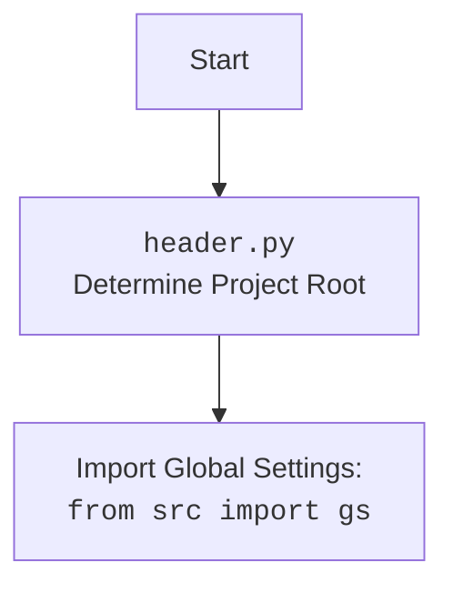

## \\file /src/ai/openai/chat_openai/browser_agent.py

### **1. <алгоритм>**

Этот код реализует класс `AIBrowserAgent`, который позволяет использовать языковую модель OpenAI для выполнения задач, требующих поиска информации в интернете и анализа веб-страниц. Агент использует библиотеку `browser_use` для взаимодействия с браузером и выполнения поисковых запросов.

**Блок-схема рабочего процесса:**

1.  **Инициализация `AIBrowserAgent`**:
    *   При создании экземпляра `AIBrowserAgent` происходит инициализация необходимых параметров, таких как API-ключ OpenAI, название языковой модели и поисковая система.
    *   Создается экземпляр `ChatOpenAI` для взаимодействия с языковой моделью.
    *   Сохраняется переданный драйвер браузера (если он был передан).

    ```python
    agent = AIBrowserAgent(api_key=api_key, model_name=model_name)
    ```

2.  **Выполнение задачи `run_task`**:
    *   Метод `run_task` принимает текстовое описание задачи (`task_prompt`) и выполняет ее, используя браузер и языковую модель.
    *   Создается экземпляр класса `Agent` из библиотеки `browser_use`, которому передается задача, языковая модель и драйвер браузера.
    *   Вызывается метод `run()` агента для выполнения задачи.
    *   После выполнения задачи драйвер браузера закрывается (если это возможно).

    ```python
    result = await agent.run_task(task_prompt)
    ```

3.  **Поиск аналогов продукта `find_product_alternatives`**:
    *   Метод `find_product_alternatives` принимает URL продукта или SKU и ищет аналоги, используя поисковую систему.
    *   Формируется поисковый запрос на основе URL или SKU.
    *   Выполняется поисковый запрос с использованием метода `run_task`.

    ```python
    alternatives = await agent.find_product_alternatives(product_url=product_url, sku=sku)
    ```

4.  **Ответ на вопрос `ask_async`**:
    *   Метод `ask_async` принимает вопрос и отвечает на него, используя поиск в интернете, если это необходимо.
    *   Формируется задача для агента, включающая вопрос.
    *   Выполняется задача с использованием метода `run_task`.

    ```python
    answer = await agent.ask_async(question)
    ```

**Поток данных:**

*   `AIBrowserAgent` инициализируется с API-ключом, моделью и поисковой системой.
*   Метод `run_task` создает `Agent` из `browser_use` с задачей, языковой моделью и драйвером.
*   Метод `find_product_alternatives` формирует поисковый запрос и передает его в `run_task`.
*   Метод `ask_async` формирует задачу с вопросом и передает ее в `run_task`.
*   `Agent` выполняет задачу, используя браузер и языковую модель, и возвращает результат.

### **2. <mermaid>**

```mermaid
flowchart TD
    subgraph AIBrowserAgent
        A[Инициализация AIBrowserAgent] --> B{Выбор задачи: поиск аналогов или ответ на вопрос}
        B -- поиск аналогов --> C[find_product_alternatives]
        B -- ответ на вопрос --> D[ask_async]
        C --> E[Формирование поискового запроса]
        D --> F[Формирование задачи с вопросом]
        E --> G[run_task]
        F --> G
        G --> H[Создание Agent из browser_use]
        H --> I[agent.run()]
        I --> J{Успешно?}
        J -- Да --> K[Возврат результата]
        J -- Нет --> L[Обработка ошибки]
        L --> K
    end

    subgraph browser_use
        H -->|Использует| BU[Agent из browser_use]
    end

    subgraph langchain_openai
        A -->|Использует| LO[ChatOpenAI из langchain_openai]
    end

    style AIBrowserAgent fill:#f9f,stroke:#333,stroke-width:2px
    style browser_use fill:#ccf,stroke:#333,stroke-width:2px
    style langchain_openai fill:#ccf,stroke:#333,stroke-width:2px
```

**Объяснение зависимостей:**

*   `langchain_openai`: Используется для создания языковой модели `ChatOpenAI`, которая необходима для обработки задач агентом. Импортируется класс `ChatOpenAI`.
*   `browser_use`: Используется для взаимодействия с браузером и выполнения поисковых запросов. Импортируется класс `Agent`.

**Дополнительно:**



### **3. <объяснение>**

**Импорты:**

*   `langchain_openai`: Используется для интеграции с языковой моделью OpenAI.
    *   `ChatOpenAI`: Класс для взаимодействия с языковой моделью OpenAI.
*   `browser_use`: Предоставляет инструменты для управления браузером и выполнения задач, связанных с веб-страницами.
    *   `Agent`: Класс, который выполняет задачи, используя браузер и языковую модель.
*   `asyncio`: Используется для асинхронного программирования.
*   `dotenv`: Используется для загрузки переменных окружения из файла `.env`.
*   `typing`: Используется для аннотации типов.
    *   `Optional`: Указывает, что переменная может иметь значение `None`.
    *   `List`: Указывает, что переменная является списком.
    *   `Union`: Указывает, что переменная может иметь один из нескольких типов.
*   `urllib.parse`: Используется для кодирования URL-адресов.
*   `header`: Содержит вспомогательные функции и переменные, связанные с настройками проекта. Определяет корневой каталог проекта.
*   `src.gs`: Содержит глобальные настройки проекта.
*   `src.logger`: Модуль для логирования событий и ошибок.

**Классы:**

*   `AIBrowserAgent`:
    *   Роль: Создание агента, использующего браузер для выполнения задач.
    *   Атрибуты:
        *   `api_key`: Ключ API OpenAI.
        *   `model_name`: Название языковой модели OpenAI.
        *   `search_engine`: Поисковая система для использования.
        *   `llm`: Экземпляр `ChatOpenAI` для взаимодействия с языковой моделью.
        *   `custom_driver`: Пользовательский драйвер браузера.
    *   Методы:
        *   `__init__`: Инициализирует класс `AIBrowserAgent`.
        *   `run_task`: Запускает агента для выполнения задачи.
        *   `find_product_alternatives`: Ищет аналоги продукта по URL или SKU.
        *   `ask`: Синхронная обертка для `ask_async`.
        *   `ask_async`: Отвечает на вопрос, используя поиск в интернете.
    *   Взаимодействие:
        *   Использует `ChatOpenAI` для взаимодействия с языковой моделью.
        *   Использует `Agent` из `browser_use` для выполнения задач.

**Функции:**

*   `main`:
    *   Аргументы: Нет.
    *   Возвращаемое значение: Нет.
    *   Назначение: Пример использования класса `AIBrowserAgent`.

**Переменные:**

*   `ENDPOINT`: Строка, определяющая endpoint.
*   `MODE`: Строка, определяющая режим работы (PRODUCTION или DEV).
*   `USE_ENV`: Флаг, определяющий, использовать ли переменные окружения.

**Потенциальные ошибки и области для улучшения:**

*   В коде используется `MODE: str = 'DEV'`, что может привести к использованию тестового бота вместо production-бота.
*   В методе `ask` используется синхронная обертка для асинхронного метода `ask_async`, что не рекомендуется.
*   Обработка ошибок в методе `run_task` может быть улучшена.

**Взаимосвязи с другими частями проекта:**

*   Использует `src.gs` для получения глобальных настроек, таких как API-ключ OpenAI.
*   Использует `src.logger` для логирования событий и ошибок.