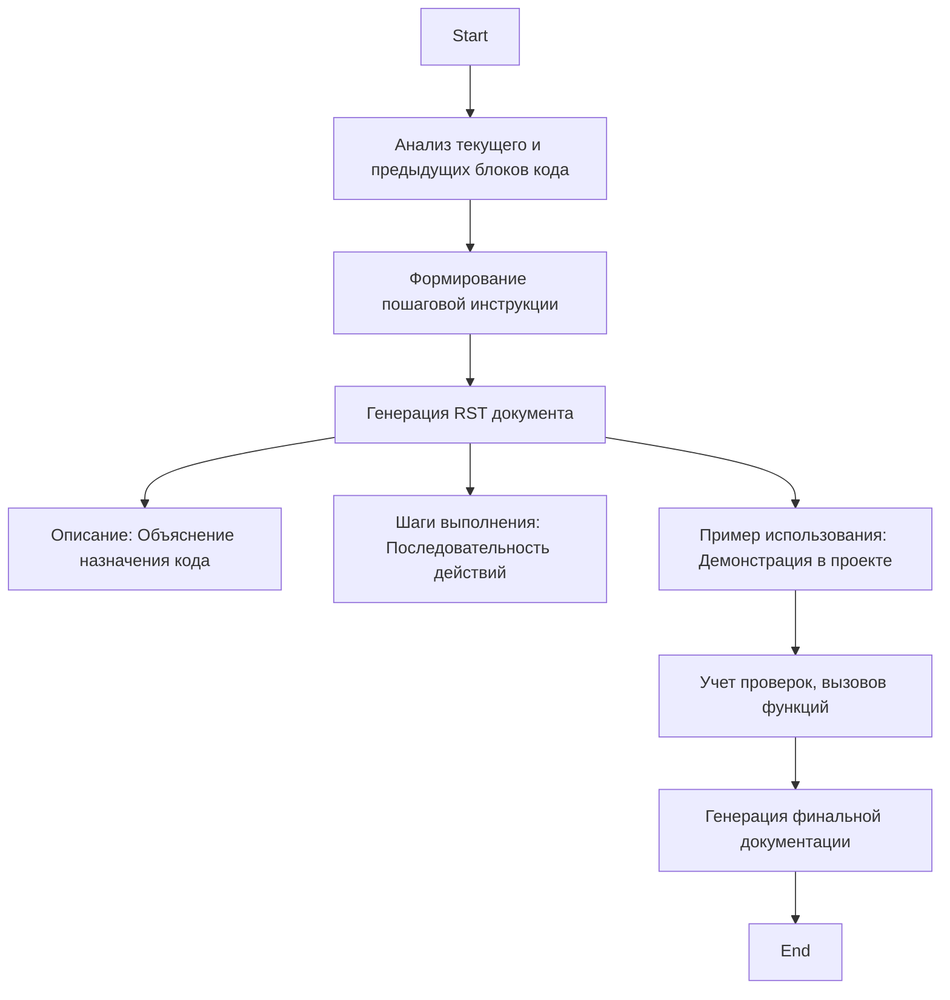

## ИНСТРУКЦИЯ:

Анализируй предоставленный код подробно и объясни его функциональность. Ответ должен включать три раздела:  

1. **<алгоритм>**: Опиши рабочий процесс в виде пошаговой блок-схемы, включая примеры для каждого логического блока, и проиллюстрируй поток данных между функциями, классами или методами.  
2. **<mermaid>**: Напиши код для диаграммы в формате `mermaid`, проанализируй и объясни все зависимости, 
    которые импортируются при создании диаграммы. 
    **ВАЖНО!** Убедитесь, что все имена переменных, используемые в диаграмме `mermaid`, 
    имеют осмысленные и описательные имена. Имена переменных вроде `A`, `B`, `C`, и т.д., не допускаются!  
    
    **Дополнительно**: Если в коде есть импорт `import header`, добавьте блок `mermaid` flowchart, объясняющий `header.py`:\
    ```mermaid
    flowchart TD
        Start --> Header[<code>header.py</code><br> Determine Project Root]
    
        Header --> import[Import Global Settings: <br><code>from src import gs</code>] 
    ```

3. **<объяснение>**: Предоставьте подробные объяснения:  
   - **Импорты**: Их назначение и взаимосвязь с другими пакетами `src.`.  
   - **Классы**: Их роль, атрибуты, методы и взаимодействие с другими компонентами проекта.  
   - **Функции**: Их аргументы, возвращаемые значения, назначение и примеры.  
   - **Переменные**: Их типы и использование.  
   - Выделите потенциальные ошибки или области для улучшения.  

Дополнительно, постройте цепочку взаимосвязей с другими частями проекта (если применимо).  

Это обеспечивает всесторонний и структурированный анализ кода.
## Формат ответа: `.md` (markdown)
**КОНЕЦ ИНСТРУКЦИИ**

## <алгоритм>

1.  **Анализ текущего и предыдущих блоков кода:**
    *   Модель получает на вход текущий блок кода и имеет доступ к ранее загруженным блокам кода в проекте.
    *   Модель анализирует код для понимания его назначения.
    *   **Пример:** Если текущий блок проверяет ввод пользователя, то предыдущие блоки могут быть функциями получения этих данных.
2.  **Формирование пошаговой инструкции:**
    *   На основе анализа модель формирует пошаговую инструкцию, описывающую процесс выполнения текущего блока кода.
    *   **Пример:**
        *   Шаг 1: Получение данных из функции `get_user_input()`.
        *   Шаг 2: Проверка данных на наличие недопустимых символов.
        *   Шаг 3: Обработка данных с помощью функции `process_data()`.
3.  **Генерация документации в формате reStructuredText (RST):**
    *   Модель создает RST документ, включающий:
        *   **Описание:** Краткое объяснение назначения блока кода.
        *   **Шаги выполнения:** Детализированная последовательность действий для выполнения кода.
        *   **Пример использования:** Демонстрация, как код используется в контексте проекта.
    *   **Пример:**
        ```rst
        Как использовать блок кода
        =========================================================================================

        Описание
        -------------------------
        Этот блок кода выполняет проверку на валидность ввода пользователя.

        Шаги выполнения
        -------------------------
        1. Получение пользовательского ввода через вызов функции `get_user_input()`.
        2. Проверка ввода на наличие недопустимых символов с использованием регулярного выражения.
        3. Если ввод невалидный, выводится сообщение об ошибке.
        4. Если ввод валидный, он передается в функцию `process_data()` для дальнейшей обработки.

        Пример использования
        -------------------------
        Пример того, как можно использовать данный блок кода в проекте:

        .. code-block:: python

            user_input = get_user_input()
            if is_valid_input(user_input):
                process_data(user_input)
            else:
                print("Ошибка: Недопустимый ввод.")
        ```
4.  **Уточнения и проверки:**
    *   Модель учитывает специфику кода: проверки, вызовы функций и т.д.
    *   Формулировки должны быть точными, избегая общих терминов.

## <mermaid>



**Анализ зависимостей:**

*   Диаграмма описывает процесс создания документации для блока кода.
*   Зависимости показывают последовательность действий, от анализа кода до генерации финальной документации.
*   Основные этапы:
    *   `AnalyzeCode`: Этап анализа кода
    *   `GenerateInstruction`: Этап формирования инструкции
    *   `CreateRSTDocument`: Этап создания RST документа
    *   `Description`, `ExecutionSteps`, `UsageExample`: Этапы формирования частей RST документа
    *   `CheckSpecifics`: Этап уточнения с учетом особенностей кода
    *   `GenerateDocumentation`: Этап генерации финальной документации

## <объяснение>

**Общее:**

Этот код описывает процесс создания документации для блоков кода. Он состоит из набора инструкций для модели, которая должна проанализировать код и сгенерировать структурированное описание.

**Импорты:**

В данном коде нет явных импортов, так как это скорее инструкция для модели, а не исполняемый код Python. Однако в процессе генерации документации могут использоваться библиотеки для работы с текстом (например, для создания RST), но это не отражено в самом коде.

**Классы:**

В коде не используются классы.

**Функции:**

В коде нет функций, однако, можно выделить логические блоки, которые можно представить как функции:

1.  `Анализ текущего и предыдущих блоков кода`:  Функция, которая получает на вход текущий блок кода и предыдущие блоки, и анализирует их назначение.
2.  `Формирование пошаговой инструкции`: Функция, которая на основе анализа формирует пошаговую инструкцию для выполнения кода.
3.  `Генерация RST документа`: Функция, которая генерирует RST документ, содержащий описание, шаги выполнения и пример использования.
4.  `Уточнения и проверки`: Функция, которая проверяет и уточняет документацию на основе специфики кода (проверки, вызовы функций).

**Переменные:**

В коде не используются переменные, так как это скорее инструкция, а не исполняемый код. Однако, можно выделить следующие переменные, которые могут быть задействованы в реализации:

*   `current_code_block`: Переменная, содержащая текущий анализируемый блок кода.
*   `previous_code_blocks`: Переменная, содержащая все ранее загруженные блоки кода.
*   `instruction`: Переменная, содержащая пошаговую инструкцию для выполнения кода.
*   `rst_document`: Переменная, содержащая сгенерированный RST документ.

**Объяснения:**

1.  **Анализ кода:** Модель анализирует текущий блок кода и предыдущие блоки, чтобы понять общую картину и взаимосвязи. Этот анализ важен для генерации точной и контекстуальной документации.
2.  **Формирование инструкции:** На основе анализа формируется пошаговая инструкция, которая описывает, как код должен выполняться. Инструкция предназначена для того, чтобы пользователь мог легко понять последовательность действий.
3.  **Генерация RST документа:** Документация создается в формате reStructuredText, что позволяет использовать ее в документационных системах, таких как Sphinx. Она включает описание, шаги выполнения и пример использования, что обеспечивает полноту информации.
4.  **Уточнения и проверки:** Модель учитывает специфику каждого блока кода, например, если это проверка, то описываются какие данные проверяются. Используются точные формулировки, избегая общих терминов.

**Потенциальные ошибки или области для улучшения:**

1.  **Сложность анализа:** Модель может испытывать трудности с анализом очень сложного или запутанного кода, особенно если есть зависимости от внешних библиотек, которые не были загружены.
2.  **Контекст:** Модель может не всегда правильно интерпретировать контекст, если предыдущие блоки кода не содержат достаточной информации.
3.  **Генерация примеров:** Генерация примеров использования может быть сложной задачей, особенно если код включает в себя нестандартные вызовы функций или методов.

**Цепочка взаимосвязей:**

Этот процесс можно связать с другими частями проекта, например, автоматической генерацией документации. Этапы генерации документации можно использовать для создания документации для всего проекта.

**Дополнительные замечания:**
*   Инструкция написана в первом лице, что является требованием к модели.
*   Инструкция направлена на то, чтобы модель генерировала понятную и полезную документацию, основанную на анализе кода.