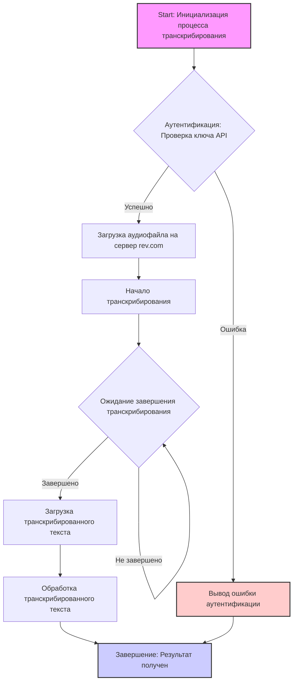

## АНАЛИЗ КОДА: revai

### 1. <алгоритм>

Поскольку предоставленный код является, скорее, комментарием и ссылками на документацию, а не фактическим исполняемым кодом, я не могу создать полноценную блок-схему. Однако я могу описать предполагаемый рабочий процесс и взаимодействие с API `rev.com`, основываясь на предоставленной информации и ссылках.

**Общий алгоритм:**

1.  **Начало:** Пользователь инициирует процесс транскрибирования аудиофайла, используя API `rev.com`.

2.  **Аутентификация:** Происходит аутентификация через API `rev.com` (предположительно, с использованием ключа API).
    *   _Пример:_ Пользователь предоставляет ключ API через переменные окружения или конфигурационный файл.

3.  **Загрузка аудио:** Аудиофайл загружается на сервер `rev.com`.
    *   _Пример:_ Аудиофайл `meeting.mp3` загружается через метод `upload_file()` из Python SDK.

4.  **Транскрибирование:** API `rev.com` обрабатывает аудиофайл и выполняет автоматическое транскрибирование.
    *   _Пример:_ После отправки аудиофайла, отправляется запрос на старт транскрибирования `start_transcription()`.

5.  **Проверка статуса:** Пользователь периодически проверяет статус транскрибирования.
    *   _Пример:_ Вызывается метод `get_transcription_status()` для отслеживания прогресса.

6.  **Получение результата:** После завершения транскрибирования, пользователь загружает транскрибированный текст.
    *   _Пример:_ Метод `get_transcription_text()` возвращает транскрибированный текст.

7.  **Обработка результата:** Пользователь может сохранить, проанализировать или отобразить полученный текст.
    *   _Пример:_ Текст сохраняется в файл `meeting.txt`.

8.  **Завершение:** Процесс транскрибирования завершен.

### 2. <mermaid>



**Объяснение диаграммы:**

*   **A:**  Начальная точка процесса, где инициируется транскрибирование.
*   **B:** Проверка аутентификации с использованием ключа API.
*   **C:** Загрузка аудиофайла на сервер `rev.com` для дальнейшего транскрибирования.
*   **D:**  Запрос к API `rev.com` для начала процесса транскрибирования загруженного аудиофайла.
*   **E:** Ожидание завершения процесса транскрибирования, проверка статуса.
*   **F:** Загрузка транскрибированного текста после успешного завершения транскрибирования.
*   **G:** Этап, где транскрибированный текст обрабатывается пользователем.
*   **H:** Завершение процесса, результат транскрибирования получен и обработан.
*   **Z1:** Вывод ошибки при неудачной аутентификации.

### 3. <объяснение>

**Импорты:**

В предоставленном коде нет явных импортов. Однако, основываясь на ссылках, можно предположить использование Python SDK для `rev.com`, который будет использовать импорты наподобие:

```python
import revai  # Основной пакет SDK rev.com
# import requests, json, etc...
```

*   `revai`: Этот гипотетический импорт представляет основной пакет, содержащий классы и функции для взаимодействия с API `rev.com`.  Он, вероятно, инкапсулирует логику отправки запросов, обработки ответов, аутентификации и т. д.

*   `requests`, `json`, etc:  Вероятно, SDK `revai` будет использовать эти стандартные пакеты для HTTP-запросов и обработки ответов в формате JSON.

**Классы:**

Предполагаемые классы (основываясь на документации и примерах):

*   `revai.Client`: Класс для взаимодействия с API `rev.com`. Содержит методы для аутентификации, загрузки файлов, запуска транскрибирования, проверки статуса и получения результатов.
    *   _Атрибуты:_ Ключ API, возможно, настройки прокси и т.д.
    *   _Методы:_ `upload_file()`, `start_transcription()`, `get_transcription_status()`, `get_transcription_text()`, etc.

**Функции:**

Предполагаемые функции (основываясь на документации и примерах):

*   `upload_file(filepath)`: Загружает аудиофайл на сервер `rev.com`.
    *   _Аргументы:_ `filepath` - путь к аудиофайлу.
    *   _Возвращает:_ Идентификатор загруженного файла.

*   `start_transcription(file_id)`: Запускает процесс транскрибирования.
    *   _Аргументы:_ `file_id` - идентификатор загруженного файла.
    *   _Возвращает:_ Идентификатор задания транскрибирования.

*   `get_transcription_status(job_id)`: Возвращает статус транскрибирования.
    *   _Аргументы:_ `job_id` - идентификатор задания транскрибирования.
    *   _Возвращает:_ Статус (например, "in progress", "completed", "failed").

*   `get_transcription_text(job_id)`: Загружает транскрибированный текст.
    *   _Аргументы:_ `job_id` - идентификатор задания транскрибирования.
    *   _Возвращает:_ Транскрибированный текст.

**Переменные:**

*   `api_key`: Ключ API для аутентификации в `rev.com` (обычно строка).
*   `file_path`: Путь к локальному аудиофайлу (обычно строка).
*   `file_id`: Идентификатор загруженного файла, полученный от `rev.com`.
*   `job_id`: Идентификатор задания транскрибирования, полученный от `rev.com`.
*   `transcription_text`: Транскрибированный текст, полученный от `rev.com`.
*   `status`: Статус выполнения транскрибирования

**Потенциальные ошибки и улучшения:**

*   **Обработка ошибок:** Необходима надежная обработка ошибок API (например, неверный ключ, ошибка загрузки, сбой транскрибирования).
*   **Асинхронность:** Транскрибирование — асинхронный процесс. Следует использовать механизмы для правильного отслеживания и обработки (например, асинхронные функции, polling).
*   **Конфигурация:**  Ключ API и другие настройки должны быть вынесены в конфигурационные файлы или переменные окружения.
*   **Оптимизация:** Можно добавить логику для работы с большим количеством аудиофайлов, включая управление ресурсами.

**Цепочка взаимосвязей:**

1.  Пользовательский интерфейс (UI) (или скрипт) инициирует запрос на транскрибирование.
2.  Код `revai` (или SDK) взаимодействует с API `rev.com`.
3.  API `rev.com` обрабатывает аудио и возвращает транскрибированный текст.
4.  Результат передаётся обратно в UI (или сохраняется).

**Дополнительная информация:**

Предоставленный код в файле `readme.ru.md` является описанием интеграции с внешним сервисом и не содержит непосредственного программного кода. Анализ основан на информации из документации сервиса `rev.com` и общих представлениях о работе API.